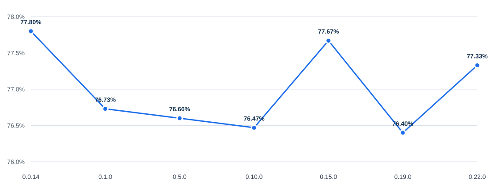

# QWEN-CODE

> This README replaces the original one to document this fork specifically.
> For full documentation on features, configuration, and usage refer to the
> [original README at v0.23.0](https://github.com/QwenLM/qwen-code/blob/v0.23.0/README.md).

---

## What is this?

This is a fork of [QwenLM/qwen-code](https://github.com/QwenLM/qwen-code) with all telemetry removed.
No data is sent to external servers during usage.

<a href="https://qwenlm.github.io/qwen-code-docs/zh/users/overview">中文</a> |
<a href="https://qwenlm.github.io/qwen-code-docs/de/users/overview">Deutsch</a> |
<a href="https://qwenlm.github.io/qwen-code-docs/fr/users/overview">français</a> |
<a href="https://qwenlm.github.io/qwen-code-docs/ja/users/overview">日本語</a> |
<a href="https://qwenlm.github.io/qwen-code-docs/ru/users/overview">Русский</a> |
<a href="https://qwenlm.github.io/qwen-code-docs/pt-BR/users/overview">Português (Brasil)</a> |
<a href="https://qwenlm.github.io/qwen-code-docs/ko/users/overview">한국어</a>

---

### Notable Changes from Upstream

- **No Telemetry**: All OpenTelemetry dependencies removed. `InstallationManager` returns a static ID, all loggers are no-ops.
- **WebSearch Tool**: Migrated from DashScope Responses API to [SerpApi](https://serpapi.com) (free tier: 250 queries/month). See [docs/developers/tools/web-search.md](docs/developers/tools/web-search.md) for details.
- **Vision Bridge**: Images are never dropped — the bridge throttles to 4 concurrent conversions instead of rejecting anything past the 4th image in a turn.

---

### The Evolution of No-Telemetry

- **Until v0.12.1-no-telemetry**: The policy was to **delete all telemetry-related files**. While effective for privacy, this made it difficult to maintain the fork and align it with upstream updates.
- **From v0.12.3-no-telemetry onwards**: We have switched to a "privacy-first" dummy implementation. We now remove all `@opentelemetry/*` packages and replace the telemetry logic with an **empty/dummy layer**. This keeps the application code untouched and easy to merge, while ensuring maximum privacy.

### Privacy Analysis

The current implementation provides a high level of security:

- **Zero External Tracking**: All OpenTelemetry dependencies are gone.
- **Neutralized Core**: The `InstallationManager` returns a static non-unique ID, and all network-bound loggers are replaced with no-op functions.
- **Local Only**: Data is only saved for local session history and hierarchical memory, as required for the application's core functionality.

---

## Installation

### Option 1 — Install script (local, no root required)

Installs Node.js via NVM and Qwen Code into your home directory.
Safe to use inside ephemeral Docker containers.

```bash
curl -fsSL https://raw.githubusercontent.com/undici77/qwen-code-no-telemetry/v0.23.0-no-telemetry/install.sh \
    | bash -s v0.23.0-no-telemetry
```

### Option 2 — Windows (PowerShell, no admin required)

Installs a portable Node.js and Qwen Code under `%LOCALAPPDATA%` — no admin
rights needed. Requires [Git for Windows](https://git-scm.com/download/win)
(npm needs `git.exe` on PATH to fetch the package from GitHub).

```powershell
iwr https://raw.githubusercontent.com/undici77/qwen-code-no-telemetry/v0.23.0-no-telemetry/install.ps1 -OutFile install.ps1
.\install.ps1 v0.23.0-no-telemetry
```

### Option 3 — Docker

**Build the image:**

```bash
docker build -t qwen-coder-sandbox .
```

**Run (sharing the current directory as workspace):**

```bash
docker run -it \
    --net=host \
    --add-host=host.docker.internal:host-gateway \
    -v "$(pwd)":/workspace \
    -w /workspace \
    qwen-coder-sandbox
```

---

## Capabilities

If you know Claude Code, you already know Qwen Code — and then some. We've put significant effort into [bringing Qwen Code to feature parity with Claude Code](https://github.com/wenshao/codeagents/blob/main/docs/comparison/qwen-code-improvement-report.md), improving both breadth and reliability across the board.

| Feature                                                            | Qwen Code | Claude Code |
| ------------------------------------------------------------------ | :-------: | :---------: |
| SubAgents, Agent Teams, Dynamic Workflows                          |     ✓     |      ✓      |
| Auto-Memory, Auto-Skills, Hooks                                    |     ✓     |      ✓      |
| Built-in Skills (/review, /batch, /loop, /bugfix…)                 |     ✓     |      ✓      |
| MCP, Plan Mode, LSP Integration                                    |     ✓     |      ✓      |
| Auto Mode, Sandbox, Git Worktrees                                  |     ✓     |      ✓      |
| Computer Use (desktop automation)                                  |     ✓     |      ✓      |
| IDE Plugins (VS Code / JetBrains / Zed)                            |     ✓     |      ✓      |
| SDK                                                                |     ✓     |      ✓      |
| Headless Mode, Session Management                                  |     ✓     |      ✓      |
| Open-source — model and framework                                  |     ✓     |      —      |
| Multi-protocol (OpenAI / Anthropic / Gemini / Qwen + any provider) |     ✓     |      —      |
| Agent Arena (multi-model head-to-head on same task)                |     ✓     |      —      |
| Daemon Mode — `qwen serve` (multi-client shared agent)             |     ✓     |      —      |
| IM Channels (Telegram / DingTalk / WeChat / Feishu)                |     ✓     |      —      |

## Qwen Code Evaluation

### Evaluation Configuration

| Configuration           | Value                                                                                               |
| ----------------------- | --------------------------------------------------------------------------------------------------- |
| Dataset                 | `princeton-nlp/SWE-bench_Verified`, 500 cases                                                       |
| Runs                    | 3 trials per version, 1,500 jobs per version; 7 Qwen Code versions                                  |
| Model                   | `Qwen 3.7 Max`                                                                                      |
| Sampling                | `temperature=1`, `top_p=0.95`                                                                       |
| Thinking / Reasoning    | `interleaved_thinking=true`, `thinking_type=adaptive`, `reasoning_effort=high`                      |
| Context / Output Limits | `context_1m=true`, `model_context_length=1,000,000`, `max_tokens=64,000`, `model_max_tokens=65,535` |
| Harness Limits          | `max_iterations=500`, `runtime_timeout_sec=7,200`, `agent_timeout_multiplier=3.0`                   |

### Scores by Qwen Code Version

| Version |  Avg Score | Pass Rate | pass@3 | pass^3 |
| ------- | ---------: | --------: | -----: | -----: |
| 0.0.14  | **77.80%** |     84.6% |  84.6% |  69.2% |
| 0.1.0   | **76.73%** |     84.6% |  84.6% |  68.0% |
| 0.5.0   | **76.60%** |     83.0% |  83.0% |  68.4% |
| 0.10.0  | **76.47%** |     84.4% |  84.4% |  67.4% |
| 0.15.0  | **77.67%** |     84.6% |  84.6% |  68.6% |
| 0.19.0  | **76.40%** |     85.0% |  85.0% |  65.8% |
| 0.22.0  | **77.33%** |     84.4% |  84.4% |  68.0% |

### Avg Score Trend



## Ecosystem

- [**Qwen Code Desktop**](https://github.com/QwenLM/qwen-code/releases/tag/desktop-latest) — Official desktop app for macOS, Windows, and Linux
- [**AionUi**](https://github.com/iOfficeAI/AionUi) — A modern GUI for command-line AI tools including Qwen Code
- [**Gemini CLI Desktop**](https://github.com/Piebald-AI/gemini-cli-desktop) — A cross-platform desktop/web/mobile UI for Qwen Code

- [**🦞 Qwen Code Claw**](https://github.com/openclaw/acpx) — Let other agents (Claude, Codex, etc.) delegate coding tasks to Qwen Code via ACP. Paste this prompt into your agent:

```text
Use Qwen Code as a coding agent. First, fetch and read this skill reference:
https://raw.githubusercontent.com/QwenLM/qwen-code/refs/heads/main/.qwen/skills/qwen-code-claw/SKILL.md
Then follow the instructions inside to install, authenticate, and use Qwen Code via acpx for all coding tasks.
```

- [**Aliyun Model Studio CLI**](https://github.com/modelstudioai/cli) — Official CLI for Aliyun's AI platform (`bailian-cli`). Extends Qwen Code with image/video generation, knowledge retrieval, app orchestration, and model deployment

## Contributing

Contributions are welcome! See [CONTRIBUTING.md](./CONTRIBUTING.md) for guidelines.

## Acknowledgments

This project was originally based on [Google Gemini CLI](https://github.com/google-gemini/gemini-cli) v0.8.2. We gratefully acknowledge the Gemini CLI team's excellent work. Starting from Qwen Code v0.1, we stopped syncing with upstream and began independent development as a multi-protocol, multi-platform agent framework with deep integrations for Qwen models and beyond.
