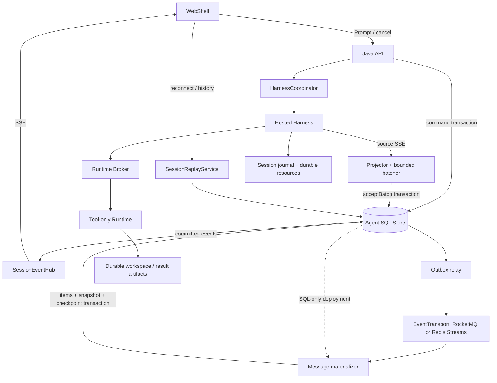

# Managed Agent 存储、事件与会话恢复设计

[English](2026-09-20-managed-agent-storage-event-architecture.md) | [简体中文](2026-09-20-managed-agent-storage-event-architecture.zh-CN.md)

> PR #12692 范围修正（2026-09-25）：下文的实现与验证记录来自完整集成预览，不是本次拆分的验收证据。当前能力、修复与未完成门禁以[评审修正](2026-09-25-managed-agent-review-corrections.zh-CN.md)为准。

状态：总体架构仍为提议；本分支已实现 P0 和基于 SQL 的 P1 物化切片。日期：2026-09-20。本文按下面的集成代码快照设计，不表示完整架构已经通过生产验收。

补充状态：§9.1～9.4 的灾备与合规删除是待实现、未验收设计。本轮只修改文档，不修改代码/schema/部署或运行产品测试。补充设计源固定为 [code_agent@1478e7b](https://github.com/doudouOUC/code_agent/tree/1478e7b632eb237bc3f40ea574ce90782e1cf4c3/qwen-code/feature/managed-agents)，draft 集成参考为 `bad721f22fcd8cfad9ec22e98f69fec75b20b6f0`，本地核对基线为 `f5088d2e`；不整体覆盖旧设计，也不把这些快照视作同一实现。第5项配额/计费排除；租户信任与强隔离选型暂缓，不默认已具备生产多租户安全。

## 1. 决策

保留 WebShell → Java 控制面 → Hosted Harness → Runtime Broker → Tool-only Runtime 的分工。Harness 运行 Qwen Agent 循环，Java 负责准入、状态、事件投影和客户端接口，Runtime 负责工具与工作区。模型推理与 Runtime 预热仍并行，实际调用工具时才等待 Runtime。

按职责抽接口，首个实现沿用 MySQL；PostgreSQL 是同一业务契约的另一个实现。有现成 RocketMQ 平台时优先接入它做可靠异步分发；没有时先用 SQL 批次扫描驱动物化，不为 SSE 额外部署 MQ。Redis Streams 保留为可选适配器，不和 RocketMQ 同时成为默认依赖。

第一阶段采用**短期 SQL 批次日志兼 Outbox → 提交后立即 SSE 推送 → 异步分发与消息物化**。这是对前面“直接写 MQ，再异步入库”的收敛：现有代码把 Session 序号、Turn 状态和 Harness 游标放在一个数据库事务里，直接拆开会引入双写缺口。保留一个有限的事务边界，先消除永久逐片段存储和每连接轮询。

代价也明确：SQL 仍处于事件接受路径；MQ 故障可以缓冲，SQL 故障仍会阻塞新事件接受。这不是“数据库故障时继续无限接收输出”的方案。若这项能力是硬要求，应优先完成第 12 节的持久化源日志方案，再评估 MQ 优先链路。

本文随下述首批表结构和 SDK 集成一同更新，但不承诺任意模型 token 位置恢复、工具恰好执行一次、数据库在线热切换或所有 MQ 功能完全等价。

当前实现切片已经加入 `AgentStateStore`、有界 Harness 事件批处理、稳定 Item/Part 身份、游标/序号/终态单事务更新，以及提交后的本机 SSE 直推与持久化补发。Flyway V2 新增 Item、Item Part、Snapshot 和消费进度表；SQL 扫描器按连续事件前缀在同一事务中更新物化内容、Snapshot 与进度，WebShell 读取一致 Snapshot、控制事件和未物化尾部。为保持兼容，目前每个公开事件仍保留一条 SQL 记录。批次日志/Outbox、保留清理、外部 EventTransport、PostgreSQL 适配器、多实例唤醒和 Harness/Runtime 持久恢复仍是后续工作。

## 2. 核实的代码基线

集成基线为分支 `feature/managed-agents-p0-p8`、提交 `fc32ab0c9502a0b44020ef1a66c88e9b3a2a1484`。上面说明的 P0/P1 切片已在该基线之后提交到同一分支。下列路径均指这一分支快照。

Java 服务源码根目录为 `packages/sdk-java/managed-agent-server/src/main/java/com/alibaba/qwen/code/managedagent/`。

| 位置                                                                                               | 当前行为及设计影响                                                                                                 |
| -------------------------------------------------------------------------------------------------- | ------------------------------------------------------------------------------------------------------------------ |
| `store/ManagedAgentStore.java`                                                                     | 具体的 JDBC 类；事务同时维护命令幂等、Turn、源游标和公开事件，不能拆成互不相关的 CRUD 接口。                       |
| `service/HarnessCoordinator.java`                                                                  | 消费 Harness SSE；按 `bootId:eventEpoch:eventId` 去重并提交有界源事件批次；还有 Java 产生的 Runtime 状态事件。     |
| `service/HarnessEventProjector.java`                                                               | 文本与工具投影已有确定性的 Item/Part 身份，并继续使用明确的公开字段白名单。                                        |
| `service/ManagedEventStreamService.java`                                                           | 实时路径使用提交后本机通知，缺口与重连通过周期 SQL 核对；浏览器不直接访问数据库。                                  |
| `service/ManagedAgentService.java`                                                                 | Transcript 读取最新物化 Snapshot、保留的控制事件和 `coveredSequence` 后的尾部；Snapshot 尚未产生时兼容旧事件分页。 |
| `harness/HarnessConnector.java`                                                                    | 已有连接器接口，可复用；当前包含提交、SSE、取消和启动代际信息。                                                    |
| `src/main/resources/db/migration/V1__managed_agent_core.sql` 与 `V2__managed_agent_projection.sql` | V1 包含 Session、Turn、Command、Event；V2 增加 Item、Item Part、Snapshot 和投影进度，批次日志/Outbox 尚未实现。    |
| `packages/sdk-java/runtime-broker/`                                                                | 已有三个 Repository 接口；Embedded Broker 默认构造仍使用内存实现。                                                 |
| `packages/core/src/managed-runtime/managed-session-assembly.ts`                                    | 直接组装本地 Session authority、资源存储和写者租约，尚非可替换的远端持久化实现。                                   |

最新代码已统一公开 Java Session、Harness、JSONL 与 Broker 使用的 Session UUID。`harnessSessionId` 仅为协议别名，不再设计第二套身份映射。租户隔离仍使用 `(tenantId, sessionId)`；`turnId` 与稳定的 `promptId` 各有用途。

普通投影事件会产生多次 UPDATE 和一次 INSERT；被过滤的源事件也要更新恢复游标。一个 chunk 不等于一个 token。当前基线未包含本文的合并、过期清理和聚合存储机制。

## 3. 数据分别由谁负责

| 数据                                              | 权威与存储                            | 保留方式                                         |
| ------------------------------------------------- | ------------------------------------- | ------------------------------------------------ |
| Session、Turn、Command、租约、幂等与权限范围      | Java 关系数据库                       | 业务保留期；幂等记录不能早于承诺的重试窗口删除。 |
| 已接受的公开事件                                  | 短期 SQL 批次日志；MQ 为分发副本      | 续传窗口及必要消费者进度共同决定清理。           |
| 展示用 Message/Item、工具卡片、Snapshot           | 从公开事件与已接受输入构建的 SQL 投影 | 长期保存完整内容；大对象引用对象存储。           |
| 模型上下文、私有 Session 记录、检查点及其资源引用 | Harness Session authority             | 独立持久化；不是公开 Message 表的反向重建结果。  |
| Runtime binding、工具执行账本                     | Broker 的持久化 Repository            | 至少覆盖执行核对及恢复期限。                     |
| Workspace、工具大结果、文件历史与恢复资源         | 持久卷或对象存储及引用清单            | 仍被 Session/执行引用的资源不得随 Runtime 回收。 |

SSE 是传输协议；MQ 是事件分发组件；关系数据库是业务状态及查询存储。三者都不自动替代 Harness Session 的恢复协议。

## 4. 第一阶段端到端链路



1. Java 在一个事务里保存 Prompt 的命令幂等、Turn、输入及控制事件，返回已接受的 Turn 身份。
2. Coordinator 取得带代际的租约，按稳定 `promptId` 提交 Harness，同时预热 Runtime。提交响应丢失时核对原提交，不创建新 Prompt 重跑。
3. Java 解析 Harness SSE，投影、去重并组成有大小上限的批次。`acceptBatch` 提交成功后，本节点直接把返回的事件发给 SSE Hub，无须再次读取数据库或等待 MQ。
4. Relay 读取同一批次日志并发往配置的 EventTransport；消费者聚合 Message/Item。无 MQ 部署由数据库批次扫描器执行相同的物化事务。
5. 浏览器重连由 Java 按 Session 序号补齐；历史查询读取完整 Item 与 Snapshot。

用户输入不是模型 delta。物化器从同事务保存的不可变 Turn 输入构建用户 Item；`turn.accepted` 需补稳定的输入 Item 引用及修订信息。当前事件只有 `turnId`，不能假设现有公开事件自身已经包含完整对话。输入与投影的身份、摘要及所属序号必须固定，Snapshot 只包含其覆盖序号内的版本。

“同时推送与入库”是**先确认可靠接受，再并行进行展示和后续处理**。不能只开两个异步任务分别发送 SSE、写 MQ，然后把它们视作一个可靠操作。Outbox 将本地状态提交和待发送内容置于同一事务，但 Relay 重试仍可能重复发布，消费者必须幂等。[Transactional outbox](https://microservices.io/patterns/data/transactional-outbox.html)

## 5. 接口边界

下面是目标职责草图，不要求每张表都建立接口。已提交的 `AgentStateStore` 覆盖 P0/P1 子集，并不等同于完整目标接口。

```java
interface AgentStateStore {
    CommandResult acceptCommand(Command command);
    Lease claimTurn(TurnKey turn, Duration duration);
    AcceptedBatch acceptBatch(Lease lease, IngressBatch batch);
    void applyProjection(ProjectionMutation mutation);
    ReplayPage readReplay(SessionKey session, long after, int limit);
    TranscriptSnapshot readSnapshot(SessionKey session);
}

interface EventTransport {
    CompletionStage<PublishReceipt> publish(CommittedBatch batch);
    Subscription consume(ConsumerSpec consumer, BatchHandler handler);
}

interface SessionArtifactStore {
    ArtifactRef putImmutable(ArtifactScope scope, InputStream content);
    InputStream readVerified(ArtifactScope scope, ArtifactRef ref);
}
```

| 边界                      | 契约                                                                                                                                     |
| ------------------------- | ---------------------------------------------------------------------------------------------------------------------------------------- |
| `AgentStateStore`         | 业务事务、范围隔离、租约代际、游标及序号分配、幂等投影。命令及其事件、批次及其源游标必须由一个后端的同一事务提交。                       |
| `EventTransport`          | 已提交批次的至少一次分发、显式处理成功/失败、发布确认和健康状态。业务 `eventId` 不依赖 Broker message ID；客户端从不使用 Broker offset。 |
| `SessionReplayService`    | 应用服务，组合 Snapshot、短期范围读取和订阅；不是“所有 MQ 都支持按 Session seek”的适配器。                                               |
| `SessionArtifactStore`    | 不可变字节、大小/摘要校验、租户及 Session 范围。对象存储不负责租约、日志提交或工具去重。                                                 |
| Harness Session authority | 在现有 authority 边界上扩展可恢复的日志提交与 fencing；继续只有 Harness 写私有 Session，Java 不成为第二写者。                            |

`MySqlAgentStateStore`、`PostgresAgentStateStore` 可以共享行映射与业务类型，使用各自 SQL 和 Flyway 迁移。数据库异常在事务退出后转换成统一的冲突结果；不能在 PostgreSQL 已失败的事务里捕获唯一键异常后继续查询。统一锁顺序、事务隔离约定、数据库时间租约、字符串大小写语义、JSON 编码、分页和重试范围，不能只换 JDBC URL。[PostgreSQL transaction isolation](https://www.postgresql.org/docs/current/transaction-iso.html)

Broker 复用 `RuntimeBindingRepository`、`RuntimeSessionRepository`、`ToolExecutionRepository`，为其增加 MySQL/PostgreSQL 实现。不要另造一套 Broker 存储 API；涉及多个仓库的不变量仍需由其业务操作明确事务或 CAS 边界。

EventTransport 的通用保证保持较小：允许重复和跨重连乱序，应用按已提交序号检查、去重及补洞。适配器可以增强顺序和吞吐，不能静默降低确认或恢复语义。第一批只实现确实要部署的后端与共同契约测试，不预先实现全部 MQ。

## 6. 事件协议与接受事务

事件至少携带 `schemaVersion`、`projectionVersion`、`tenantId`（内部）、`sessionId`、`turnId`、`sequence`、`eventId`、`type`、`data`、`createdAt`。文本还需要稳定的 `itemId` 和 `contentPartId`。身份来自 Harness 协议扩展，不能依赖 Java 内存里的临时计数器。

稳定 Item/Part 身份与 Snapshot 重置分别进行能力协商。Harness 未提供前者时保留旧投影路径；客户端未支持后者时保留旧续传路径。不把缺少身份的片段猜测合并，也不提前对不兼容的会话启用清理。

内部批次记录 `batchId`、`firstSequence`、`lastSequence`、`producerGeneration`、源 `bootId/eventEpoch` 与已接受的源游标。公开序号是本 Session 的提交顺序，源游标用于 Harness 恢复，二者不可混用。重放保留最初提交的投影版本、序号和内容，不重新运行最新版投影器。

`acceptBatch` 必须在一个事务内完成：

1. 按统一顺序锁 Session 与 Turn，验证租户、活动 Turn、数据库时间租约、单调递增的 owner generation 及源 epoch。过期写者不能提交，即使它还活着。
2. 丢弃当前 epoch 下已提交源游标以前的输入，再进行合并。IngressBatch 在提交前保留源事件边界，以便处理重试批次与已接受前缀重叠；不同 epoch 不能用数字大小比较。
3. 为新公开事件分配连续 `sequence`，保存不可变批次，推进源游标和 Session 水位；终态与其终态事件同事务更新。全部被过滤时只提交游标检查点，不产生空公开事件。
4. 事务提交后才向 Hub 发布；命令产生的控制事件使用同一序号分配机制。Runtime 异步回调还需验证对应操作的 generation/状态，拒绝失效操作推进当前状态。原调用的可信迟到回执走独立受限收件/结算路径，保留事实，不注入 replacement generation 或唤醒已关闭 Session。

SQL 提交响应丢失时，先按稳定提交身份核对结果；已提交的批次复用原 `batchId`、序号和内容，不重新分配序号。相同身份携带不同摘要属于协议冲突，应停止该流并报警。接受凭据和源游标去重元数据至少保留到承诺的重试窗口结束，不能随短期正文一起提前删除。

第一段可见文本立即提交；后续同一 `turnId/itemId/contentPartId/type` 的文本允许合并。候选参数为 `50–100ms` 或 `64KiB` 达任一上限即提交，需压测确定。终态、工具边界、审批、错误和取消先刷新前序文本，再及时提交；不能把它们按文本拼接。

内存缓冲有单 Session 与全局上限。接受前崩溃的尾部只在 Harness 源流确实还能回放时可重取；当前源流跨 boot 恢复未经证明，不能把短期内存窗口说成绝对不丢。数据库确认的可靠性同样取决于刷盘、副本及故障切换配置。

## 7. 推送、续传与 MQ 消费

### 7.1 SSE 与多实例

同节点由提交回调推送完整批次。每个节点的 Hub 为同一 Session 共享有界缓冲，再分发给多个浏览器连接；慢连接超限就断开并要求续传，不阻塞 Harness，也不取消 Turn。

小规模多实例部署使用服务发现中的已认证 Java 节点发送合并的 `sessionId + committedSequence` 通知。收到通知且有本地订阅的节点，按 Session 范围读取一次，再发给全部本地连接。通知只作唤醒提示；按节点批量检查活跃 Session 水位作为丢通知修复路径，检查频率与心跳协调。这仍有跨节点范围读取，但消除了每个浏览器固定 `200ms` 轮询。

节点广播随节点数放大，必须压测并限定首版规模；规模扩大后再采用 Session 分片路由。不能把多个 SSE 节点放进一个 MQ 消费组，就假设每个节点都会收到相同事件。MQ 物化消费与 SSE 节点通知是不同的职责。

### 7.2 无缝衔接历史与实时

先注册本地订阅并缓冲通知，再读取一致的 Snapshot 和日志高水位 `H`，发送 `(afterSequence, H]` 内的数据，然后排空缓冲中 `sequence > H` 的部分。客户端和服务端均按序号去重；遇到缺口先补齐，不能直接跳过。范围分页需短期读取租约或等效保护，避免清理任务在分页中间删掉数据；保护到期时显式重试或重置。

保留现有 SSE 的数字 `id` / `Last-Event-ID`，由服务端固定到已鉴权的 Session；前端使用十进制字符串或安全整数策略，避免大序号精度丢失。新增能力协商后返回 `minReplaySequence`、`lastSequence`、`coveredSequence`。超出保留窗口时，流建立前返回明确的游标过期错误；流建立后发送不推进业务序号的 `resync.required` 控制帧并关闭。

前端拿到物化 Snapshot，整体替换其覆盖的状态，再从 `coveredSequence` 之后读取尾部，不能把同一段文本追加两次。Snapshot 必须绑定一致版本的 Item 内容及水位；若历史分页，所有页面固定在同一 Snapshot 版本。清理仅能推进到已物化的连续前缀，保证该 Snapshot 之后仍有连续日志。旧客户端未具备重置能力前，不能对它依赖的数据启用过期删除。

### 7.3 消费和重试

以 `(tenantId, sessionId)` 作为消息分组键，Relay 按 Session 串行发布；超时不确定时重发同一 `batchId`。发布确认与本地标记之间崩溃会重复发送，这是正常恢复路径。

RocketMQ 的组内顺序需要单生产者串行发送；跨生产者接管仍需应用检查序号，MessageGroup 不代替 fencing。[RocketMQ ordered messages](https://rocketmq.apache.org/docs/featureBehavior/03fifomessage/)

消费者在一个数据库事务里更新 Item/Snapshot 和自己的连续进度，然后 ACK；重投不重复追加文本。缺口从短期日志补齐；日志也缺失时暂停该 Session 的物化并报警，不把后续内容当作连续状态。消费者不能仅因超过重试次数进入死信就推进业务水位。

浏览器续传使用 Session 的公开序号，不重置物化消费者组。RocketMQ 的消息位置由 topic/queue/offset 描述，消费者进度属于消费组，不是用户会话游标。[RocketMQ consumer progress](https://rocketmq.apache.org/docs/featureBehavior/09consumerprogress/)

## 8. 表结构、聚合与保留

| 结构                                              | 作用与当前状态                                                                                                |
| ------------------------------------------------- | ------------------------------------------------------------------------------------------------------------- |
| `managed_agent_event_batch`                       | 单行保存一个有界批次、序号区间和编码后的公开事件；兼作 Outbox 与续传日志，不再额外复制一张相同的 SQL Outbox。 |
| `managed_agent_item` 与 `managed_agent_item_part` | V2 已实现稳定消息/工具状态与文本 Part。P1 当前按已接受 delta 更新累计正文，不可变长输出分段仍是后续工作。     |
| `managed_agent_snapshot`                          | V2 已实现一致 Item 文档与 `coveredSequence`；更完整的终态/控制状态和固定历史分页版本仍是后续工作。            |
| `managed_agent_consumer_progress`                 | SQL 消息投影进度已实现；发布进度仍是后续工作，不能用 Broker ACK 代替物化进度。                                |
| Session/Turn 增量列                               | 租约 generation、日志最低/最高水位、存储版本、恢复状态和持久化资源引用。                                      |

批次按 `(tenantId, sessionId, firstSequence)` 定位，并支持查找覆盖请求起点的批次；分页在应用层展开事件。长期 Item 可以在内容块结束、终态或有上限的周期检查点更新；不要每个 delta 都重写累计增长的整段正文。长输出使用不可变分段及清单，避免累计写放大。

周期物化可以延后写入，但不能先推进消费进度或 ACK，再把尚未保存的正文留在内存里。处理成功必须对应同事务持久化的内容（或已验证的不可变分段引用）与连续进度；Snapshot 的覆盖水位还必须对应可读取的一致内容版本。

清理条件必须全部成立：

- 批次超过公开续传窗口 `W`，且没有有效范围读取保护。
- 完整内容、控制状态及所需 Snapshot 已覆盖到该批次末尾。
- 所有必要消费者都已完成；启用 MQ 时也已完成分发及必要下游处理。新增消费者先从 Snapshot 初始化，不能假设旧批次仍在。
- 不存在调查、恢复或资源引用 pin；按有界分页删除，避免长期持锁。
- 已明确保留策略，并满足 §9.3～9.4 的删除、安全水位与真实资源 owner 条件。`coveredSequence` 只表示投影覆盖，不是跨存储安全删除水位；控制事件、Range、回执查询仍依赖原表时不能清掉它们。

`W` 是待确认参数，不预设永久保存。可用 `24h` 作为容量测算示例，但它不是已经承诺的产品配置。超过窗口并不等于无条件删除；若消费者长时间落后，限流、暂停新 Turn 并告警，不能无限积压或静默丢弃。

RocketMQ 自身会按保留和空间策略清理，包括尚未消费的数据，应用不能假设“未 ACK 就永远保留”。必要进度落后时由 SQL 日志承担修复来源，并在容量边界前停止接受新工作。[RocketMQ storage policy](https://rocketmq.apache.org/docs/featureBehavior/11messagestorepolicy/)

合并主要减少行数、索引和重复封装；内容字节不会凭空消失。原始速率约为 `C × r × s` 字节/秒，未压缩的窗口容量约为 `C × r × s × W`，还要计入 SQL/MQ 副本和索引。例如 `C=100`、`r=20` 次/秒、`s=200` 字节时，仅原始内容就是 `34.56GB/天`；`100ms` 合并平均约合入两个事件，并不能保证数量级下降。若测得 SQL 批次日志仍超出预算，就不能以“已经加 MQ”为由直接上线，应缩短经确认的窗口、限制并发或推进第 12 节的源日志方案。

## 9. Harness 与 Runtime 恢复

当前本地聊天文件由 Storage 与 ChatRecordingService 放在运行目录下的 `projects/<sanitized-cwd>/chats/<sessionId>.jsonl`；根目录受 `QWEN_RUNTIME_DIR`、运行配置和用户目录影响。JSONL 在磁盘上并不自动意味着无法解耦，关键是进程替换后能否寻址、恢复字节并阻止旧写者继续提交。

完整恢复单元包含私有日志、检查点、被引用资源的闭包、Workspace 身份/快照、文件历史，以及 Broker 中的 binding/执行账本。当前 `LocalProcessRuntimeProvisioner.stopNow` 会删除 generation 目录，不能把其 `outputRoot` 当成长期资源位置；也不能只把 JSONL 上传而遗漏其引用的大结果或检查点资源。

提议的恢复顺序：

1. 按租户与 Session 找到已提交 manifest/日志修订，在隔离状态核验恢复资格与当前安全水位；先隔离旧 Java/Harness/Runtime 写权。没有证据时不开放普通读取、派发、自动任务或 GC。
2. 从原持久账本按原 `executionCallId` 核对不确定调用及备份后缺失区间；查询不新建 Runtime、不重新 prepare/execute。超时、进程退出、恢复库无记录都不证明无副作用；未知区间无法枚举时扩大 blocked 范围。
3. 验证资源精确版本、摘要、长度和引用闭包，重放删除/密钥撤销约束，核对实际模型消费位置。缺资源进入 `recovery_blocked`，不回退为空 Session 或把全部 settled 结果当作已消费。
4. 只有 Workspace 占用、旧 writer 停止/隔离、原结果/history 结算及存储交接证明满足后，才挂载原 Workspace 或已确认快照。随后在同一 Session UUID 下取得新 writer generation、恢复 Harness authority，并按原 binding 策略恢复执行句柄；不透明重绑活跃 Runtime Session。
5. 仅在当前 ACL、生命周期及协议恢复边界允许时继续。私有日志恢复、公开 SSE 补发、运行中模型请求续算是三件不同的事。

资源先不可变发布并校验，再通过带 expected revision 与 writer generation 的条件提交发布 manifest/日志提交点。上传成功但提交不明只产生候选孤儿；实际 owner 必须按原 commandId 查明原提交、隔离旧生产者并核对全部引用/发布 hold 后，才允许回收，不能超时清唯一副本。提交点不能引用尚未持久化的对象。对象存储插件之外，必须有实际拒绝旧 generation 的权威提交机制，不能仅依赖本地锁或“租约已经过期”的客户端判断。

生产恢复能力需扩展 Harness 协议，明确 `journalRevision`、资源 manifest 与可恢复边界的确认。恢复状态与 Turn 完成状态分别记录；成功生成回复不自动证明可迁移恢复。持久化确认和执行核对完成前禁止回收仍被引用的资源。现有 boot mismatch 拒绝路径在这些验收完成前继续保留，不改成无条件重新 attach。

<a id="restore-set"></a>

### 9.1 RestoreSet：一致备份集合

首版选择维护屏障备份，不承诺任意时刻热快照。停止集合涉及的 Session/共享 Workspace 的新输入、唤醒、派发和引用变更，排空实际写者及后代，持久接收结果/资源，提交模型实际消费位置与 history/checkpoint，再 freeze/flush。无法获得这些证明的集合不发布为可自动恢复。

RestoreSet 是有版本、不可变的跨存储 manifest，绑定稳定集合 ID、原维护 operation、范围、schema/reader 版本、屏障与冻结证明、组件版本/ref/digest、恢复边界和核验状态；通过已有仓库条件发布，不作为第二份 Session 日志。它关联：

| 组成           | 必须固定的内容                                                                                                |
| -------------- | ------------------------------------------------------------------------------------------------------------- |
| MySQL          | 一致备份身份、校验信息、对应 binlog/GTID 边界；包括产品状态、原命令、Broker binding/执行记录和 Workspace 引用 |
| qwen authority | 私有 journal 完整提交前缀、checkpoint、待处理命令/原调用、实际模型消费结果及位置；不能仅取公开 Item/Snapshot  |
| 对象与资源     | 精确版本、长度、digest、全部引用闭包与各 owner/hold；不能只保存可变 object key 或“最新版本”                   |
| Workspace      | PVC/卷快照、受信 storage identity、文件 history/前后像及对应占用/冻结证明                                     |
| 构建与密钥     | build/Bundle/模板/协议兼容版本、所需 key 版本引用；manifest 不存密钥明文                                      |

组件完成和 manifest 发布之间丢 ACK 时查询原 operation，不另造恢复集合或提前解屏障。全部组件核验、条件发布成功后才按当前权限释放维护屏障；失败保留持久进度并由原 operation 收敛。备份成功只证明所声明边界，不批准将来恢复。

共同时间戳不是一致性证明；[MySQL binlog/PITR](https://dev.mysql.com/doc/refman/8.0/en/point-in-time-recovery-binlog.html)和 GTID 不证明外部副作用，[VolumeSnapshot](https://kubernetes.io/blog/2020/12/10/kubernetes-1.20-volume-snapshot-moves-to-ga/)不自动提供应用一致性。`RestoreBundle` 仍是单 Session 的恢复响应，读取已验证集合里的合法基础；RestoreSet 不代替 authority。封闭记录/引用、minimumReader 及 capability 规则见[存储规范](managed-agent-session-storage.zh-CN.md#restore-set)。

<a id="quarantined-restore"></a>

### 9.2 隔离恢复与缺失区间

恢复启动默认隔离，不派发、不自动唤醒、不运行 GC；普通读取也须等 §9.3 的完整当前安全依据。旧 Java/Harness 的存储写权与旧 Runtime 的物理写通道分别隔离，新 DB epoch 或凭据版本不能证明旧 Shell 停止。原节点/存储证明、RWOP 和同卷交接遵守 [Endpoint §17](2026-09-21-managed-runtime-endpoint-recovery.zh-CN.md#hosted-runtime-profile)。

从备份边界到恢复隔离完成之间，必须依靠不随该备份丢失的原持久账本、受保护备份/审计及原 owner 证据枚举执行缺口。恢复库自己没有 command/dispatch 行不是未执行证明。仅当现有证据可覆盖完整区间、原效果已结算且结果/history/消费位置一致时才允许续跑；区间无法枚举就阻塞可能受影响的全部 Session/Workspace，不能把已知子集当作完整清单。原执行查询不 provision/prepare/execute。

重放删除/密钥撤销事实后只恢复仍有资格的资源。真实 ACL 权威不可用或尚可能是回滚旧版本时，不签新 grant、不开放普通读取；技术恢复成功不恢复用户旧权限。`accepted_unresolved` 仅关闭业务案件，物理 UNKNOWN 保留，不生成工具成功、不解卷、不恢复原模型。新任务也不能绕开原卷屏障，见[对账](managed-agent-recovery-operations.zh-CN.md#unknown-reconciliation)及[撤权](managed-agent-control-protocol.zh-CN.md#dynamic-authorization)。

<a id="recovery-safety-watermark"></a>

### 9.3 备份外的完整安全水位

完整 DR 开放前，必须有不随业务 DB 回滚的恢复资格、删除 tombstone、密钥撤销记录和可验证完整水位。优先复用已有受保护备份/审计存储，只保存这些窄事实，不复制 Session 日志、不新增服务或 MQ。它必须处于不会与业务备份一起回退的保护范围；同一份 SQL 备份里的“最新水位”无效。

接口义务是返回目标恢复范围、当前资格/删除/key 撤销事实、完整水位、对应记录集及其完整性和新鲜性证据；验证者必须能证明无漏尾、无倒退，且查询覆盖全部相关范围。签名、hash、备份时间或客户端缓存的最大序号本身不能证明当前性。部署可复用受保护存储自身经验证的当前完整读取能力；无法提供这项证明的适配器不具备完整 DR capability，不能临时信任恢复库自报。

启用完整 DR 的部署，先在受保护依据中按原 operation 幂等预登记会降低恢复资格的删除/撤销意图，再推进业务库操作，最后登记经核验的结算引用。待决意图也阻止对应范围恢复；任何一步丢 ACK 按原 ID 对账，不因业务库回滚而抹掉意图。受保护存储不能在尚有未结意图或无法覆盖的来源变更时声称完整水位。该顺序复用原 operation 的持久阶段，不承诺跨库原子事务，也不复制业务日志。

恢复验证期间的并发删除/撤权也不能漏掉：开放读取/签发 grant 前重新核验当前权威与安全水位，并让后续读取/续租持续服从当前权限。跨系统读取不冒充分布式原子事务；无法形成有效准入屏障时继续隔离。没有证据时，普通 SSE/历史/Range/export/回执内容均 blocked，仅可经独立授权的隔离诊断访问必要材料，不唤醒模型、不允许普通导出。

删除/撤销依据至少覆盖所有仍能恢复相关旧数据的备份与副本，不能按短命令幂等 TTL 清除。该前置属于 G/W1 完整灾备开放条件，不强迫 C/E＋W0 在线闭环新增基础设施。缺少它可以报告备份存在或恢复未验证，不能宣称安全自动恢复。

<a id="compliance-deletion"></a>

### 9.4 合规删除与副本完成度

复用原 Session close/delete、operation、资源 owner 和持久清理进度。删除请求先持久受理并封新输入/派发/普通读取，ACK 不等于停止或删除。生命周期仍为 `idle/active/recovery_blocked → closing → closed`，随后 `closed/archived → deleting → deleted`，不从活动态跳删除终态；原物理 owner 未知不能提前 closed。原 ID 查询/取消、可信迟到收件及清理保留窄系统资格，不唤醒模型或恢复撤权用户读取。

原工作可信停止后，核对结果交付、reader、pin、fork/export、发布 hold、调查/法律保留；在原 operation 下持久注销引用与 tombstone，再由真实 owner 按精确版本和身份条件清理。跨 owner 丢 ACK 查原引用/提交，不按超时推断已释放。未知引用或执行保持 pending/blocked，不清唯一证据；单 Session 删除只释放自身引用，不删除共享 Workspace/PVC。整个 Workspace/租户删除需要单独权限并核对全部引用。

完成度使用受控、版本化公开投影，且每项带原 operation、范围、revision、证据引用与未完成原因，不重定义既有 `deleted`：

| 维度              | 可报告完成的依据                                                                 |
| ----------------- | -------------------------------------------------------------------------------- |
| 在线撤读          | 普通新请求及已有流的后续内容交付均已阻断；已发字节无法追回                       |
| 执行停止          | 原可信监督者确认声明范围内实际退出；节点/存储隔离另报，不能伪称进程退出          |
| 在线清理          | 当前 owner 的可删除在线副本与引用已结算并核验，其他 owner 合法引用未受损         |
| 备份待清理        | 逐项记录 SQL 备份、对象历史版本、快照、导出等仍存副本及保留期限，不算完全完成    |
| hold/供应商待确认 | 有效法律保留或供应商未证实清理，记录适用范围、期限和后续动作                     |
| 完全完成          | 声明删除范围内所有应清理副本均有证明，不再有未完成 hold/外部确认或可解密恢复路径 |

删除约束必须在任意灾备开放读取前重放。[OSS delete marker](https://www.alibabacloud.com/help/en/oss/developer-reference/deleteobject)不等于历史版本已清除；已交付的用户导出无法技术追回，不能无依据承诺清理它。密钥擦除只有所有相关可解密副本及可恢复 key 路径都不可恢复才成立，不销毁他人共享 key，不同时承诺彻底擦除和完整恢复。

RPO/RTO、保留窗口、具体 CSI 驱动、备份删除及供应商契约尚未选定，不猜数值；未配置/未验证时相应自动恢复或 GC 不开放。UNKNOWN 不是无限期保留敏感数据的法律依据，需独立保留策略和有权合规处理；业务风险接受也不伪造物理结算。更细生命周期与引用规则见[Session 存储](managed-agent-session-storage.zh-CN.md#deletion-settlement)。

## 10. 后端选择与部署配置

| 组件                  | 首选及替换边界                                                                                                                                             |
| --------------------- | ---------------------------------------------------------------------------------------------------------------------------------------------------------- |
| 关系数据库            | 先沿用 MySQL，减少迁移变量；已有 PostgreSQL 平台的部署可以选其适配器。当前问题不能通过换数据库类型直接解决。                                               |
| 消息分发              | 已有平台时优先 RocketMQ，承担多消费者和积压恢复；无平台时先启用 SQL 扫描器。Redis Streams 是短窗口场景的候选实现，仍需验证持久化、pending 消息恢复和容量。 |
| 浏览器续传            | 首版统一 SQL 批次日志；选择 Redis 适配器不意味着续传存储也必须再复制一份。                                                                                 |
| 大对象与 Session 资源 | 使用现有对象存储或符合写者约束的持久存储。开发环境可以用本地实现，不能据此宣称跨节点恢复。                                                                 |

后端选择发生在部署启动时，使用依赖注入和厂商迁移目录；这是本文提议的配置形状，不是当前已有配置：

```yaml
qwen:
  managed-agent:
    storage:
      backend: mysql # mysql | postgresql
    event-transport:
      backend: rocketmq # rocketmq | redis-streams | sql
    artifacts:
      backend: local # development only; production uses a durable provider
```

`sql` 表示不启用外部 EventTransport，由批次扫描器驱动物化。内存实现仅用于测试/开发。启动时校验所选适配器支持部署要求的确认、消费恢复和资源校验；缺能力就拒绝启用相应模式。凭证由部署配置注入，不进入公共事件或日志。

运行时不能按一次请求任意切换 MySQL/PG 或 MQ。切换需暂停写入、排空或保存检查点、迁移数据、核对序号与摘要，再切换并恢复；不能通过双跑工具或双写两个数据库模拟无损切换。

## 11. 故障语义

| 故障点                         | 处理与可承诺的边界                                                        |
| ------------------------------ | ------------------------------------------------------------------------- |
| Java 在批次提交前崩溃          | 从最后持久化源游标重取；源不可回放则报告缺口/恢复阻塞，未提交尾部无保证。 |
| 提交成功但尚未推 SSE           | 日志补发，浏览器按原序号去重。                                            |
| MQ 发送成功但 Relay 未标记     | 同 batch 重发，物化事务去重；不重复追加文本。                             |
| SSE 通知丢失或节点崩溃         | 节点水位核对或重连续传修复，浏览器不控制 Turn 生存期。                    |
| SQL 暂时不可写                 | 有界缓冲和背压；源无法可靠暂停/回放时显式失败，不继续承诺已接受。         |
| MQ 不可用                      | 已接受输出仍可由 SQL 支持展示；Outbox 有界积压，达到阈值停止新准入。      |
| 消费者乱序、死信或漏段         | 检查连续进度并补洞，无法补齐则暂停该 Session 投影；不推进 Snapshot 水位。 |
| 租约切换后旧 Java/Harness 回来 | 数据库接受事务和私有日志提交均校验 generation；MQ 顺序能力不承担此防护。  |
| 工具结果未知或 Workspace 缺失  | `recovery_blocked`，不自动执行第二次，也不创建空工作区冒充恢复。          |

所有查询、重放、资源下载与内部通知都保留租户鉴权。`X-Qwen-Tenant-Id` 是可信入口传递的范围，不是身份凭证。MQ 内部元数据和私有 Harness 记录不得直接透传前端；保留当前显式公开投影及敏感字段过滤。Hosted 按[动态授权契约](managed-agent-control-protocol.zh-CN.md#dynamic-authorization)在现有 SSE 和每个后续内容交付边界核对当前 ACL，不把连接建立时的权限当成永久资格。内部原 ID 收件可继续，但不会恢复用户读取或模型推进。

## 12. 落地顺序与代码改造

| 阶段                           | 工作与退出条件                                                                                                                                                                                                                             |
| ------------------------------ | ------------------------------------------------------------------------------------------------------------------------------------------------------------------------------------------------------------------------------------------ |
| P0：契约与基线                 | **基础已实现。** 已有 `AgentStateStore`、有界入口批处理、幂等准入和提交后 Hub 直推；H2 与真实 MySQL 集成测试覆盖当前契约。性能基线和 PostgreSQL 对等能力仍待完成。                                                                         |
| P1：批次与直推                 | **基于 SQL 的切片已实现。** 已有稳定 Item/Part 身份、V2 投影表、连续进度/Snapshot 同事务物化、带 Snapshot 水位的公共 Item 列表，以及 WebShell 的 Snapshot 加尾部恢复。长输出写放大、Snapshot 分页保护和生产故障/性能证据仍待完成。         |
| P2：传输与保留                 | 增加实际选中的 MQ 适配器、Outbox Relay、多实例通知及续传重置；物化核对通过后，才启用窗口清理。已有 RocketMQ 平台时在此接入。                                                                                                               |
| P3：恢复持久化                 | 持久化 Broker 三个 Repository；补 Harness authority 和资源 manifest、Workspace 恢复与回收屏障。跨 JVM/Harness/Runtime 故障测试通过后，才开放自动接管能力。                                                                                 |
| P4：按测量决定是否改变接受路径 | 若 SQL 接受吞吐或 SQL 故障隔离不达标，先让 Harness/入口具备独立持久化源日志、单写者 fencing、稳定事件身份与重放确认，再设计 MQ 接受后直推、SQL 异步物化。此时必须重定控制事件与文本的统一顺序及公开游标，不能只替换 `acceptBatch` 的实现。 |

P4 是明确的后续设计门槛，不是当前接口已经实现的能力。当前不引入多套运行模式、通用查询 DSL、自动 MQ 热切换或新的 Java Agent 循环。

迁移采用增量表与逐 Session 的 `storageVersion`，老 Session 暂时保留旧事件路径，新 Session 灰度使用新路径。历史回填缺少稳定 Item 身份时只保留为旧 Transcript，不能猜测后删除原记录。旧客户端继续使用保留路径，具备新能力的客户端才能进入窗口清理模式。

灰度先做只读投影对比，绝不双发 Prompt/工具。回滚优先停止新模式准入并保留兼容读取；已有新模式 Session 继续由兼容服务处理或明确暂停。启用清理后，旧版本无法仅凭已经删掉的 delta 恢复历史，因此不能只回滚二进制。

## 13. 验收与待确认参数

验收应针对实际部署的 MySQL、PostgreSQL 和 MQ 版本，不以 H2 或内存适配器通过代替：

- 两个 JVM 同时提交相同幂等键、竞争 Turn 和租约，只有一次准入；失效 generation 不能推进源游标、事件或状态。
- 注入提交前后、发布确认前后、投影事务前后崩溃，核对事件、完整文本、终态和消费进度，既无静默缺口也无重复文本。
- 切换 Java 节点、丢通知、慢消费者、重连与 Snapshot 分页同时发生，验证缓冲到补发的衔接、游标过期与清理互斥。
- 多 Part 文本、工具/审批交错、取消和错误终态均保持边界；确认公开投影不包含私有内容。
- 清理时模拟必要消费者落后、Broker 提前清理和资源 pin；达到容量阈值前正确限流，仍可由保留日志补洞。
- 删除 Runtime 进程及临时 generation 目录后恢复同一 Workspace 和 Session；缺少资源或工具结果未知时明确阻塞，不重复执行。
- 各数据库适配器执行同一事务/幂等/CAS 测试；MQ 适配器执行同一确认丢失、重复、乱序和恢复测试；源码集成时再执行对应构建、类型检查和 E2E。

补充验收（均未执行）：

| 用例                          | 必须成功                                             | 必须拒绝或阻塞                                         |
| ----------------------------- | ---------------------------------------------------- | ------------------------------------------------------ |
| 一致备份与丢 ACK              | 冻结闭包、精确版本及原 operation 收敛同一 RestoreSet | 单独 timestamp/GTID/VolumeSnapshot 不冒充一致恢复      |
| DB 回滚至派发前               | 完整缺口证据及原回执允许合法恢复                     | 缺记录不重放；旧写者未隔离、缺口不可枚举则扩大 blocked |
| DB 回滚至删除/撤权前          | 最新完整安全水位重放删除/撤销后仅合法数据可读        | 陈旧签名/水位或缺 authority 时普通读取也拒绝           |
| 恢复与并发删除                | 开放前及后续读取持续服从当前权威                     | 一次恢复验证不永久豁免后续撤权/删除                    |
| 删除与 reader/pin/fork/共享卷 | 排空和引用注销可恢复，独立引用保持可读               | 不误删共享 PVC、发布 hold 或唯一 UNKNOWN 证据          |
| 副本/key/供应商               | 所有声明范围内副本及可解密路径结清才完全完成         | delete marker、部分密钥擦除、未确认外部删除不虚报完成  |

每项须同时有成功与拒绝路径，不能全部 blocked 冒充通过。真实 MySQL/Kubernetes/CSI/对象版本及供应商语义须独立验证，H2/fake API 不替代。补充的 G/W1/O4 开放条件与本篇原 P0～P4 编号分开；内部安全规则不等 D 公共投影上线。

性能对比记录：首字延迟及段间延迟 p50/p95/p99、每 Session 事务/秒、SQL 实际字节与索引占用、重放吞吐、物化延迟、MQ 积压、每节点/SSE 连接缓冲和资源恢复耗时。本文没有跑性能实验，不声称固定倍数提升。

上线前需明确：现有 RocketMQ 平台及版本、活跃 Session 数与事件速率、续传窗口 `W`、最大可容忍积压、数据库/MQ 确认的故障保证、历史与资源保留期、允许的恢复点和恢复时间。接口和分阶段设计不依赖立刻确定这些数值；容量、清理和跨节点恢复的生产配置依赖它们。

参考现有方案：集成快照中的 `docs/design/2026-09-19-managed-agent-spring-server.zh-CN.md`、`docs/design/2026-09-20-managed-agent-dual-path-web-shell.zh-CN.md`、`docs/design/managed-agent-session-storage.md` 与 `docs/design/managed-agent-session-harness-runtime.md`。本文补充其存储与事件边界，不把已有设计文档视作功能验证结果。
