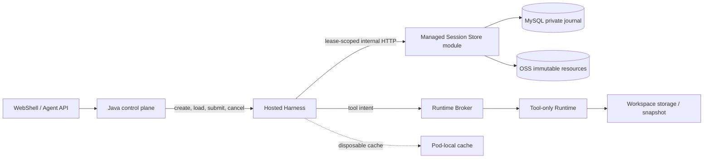

# Managed Session Durable Authority Store

[English](2026-09-21-managed-session-durable-store.md) | [简体中文](2026-09-21-managed-session-durable-store.zh-CN.md)

> PR #12692 scope correction (2026-09-25): implementation and verification records below refer to the full integration preview, not acceptance evidence for this split. See [review corrections](2026-09-25-managed-agent-review-corrections.md) for current capabilities, fixes, and remaining gates.

Status: D0, D1a, and D1b are implemented in the current feature-branch working tree, including the shared TypeScript/Java golden contract and the independent-JVM failure/takeover proof against real MySQL. D2a routing for newly created Hosted Sessions with inline resources, the cold Hosted load path, the first public Session lifecycle slice, and deterministic settled-Session and single-execution in-flight owner-failover proofs are also implemented. The settled proof kills the real Java and Hosted Harness processes, deletes the old Harness disk, starts replacement owners, and completes a second Turn with the first Turn's restored context. The in-flight proof crashes both owners after the durable `PREPARED` Broker identity and private `await_runtime` checkpoint are committed but before physical execution starts. A replacement Harness reconstructs that exact execution and Runtime Session identity without allocating a new Runtime, starts it once, persists the `SETTLED` receipt as `results_ready`, and completes checkpoint-bound continuation under a replacement Harness generation and Java event epoch. The proof observes one Broker row, one physical side effect, one initial model request, one continuation model request, one public terminal event, and no original-Prompt replay after deleting the old Harness disk. Java durably installs the replacement event epoch and attachment cursor before it invokes continuation, then advances the cursor after the response. An `UNKNOWN` observation is persisted by the current fenced writer as `BLOCKED_EXECUTION`, and Java terminates the admitted public Turn without submitting it again. The current implementation additionally admits an ordered batch of concurrency-safe Runtime executions before any physical dispatch, settles each execution into its own outcome reference, and resumes only after the complete batch is settled. A cancelling replacement owner passively inspects the original executions, cancels them by their durable identities, blocks on `UNKNOWN`, and publishes one cancelled terminal without starting a replacement Runtime or model continuation. These multi-execution and recovered-cancellation paths have TypeScript and Java protocol/coordinator coverage; deterministic multi-process fault injection for them remains outstanding. OSS resources, physical deletion/retention, post-continuation-admission Harness crash/event reconstruction, Workspace reconciliation, Kubernetes scheduler recovery, and the remaining D3 production gates remain. Date: 2026-09-24. This design refines the durable-recovery work in [Managed Agent Storage, Events, and Session Recovery](2026-09-20-managed-agent-storage-event-architecture.md). It covers new Hosted Managed Sessions only; importing existing local Sessions is out of scope for the first release.

## 1. Decision

For Hosted Managed Sessions, replace Runtime-local JSONL as the production authority with a hybrid durable store:

- MySQL stores the private journal head, writer generation and lease, idempotent transaction receipts, exact committed record bytes, resource references, recovery status, and immutable resource bodies up to 64 KiB.
- OSS stores immutable resource bodies larger than 64 KiB, such as large messages, checkpoints, tool outcomes, file-history data, and recovery artifacts.
- The TypeScript Harness remains the semantic Session authority: it validates and creates Managed records. The Java storage module is the physical commit and fencing service; it does not run the Agent loop or synthesize private records.
- A local JSONL, if materialized for compatibility or diagnostics, is a disposable cache/export. It is never a second authority and losing the Harness Pod disk does not lose the Session.
- Standalone CLI and development deployments retain the existing local-file backend. A Session selects one backend when it is created and never dual-writes two authorities.

Do not use a shared PVC or one appendable OSS object as the production authority. A PVC is an acceptable development or transitional backend. OSS is appropriate for immutable bodies, but the relational commit point supplies ordering, idempotency, compare-and-set, and stale-writer rejection.

## 2. Verified Current Baseline

Standalone still uses the local backend. D0 isolates storage behind contracts, D1a implements the remote service, and D1b/D2a select it for new private Hosted creates:

- `LocalManagedSessionAuthority` reads and appends through a `ManagedSessionJournalHandle`; it no longer owns a transcript path or calls `SessionWriterLease` for normal writes.
- `LocalJsonlManagedSessionJournalStore` wraps `SessionWriterLease`, scans the normal Session transcript, and preserves the existing JSONL bytes and torn-tail behavior.
- `LocalManagedSessionResourceStore` implements `ManagedSessionResourceStore` and publishes resources under `<runtimeBaseDir>/resources/<sessionId>/`.
- `openManagedSession` accepts injected journal/resource stores and defaults to those local adapters.
- Flyway V4 and the Spring internal API now persist a private Managed journal head, exact transaction bytes, resource catalog, and revision-to-resource references. Database-time leases, monotonic writer generations, head CAS, command idempotency, exact-byte verification, and transactional `MYSQL_INLINE` resources are implemented.
- A private Hosted Harness create request may now select the HTTP journal/resource adapters for one caller-owned Session ID. Ordinary daemon routes reject that capability, and the ACP child accepts it only from its authenticated private managed parent.
- The active D2 path persists exact journal transactions and resources up to 64 KiB without creating a local authoritative transcript. Private Hosted `loadSession` reacquires the remote writer, verifies and projects the durable journal and referenced resources in memory, and rebuilds the existing restore shape without a local transcript.
- Store `writerId` is tied to the current Hosted Harness boot ID. The ordinary bind path may replace a stored Harness generation only while Java owns the active Turn dispatch lease and before that Turn has attempted admission. An admitted in-flight Turn can change generation only through the narrower recovery path, which also proves the checkpoint/activation identity, replacement attachment watermark, former boot/event epoch, and single known execution outcome; it is never reinterpreted as a fresh admission.
- The existing JSONL contains `session_execution_engine`, `managed_session_header_v1`, `managed_session_event_v1`, and `managed_session_commit_v1` records. The sibling `<sessionId>.ledger.jsonl` is the prompt terminal ledger, not the private Managed journal.

Sessions that remain on the local backend still lose their transcript and referenced resources with an ephemeral Runtime or Hosted Harness filesystem. The new Hosted create/load path removes that durability dependency for the journal and inline resources. Uploading only JSONL would still be insufficient because checkpoints and message/tool bodies are separate resources.

Hosted remote mode does not upload the sibling prompt ledger as another file. Its durable facts are represented by the private `turn.settled` transaction and the public Java Turn state. Standalone mode keeps the existing sidecar for compatibility.

## 3. Options Considered

| Option                                  | Advantages                                                                                                                                | Problems                                                                                                                                                                                                                                | Decision                                        |
| --------------------------------------- | ----------------------------------------------------------------------------------------------------------------------------------------- | --------------------------------------------------------------------------------------------------------------------------------------------------------------------------------------------------------------------------------------- | ----------------------------------------------- |
| Per-Session PVC                         | Smallest code change; preserves file APIs                                                                                                 | Couples scheduling to storage; slow attach/failover; non-Kubernetes deployments need another solution; volume access modes are not application fencing; referenced resources and database state still need coordinated recovery         | Development or transitional use only            |
| Shared RWX filesystem                   | Existing readers can see the same path                                                                                                    | Lock and inode semantics depend on the filesystem; shared contention and noisy-neighbor risk; a filesystem path does not provide tenant-scoped CAS or idempotent commit receipts                                                        | Reject as production authority                  |
| One appendable OSS JSONL                | Durable and visually similar to the local file                                                                                            | Append is sequential; a single appendable object is limited to 5 GiB; appendable versions, WORM, encryption, and download behavior have restrictions; no atomic transaction spans the object, resource manifests, and writer generation | Reject                                          |
| MySQL only                              | Strong transaction, ordering, and fencing model                                                                                           | Large checkpoints, messages, and tool results inflate database storage and backup traffic                                                                                                                                               | Use for journal data and resources up to 64 KiB |
| Tiered MySQL journal/resources plus OSS | Strong commit semantics while keeping large bytes out of SQL; scheduler-independent; works with local process and Kubernetes provisioners | Requires an internal storage API, resource manifest, and safe garbage collection                                                                                                                                                        | Selected                                        |

Kubernetes documents that ordinary volume access modes primarily describe mounting capabilities and do not themselves enforce write protection after mount. `ReadWriteOncePod` is stricter but still binds recovery to a volume and CSI behavior. [Kubernetes Persistent Volumes](https://kubernetes.io/docs/concepts/storage/persistent-volumes/)

OSS object operations are atomic and strongly consistent after a successful write, which is suitable for immutable resources. OSS AppendObject, however, has a 5 GiB limit, appends only to the current appendable version, does not create a historical version for every append, cannot be combined with WORM, and has other storage/encryption constraints. [OSS consistency](https://help.aliyun.com/en/oss/user-guide/what-is-oss), [OSS AppendObject](https://help.aliyun.com/en/oss/developer-reference/appendobject)

## 4. Target Topology and Ownership



The Managed Session Store is initially a module in the existing Spring control-plane service, exposed only through an internal HTTP API. It does not require another deployment. The contract is transport-independent so the module can be separated later without changing Core semantics.

Java continues to initiate public Harness and Runtime operations. The storage callback is a narrow internal persistence channel: Java grants a Session-scoped writer capability to the selected Harness, and the Harness uses it only to read or commit that Session. TypeScript does not receive database credentials or OSS long-lived credentials.

The same `(tenantId, workspaceId, sessionId)` identifies the Java public Session, private Harness journal, and Runtime binding. There is no second public or Harness Session ID.

### 4.1 Session-management ownership

| Component                 | Owns                                                                                                                                                                         | Must not own                                                 |
| ------------------------- | ---------------------------------------------------------------------------------------------------------------------------------------------------------------------------- | ------------------------------------------------------------ |
| Java control plane        | Public Session lifecycle, tenant scope, public Turn idempotency/status, Harness and Runtime bindings, the scoped Store descriptor, and the physical MySQL/OSS commit service | Model conversation semantics or direct tool execution        |
| TypeScript Hosted Harness | Model loop, private context, semantic Managed records, checkpoints, and the single active writer lease for one Session                                                       | Pod-local storage as durable authority or Runtime scheduling |
| Runtime Broker            | Runtime allocation, endpoint/lease/generation, scheduler adaptation, and reconciliation of tool execution ownership                                                          | Conversation history or model-loop state                     |
| Tool Runtime              | Workspace-local tools, MCP/skill execution, and replaceable execution caches                                                                                                 | Public Session identity or authoritative transcript          |
| MySQL and OSS             | Ordered physical journal commits, fencing metadata, receipts, and immutable resource bytes                                                                                   | Agent decisions or recovery policy                           |

Java therefore manages the public Session and grants capabilities; Harness manages the private conversational state; Runtime manages where tools execute. A component can be restarted independently only when the state owned by the other two layers is durably addressable by the same Session key.

### 4.2 Public Session lifecycle protocol

The Java control plane exposes the public lifecycle API and is the sole authority for lifecycle state, tenant checks, and command idempotency:

```text
PATCH  /v1/agents/sessions/{sessionId}
POST   /v1/agents/sessions/{sessionId}/archive
POST   /v1/agents/sessions/{sessionId}/unarchive
DELETE /v1/agents/sessions/{sessionId}
```

Every mutation requires `Idempotency-Key`. Java locks the tenant-scoped Session row, creates a durable `PENDING` command with the pre-mutation Session state and a requested event, performs the external Harness/Runtime action, then atomically marks the command `COMPLETED`, advances the public Session projection, and appends the completed event. A dependency failure leaves the command pending. Retrying the same key and request resumes it; a different lifecycle command for that Session receives `session_operation_active`. Reusing the key with different content receives `idempotency_conflict`. Persisting the pre-mutation state also lets an archived Session be deleted without requiring an already-closed Harness to become available again.

| Operation | Preconditions                              | Pending public state                      | Required external action before completion                                                            | Completed public state/event                      |
| --------- | ------------------------------------------ | ----------------------------------------- | ----------------------------------------------------------------------------------------------------- | ------------------------------------------------- |
| Rename    | `ACTIVE`                                   | remains `ACTIVE` with a pending command   | Hosted Harness durably commits the `session_metadata` title record and acknowledges `persisted: true` | `ACTIVE`; title projection plus `session.updated` |
| Archive   | `ACTIVE` and no active Turn                | `ARCHIVING`                               | close the live Harness attachment, then drain the Runtime binding                                     | `ARCHIVED`; `session.archived`                    |
| Unarchive | `ARCHIVED`                                 | remains `ARCHIVED` with a pending command | clear the Runtime retirement fence; Harness is cold-loaded lazily on the next Turn                    | `ACTIVE`; `session.unarchived`                    |
| Delete    | `ACTIVE` or `ARCHIVED`, and no active Turn | `DELETING`                                | close Harness when it was active, then drain Runtime; an archived Harness is already closed           | `DELETED` tombstone; `session.deleted`            |

Archive and delete reject `ACCEPTED`, `RUNNING`, or `CANCELLING` Turns instead of silently cancelling or duplicating work. Rename is acknowledged publicly only after the private title commit succeeds, so Java's title is a projection rather than a second title authority. Close-by-Session-ID, Runtime drain, and Runtime resume are idempotent, which makes a pending command safe to continue after a lost response or Java restart.

Archive clears the live event cursor but retains the last Harness generation as a private-authority existence sentinel. After unarchive, the next Turn cold-loads that Session before binding a new generation. A Session without a sentinel also probes load first and creates only on an explicit not-found response, covering Sessions whose first private write was metadata rather than a Turn. The private `create` path rejects an existing authority with `409`, while `load` returns `404` instead of initializing an empty authority; this keeps retry recovery from silently replacing or fabricating conversation history.

A live Hosted attachment is additionally bound to the normalized Store endpoint, tenant, workspace, and Harness writer generation. Hot attach, concurrent cold-load coalescing, and restore races all compare that identity and fail closed with `managed_session_store_conflict` instead of letting another tenant or Store descriptor reuse the in-memory Session. Lease duration may change without changing storage identity.

The first delete slice is deliberately a soft tombstone. `GET` and list APIs hide a `DELETED` Session, while the committed public deletion event remains replayable to an already connected client. Private journal/resource bytes are retained until writer sealing, execution reconciliation, legal hold, retention, and garbage collection are implemented. This slice must not be advertised as physical erasure.

## 5. Core Storage Contracts

Extract behavior from the current concrete local classes without duplicating the Managed state machine:

```ts
interface ManagedSessionJournalStore {
  open(request: OpenJournalRequest): Promise<ManagedSessionJournalHandle>;
}

interface ManagedSessionJournalHandle {
  readonly sessionKey: ManagedSessionKey;
  read(options?: { maxBytes?: number }): Promise<ManagedSessionJournalScan>;
  appendTransaction(records: readonly unknown[]): Promise<void>;
  blockRecovery?(request: RecoveryBlockRequest): Promise<void>;
  seal(): Promise<void>;
  abort(): Promise<void>;
}

interface ManagedSessionResourceStore {
  publish(kind: string, bytes: Buffer): Promise<ManagedSessionDurableRef>;
  read(ref: ManagedSessionDurableRef): Promise<Buffer>;
}
```

This is the implemented Core seam. `appendTransaction` always receives one complete semantic transaction. The optional `blockRecovery` capability is implemented by the durable HTTP handle; callers fail closed when a selected store cannot durably record a recovery block. The local adapter keeps the historical per-line sync and recoverable torn-tail behavior. The D1a Java endpoint accepts the complete remote transaction and applies the physical commit semantics. The D1b HTTP handle serializes that batch once, acquires or renews its scoped writer grant internally, submits outer CAS and idempotency metadata derived from the validated header, events, and marker, and returns only after Java confirms the exact bytes are committed. Its paired HTTP resource adapter retains staged inline bytes until that commit and verifies response metadata, exact transaction bytes, the digest chain, and downloaded resources during restore.

`ManagedSessionAuthority` owns record validation, event sequence rules, command content digests, checkpoint rules, and domain semantics. Store implementations own physical atomicity, writer fencing, exact-byte durability, pagination, and resource verification.

Implementations:

- `LocalJsonlManagedSessionJournalStore` wraps `SessionWriterLease` and preserves current standalone behavior, including explicit torn-tail recovery.
- `LocalManagedSessionResourceStore` remains the local resource adapter.
- `HttpManagedSessionJournalStore` and `HttpManagedSessionResourceStore` use the internal Java API for hosted mode.

The remote resource adapter keeps resources up to and including 64 KiB staged in the Harness until their owning journal transaction commits them atomically into MySQL. Larger resources are published to OSS before that transaction. Both paths return the same `DurableRef`; readers do not infer placement from the ref. The fixed v1 threshold avoids a per-deployment behavior matrix and can change only with a storage-versioned compatibility decision.

The remote commit operation accepts one complete Managed transaction: normally one to three event records followed by its commit marker, plus any staged inline resources. Java stores the exact UTF-8 JSONL bytes and their SHA-256 digest; it does not parse or reserialize private event bodies. It validates the outer scope, size, record count, sequence range, reference list, lease, and digest chain.

## 6. Relational Data Model

Use separate private tables rather than extending `managed_agent_event`, which is a filtered public projection.

### 6.1 `qwen_managed_session_journal_head`

One row per Session:

| Field                                                                      | Purpose                                                                  |
| -------------------------------------------------------------------------- | ------------------------------------------------------------------------ |
| `tenant_id`, `workspace_id`, `session_id`                                  | Trusted scope and primary identity                                       |
| `storage_version`, `state`                                                 | Format and lifecycle (`ACTIVE`, `SEALED`, `DELETING`, `DELETED`)         |
| `writer_generation`, `writer_id`, `writer_lease_until`, `lease_token_hash` | Monotonic writer fencing, using database time                            |
| `journal_revision`, `committed_sequence`, `last_commit_digest`             | Authoritative head CAS                                                   |
| `activation_epoch`                                                         | Connect private writes to the active Harness grant                       |
| `latest_checkpoint_resource_id`                                            | Fast restore entry point; null only for a valid initial basis            |
| `compacted_through_revision`                                               | Future immutable-pack watermark; zero initially                          |
| `recovery_status`, `recovery_detail_code`                                  | `READY`, `BLOCKED_RESOURCE`, `BLOCKED_WORKSPACE`, or `BLOCKED_EXECUTION` |
| `created_at`, `updated_at`                                                 | Database timestamps                                                      |

The primary key is `(tenant_id, session_id)`. Every mutating transaction locks this exact row through its unique key. InnoDB locking reads provide the row serialization needed for the head CAS. [MySQL InnoDB locking](https://dev.mysql.com/doc/refman/8.0/en/innodb-best-practices.html)

### 6.2 `qwen_managed_session_journal_tx`

One row per committed Managed transaction:

| Field                                                                     | Purpose                                                                              |
| ------------------------------------------------------------------------- | ------------------------------------------------------------------------------------ |
| Scope plus `journal_revision`                                             | Ordered primary key                                                                  |
| `operation`, `command_id`, `content_digest`, `command_key_hash`           | Idempotency; raw values remain auditable while the bounded hash backs the unique key |
| `first_sequence`, `last_sequence`, `event_count`                          | Event range                                                                          |
| `events_digest`, `previous_commit_digest`, `commit_digest`                | Existing hash-chain proof                                                            |
| `writer_generation`, `writer_id`, `writer_token_hash`, `activation_epoch` | Audit, authenticated lost-response replay, and stale-writer proof                    |
| `latest_checkpoint_resource_id`                                           | Optional checkpoint pointer advanced by this transaction                             |
| `record_encoding`, `record_bytes`, `byte_length`, `record_digest`         | Exact bounded JSONL transaction bytes; initially `identity` encoding in `MEDIUMBLOB` |
| `created_at`                                                              | Commit time                                                                          |

The first row is a genesis transaction for `session.create`: it contains the exact `session_execution_engine` and Managed header lines, uses sequence zero, and references the definition and root snapshot resources. Later rows contain event records plus their commit marker. This groups the physical creation atomically without changing the exported JSONL record format or the event sequence. The existing 8 MiB transaction limit remains. `command_key_hash` is SHA-256 over the unambiguous operation/command tuple so the MySQL unique index stays within `utf8mb4` key limits; collision checks still compare the stored raw values and content digest. Private record bytes are never returned by public Agent APIs or copied into `managed_agent_event`.

### 6.3 `qwen_managed_session_resource`

Catalogs immutable resources stored in MySQL or OSS:

| Field                                                  | Purpose                                                                 |
| ------------------------------------------------------ | ----------------------------------------------------------------------- |
| Scope plus `resource_id`                               | Opaque identity and ownership                                           |
| `kind`, `schema_version`, `byte_length`, `sha256`      | Existing `DurableRef` contract                                          |
| `storage_kind`, `inline_bytes`                         | `MYSQL_INLINE` plus bytes for resources up to 64 KiB                    |
| `object_key`, `object_version_id`, `encryption_key_id` | `OSS_OBJECT` location and encryption identity for larger resources      |
| `publish_command_id`, `state`                          | Idempotent `ALLOCATED`, `PUBLISHED`, `REFERENCED`, `DELETING` lifecycle |
| `created_at`, `last_verified_at`, `retention_until`    | Operations and retention metadata                                       |

Exactly one placement is valid for each resource. `MYSQL_INLINE` requires `inline_bytes` and null OSS location fields; `OSS_OBJECT` requires the OSS location fields and null `inline_bytes`. The 64 KiB boundary is measured from the raw resource bytes before transport encoding. Every read verifies `byte_length` and `sha256` regardless of placement.

### 6.4 `qwen_managed_session_resource_ref`

Records the resource closure committed by each journal revision. The logical key is `(tenant_id, session_id, journal_revision, resource_id)`; V4 uses a SHA-256 Session scope key in the physical primary key to stay within MySQL `utf8mb4` index limits while retaining and checking the raw scope columns. The first release retains all Session-owned referenced resources until the Session is explicitly deleted. Cross-Session pins and automatic garbage collection remain disabled until their hold protocol is implemented and tested.

## 7. Internal HTTP Protocol

When `qwen.managed-agent.session-store.enabled=true`, the implemented D1a service exposes the following routes. They are disabled by default so an ordinary public standalone deployment cannot accidentally expose private model context before service authentication is configured:

```text
POST /internal/managed-session-store/v1/sessions/{sessionId}/writers:acquire
POST /internal/managed-session-store/v1/sessions/{sessionId}/writers:renew
POST /internal/managed-session-store/v1/sessions/{sessionId}/recovery:block
POST /internal/managed-session-store/v1/sessions/{sessionId}/transactions:commit
GET  /internal/managed-session-store/v1/sessions/{sessionId}/restore
GET  /internal/managed-session-store/v1/sessions/{sessionId}/transactions
GET  /internal/managed-session-store/v1/sessions/{sessionId}/resources/{resourceId}
POST /internal/managed-session-store/v1/sessions/{sessionId}/writers:seal
```

The caller presents a fresh opaque Base64URL writer secret in `X-Qwen-Managed-Writer-Token` when acquiring a writer. Java grants and returns the database generation and expiry, and stores only the secret hash. Journal commits and renewals bind tenant, workspace, Session, writer identity, generation, and an unexpired database-time lease. Restore-head, transaction-page, and resource reads also require the current unexpired secret, so a superseded Harness cannot read private context after takeover. Seal is idempotent and may close an expired grant only while no higher generation has superseded it. A retry with the same writer and secret renews the same unexpired generation; an explicit seal or lease expiry permits a higher generation. Production deployments require mTLS or an equivalent service identity in addition to this scoped bearer; `tenantId` is scope, not authentication.

`recovery:block` is a one-way fenced transition from `READY` to one of the three blocked recovery states. It requires the current writer identity, generation, secret, and unexpired database-time lease. Retrying the same status and detail is idempotent; a different block cannot overwrite the first cause, and this route cannot unblock a Session.

Every response under the private store prefix carries `Cache-Control: no-store`; tenant, workspace, Session, and resource identifiers are also compared as exact raw values after database lookup so a case-insensitive MySQL collation cannot widen a scope.

Transaction reads first page over revision and byte-length metadata, then fetch full records for a page whose unencoded transaction bytes do not exceed 8 MiB. The item limit therefore cannot expand one restore response to hundreds of MiB.

Restore reads fail closed on unknown lifecycle or recovery states, unsafe head counters, revision gaps, and head/transaction disagreement. These checks report storage corruption rather than returning a partial authority.

`transactions:commit` carries staged inline resources and inserts them in the same MySQL transaction as their first journal references. An optional `latestCheckpointResourceId` must identify a `managed-checkpoint` resource referenced by that transaction and advances the head atomically. The implemented path accepts raw resources up to and including 64 KiB, bounds their aggregate transaction bytes, verifies length and SHA-256, and returns `managed_session_oss_disabled` for larger resources. The D2 `resources:allocate` and `resources/{resourceId}:finalize` signed-object flow is not implemented. Standalone and ordinary daemon Sessions continue to select the local adapter; only the private Hosted Harness create path can select the remote adapter.

## 8. Commit Protocol

Writer acquisition creates a revision-zero fenced head before any journal bytes become visible. The `session.create` genesis commit then inserts the exact engine/header transaction, inline resource bodies, initial resource references, and the head advance to revision one in one MySQL transaction. An abandoned empty head is not a created public Session and can be reclaimed only by a higher writer generation after seal or lease expiry. For every later semantic transaction:

1. Core validates the command, actor, expected sequence, records, and resource closure. Resources up to 64 KiB remain staged in the scoped Harness handle; larger resources are uploaded as immutable OSS objects and finalized. Neither is yet visible from the Session journal.
2. Harness calls `transactions:commit` with exact record bytes, resource refs, expected journal revision, expected committed sequence, previous commit digest, writer generation, activation epoch, operation, command ID, and content digest.
3. In one MySQL transaction, the store locks the head row, validates the unexpired generation and activation, resolves an existing idempotency receipt, verifies expected head and every resource, inserts staged inline resource bytes, the journal transaction, and resource references, then advances the head.
4. Only after commit does Harness acknowledge the private event or report a successful terminal Turn. A lost response is retried with the same command ID and content digest and returns the original receipt.
5. Updating a local cache and publishing public/SSE projections happen after the private commit. Their failure does not roll back or duplicate the private transaction.

An OSS upload followed by a failed database commit leaves an unreferenced immutable object. It is not visible to recovery and can be collected later after the publisher is fenced and a safety window passes. Failed inline commits leave no resource row. A committed journal head can never reference an unfinalized object.

## 9. Open and Recovery Protocol

1. Java grants a new writer generation only after fencing the previous generation. Expiry alone authorizes a higher database generation, but does not prove an old tool side effect stopped; Runtime dispatch uses its own generation checks.
2. Harness reads the journal head and a restore bundle containing the latest verified checkpoint, the committed tail after that checkpoint, pending commands, and resource manifest.
3. Harness verifies the commit digest chain, record bytes, checkpoint digest, and all required resources. Immutable resources may be cached by digest on the Harness Pod.
4. The Runtime Broker reconciles every unsettled `executionCallId`. Unknown outcomes produce `BLOCKED_EXECUTION`; they are never executed again merely because the former Pod disappeared.
5. Workspace identity and snapshot/mount are verified. A missing workspace produces `BLOCKED_WORKSPACE`; transcript readability is not proof that execution can continue.
6. Only a `READY` restore installs a new activation and enables model/tool progression. Missing or corrupt resources produce `BLOCKED_RESOURCE`, while read-only history remains available where safe.

The implemented tool-intent boundary establishes the identity needed by step 4. Harness asks the Broker to create an idempotent `PREPARED` execution record, commits the tool name, returned Broker `executionCallId`, and Runtime Session binding in `await_runtime`, and calls the explicit start route only after that commit succeeds. Reading a `PREPARED` execution does not dispatch it, cancellation settles it without a side effect, and the legacy create-and-start route remains compatible. On cold load, Core reconstructs the pending execution and the provider queries it by the durable Harness, Runtime Session, and execution identities without consulting the former process's in-memory entry. Recovery starts the original `PREPARED` identity, polls an `EXECUTING` or `CANCEL_REQUESTED` execution until settled, commits the immutable result reference in a `results_ready` checkpoint, and exposes a checkpoint/activation-bound private continuation route. While Java owns the Turn dispatch lease, it binds the replacement Harness boot, durably replaces the public event epoch with the attachment watermark, invokes that continuation route with the original public `promptId`, advances the durable cursor after the response, and streams the new epoch without calling ordinary Prompt submission. The structured Broker `UNKNOWN` result is preserved instead of being converted into a retry, the current fenced Harness writer records `BLOCKED_EXECUTION`, and the Java coordinator fails the public Turn before Harness submission. Once blocked, Harness skips the semantic activation-release transaction, which the Store must reject, but still seals the writer immediately so ownership does not linger until lease expiry.

This implemented recovery slice deliberately supports one durable pending execution. Multi-tool recovery needs a batch checkpoint that maps each tool call to its own immutable outcome; assigning one outcome reference to multiple tools would be incorrect. Recovery while the public Turn is already `CANCELLING` remains fail-closed because cancellation must also consume or settle the private `results_ready` checkpoint. Java's replacement event epoch is now write-ahead state: a crash before the continuation call is safely retryable, and a crash after admission no longer leaves the old epoch durable. Continuation admission itself is still process memory in the Harness bridge, however, so a Harness crash after model continuation has progressed still needs durable event/checkpoint reconstruction and deterministic process-level proof. Those broader windows remain D3 gates.

The first remote implementation can page the complete committed journal. Compaction is a later measured optimization: a background job may pack a contiguous prefix into an immutable compressed OSS object, verify it, atomically publish its manifest and watermark in MySQL, and only then delete covered SQL blobs after a grace period. Restore merges verified packs with the SQL hot tail. OSS object listing is never the authority for order or completeness.

## 10. Latency and Availability

The durable path must not reintroduce Runtime cold-start latency into first token:

- Session creation should stage or publish its definition and root snapshot before the first Prompt where possible.
- Prompt input is committed before model inference. A normal prompt up to 64 KiB and its journal records use one bounded internal store transaction, not an OSS PUT or Pod startup wait; larger input uses the OSS path explicitly.
- Model inference and Runtime preparation remain concurrent. The Harness waits for Runtime only at the first tool boundary.
- Text deltas are not individually written to the private journal. Commit at semantic boundaries: input admission, model attempt/result, tool intent before dispatch, tool receipt before consumption, checkpoint, and Turn settlement.
- A terminal success is not emitted until the final message and checkpoint transaction is durable.
- Local caches can reduce restore reads but never relax commit acknowledgement.

Measure added first-token latency, commit p50/p95/p99, restore latency, MySQL bytes per Turn, OSS requests and bytes per Turn, and cache hit rate. Validate the 64 KiB placement boundary against those measurements before production; changing it later requires a storage-versioned compatibility decision. No fixed latency claim is made by this design.

If MySQL is unavailable, stop accepting new private commits and apply bounded backpressure. Continuing a model or tool side effect without durable admission would violate the recovery contract. An OSS outage blocks operations that require a new resource but does not make already committed history unreadable if its resources remain available through normal redundancy/cache behavior.

## 11. Retention, Deletion, and Security

- Public SSE replay retention and private Session retention are separate. Expiring public deltas must not delete private model context or checkpoints.
- The first release performs no automatic deletion of referenced private resources. A safe leak is preferable to an unsafe recovery gap.
- Session deletion first closes admission, reconciles executions, writes a tombstone/cleanup plan, and removes database references. Object deletion is idempotent and occurs after the configured grace or legal-retention window.
- Enable OSS versioning and server-side encryption. Use an overwrite-prevention request header for immutable writes. Versioning protects against accidental replacement but does not replace the database commit point. [OSS overwrite protection and limits](https://help.aliyun.com/en/oss/user-guide/limits), [OSS versioning](https://help.aliyun.com/en/oss/user-guide/manage-objects-in-a-versioning-enabled-bucket)
- Private journal/resource tables use a separate database role from public readers. All reads require trusted tenant and Session scope. Raw records, signed URLs, credentials, tool arguments, and model context are excluded from public events and ordinary application logs.
- Backups and disaster recovery must cover MySQL and OSS consistently enough to restore a journal head and every referenced object. A database point newer than the available object replica is not a valid recovery point.

## 12. Rollout and Reviewable Changes

### D0: Storage seam, no behavior change

Status: implemented on the current feature branch.

- Introduce `ManagedSessionJournalStore` and `ManagedSessionResourceStore` contracts.
- Move current JSONL scanning/appending and resource files behind local adapters.
- Run existing authority, projection, restore, writer-conflict, and corruption tests unchanged against the local adapter.

Exit condition: standalone behavior and bytes are unchanged; no Java or OSS dependency enters Core.

### D1: Durable Java store and contract client

Status: D1a and D1b are implemented.

- Implemented in D1a: four Flyway V4 private tables; the Spring internal API; database-time lease/generation fencing; head CAS and atomic checkpoint-pointer advance; idempotent receipts; exact record-byte storage and verification; paged restore reads; and transactional `MYSQL_INLINE` resources with OSS fail-closed.
- Implemented in D1b: the paired TypeScript HTTP journal/resource adapters, scoped writer acquire/renew/seal, exact transaction reconstruction and verification, structured Java errors, inline resource staging, and close/reopen tests that use no local transcript. A shared fixture now pins headers, limits, exact UTF-8/JSONL bytes, SHA-256 digests, request metadata, and Java error classifications across both languages.
- The independent-process proof starts separate child JVMs against a disposable real-MySQL schema. Writer A commits and halts before returning an acknowledgement; after its database-time lease expires, writer B acquires generation 2 and restores the committed transaction and inline resource. Retrying A's identical command returns the original receipt, while a new write from A is fenced. This completes the D1 Store-boundary proof. The D2 settled-Session proof described below additionally kills the real Hosted Harness and Java owner and resumes a new Turn.
- D2a now selects this backend for new private Hosted Harness Sessions. Java supplies tenant, workspace, writer identity, endpoint, and lease duration; the Harness generates the writer secret. The descriptor is rejected by ordinary daemon routes and untrusted ACP parents.

Exit condition: two Java instances sharing MySQL reject stale writers and return the same receipt after a lost response.

### D2: OSS resources and Hosted routing

- Status: new-Session routing, cold Hosted load, and real Hosted owner failover are implemented for settled Sessions whose resource closure fits the inline store. The tool boundary persists the complete ordered Broker execution batch before side effects can start. An admitted in-flight Turn with known executions can now install a replacement Harness generation and write-ahead public event epoch, consume each original result, and continue without Prompt or tool replay. A cancelling replacement passively loads the checkpoint, cancels the original execution identities, and emits one cancelled terminal without a model continuation. A deterministic multi-process E2E currently proves the single-execution crash point after durable `PREPARED`/`await_runtime` and before physical execution start; the equivalent multi-execution and recovered-cancellation process proofs remain. OSS, post-continuation-admission Harness crash/event reconstruction, and the remaining in-flight failure matrix remain.
- Implement the `OSS_OBJECT` path for resources larger than 64 KiB: allocate/upload/finalize/read, scoped signed URLs, digest verification, encryption, and orphan inventory.
- The remote backend is selected only for newly created Hosted Managed Sessions. Existing local Sessions remain local; there is no migration or dual write.
- The Hosted `loadSession` path supplies the same scoped Store descriptor used at create time. The ACP child reacquires the durable writer, validates the journal and resource closure, projects reader-facing records, and builds the runtime restore state without consulting a local transcript.
- The deterministic multi-process test starts MySQL, Spring/Java, the Hosted Harness, the embedded Broker with its local-process Runtime provider, and a fake model. After the first Turn settles, it kills the Java and Harness process trees, deletes both old local homes, waits for the database writer lease to expire, and starts replacement owners. The replacement Harness acquires a higher writer generation and completes a second Turn on the same public Session; the second model request contains both the first prompt and first answer. The test also verifies that journal revision, committed sequence, public terminal count, and Harness boot ID advance without consulting the deleted Harness disk.
- The in-flight variant holds Broker start after the Harness has committed the exact `executionCallId` and `await_runtime` checkpoint, crashes the original Java and Harness process trees, deletes the old Harness disk, and then releases the replacement owner. It asserts the original execution reaches `SETTLED` at dispatch generation 1, exactly one physical side effect occurs, the model sees one initial request plus one receipt continuation, and the public Turn emits exactly one terminal event. The test is intentionally narrower than the complete failure matrix: a successor can reread consumed receipts until `turn_settled`, and an unreadable outcome body is rebuilt from the Broker's settled result. `npm run test:e2e:managed-continuation-failover` kills the Harness after the continuation has published its first text chunk, then checks that the tool ran once, the replacement sends one more continuation, the public transcript keeps only the replacement answer, and the Turn has one terminal event. Multiple and cancelled execution semantics have protocol and coordinator tests but remain unproven by this process-level harness.
- Automatic recovery of an already admitted in-flight Turn accepts an ordered batch only when every original execution has a known durable outcome; one `UNKNOWN` blocks the whole batch without replay. Java requires the active dispatch lease, the expected former Harness boot/event epoch, the replacement attachment watermark, and the checkpoint/activation identity before changing either owner. Recovered cancellation uses a separate passive load and checkpoint-bound cancel operation so inspection cannot start a prepared execution; it waits for the original executions to settle and never admits model continuation. A continuation whose durable events cannot be reconstructed remains fail-closed. Idle or not-yet-admitted recovery does not relax those fences.

Exit condition: the settled inline-resource portion is now proven by deleting the original owner filesystem and restoring the same Session on another Harness without losing history. D2 is not complete until the same closure includes OSS-backed resources and checkpoints.

### D3: Recovery gates and production evidence

- The Runtime-dispatch fence, recovery inspection, ordered multi-execution continuation, and recovered cancellation are implemented: `executions:prepare` reserves each durable Broker identity without dispatch, the Harness atomically commits the ordered batch, `executions/{executionCallId}:start` performs idempotent dispatch, and a cold Harness starts or polls those exact executions without replay. Individual settled receipts retain their execution identity and ordinal; only a fully settled batch advances the private checkpoint to `results_ready`. Java then binds the expected writer activation to a replacement Harness boot and durably installs the attachment event watermark under the Turn dispatch lease before requesting checkpoint-bound continuation or cancellation.
- Core and the Broker preserve and inspect stable identities, and the `UNKNOWN` branch durably records `BLOCKED_EXECUTION` before Java terminates the public Turn. The real-process proof covers the single-execution `PREPARED`/`await_runtime` to `SETTLED`/`results_ready` takeover boundary. Remaining recovery work includes deterministic multi-process proof for multi-execution and cancellation recovery, durable event/checkpoint reconstruction after a mid-continuation Harness crash, Workspace recovery, and process-level fault injection at the other boundaries.
- Add retention/tombstone workflow, metrics, alerts, backup/restore exercise, and fault injection.

Exit condition: the failure matrix below passes on the deployed MySQL and OSS products. Only then can hosted mode advertise automatic cross-Pod recovery.

## 13. Acceptance Matrix

| Scenario                                     | Required result                                                                                               |
| -------------------------------------------- | ------------------------------------------------------------------------------------------------------------- |
| Two Harness workers acquire the same Session | One generation can commit; the stale worker receives a conflict before any bytes become visible               |
| Commit succeeds but HTTP response is lost    | Same command ID and digest returns the original receipt; no duplicate sequence or content                     |
| Same idempotency key with different content  | Conflict and alert; neither payload overwrites the other                                                      |
| Crash after object upload, before SQL commit | Session cannot see the object; it remains a safely collectible orphan                                         |
| Resource is 64 KiB or 64 KiB plus one byte   | The first uses `MYSQL_INLINE`, the second uses `OSS_OBJECT`; both use the same `DurableRef` and digest checks |
| Crash after SQL commit, before cache/SSE     | Recovery reads the committed transaction; cache and public projection catch up without rewriting it           |
| Harness Pod and local disk are deleted       | New Harness restores journal, checkpoint, and all referenced resources                                        |
| Resource missing or digest mismatch          | `BLOCKED_RESOURCE`; never continue from an empty or older unproven state                                      |
| Tool result outcome is unknown               | `BLOCKED_EXECUTION`; never automatically repeat the tool call                                                 |
| Owners crash after `await_runtime` commit    | Replacement starts the same Broker execution once, consumes its receipt, and emits one public terminal event  |
| Workspace snapshot/mount is absent           | History remains readable, execution is `BLOCKED_WORKSPACE`                                                    |
| Tenant or Session scope is forged            | Request is rejected before object URL or private bytes are returned                                           |
| MySQL or OSS is unavailable                  | Bounded backpressure and explicit failure; no false durable acknowledgement                                   |
| Local cache is corrupt or absent             | Rebuild or ignore it; durable head and resource digests determine truth                                       |
| Session is deleted during active work        | Admission closes, executions settle or block, tombstone commits, then resources are reclaimed safely          |

## 14. Open Deployment Parameters

Before production enablement, choose and measure:

- private Session retention and legal-hold requirements;
- active Session and Turn rates, average/maximum journal bytes and resource bytes per Turn;
- writer lease duration and renewal interval;
- MySQL durability/replication settings and acceptable recovery point/time;
- OSS region, redundancy, versioning, encryption key policy, lifecycle classes, and cross-region recovery;
- maximum restore tail, checkpoint frequency, and whether SQL-to-OSS journal packing is necessary;
- Workspace persistence or snapshot provider, which is a separate prerequisite for executable recovery.

These parameters do not change the selected ownership or commit protocol. They determine capacity and operational policy, not whether a local Pod disk is authoritative.
