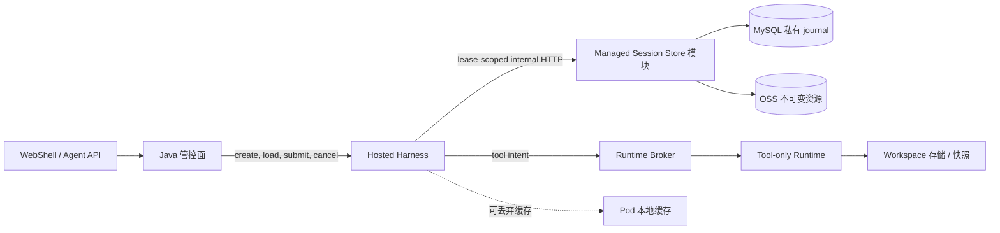

# Managed Session 长期权威存储

[English](2026-09-21-managed-session-durable-store.md) | [简体中文](2026-09-21-managed-session-durable-store.zh-CN.md)

> PR #12692 范围修正（2026-09-25）：下文的实现与验证记录来自完整集成预览，不是本次拆分的验收证据。当前能力、修复与未完成门禁以[评审修正](2026-09-25-managed-agent-review-corrections.zh-CN.md)为准。

状态：当前 feature 分支工作树已实现 D0、D1a 和 D1b，包括 TypeScript/Java 共享 golden contract，以及基于真实 MySQL 的独立 JVM 崩溃/接管证明。面向新建 Hosted Session 和 inline 资源的 D2a 路由、Hosted 冷加载链路、第一阶段公共 Session 生命周期，以及 settled Session 与单 execution 在途 Turn 的确定性 owner failover 证明也已实现。settled 证明会强杀真实 Java 与 Hosted Harness 进程、删除旧 Harness 磁盘、启动替代 owner，并在第二轮恢复第一轮上下文后成功完成 Turn。在途证明则在 durable `PREPARED` Broker 身份和私有 `await_runtime` checkpoint 已提交、但物理执行尚未开始时强杀两个 owner。替代 Harness 不分配新 Runtime，而是重建同一个 execution 与 Runtime Session 身份，只启动一次物理执行，把 `SETTLED` 回执持久化为 `results_ready`，并在替代 Harness generation 与 Java event epoch 下完成 checkpoint-bound continuation。删除旧 Harness 磁盘后，该证明观察到一条 Broker 记录、一次物理副作用、一次初始模型请求、一次 continuation 模型请求、一个公共终态事件，且没有重放原 Prompt。Java 会在调用 continuation 前先持久安装替代 event epoch 与 attachment cursor，再在响应后推进 cursor。`UNKNOWN` 观测会由当前 fenced writer 持久写成 `BLOCKED_EXECUTION`，Java 会终止已准入的公共 Turn，而不会重新提交。当前实现还会在任何物理派发前原子准入一批按顺序排列、允许并发的 Runtime execution，为每个 execution 单独结算 outcome reference，并且只在整批全部 settled 后继续。处于取消态的替代 owner 会被动检查原 execution，按其 durable identity 逐项取消；遇到 `UNKNOWN` 时阻塞，并且不会启动替代 Runtime 或模型 continuation，只发布一个 cancelled 终态。多 execution 与恢复态取消路径已有 TypeScript 和 Java 协议/coordinator 覆盖，但其确定性多进程故障注入仍待完成。OSS 资源、物理删除/保留策略、continuation 准入后的 Harness 再次崩溃与事件重建、Workspace 对账、Kubernetes 调度恢复及其余 D3 生产门禁仍待完成。日期：2026-09-24。本文细化[Managed Agent 存储、事件与 Session 恢复](2026-09-20-managed-agent-storage-event-architecture.zh-CN.md)中的长期恢复工作。首版只覆盖新建的 Hosted Managed Session；既有本地 Session 导入不在首版范围内。

## 1. 决策

Hosted Managed Session 不再把 Runtime 本地 JSONL 作为生产权威，而采用混合长期存储：

- MySQL 保存私有日志头、writer generation 与 lease、幂等事务回执、已提交记录的精确字节、资源引用、恢复状态，以及不超过 64 KiB 的不可变资源正文。
- OSS 保存超过 64 KiB 的不可变资源正文，例如较大消息、checkpoint、工具结果、文件历史和恢复产物。
- TypeScript Harness 仍是 Session 语义权威：由它校验并生成 Managed 记录。Java 存储模块只负责物理提交和 fencing，不运行 Agent Loop，也不生成私有记录。
- 如为兼容或诊断生成本地 JSONL，它只是可丢弃缓存/导出格式，不是第二权威；Harness Pod 本地盘丢失不能导致 Session 丢失。
- 独立 CLI 和开发部署继续使用现有本地文件后端。Session 创建时只选择一个后端，不对两个权威做双写。

不把共享 PVC 或单个可追加 OSS Object 作为生产权威。PVC 可以用于开发或过渡；OSS 适合不可变正文，但顺序、幂等、CAS 和旧 writer 拒绝由关系型提交点提供。

## 2. 已核验的当前基线

Standalone 仍使用本地后端。D0 已通过契约隔离存储，D1a 实现远端服务，D1b/D2a 则让新建的私有 Hosted Session 选择该服务：

- `LocalManagedSessionAuthority` 通过 `ManagedSessionJournalHandle` 读写；正常写入不再直接持有 transcript path 或调用 `SessionWriterLease`。
- `LocalJsonlManagedSessionJournalStore` 包装 `SessionWriterLease`、扫描普通 Session transcript，并保持既有 JSONL 字节与 torn-tail 语义。
- `LocalManagedSessionResourceStore` 实现 `ManagedSessionResourceStore`，把资源发布到 `<runtimeBaseDir>/resources/<sessionId>/`。
- `openManagedSession` 支持注入 journal/resource store，默认选择上述本地 adapter。
- Flyway V4 和 Spring 内部 API 已能保存私有 Managed journal head、事务精确字节、资源目录及 revision 到资源的引用；数据库时间 lease、单调 writer generation、head CAS、command 幂等、精确字节校验和事务化 `MYSQL_INLINE` 均已实现。
- 私有 Hosted Harness 创建请求现在可以为一个调用方指定的 Session ID 选择 HTTP journal/resource adapter。普通 daemon 路由会拒绝该 capability，ACP 子进程也只接受经过认证的私有 managed parent 下发的配置。
- 当前 D2 活跃路径会持久化精确 journal 事务和不超过 64 KiB 的资源，并且不创建本地权威 transcript。私有 Hosted `loadSession` 会重新获取远端 writer，在内存中校验和投影 durable journal 及其引用资源，并在没有本地 transcript 的情况下重建既有恢复结构。
- Store `writerId` 与当前 Hosted Harness boot ID 绑定。普通 bind 路径只有在 Java 持有 active Turn dispatch lease 且该 Turn 尚未尝试准入时，才允许替换已记录的 Harness generation。已经准入的在途 Turn 只能走更窄的恢复路径；该路径还必须证明 checkpoint/activation 身份、替代 attachment 水位、原 boot/event epoch 和单个已知 execution 结果，不能把原 Turn 重新解释为一次新准入。
- 现有 JSONL 包含 `session_execution_engine`、`managed_session_header_v1`、`managed_session_event_v1` 和 `managed_session_commit_v1`。同目录的 `<sessionId>.ledger.jsonl` 是 prompt 终态账本，不是私有 Managed journal。

仍使用本地后端的 Session，在 Runtime 或 Hosted Harness 使用临时文件系统时，Pod 回收后依然会丢失 transcript 及其引用资源。新的 Hosted 创建/加载路径已经去掉 journal 和 inline 资源对该本地持久盘的依赖。只上传 JSONL 仍然不够，因为 checkpoint、消息和工具正文位于独立资源中。

Hosted 远端模式不会再把同目录的 prompt ledger 作为另一个文件上传；其中需要长期保留的事实由私有 `turn.settled` 事务和 Java 公共 Turn 状态表达。Standalone 模式为兼容继续保留现有 sidecar。

## 3. 方案比较

| 方案                              | 优点                                                                                       | 问题                                                                                                                                      | 决策                                    |
| --------------------------------- | ------------------------------------------------------------------------------------------ | ----------------------------------------------------------------------------------------------------------------------------------------- | --------------------------------------- |
| 每 Session PVC                    | 代码改动最少，保留文件 API                                                                 | 调度与存储耦合；挂载/故障切换慢；非 Kubernetes 还需另一套方案；卷访问模式不是应用层 fencing；引用资源与数据库状态仍需协同恢复             | 仅开发或过渡使用                        |
| 共享 RWX 文件系统                 | 既有 reader 可见同一路径                                                                   | lock/inode 语义依赖文件系统；共享争用和噪声租户风险；文件路径无法提供租户级 CAS 与幂等提交回执                                            | 拒绝作为生产权威                        |
| 单个可追加 OSS JSONL              | 长期保存且形态类似本地文件                                                                 | 追加串行；单个 Appendable Object 最大 5 GiB；版本、WORM、加密和下载行为有限制；无法跨 Object、资源 manifest 和 writer generation 原子提交 | 拒绝                                    |
| 仅 MySQL                          | 事务、顺序和 fencing 清晰                                                                  | 大 checkpoint、消息和工具结果会放大数据库及备份流量                                                                                       | 保存 journal 数据和不超过 64 KiB 的资源 |
| MySQL 分层 journal/resource + OSS | 提交语义强，同时大字节不进入 SQL；不依赖调度器；本地进程和 Kubernetes provisioner 均可使用 | 需要内部存储 API、资源 manifest 与安全回收                                                                                                | 选择此方案                              |

Kubernetes 文档说明，普通卷访问模式主要描述挂载能力，卷挂载后并不自动强制写保护。`ReadWriteOncePod` 更严格，但恢复仍受卷和 CSI 能力约束。[Kubernetes Persistent Volumes](https://kubernetes.io/docs/concepts/storage/persistent-volumes/)

OSS 在写成功后提供原子操作和强一致性，适合保存不可变资源。但 OSS AppendObject 最大 5 GiB，只能向当前 Appendable 版本追加，不会为每次追加生成历史版本，且与 WORM、部分加密和下载能力存在限制。[OSS consistency](https://help.aliyun.com/en/oss/user-guide/what-is-oss)、[OSS AppendObject](https://help.aliyun.com/en/oss/developer-reference/appendobject)

## 4. 目标拓扑与归属



Managed Session Store 首先作为现有 Spring 管控面中的模块，通过内部 HTTP API 提供能力，不要求新增部署。接口与传输解耦，后续可以拆成独立服务，而不改变 Core 语义。

Java 继续主动发起公开的 Harness 和 Runtime 操作。存储回调是一条窄的内部持久化通道：Java 向选中的 Harness 发放 Session 范围的 writer capability，Harness 只能用它读写该 Session。TypeScript 不获得数据库凭据或 OSS 长期凭据。

Java 公共 Session、Harness 私有 journal 和 Runtime binding 共用同一个 `(tenantId, workspaceId, sessionId)`，不新增第二套 public 或 Harness Session ID。

### 4.1 Session 管理职责

| 组件                      | 负责                                                                                                                               | 不应负责                                         |
| ------------------------- | ---------------------------------------------------------------------------------------------------------------------------------- | ------------------------------------------------ |
| Java 管控面               | 公共 Session 生命周期、tenant scope、公共 Turn 幂等与状态、Harness/Runtime binding、scoped Store 描述，以及 MySQL/OSS 物理提交服务 | 模型会话语义或直接工具执行                       |
| TypeScript Hosted Harness | 模型循环、私有上下文、Managed 语义记录、checkpoint，以及单个 Session 的唯一 active writer lease                                    | 把 Pod 本地存储当成长期权威，或负责 Runtime 调度 |
| Runtime Broker            | Runtime 分配、endpoint/lease/generation、调度器适配，以及工具执行归属对账                                                          | 会话历史或模型循环状态                           |
| Tool Runtime              | Workspace 本地工具、MCP/skill 执行和可替换的执行缓存                                                                               | 公共 Session 身份或权威 transcript               |
| MySQL 与 OSS              | 有序物理 journal commit、fencing 元数据、回执和不可变资源字节                                                                      | Agent 决策或恢复策略                             |

因此，Java 管公共 Session 并发放 capability，Harness 管私有会话状态，Runtime 管工具在哪里执行。只有另外两层拥有的状态都能通过同一个 Session key 长期寻址时，其中任意一层才能独立重启。

### 4.2 公共 Session 生命周期协议

Java 管控面对外提供生命周期 API，并且是生命周期状态、tenant 校验和命令幂等的唯一权威：

```text
PATCH  /v1/agents/sessions/{sessionId}
POST   /v1/agents/sessions/{sessionId}/archive
POST   /v1/agents/sessions/{sessionId}/unarchive
DELETE /v1/agents/sessions/{sessionId}
```

每个变更都必须携带 `Idempotency-Key`。Java 先锁定 tenant 范围的 Session 行，写入包含变更前 Session 状态的长期 `PENDING` command 和 requested event，再执行 Harness/Runtime 外部动作，最后原子地把 command 标记为 `COMPLETED`、推进公共 Session 投影并追加完成事件。依赖失败时 command 保持 pending；使用相同 key 和相同请求重试会继续执行，针对同一 Session 的其他生命周期命令会得到 `session_operation_active`，相同 key 携带不同内容则得到 `idempotency_conflict`。持久化变更前状态也使归档 Session 在删除时不必等待已经关闭的 Harness 再次可用。

| 操作     | 前置条件                              | Pending 时公共状态                        | 完成前必须成功的外部动作                                                      | 完成后的公共状态/事件                  |
| -------- | ------------------------------------- | ----------------------------------------- | ----------------------------------------------------------------------------- | -------------------------------------- |
| 重命名   | `ACTIVE`                              | 保持 `ACTIVE`，同时存在 pending command   | Hosted Harness 长期提交 `session_metadata` 标题记录，并确认 `persisted: true` | `ACTIVE`；标题投影与 `session.updated` |
| 归档     | `ACTIVE` 且无活动 Turn                | `ARCHIVING`                               | 关闭在线 Harness attachment，再 drain Runtime binding                         | `ARCHIVED`；`session.archived`         |
| 取消归档 | `ARCHIVED`                            | 保持 `ARCHIVED`，同时存在 pending command | 清除 Runtime retirement fence；下一次 Turn 再惰性冷加载 Harness               | `ACTIVE`；`session.unarchived`         |
| 删除     | `ACTIVE` 或 `ARCHIVED`，且无活动 Turn | `DELETING`                                | 原状态为 active 时关闭 Harness，再 drain Runtime；归档 Harness 已经关闭       | `DELETED` tombstone；`session.deleted` |

归档和删除遇到 `ACCEPTED`、`RUNNING` 或 `CANCELLING` Turn 时直接拒绝，不会隐式取消或重复工作。重命名只有在私有标题提交成功后才对外确认，因此 Java 的标题只是投影，不会形成第二个标题权威。按 Session ID 关闭、Runtime drain 和 Runtime resume 都是幂等动作，使 pending command 能在响应丢失或 Java 重启后安全续跑。

归档会清除在线事件游标，但保留最后一代 Harness generation，作为私有权威已经存在的哨兵。取消归档后，下一次 Turn 会先冷加载该 Session，再绑定新的 generation。没有哨兵的 Session 也会先探测 load，只有明确收到 not-found 才执行 create，从而覆盖首次私有写入是元数据而不是 Turn 的 Session。私有 `create` 路径遇到已有权威时返回 `409`，而 `load` 在权威不存在时返回 `404`，不会顺手初始化空权威，从而避免重试恢复静默替换或凭空生成会话历史。

在线 Hosted attachment 还会绑定到规范化后的 Store endpoint、tenant、workspace 和 Harness writer generation。热 attach、并发冷加载合并和 restore race 都会比较这组身份；一旦不同，就以 `managed_session_store_conflict` fail closed，而不会让另一个 tenant 或 Store 描述复用内存中的 Session。lease 时长变化不改变存储身份。

第一阶段删除有意只实现软 tombstone。`GET` 和列表 API 会隐藏 `DELETED` Session，而已连接客户端仍可重放已经提交的公共删除事件。私有 journal/resource 字节会继续保留，直到 writer seal、execution 对账、legal hold、保留期和垃圾回收全部实现。因此不能把当前能力宣称为物理擦除。

## 5. Core 存储契约

从当前具体本地类中提取能力，但不复制 Managed 状态机：

```ts
interface ManagedSessionJournalStore {
  open(request: OpenJournalRequest): Promise<ManagedSessionJournalHandle>;
}

interface ManagedSessionJournalHandle {
  readonly sessionKey: ManagedSessionKey;
  read(options?: { maxBytes?: number }): Promise<ManagedSessionJournalScan>;
  appendTransaction(records: readonly unknown[]): Promise<void>;
  blockRecovery?(request: RecoveryBlockRequest): Promise<void>;
  seal(): Promise<void>;
  abort(): Promise<void>;
}

interface ManagedSessionResourceStore {
  publish(kind: string, bytes: Buffer): Promise<ManagedSessionDurableRef>;
  read(ref: ManagedSessionDurableRef): Promise<Buffer>;
}
```

以上是已实现的 Core 接缝。`appendTransaction` 每次接收一笔完整的语义事务；可选的 `blockRecovery` 能力由 durable HTTP handle 实现，所选 Store 无法持久记录恢复阻塞时调用方会 fail-closed。本地 adapter 保留历史上的逐行 sync 与可恢复 torn-tail 行为。D1a Java endpoint 接收完整远端事务并执行物理提交语义。D1b HTTP handle 对整批记录只序列化一次，在内部获取或续租 scoped writer grant，从已校验的 header、event 和 marker 派生外层 CAS 与幂等元数据，并仅在 Java 确认精确字节已提交后返回；配套 HTTP resource adapter 会将 inline 暂存字节保留到该次提交，并在恢复时校验响应元数据、精确事务字节、摘要链和下载资源。

`ManagedSessionAuthority` 负责记录校验、事件 sequence、command content digest、checkpoint 规则和领域语义；Store 实现负责物理原子性、writer fencing、精确字节持久化、分页和资源校验。

实现包括：

- `LocalJsonlManagedSessionJournalStore` 封装 `SessionWriterLease`，保留现有 standalone 行为及显式坏尾恢复。
- `LocalManagedSessionResourceStore` 继续作为本地资源适配器。
- `HttpManagedSessionJournalStore` 与 `HttpManagedSessionResourceStore` 在 hosted 模式调用 Java 内部 API。

远端 resource adapter 将不超过 64 KiB 的资源暂存在 Harness 中，直到所属 journal 事务把资源与引用原子写入 MySQL。较大资源在该事务之前发布到 OSS。两条路径返回相同的 `DurableRef`，reader 不从 ref 猜测物理位置。v1 使用固定阈值，避免形成按部署变化的行为矩阵；以后只有通过带 storage version 的兼容决策才能调整。

远端提交一次接收一个完整 Managed 事务：通常是一至三条 event record 加一条 commit marker，并带上待提交的 inline resources。Java 保存 UTF-8 JSONL 精确字节及 SHA-256，不解析或重新序列化私有事件正文；它只校验外层 scope、大小、记录数量、sequence 范围、引用列表、lease 和摘要链。

## 6. 关系数据模型

使用独立私有表，不扩展已过滤的公共投影 `managed_agent_event`。

### 6.1 `qwen_managed_session_journal_head`

每个 Session 一行：

| 字段                                                                       | 用途                                                                    |
| -------------------------------------------------------------------------- | ----------------------------------------------------------------------- |
| `tenant_id`、`workspace_id`、`session_id`                                  | 可信 scope 与主身份                                                     |
| `storage_version`、`state`                                                 | 格式和生命周期（`ACTIVE`、`SEALED`、`DELETING`、`DELETED`）             |
| `writer_generation`、`writer_id`、`writer_lease_until`、`lease_token_hash` | 使用数据库时间的单调 writer fencing                                     |
| `journal_revision`、`committed_sequence`、`last_commit_digest`             | 权威 head CAS                                                           |
| `activation_epoch`                                                         | 将私有写入绑定到当前 Harness grant                                      |
| `latest_checkpoint_resource_id`                                            | 快速恢复入口；仅合法 initial basis 可为空                               |
| `compacted_through_revision`                                               | 未来不可变 pack 水位；初始为零                                          |
| `recovery_status`、`recovery_detail_code`                                  | `READY`、`BLOCKED_RESOURCE`、`BLOCKED_WORKSPACE` 或 `BLOCKED_EXECUTION` |
| `created_at`、`updated_at`                                                 | 数据库时间                                                              |

主键为 `(tenant_id, session_id)`。每个变更事务通过唯一键锁定这一行。InnoDB locking read 为 head CAS 提供所需的行级串行化。[MySQL InnoDB locking](https://dev.mysql.com/doc/refman/8.0/en/innodb-best-practices.html)

### 6.2 `qwen_managed_session_journal_tx`

每个已提交 Managed 事务一行：

| 字段                                                                      | 用途                                                                |
| ------------------------------------------------------------------------- | ------------------------------------------------------------------- |
| scope 加 `journal_revision`                                               | 有序主键                                                            |
| `operation`、`command_id`、`content_digest`、`command_key_hash`           | 幂等键；原值用于审计，有界 hash 支撑唯一索引                        |
| `first_sequence`、`last_sequence`、`event_count`                          | 事件范围                                                            |
| `events_digest`、`previous_commit_digest`、`commit_digest`                | 现有摘要链证明                                                      |
| `writer_generation`、`writer_id`、`writer_token_hash`、`activation_epoch` | 审计、带身份的响应丢失重放与旧 writer 证明                          |
| `latest_checkpoint_resource_id`                                           | 由本事务推进的可选 checkpoint 指针                                  |
| `record_encoding`、`record_bytes`、`byte_length`、`record_digest`         | 精确且有界的 JSONL 事务字节；首版用 `MEDIUMBLOB` 的 `identity` 编码 |
| `created_at`                                                              | 提交时间                                                            |

第一行是 `session.create` 的 genesis transaction：保存精确的 `session_execution_engine` 和 Managed header 两行，使用 sequence zero，并引用 definition 与 root snapshot 资源。后续行才保存 event records 及其 commit marker。这样可以让物理创建原子完成，同时不改变导出 JSONL 的记录格式或 event sequence。保持现有单事务 8 MiB 限额。`command_key_hash` 是无歧义 operation/command 元组的 SHA-256，使 MySQL 唯一索引保持在 `utf8mb4` key 限额内；发生命中时仍比较已保存的原始字段和 content digest。私有记录字节绝不从公共 Agent API 返回，也不复制到 `managed_agent_event`。

### 6.3 `qwen_managed_session_resource`

记录存放在 MySQL 或 OSS 的不可变资源：

| 字段                                                   | 用途                                                               |
| ------------------------------------------------------ | ------------------------------------------------------------------ |
| scope 加 `resource_id`                                 | 不透明身份和归属                                                   |
| `kind`、`schema_version`、`byte_length`、`sha256`      | 现有 `DurableRef` 契约                                             |
| `storage_kind`、`inline_bytes`                         | `MYSQL_INLINE` 及不超过 64 KiB 的资源字节                          |
| `object_key`、`object_version_id`、`encryption_key_id` | 较大资源的 `OSS_OBJECT` 位置与加密身份                             |
| `publish_command_id`、`state`                          | 幂等的 `ALLOCATED`、`PUBLISHED`、`REFERENCED`、`DELETING` 生命周期 |
| `created_at`、`last_verified_at`、`retention_until`    | 运维与保留元数据                                                   |

每个资源只能使用一种物理位置。`MYSQL_INLINE` 必须有 `inline_bytes` 且 OSS 位置字段为空；`OSS_OBJECT` 必须有 OSS 位置字段且 `inline_bytes` 为空。64 KiB 边界按传输编码前的资源原始字节计算。无论资源位于哪里，读取时都必须校验 `byte_length` 和 `sha256`。

### 6.4 `qwen_managed_session_resource_ref`

保存每个 journal revision 提交的资源闭包。逻辑键为 `(tenant_id, session_id, journal_revision, resource_id)`；V4 在物理主键中使用 SHA-256 Session scope key，以满足 MySQL `utf8mb4` 索引长度限制，同时保留并校验原始 scope 列。首版在 Session 被显式删除前保留其所有已引用资源；跨 Session pin 和自动 GC 在持有协议完成并验证前保持关闭。

## 7. 内部 HTTP 协议

设置 `qwen.managed-agent.session-store.enabled=true` 后，D1a 会开放以下私有路由。它们默认关闭，避免普通公共 standalone 部署在服务鉴权尚未配置时意外暴露私有模型上下文：

```text
POST /internal/managed-session-store/v1/sessions/{sessionId}/writers:acquire
POST /internal/managed-session-store/v1/sessions/{sessionId}/writers:renew
POST /internal/managed-session-store/v1/sessions/{sessionId}/recovery:block
POST /internal/managed-session-store/v1/sessions/{sessionId}/transactions:commit
GET  /internal/managed-session-store/v1/sessions/{sessionId}/restore
GET  /internal/managed-session-store/v1/sessions/{sessionId}/transactions
GET  /internal/managed-session-store/v1/sessions/{sessionId}/resources/{resourceId}
POST /internal/managed-session-store/v1/sessions/{sessionId}/writers:seal
```

调用方在 acquire writer 时通过 `X-Qwen-Managed-Writer-Token` 提交新生成的 opaque Base64URL writer secret。Java 授予并返回数据库 generation 和过期时间，且只保存 secret hash。journal commit 与 renew 会绑定 tenant、workspace、Session、writer 身份、generation 及未过期的数据库时间 lease；读取 restore head、transaction page 和 resource 也要求当前未过期 secret，确保被接管的旧 Harness 无法继续读取私有上下文。seal 保持幂等；只有在尚未被更高 generation 取代时，它才可关闭已过期 grant。相同 writer 与 secret 重试会续租同一未过期 generation；显式 seal 或 lease 过期后才允许更高 generation。生产部署除 scoped bearer 外还需 mTLS 或等价服务身份；`tenantId` 只是 scope，不是鉴权凭据。

`recovery:block` 是从 `READY` 到三个阻塞恢复状态之一的单向 fenced 转移。它要求当前 writer 身份、generation、secret 及未过期的数据库时间 lease。同一 status/detail 重试保持幂等；不同阻塞原因不能覆盖第一个原因，该路由也不能解除阻塞。

私有 Store 前缀下的所有响应均携带 `Cache-Control: no-store`；数据库查询后还会对 tenant、workspace、Session 和 resource ID 的原始值做精确比较，避免不区分大小写的 MySQL collation 扩大 scope。

transaction 读取会先按 revision 与 byte-length 元数据分页，再拉取未编码事务字节总量不超过 8 MiB 的完整记录，因此 item limit 不会把单次恢复响应放大到数百 MiB。

恢复读取对未知 lifecycle/recovery 状态、不安全的 head 计数、revision 缺口以及 head/transaction 不一致统一 fail-closed；这些情况会报告存储损坏，而不会返回残缺权威。

`transactions:commit` 携带待提交 inline resources，并在它们首次被 journal 引用的同一 MySQL 事务中写入。可选的 `latestCheckpointResourceId` 必须指向本事务引用的 `managed-checkpoint` 资源，并与 head 原子推进。已实现路径接收不超过 64 KiB 的原始资源，限制单事务 inline 总字节数，校验长度与 SHA-256，并对更大资源返回 `managed_session_oss_disabled`。D2 的 `resources:allocate` 与 `resources/{resourceId}:finalize` 签名对象流程尚未实现。Standalone 和普通 daemon Session 仍选择 local adapter；只有私有 Hosted Harness 创建路径可以选择 remote adapter。

## 8. 提交协议

writer acquire 会先创建 revision-zero 的 fenced head，此时尚无 journal 字节可见。随后 `session.create` genesis commit 在一个 MySQL 事务中写入精确的 engine/header transaction、inline resource 正文、初始资源引用，并把 head 推进到 revision one。被遗弃的空 head 不代表公共 Session 已创建，只能在 seal 或 lease 过期后由更高 writer generation 接管。后续每个语义事务按以下流程执行：

1. Core 校验 command、actor、expected sequence、records 和资源闭包。不超过 64 KiB 的资源暂存在 scoped Harness handle 中；较大资源以不可变 OSS Object 上传并 finalize。两者此时都尚未从 Session journal 可见。
2. Harness 调用 `transactions:commit`，携带精确 record 字节、resource refs、expected journal revision、expected committed sequence、previous commit digest、writer generation、activation epoch、operation、command ID 和 content digest。
3. Store 在同一个 MySQL 事务内锁定 head，校验未过期 generation 与 activation，查询原幂等回执，校验预期 head 和全部资源，插入待提交 inline resource 字节、journal transaction 与 resource refs，最后推进 head。
4. 只有提交成功后，Harness 才确认私有事件或报告 Turn 成功终态。响应丢失时使用原 command ID 和 content digest 重试并返回原回执。
5. 本地缓存和公开/SSE 投影在私有提交后更新；它们失败不能回滚或重复私有事务。

OSS Object 上传后数据库提交失败，会留下未引用的不可变孤儿。恢复看不到它；确认发布者已被 fencing 并超过安全窗口后才可回收。Inline 提交失败不会留下 resource row。已提交 journal head 绝不能引用尚未 finalize 的 Object。

## 9. 打开与恢复协议

1. Java 先 fencing 原 generation，再发放新 writer generation。lease 过期允许数据库产生更高 generation，但不能证明旧工具副作用已停止；Runtime 派发仍使用自己的 generation 门禁。
2. Harness 读取 journal head 和 RestoreBundle，其中包含最新已验证 checkpoint、checkpoint 后的已提交尾部、未决 command 及资源 manifest。
3. Harness 核验 commit 摘要链、record 字节、checkpoint digest 和全部必需资源。Harness Pod 可按 digest 缓存不可变资源。
4. Runtime Broker 对每个未结算 `executionCallId` 对账。结果未知则进入 `BLOCKED_EXECUTION`，不能因为旧 Pod 消失就重新执行。
5. 核验 Workspace 身份与快照/挂载。缺少 Workspace 时进入 `BLOCKED_WORKSPACE`；能读 transcript 不等于能继续执行。
6. 只有 `READY` 的恢复才能安装新 activation 并允许模型/工具推进。资源缺失或损坏进入 `BLOCKED_RESOURCE`；安全场景仍可提供只读历史。

已实现的 tool-intent 边界为第 4 步建立了可对账身份：Harness 先让 Broker 幂等创建 `PREPARED` execution 记录，把工具名、返回的 Broker `executionCallId` 与 Runtime Session binding 提交到 `await_runtime`，只有提交成功后才调用显式 start 路由。读取 `PREPARED` execution 不会触发派发，取消会在没有副作用的情况下结算；原 create-and-start 路由继续保持兼容。冷加载后，Core 会重建待处理 execution，provider 可直接用持久化的 Harness、Runtime Session 与 execution 身份查询 Broker，而不依赖旧进程的内存 entry。恢复流程会启动原 `PREPARED` 身份，轮询 `EXECUTING` 或 `CANCEL_REQUESTED` 直到结算，把不可变结果引用提交进 `results_ready` checkpoint，并暴露绑定 checkpoint/activation 的私有 continuation 路由。Java 持有 Turn dispatch lease 时，会绑定替代 Harness boot，先以 attachment 水位持久替换公共 event epoch，再使用原公共 `promptId` 调用 continuation 路由，在响应后推进持久 cursor，并在不调用普通 Prompt submission 的情况下流式转发新 epoch。Broker 的结构化 `UNKNOWN` 会原样保留而不会被转成重试，当前 fenced Harness writer 会写入 `BLOCKED_EXECUTION`，Java coordinator 会在 Harness submit 前终止公共 Turn。进入阻塞状态后，Harness 会跳过 Store 必须拒绝的 activation-release 语义事务，但仍立即 seal writer，不让所有权一直残留到 lease 到期。

这条已实现恢复链路刻意只支持一个 durable pending execution。多工具恢复需要一种批量 checkpoint，把每个工具调用映射到各自不可变结果；把同一个结果引用分配给多个工具是错误的。公共 Turn 已经处于 `CANCELLING` 时仍然 fail-closed，因为恢复态取消还必须同时消费或结算私有 `results_ready` checkpoint。Java 的替代 event epoch 现在采用 write-ahead 顺序：continuation 调用前崩溃可以安全重试，调用准入后崩溃也不会让旧 epoch 继续留在长期状态中。已消费的工具回执在写入 `turn_settled` 之前仍可被替代 Harness 读回，且不会重新派发工具；回执正文不可读时，从 Broker 已结算结果重建。`npm run test:e2e:managed-continuation-failover` 会在 continuation 写出第一段公开文本后强杀 Harness，并检查工具只执行一次、替代 Harness 再发一次 continuation、公开记录只保留替代答案、且 Turn 只有一个终态。多工具和恢复态取消仍是 D3 门禁。

首个远端实现可以分页读取完整已提交 journal。压缩属于后续按测量触发的优化：后台任务把连续前缀打包成不可变压缩 OSS Object，校验后在 MySQL 原子发布 manifest 和水位，经过宽限期后再删除覆盖的 SQL blob。恢复合并已验证 pack 与 SQL 热尾；OSS Object listing 永远不是顺序或完整性的权威。

## 10. 延迟与可用性

长期存储链路不能重新把 Runtime 冷启动放进首 token：

- 尽量在第一条 Prompt 前完成 Session definition 和 root snapshot 的暂存或发布。
- Prompt input 在模型推理前提交。普通的不超过 64 KiB 的 Prompt 及其 journal records 只使用一次有界内部存储事务，不等待 OSS PUT 或 Pod 启动；更大输入明确走 OSS 路径。
- 模型推理和 Runtime prepare 继续并行，只有第一次真实工具调用才等待 Runtime。
- 不逐 token 写私有 journal；在 input admission、model attempt/result、工具派发前 intent、模型消费前 receipt、checkpoint 和 Turn settlement 等语义边界提交。
- 最终消息和 checkpoint 事务持久后才发出成功终态。
- 本地缓存可减少恢复读取，但不能放宽提交 ACK。

测量新增 TTFT、commit p50/p95/p99、恢复延迟、每 Turn MySQL 字节、OSS 请求/字节和缓存命中率。生产前使用这些数据验证 64 KiB 分界；以后调整该值需要带 storage version 的兼容决策。本文不承诺固定延迟数字。

MySQL 不可用时停止接受新私有提交并实施有界背压。在 durable admission 之前继续模型或工具副作用会破坏恢复契约。OSS 不可用会阻塞需要新资源的操作；已经提交且资源仍可通过正常冗余/缓存读取的历史不受影响。

## 11. 保留、删除与安全

- 公共 SSE replay 保留期与私有 Session 保留期分离；公共 delta 过期不能删除私有模型上下文或 checkpoint。
- 首版不自动删除任何已引用私有资源。宁可安全占用空间，也不能制造恢复缺口。
- 删除 Session 时先封闭准入、对账 execution、提交 tombstone/cleanup plan 并删除数据库引用；Object 删除保持幂等，并在配置的宽限或合规保留期后执行。
- 启用 OSS 版本控制和服务端加密；不可变写使用禁止覆盖请求头。版本控制可防误覆盖，但不能替代数据库提交点。[OSS overwrite protection and limits](https://help.aliyun.com/en/oss/user-guide/limits)、[OSS versioning](https://help.aliyun.com/en/oss/user-guide/manage-objects-in-a-versioning-enabled-bucket)
- 私有 journal/resource 表使用不同于公共 reader 的数据库角色。所有读取均校验可信 tenant 和 Session scope。原始 records、签名 URL、凭据、工具参数和模型上下文不得进入公共事件或普通应用日志。
- 备份与容灾必须同时覆盖 MySQL 和 OSS，使恢复点包含 journal head 引用的全部 Object。数据库恢复点新于可用 Object 副本时，不构成有效恢复点。

## 12. 落地顺序与可评审改动

### D0：存储接缝，无行为变化

状态：已在当前 feature 分支实现。

- 引入 `ManagedSessionJournalStore` 与 `ManagedSessionResourceStore` 契约。
- 将现有 JSONL 扫描/追加和资源文件放进本地 adapter。
- 原 authority、projection、restore、writer conflict 和 corruption 测试不改语义地在本地 adapter 上通过。

退出条件：standalone 行为和字节不变，Core 不引入 Java 或 OSS 依赖。

### D1：Java 长期 Store 与契约客户端

状态：D1a 与 D1b 均已实现。

- D1a 已实现：Flyway V4 四张私有表；Spring 内部 API；基于数据库时间的 lease/generation fencing；head CAS 与 checkpoint 指针原子推进；幂等回执；精确 record bytes 存储与校验；分页恢复读取；以及 OSS fail-closed 的事务化 `MYSQL_INLINE` 资源。
- D1b 已实现：配套 TypeScript HTTP journal/resource adapter、scoped writer 获取/续租/seal、精确事务重建与校验、结构化 Java 错误、inline 资源暂存，以及不使用本地 transcript 的关闭/重开测试。共享 fixture 现在跨两种语言固定 header、限额、UTF-8/JSONL 精确字节、SHA-256 摘要、请求元数据和 Java 错误分类。
- 独立进程证明会让多个子 JVM 连接一个临时真实 MySQL schema：writer A 提交后在返回 ACK 前直接退出；数据库时间 lease 过期后，writer B 取得 generation 2 并恢复已提交事务和 inline 资源。A 对同一 command 的重试会得到原回执，而其新写入会被 fencing。至此 D1 Store 边界退出条件已满足。下述 D2 settled Session 证明进一步强杀真实 Hosted Harness 与 Java owner，并完成下一轮 Turn。
- D2a 已为新建私有 Hosted Harness Session 选择该 backend。Java 下发 tenant、workspace、writer 身份、endpoint 和 lease 时长，Harness 自己生成 writer secret；普通 daemon 路由和不可信 ACP parent 都会拒绝该描述。

退出条件：两个共享 MySQL 的 Java 实例能拒绝旧 writer，并在提交响应丢失后返回同一回执。

### D2：OSS 资源与 Hosted 路由

- 状态：新 Session 路由、Hosted 冷加载，以及 settled Session 的真实 Hosted owner failover 已支持 inline 资源；工具边界会在副作用启动前持久化完整且有序的 Broker execution 批次。包含已知 execution 的已准入在途 Turn 现在可以安装替代 Harness generation 与 write-ahead 公共 event epoch、逐项消费原结果，并且不重放 Prompt 或工具就继续。处于取消态的替代 owner 会被动加载 checkpoint，取消原 execution identity，并且不触发模型 continuation，只发布一个 cancelled 终态。当前确定性多进程 E2E 已证明单 execution 在 durable `PREPARED`/`await_runtime` 之后、物理执行开始之前的崩溃接管；对应的多 execution 和恢复态取消进程证明仍待完成。OSS、continuation 准入后的 Harness 再次崩溃与事件重建，以及其余在途故障矩阵仍待完成。
- 为超过 64 KiB 的资源实现 `OSS_OBJECT` 路径：allocate/upload/finalize/read、scoped signed URL、摘要校验、加密和孤儿盘点。
- 仅新建 Hosted Managed Session 选择远端后端；既有本地 Session 继续本地运行，不迁移、不双写。
- Hosted `loadSession` 会下发与 create 相同作用域的 Store 描述。ACP 子进程重新获取 durable writer，校验 journal 与 resource 闭包，投影 reader-facing records，并且不读取本地 transcript 就构建 runtime restore state。
- 确定性多进程测试会启动 MySQL、Spring/Java、Hosted Harness、带本地进程 Runtime Provider 的内嵌 Broker 与假模型。第一轮结算后，它强杀 Java 和 Harness 进程树、删除两者旧本地 home、等待数据库 writer lease 过期，再启动替代 owner。替代 Harness 取得更高 writer generation，在同一公共 Session 上完成第二轮；第二次模型请求同时包含第一轮 prompt 与 answer。测试还核验 journal revision、committed sequence、公共终态数量与 Harness boot ID 均推进，且未读取已删除的 Harness 磁盘。
- 在途变体会在 Harness 已提交精确 `executionCallId` 和 `await_runtime` checkpoint 后阻塞 Broker start，强杀原 Java 与 Harness 进程树、删除旧 Harness 磁盘，再放行替代 owner。它断言原 execution 以 dispatch generation 1 到达 `SETTLED`，物理副作用恰好一次，模型收到一次初始请求和一次回执 continuation，公共 Turn 只产生一个终态事件。该测试有意小于完整故障矩阵：尚未覆盖 continuation 准入后的再次崩溃；多个和已取消 execution 的语义已有协议与 coordinator 测试，但还没有被该进程级 harness 证明。
- 已准入在途 Turn 只有在原有序批次中的每个 execution 都有已知 durable outcome 时才允许自动恢复；任一 `UNKNOWN` 都会阻塞整批且不重放。Java 在更换任一 owner 前，必须持有 active dispatch lease，并匹配预期的旧 Harness boot/event epoch、替代 attachment 水位与 checkpoint/activation 身份。恢复态取消使用独立的被动加载和 checkpoint-bound cancel 操作，使检查本身不会启动 prepared execution；它等待原 execution settled，并且绝不准入模型 continuation。无法重建长期事件的 continuation 仍然 fail-closed。空闲或尚未准入的恢复不会放宽这些 fence。

退出条件：删除原 owner 文件系统后，由另一个 Harness 无历史缺失地恢复同一 settled Session，这一 inline 资源子条件现已验证。只有同一资源闭包覆盖 OSS 资源与 checkpoint 后，D2 才算完整完成。

### D3：恢复门禁与生产证据

- Runtime dispatch fence、恢复查询、有序多 execution continuation 和恢复态取消已实现：`executions:prepare` 只预留每个 durable Broker 身份而不派发，Harness 原子提交完整有序批次，再由 `executions/{executionCallId}:start` 执行幂等派发；冷启动 Harness 会启动或轮询这些精确 execution 而不重放。每个 settled 回执保留自己的 execution identity 与 ordinal，只有整批全部 settled 后私有 checkpoint 才推进到 `results_ready`；随后 Java 在 Turn dispatch lease 下，把预期 writer activation 绑定到替代 Harness boot，并在请求 checkpoint-bound continuation 或 cancellation 前持久安装 attachment event 水位。
- Core 与 Broker 能够保留并查询稳定身份；`UNKNOWN` 分支会先持久写入 `BLOCKED_EXECUTION`，再由 Java 终止公共 Turn。真实进程证明现已覆盖单 execution 从 `PREPARED`/`await_runtime` 到 `SETTLED`/`results_ready` 的接管边界。剩余恢复工作包括多 execution 和恢复态取消的确定性多进程证明、continuation 中途 Harness 崩溃后的长期事件/checkpoint 重建、Workspace 恢复，以及其他边界的进程级故障注入。
- 增加保留/tombstone 流程、指标、告警、备份恢复演练和故障注入。

退出条件：下列故障矩阵在实际 MySQL 和 OSS 产品上通过。只有这时 hosted 模式才能承诺跨 Pod 自动恢复。

## 13. 验收矩阵

| 场景                                     | 必需结果                                                                             |
| ---------------------------------------- | ------------------------------------------------------------------------------------ |
| 两个 Harness worker 同时取得同一 Session | 只有一个 generation 可提交；旧 worker 在任何字节可见前收到 conflict                  |
| Commit 成功但 HTTP 响应丢失              | 原 command ID 与 digest 返回原回执，不重复 sequence 或内容                           |
| 相同幂等键但内容不同                     | conflict 并告警，两份 payload 都不能覆盖另一份                                       |
| Object 上传后、SQL 提交前崩溃            | Session 看不到该 Object；它是可安全回收的孤儿                                        |
| 资源为 64 KiB 或 64 KiB 加 1 字节        | 前者使用 `MYSQL_INLINE`，后者使用 `OSS_OBJECT`；两者使用相同 `DurableRef` 和摘要校验 |
| SQL 提交后、cache/SSE 前崩溃             | 恢复读到已提交事务；cache 和公共投影追赶但不重写事务                                 |
| Harness Pod 与本地盘删除                 | 新 Harness 恢复 journal、checkpoint 和全部引用资源                                   |
| 资源缺失或摘要不符                       | `BLOCKED_RESOURCE`；不从空状态或未经证明的旧状态继续                                 |
| 工具结果未知                             | `BLOCKED_EXECUTION`；不自动重复调用工具                                              |
| owner 在提交 `await_runtime` 后崩溃      | 替代 owner 只启动一次同一 Broker execution，消费其回执并只产生一个公共终态事件       |
| Workspace 快照/挂载缺失                  | 历史仍可读，执行状态为 `BLOCKED_WORKSPACE`                                           |
| 伪造 tenant 或 Session scope             | 返回 Object URL 或私有字节前拒绝请求                                                 |
| MySQL 或 OSS 不可用                      | 有界背压和明确失败，不发出虚假 durable ACK                                           |
| 本地 cache 损坏或缺失                    | 重建或忽略；以 durable head 与 resource digest 为准                                  |
| 活动工作期间删除 Session                 | 封闭准入，execution 结算或阻塞，提交 tombstone，再安全回收资源                       |

## 14. 待确认的部署参数

生产启用前需要选择并测量：

- 私有 Session 保留期和 legal hold 要求；
- 活跃 Session/Turn 速率，以及每 Turn journal/resource 平均和最大字节数；
- writer lease 时长与续租间隔；
- MySQL 持久化/复制配置与允许的恢复点、恢复时间；
- OSS region、冗余、版本控制、加密密钥策略、生命周期存储级别和跨 region 恢复；
- 最大恢复尾部、checkpoint 频率，以及是否需要把 SQL journal 打包进 OSS；
- Workspace 持久化或快照 provider；这是可执行恢复的独立前置条件。

这些参数不改变已选定的归属与提交协议，只决定容量和运维策略，不决定本地 Pod 磁盘是否是权威。
