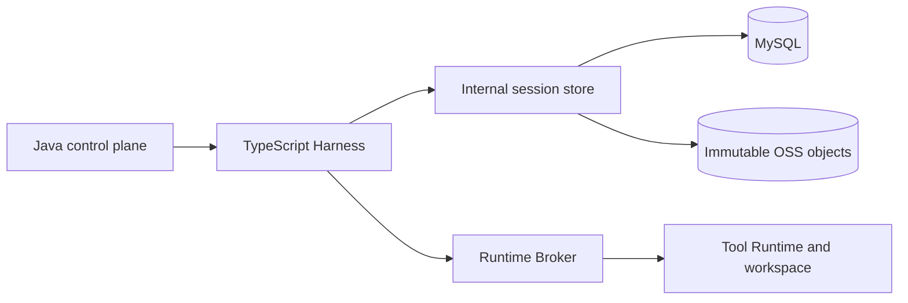

# Managed Session TypeScript Durable Foundation

[English](2026-09-25-managed-session-typescript-foundation.md) | [简体中文](2026-09-25-managed-session-typescript-foundation.zh-CN.md)

The [Hosted integration design](2026-09-21-managed-session-durable-store.md) covers the full control plane; this document covers the TypeScript foundation in PR #12693.

Status: TypeScript storage and recovery primitives for PR #12693. Updated: 2026-09-25. This PR does not wire a Hosted Agent loop or provide a Java service, database migrations, OSS implementation, or cross-process failover proof. Those belong to the control-plane integration split from [#12358](https://github.com/QwenLM/qwen-code/pull/12358). Statements about the target deployment below are requirements, not evidence that this PR deploys them.

## 1. Decision

For Hosted Managed Sessions, use a durable physical store behind the TypeScript semantic authority:

- The Harness validates and creates private session records, checkpoints, and command receipts.
- The target Java store owns MySQL transactions, writer generations, leases, and head compare-and-set (CAS).
- The target resource placement is MySQL for bodies up to and including 64 KiB and immutable OSS objects above 64 KiB. This PR implements the HTTP inline client only; larger resources are explicitly rejected.
- Standalone adapters retain local JSONL and session-owned resource files. A session uses one backend; there is no dual write or local-to-remote migration.

A shared filesystem or one appendable object cannot replace the transaction and stale-writer contract. Immutable objects can hold bytes; the journal head determines which bytes are committed.

## 2. Verified Current Baseline

This PR contains:

- `LocalManagedSessionAuthority`, the journal/resource interfaces, local adapters, and HTTP adapters.
- Checkpoint parsing, prompt inbox, activation queue, logical Harness handles, and a process-local Runtime dispatch gate.
- Managed transcript projection and legacy maintenance guards.
- Unit tests and a shared HTTP contract fixture. The HTTP tests use a fake service; they do not verify a Java/MySQL implementation.

The factory, scheduler, and admission components are library primitives. Their presence does not start a model, allocate a Runtime, or enable Hosted failover. Java lifecycle routes, authenticated parent descriptors, Broker reconciliation, and owner replacement are integration work outside this diff.

## 3. Options Considered

| Option                                     | Tradeoff                                                                       | Decision                          |
| ------------------------------------------ | ------------------------------------------------------------------------------ | --------------------------------- |
| Per-session or shared filesystem           | Small adapter, but filesystem ownership is not distributed side-effect fencing | Retain for standalone development |
| One appendable object                      | No atomic resource manifest, command receipt, and writer CAS                   | Reject as session authority       |
| MySQL for all bodies                       | Atomic, but large histories inflate database storage                           | Keep small bodies inline          |
| MySQL journal plus immutable object bodies | Requires scoped API and recovery verification                                  | Target Hosted architecture        |

## 4. Target Topology and Ownership

Java owns public Session/Turn lifecycle and tenant authorization. The Harness owns conversation semantics. The physical store owns journal commit and writer fencing. The Broker owns execution identity and dispatch; the Runtime owns workspace side effects.

The common key is `(tenantId, workspaceId, sessionId)`. A writer generation fences storage writes; it does not prove an earlier external side effect stopped. The in-process dispatch gate is not a replacement for a durable Broker fence.

### 4.1 Session-management ownership

Local `SessionService` may display, archive, unarchive, and delete a closed local Managed session and its private resources. Daemon maintenance holds a claim against the sealed schema-3 lock while moving or deleting the transcript, then leaves the sealed writer fence intact. Startup and in-session legacy resume, as well as legacy recording, must reject a Managed transcript before binding or appending through the old engine; legacy rename and fork must also reject it. ACP restore returns a typed execution-engine error for this rejection, which the daemon maps to HTTP 409. Managed renames go through committed `session_metadata` records. Session listings use the already-read execution-engine record to skip Managed metadata probes for legacy transcripts while preserving Managed title and source projection.

### 4.2 Public Session lifecycle protocol

Hosted create/load/rename/archive/delete APIs are outside this PR. Before enabling them, the control plane must enforce tenant scope, lifecycle idempotency, active-Turn exclusion, and cold load without silently replacing an existing journal. Local resource cleanup is not evidence of remote physical erasure.

## 5. Core Storage Contracts

`ManagedSessionJournalStore.open` returns one session-scoped handle. The handle supports reading, appending one complete semantic transaction, sealing, and aborting an unsuccessful open. The optional `blockRecovery` operation persists a remote recovery failure. `ManagedSessionResourceStore` publishes and reads digest-verified immutable references.

Local writes use `SessionWriterLease` schema 3 and pin the Managed format. Sealing records the last committed sequence and commit-chain digest alongside the physical transcript proof. Certified takeover must verify both. Explicit local tail recovery removes complete JSONL event lines lacking a commit marker; an incomplete physical line remains fail-closed under the existing writer-lease checks.

The HTTP adapter acquires/renews/seals a scoped writer, encodes the transaction once, checks commit receipts, and verifies paged restore metadata and exact record bytes. It does not accept redirects. Resource reads verify kind, schema, length, and SHA-256.

Staged inline resources become durable only in the transaction that references them. A validated Harness checkpoint's embedded references are included in that transaction's resource closure, including history, approval, and tool-outcome references. Opaque user message bytes are not recursively interpreted as storage references. Unreferenced staged resources must not be published by an unrelated commit. The 1,024-resource limit includes checkpoint dependencies.

## 6. Relational Data Model

The target service needs a session head, ordered transactions, immutable resource catalog, and revision-to-resource references. These SQL tables and migrations are not included here.

The head must contain writer generation/lease, journal revision, committed sequence, commit-chain digest, activation epoch, checkpoint pointer, and recovery status. Transactions retain exact UTF-8 JSONL bytes and idempotent receipts. Resource rows bind scope, immutable metadata, placement, and verified bytes/object location.

## 7. Internal API Contract

The client uses `/internal/managed-session-store/v1/sessions/{sessionId}` with `X-Qwen-Tenant-Id` and `X-Qwen-Managed-Writer-Token`, plus workspace and writer identity in requests. It supports writer acquire/renew/seal, transaction commit/list, restore, resource read, and recovery block operations. Responses require `Cache-Control: no-store`.

The writer token is generated by the client and proves possession of a lease secret, not service identity or tenant authorization. Before deployment the service must authenticate the caller and authorize the supplied tenant/workspace/session independently. A caller-controlled tenant header and writer token alone are insufficient. This PR cannot establish that server boundary because the server is not present.

## 8. Commit Protocol

1. Validate scope, actor, activation, event sequence, command content, and resource metadata.
2. Publish local immutable bytes, or stage HTTP inline bytes until commit.
3. Form a contiguous event batch and commit marker. `eventsDigest` hashes the complete canonical event content, including scope, timestamps, subjects, and payloads. The earlier foundation's identity-only prototype digest is not an integrity proof accepted by this authority.
4. Commit exact bytes and all referenced resources under the writer generation and expected journal head. A lost response may be retried only with the same command identity and content.
5. Advance in-memory state and expose success only after the physical commit succeeds.

Harness checkpoint read/modify/write operations and handoff share one handle queue. Conflicting approval and Runtime waits must not both succeed by overwriting the same prior checkpoint. Starting a new Agent run invalidates the previous run's safety boundary; only a subsequently committed boundary can authorize handoff.

Activation renewal that cannot extend the horizon must not append an invalid journal event. A cancelled, never-started inbox item cannot later become activation-ready. State preconditions are checked before durable append so rejected requests do not poison reopen.

## 9. Open and Recovery Protocol

Local reopen verifies the committed journal and any sealed takeover proof. Checkpoint parsing distinguishes resumable Harness state from historical branch display records and blocks invalid or missing state. Transcript projection reads only committed records and verifies referenced bodies.

Remote deployment additionally requires the control plane to:

1. Obtain a higher fenced writer generation and verify the journal/resource closure.
2. Reconcile every original Broker execution identity. Unknown outcomes block recovery; they do not authorize replay.
3. Verify the workspace identity and availability.
4. Bind the replacement Harness and public event cursor under the active Turn lease.
5. Resume the checkpoint without resubmitting the original prompt or duplicating tools.

This PR's fake-service and logical-handle tests cover component behavior. They do not prove these five deployment steps or recovery after process/disk loss. Ordered tool batches are represented in checkpoints, but end-to-end multi-tool and cancellation recovery remain integration gates.

## 10. Latency and Availability

Commit at semantic boundaries rather than on every text delta. Do not acknowledge terminal success before the final private state is durable. Storage outages must stop new uncommitted progression; restore must never substitute an empty session for unavailable data.

Measure first-token overhead, commit and restore p50/p95/p99, bytes per Turn, resource counts, and lease renewal behavior before enabling Hosted routing. No latency or availability claim is established by this PR.

## 11. Retention, Deletion, and Security

Private journal retention is separate from public event replay. The Hosted deployment must retain every referenced resource, implement tombstones and safe orphan collection, encrypt remote bodies, and coordinate database/object backups. These remote operations remain out of scope.

Only trusted internal callers may receive raw history or lease capabilities. Do not put credentials or private context in public events. Local schema-3 locks prevent older lease implementations from writing Managed transcripts.

## 12. Rollout and Reviewable Changes

- **D0, this PR:** local storage seam, semantic authority, checkpoint/queue primitives, transcript projection, lease compatibility, and focused tests.
- **D1 client, this PR:** inline HTTP client and shared fixture. The matching Java service, migrations, authorization, and real database contract proof are separate prerequisites.
- **D2, later integration:** Hosted routing, cold load, immutable object bodies above 64 KiB, Broker reconciliation, and real owner replacement.
- **D3, production gate:** deterministic process-failure matrix, workspace recovery, event reconstruction, retention, metrics, and backup/restore exercises.

Do not advertise automatic cross-Pod recovery until the integrated failure matrix passes. Existing local sessions are not migrated.

## 13. Acceptance Matrix

| Scenario                                                 | Required result / evidence                                                          |
| -------------------------------------------------------- | ----------------------------------------------------------------------------------- |
| Build this PR against its base                           | Build and typecheck without files from sibling PRs                                  |
| Local seal and takeover                                  | Schema-3 proof verified; older writers refused                                      |
| Event payload or scope changes under the same identities | Commit digest verification rejects altered bytes                                    |
| Same-millisecond renewal or cancel/readiness race        | No unreplayable journal event; reopen still succeeds                                |
| Legacy resume or title recording targets a Managed log   | Reject before a legacy append; Managed reopen remains possible                      |
| Daemon archives, unarchives, or deletes a sealed log     | Maintenance succeeds without removing its sealed writer fence                       |
| Approval and Runtime checkpoint mutations overlap        | Preserve accepted work; reject conflicting admission                                |
| New Agent run observes an old turn-complete boundary     | Refuse handoff until a new safety boundary commits                                  |
| Checkpoint references staged history                     | Cold HTTP owner reads both checkpoint and history                                   |
| More than 64 KiB resource                                | Explicit failure until OSS implementation exists                                    |
| Corrupt/missing resource or unknown tool outcome         | Block execution; never silently reconstruct empty state or replay tools             |
| Original processes and disks disappear                   | Must be proven by a separate integrated process-failure test                        |
| Forged tenant/workspace/session                          | Authenticated service rejects before returning private bytes; server proof required |

Run unit tests from `packages/core`, including the affected Managed runtime, writer lease, transcript reader/validator, and session maintenance suites. Run `npm run build && npm run typecheck` from the repository root. Unit success does not replace the server and process-level evidence above.

## 14. Open Deployment Parameters

Choose and validate the service authentication mechanism, lease duration and clock behavior, MySQL durability policy, OSS configuration, workspace persistence, resource retention, maximum restore size, and checkpoint frequency. These determine deployment readiness; the client alone cannot guarantee them.
