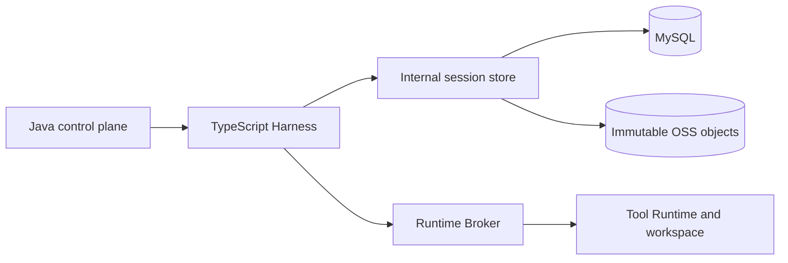

# Managed Session TypeScript 持久化基础层

[English](2026-09-25-managed-session-typescript-foundation.md) | [简体中文](2026-09-25-managed-session-typescript-foundation.zh-CN.md)

[Hosted 集成设计](2026-09-21-managed-session-durable-store.zh-CN.md)涵盖完整控制面；本文仅涵盖 PR #12693 中的 TypeScript 基础层。

状态：PR #12693 的 TypeScript 存储和恢复基础模块。更新日期：2026-09-25。本 PR 未接入 Hosted Agent 循环，也不提供 Java 服务、数据库迁移、OSS 实现或跨进程 failover 证明。这些属于从 [#12358](https://github.com/QwenLM/qwen-code/pull/12358) 拆出的控制面集成。下文对目标部署的描述是要求，不能作为本 PR 已部署这些能力的证据。

## 1. 决策

Hosted Managed Session 在 TypeScript 语义权威之后使用持久化物理存储：

- Harness 校验并创建私有会话记录、checkpoint 和命令回执。
- 目标 Java 存储负责 MySQL 事务、writer generation、租约以及 journal head 的 compare-and-set（CAS）。
- 目标资源放置规则为：小于等于 64 KiB 的 body 使用 MySQL，大于 64 KiB 的 body 使用不可变 OSS 对象。本 PR 仅实现 HTTP inline 客户端，明确拒绝更大的资源。
- 独立运行适配器保留本地 JSONL 和会话私有资源文件。一个会话只选择一个后端，不双写，也不迁移既有本地会话。

共享文件系统或单个追加对象不能替代事务和旧 writer 拒绝协议。不可变对象存放字节，由 journal head 决定哪些字节已经提交。

## 2. 已核实的当前基线

本 PR 包含：

- `LocalManagedSessionAuthority`、journal/resource 接口、本地适配器和 HTTP 适配器。
- Checkpoint 解析、prompt inbox、activation 队列、逻辑 Harness handle 和进程内 Runtime dispatch gate。
- Managed transcript 投影及旧维护路径保护。
- 单元测试和共享 HTTP 契约 fixture。HTTP 测试使用 fake service，不能验证 Java/MySQL 实现。

Factory、scheduler 和 admission 组件是库级基础模块。存在这些模块不代表已经启动模型、分配 Runtime 或启用 Hosted failover。Java 生命周期路由、经过认证的父进程 descriptor、Broker 对账以及 owner 替换属于本 diff 之外的集成工作。

## 3. 方案比较

| 方案                            | 取舍                                             | 决策                 |
| ------------------------------- | ------------------------------------------------ | -------------------- |
| 每会话或共享文件系统            | 适配器简单，但文件系统所有权不能隔离分布式副作用 | 保留给独立运行和开发 |
| 单个追加对象                    | 缺少资源清单、命令回执和 writer CAS 的原子性     | 不作为会话权威       |
| 所有 body 放在 MySQL            | 可以原子提交，但长历史增加数据库体积             | 仅小 body inline     |
| MySQL journal 加不可变对象 body | 需要作用域 API 和恢复校验                        | Hosted 目标架构      |

## 4. 目标拓扑与所有权

Java 负责公共 Session/Turn 生命周期和租户授权，Harness 负责会话语义，物理存储负责 journal 提交和 writer fencing，Broker 负责执行身份和 dispatch，Runtime 负责 workspace 副作用。

共同的 key 是 `(tenantId, workspaceId, sessionId)`。Writer generation 隔离存储写入，不能证明此前的外部副作用已经停止。进程内 dispatch gate 不能替代持久化 Broker fence。

### 4.1 会话管理所有权

本地 `SessionService` 可以展示、归档、取消归档和删除已关闭的本地 Managed 会话及其私有资源。daemon 维护在移动或删除 transcript 时持有封存 schema-3 锁上的 claim，完成后保留封存的 writer fence。启动时及会话内的旧 resume 路径和旧录制路径必须在绑定或追加旧引擎记录前拒绝 Managed transcript；旧 rename 和 fork 也必须拒绝。ACP 恢复对该拒绝返回有类型的执行引擎错误，daemon 将其映射为 HTTP 409。Managed 重命名通过已提交的 `session_metadata` 记录完成。会话列表复用已读取的执行引擎记录，为 legacy transcript 跳过 Managed 元数据探测，同时保留 Managed 标题和来源投影。

### 4.2 公共会话生命周期协议

Hosted create/load/rename/archive/delete API 不在本 PR 中。启用前，控制面必须落实租户作用域、生命周期幂等、活跃 Turn 互斥和不静默替换既有 journal 的冷加载。本地资源清理不能证明远端数据已经物理擦除。

## 5. Core 存储契约

`ManagedSessionJournalStore.open` 返回作用域限定为单个会话的 handle，支持读取、追加完整语义事务、seal 和中止失败的 open。可选 `blockRecovery` 操作持久化远端恢复失败。`ManagedSessionResourceStore` 发布和读取带摘要的不可变引用。

本地写入采用 `SessionWriterLease` schema 3 并固定 Managed 格式。Seal 在物理 transcript proof 之外记录最后已提交序号和 commit-chain digest；certified takeover 必须同时验证两者。显式本地尾部恢复会清除缺 commit marker 的完整 JSONL 事件行；不完整物理行继续遵循已有 writer-lease 校验并 fail-closed。

HTTP 适配器获取、续租和 seal 有作用域的 writer，只编码一次事务，核对提交回执，并验证分页恢复元数据和精确记录字节。它不接受重定向。资源读取验证 kind、schema、长度和 SHA-256。

暂存的 inline 资源只在引用它的事务中持久化。经过校验的 Harness checkpoint 的内嵌引用必须加入该事务的资源闭包，包括历史、审批和工具结果引用；不递归地将不透明用户消息解释为存储引用。未引用的暂存资源不能由不相关事务发布。1,024 个资源上限包含 checkpoint 依赖。

## 6. 关系数据模型

目标服务需要会话 head、有序事务、不可变资源目录和 revision-to-resource 引用。本 PR 不包含这些 SQL 表及迁移。

Head 必须记录 writer generation/lease、journal revision、已提交序号、commit-chain digest、activation epoch、checkpoint 指针和恢复状态。事务保留精确 UTF-8 JSONL 字节及幂等回执；资源行绑定作用域、不可变元数据、放置位置及经过校验的字节或对象地址。

## 7. 内部 API 契约

客户端使用 `/internal/managed-session-store/v1/sessions/{sessionId}`，携带 `X-Qwen-Tenant-Id` 和 `X-Qwen-Managed-Writer-Token`，并在请求中提供 workspace 和 writer 身份。操作包括 writer acquire/renew/seal、事务 commit/list、restore、资源读取和 recovery block。响应要求 `Cache-Control: no-store`。

Writer token 由客户端生成，只能证明持有租约密钥，不能证明服务身份或租户授权。部署前，服务必须认证调用方，并独立授权所提交的 tenant/workspace/session。调用方自行提供的租户头和 writer token 不足以构成授权。本 PR 没有服务端，因而不能建立或证明这一安全边界。

## 8. 提交协议

1. 校验作用域、actor、activation、事件序号、命令内容和资源元数据。
2. 发布本地不可变字节，或将 HTTP inline 字节暂存到提交时。
3. 构建连续事件批次和 commit marker。`eventsDigest` 对完整 canonical 事件内容计算摘要，覆盖作用域、时间戳、subject 和 payload。此前基础层原型只含事件身份的摘要不能作为本权威接受的完整性证明。
4. 在 writer generation 和预期 journal head 条件下，提交精确字节和全部引用资源。响应丢失只能使用相同命令身份与内容重试。
5. 物理提交成功后才推进内存状态并对外确认成功。

Harness checkpoint 的读取、修改、写入及 handoff 共用一个 handle 队列。冲突的审批等待和 Runtime 等待不能通过覆盖同一旧 checkpoint 而同时成功。启动新 Agent run 会使上一轮安全边界失效，只有之后提交的新边界才能授权 handoff。

无法延长 horizon 的 activation 续租不能追加无效 journal 事件。已取消且尚未启动的 inbox 项不能再标记 activation-ready。状态前提必须在持久化追加前检查，拒绝的请求不能破坏 reopen。

## 9. 打开与恢复协议

本地 reopen 验证已提交 journal 及 sealed takeover proof。Checkpoint 解析区分可恢复 Harness 状态与历史分支展示记录，缺失或无效状态阻止执行。Transcript 投影只读取已提交记录并校验引用 body。

远端部署还要求控制面：

1. 获得更高且经过 fencing 的 writer generation，并验证 journal/资源闭包。
2. 对账每个原始 Broker 执行身份；未知结果阻止恢复，不能授权重放。
3. 验证 workspace 身份和可用性。
4. 在活跃 Turn 租约下绑定替换 Harness 和公共事件 cursor。
5. 从 checkpoint 继续，不能重提原始 prompt 或重复执行工具。

本 PR 的 fake-service 和逻辑 handle 测试覆盖组件行为，不能证明这五个部署步骤，也不能证明进程和磁盘丢失后的恢复。Checkpoint 表达有序工具批次，但多工具和取消恢复的端到端验证仍是集成门槛。

## 10. 延迟与可用性

在语义边界提交，而不是为每个文本 delta 写私有 journal。最终私有状态持久化之前不能确认终态成功。存储故障必须停止新的未提交推进，恢复时不能用空会话替代不可用数据。

启用 Hosted routing 前，应测量首 token 增量、commit/restore p50/p95/p99、每 Turn 字节数、资源数量和续租行为。本 PR 不构成延迟或可用性承诺。

## 11. 保留、删除与安全

私有 journal 保留策略独立于公共事件 replay。Hosted 部署必须保留全部被引用资源，实现 tombstone、安全孤儿回收、远端 body 加密和数据库/对象联合备份。这些远端操作仍不在范围内。

只有受信内部调用方可以获得原始历史和租约能力，不能将凭证或私有上下文写入公共事件。本地 schema-3 锁阻止旧 lease 实现写入 Managed transcript。

## 12. 发布阶段与可评审改动

- **D0，本 PR：** 本地存储接口、语义权威、checkpoint/队列基础模块、transcript 投影、lease 兼容和定向测试。
- **D1 客户端，本 PR：** inline HTTP 客户端和共享 fixture；配套 Java 服务、迁移、授权和真实数据库契约证明属于独立前提。
- **D2，后续集成：** Hosted routing、冷加载、大于 64 KiB 的不可变对象、Broker 对账和真实 owner 替换。
- **D3，生产门槛：** 确定性进程故障矩阵、workspace 恢复、事件重建、保留策略、指标和备份恢复演练。

集成故障矩阵通过前，不能宣称自动跨 Pod 恢复。不迁移既有本地会话。

## 13. 验收矩阵

| 场景                                   | 必须结果／证据                                       |
| -------------------------------------- | ---------------------------------------------------- |
| 在本 PR 基线上构建                     | 不依赖兄弟 PR 文件即可 build/typecheck               |
| 本地 seal 与 takeover                  | 验证 schema-3 proof；拒绝旧 writer                   |
| 保持事件身份却修改 payload 或作用域    | Commit digest 校验拒绝被修改的字节                   |
| 同毫秒续租或 cancel/readiness 竞争     | 不产生无法重放事件，reopen 仍成功                    |
| 旧 resume 或标题录制指向 Managed 日志  | 在旧记录追加前拒绝；Managed 仍可 reopen              |
| daemon 归档、取消归档或删除已封存日志  | 维护成功，且保留封存 writer fence                    |
| 审批与 Runtime checkpoint 并发修改     | 保留已接受工作，拒绝冲突 admission                   |
| 新 Agent run 读取旧 turn-complete 边界 | 新安全边界提交前拒绝 handoff                         |
| Checkpoint 引用暂存历史                | 冷 HTTP owner 能读取 checkpoint 及历史               |
| 资源大于 64 KiB                        | OSS 实现之前明确失败                                 |
| 资源损坏／缺失或工具结果未知           | 阻止执行，不能静默重建空状态或重放工具               |
| 原进程和磁盘消失                       | 必须由独立集成进程故障测试证明                       |
| 伪造 tenant/workspace/session          | 经过认证的服务在返回私有字节之前拒绝；需要服务端证明 |

从 `packages/core` 运行单元测试，覆盖受影响的 Managed runtime、writer lease、transcript reader/validator 和会话维护套件；从仓库根目录运行 `npm run build && npm run typecheck`。单元测试成功不能替代上述服务端和进程级证据。

## 14. 待确定的部署参数

部署前选择并验证服务认证机制、租约时长和时钟行为、MySQL 持久性策略、OSS 配置、workspace 持久化、资源保留、最大恢复体积和 checkpoint 频率。这些参数决定部署就绪状态，客户端本身不能保证它们。
