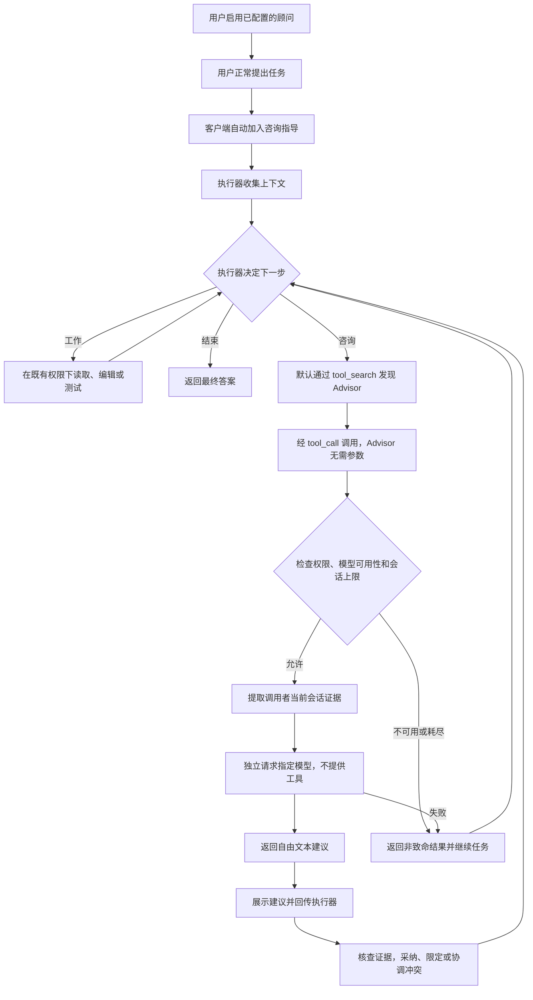

# Advisor 行为对齐

[English](advisor-alignment.md) | [简体中文](advisor-alignment.zh-CN.md)

## 目标与参考

补齐 #9636 引入的 executor/advisor 行为及 #9036 的验收约定。产品目标是：用户启用顾问后，执行器在普通工作过程中自主咨询，无需用户在每条 prompt 中要求咨询。执行器仍对行动和最终答案负责。

参考版本为 **Claude Code 2.1.282**，于 2026-09-25 对照其发布二进制确认。较旧本地源码仅用于理解结构，不作为当前实现证据。不复制上游实现。二进制确认了咨询指导和模型配对限制。[Claude Code 文档](https://code.claude.com/docs/en/advisor)描述模型决定调用时机、普通子代理继承、额外用量及 CLI 无次数设置；[API 文档](https://platform.claude.com/docs/en/agents-and-tools/tool-use/advisor-tool)另行描述服务端工具、建议回传和可选上限。

控制模式一致不等于模型行为或服务端内部实现相同。缓存的参考可执行文件连 `--version` 都被信号 9 终止，尚未完成 Claude/Qwen 同任务的真实运行对照。

## 入口与职责

| 入口                         | 触发者                                                        | 建议去向                                             |
| ---------------------------- | ------------------------------------------------------------- | ---------------------------------------------------- |
| 原生 Advisor                 | 通过 `/advisor`、`--advisor` 或设置启用后，执行器选择调用工具 | 作为工具结果进入调用者的会话，同时展示给用户         |
| 旧 `/advisor review [focus]` | 用户显式请求评审                                              | 向用户展示结构化评审，不属于原生执行器继续执行的闭环 |

启用顾问是选择一项能力，不是启动后台监听者，也不是要求每轮调用。客户端在用户/cron 任务及符合条件的子代理任务入口自动提供咨询指导，由模型决定何时遵循。顾问推理本身没有执行工具，不能递归咨询其他顾问。

## 自动咨询流程

菱形节点是模型决策，不是代码强制检查点。指导要求必要时先初步了解，再在实质工作前咨询；实质工作包括写作、编辑、形成解释、依赖假设或给出答案。认为任务完成、错误重复、方案不收敛、结果反常或考虑更换方案时，也要求咨询。较长任务另明确要求方案前与完成前两个时点均咨询。若建议与已观察证据冲突，执行器应说明冲突并再次咨询。下一步由刚收到的工具结果直接决定的短反应任务不需要反复调用，但这不豁免首次咨询。最终咨询前保存已获授权的成果；建议不授予提交、发布或其他权限。

`advisor` 默认延迟加载，保留简短描述和空对象 schema。`tool_search` 返回其声明，`tool_call` 执行咨询，不扩展执行器当前的工具声明列表。显式可见性设置和既有无桥接回退仍生效。普通子代理沿用共享运行时的工具加载规则，包括既有运行时对普通延迟工具的提前加载，不强制引入另一套 Advisor 专用发现机制。

## 证据、运行时与失败边界

- 提取调用者的**当前活动会话**，包括任务、工具调用及结果、系统指令和声明，截止到本次咨询调用。既有压缩可能已把早期轮次变为摘要，这不是完整归档导出。
- 通过异步 agent context 将普通子代理咨询绑定到自身会话，包括批准后继续执行。子代理缺少会话时直接失败，不回退到父会话。工具允许列表、禁用项、safe/bare 模式及权限仍生效。
- 将证据序列化后发起独立跨 provider 请求。过滤私有推理和签名，二进制内容替换为元数据或占位符。因此顾问拿不到像素级或音频级证据，不宣称等同于 Anthropic 服务端上下文传输。
- 原生建议为文本或 Markdown，不强制 JSON 字段，不提供执行工具。保留旧手动评审格式和历史卡片。咨询失败时不静默回退到其他模型或端点。
- 顾问指令要求发现有证据、说明因果步骤和假设；执行器指令要求采纳前核查因果路径，区分当前行为与拟议改动的风险。这些是模型指令，不是正确性判定器。
- `advisorMaxUses` 是非负 User/System 设置，`0` 表示不限。主执行器与派生子代理共享运行时 session 内存计数。等待请求前占用一次尝试，失败也计数。关闭或换模型不重置，新运行时 session 才重置。Workspace 不能提高或覆盖此边界。
- Provider 错误和次数耗尽返回非致命结果，执行器可继续而不陷入重试循环。取消沿既有 abort 路径传播。Ink/OpenTUI 显示原生建议并兼容结构化历史；模型用量单独归属 Advisor。

## 对齐项与有意保留的差异

下表的“对齐”指可观察的控制约定一致，不意味着提示词、服务端内部实现、时延或输出质量相同。

| 方面             | Claude 参考行为                        | Qwen 决策                                            | 原因与代价                                                                |
| ---------------- | -------------------------------------- | ---------------------------------------------------- | ------------------------------------------------------------------------- |
| 谁决定咨询       | 执行器模型决定                         | 对齐：自动提供指导，由模型选择调用                   | 保留自主性，不保证所有模型遵循每个检查点                                  |
| 咨询闭环         | 建议返回执行器，后者继续               | 对齐：工具结果回注与继续执行                         | 执行器负责核查和行动，顾问不是审批者                                      |
| 普通子代理       | 按模型资格继承顾问                     | 相同能力，使用调用者自身证据和既有 Qwen 工具策略     | 防止误用父会话及内部侧查询递归                                            |
| 工具发现         | 原生顾问能力，参考约定不包含 Qwen 桥接 | 默认 `tool_search` → `tool_call`，保留既有可见性覆盖 | 适配 Qwen schema 加载设计，减少常驻声明；增加发现步骤，不宣称推理质量更好 |
| 请求执行         | Anthropic 管理的服务端工具             | 客户端独立请求，支持跨 provider 组合                 | 满足 Qwen 多供应商能力，不复刻供应商服务端时延、缓存和计费                |
| 模型配对         | 模型目录资格及排名限制                 | 用户选择已配置模型，不虚构跨 provider 排名           | 没有可靠统一能力尺度，用户可能选到更弱顾问，同模型名也不保证同等质量      |
| 上下文传输       | 服务端工具使用可用会话上下文           | 过滤后序列化调用者当前证据                           | 可移植且遵守推理/二进制边界；模态证据和缓存复用不同                       |
| 次数上限         | API 可选限制，不是 Claude CLI 设置     | 可选会话共享尝试上限                                 | 满足 #9036，限制次数而非金额或载荷大小                                    |
| 成果持久化与批准 | 参考指导要求最终咨询前持久化成果       | 保存授权成果，不隐含提交或发布权限                   | 遵循 Qwen 权限模型和用户授权，不宣称模型行为更优                          |
| 旧手动评审       | 不是原生闭环的参考入口                 | 单独保留 `/advisor review` 兼容路径                  | 完善自主咨询时不改变用户主动触发的工作流                                  |

这些差异分别来自可移植性约束、兼容决定或明确的 Qwen 扩展，不应统一描述为“比 Claude 更好”。将模型决策替换为强制咨询属于另一项产品和架构决策，不在本次对齐中。

## 验收约定

| 约定               | 必需证据                                                                                                          |
| ------------------ | ----------------------------------------------------------------------------------------------------------------- |
| 非常驻 schema 发现 | 初始请求不包含 Advisor，发现与桥接调用成功，声明列表稳定                                                          |
| 咨询并继续         | 指定模型/端点收到调用者证据且不带工具，可读建议返回执行器，后者继续                                               |
| 调用者与权限隔离   | 普通子代理使用自身会话，缺失会话不回退；权限和禁止递归约束生效                                                    |
| 失败与预算         | Provider 失败、取消、耗尽、关闭和尝试计数遵循约定；耗尽/关闭后不再请求顾问                                        |
| 终端行为           | 实际 Ink 和严格 OpenTUI tmux capture 显示可读 Advisor 名称/结果、执行器模型、继续执行及独立统计                   |
| 自主时序           | 验证实质解释/工作前及完成时咨询，并覆盖重复错误、改变方案和证据冲突；短反应步骤不必反复调用，但零调用不算对齐通过 |
| 证据协调           | 真实执行器用可执行的原始证据核查受控错误建议，不传播错误发现，并在后续咨询中提出冲突                              |
| 实际交付           | 实现文件存在，请求的回归命令成功；模型自述或进程退出码单独不足以证明完成                                          |

单元/集成测试保护确定性边界，真实模型场景评估指导和任务行为。记录 prompt、配置来源、工具/咨询顺序、时长、用量及失败；不反复运行不变场景直到出现一次成功。有限验收样本不保证未来所有建议都正确。

真实诊断应隔离测试 home 与 workspace，保留模型已配置的生成参数，在 headless 模式显式允许预定临时文件及命令，并在推理前检查规则。记录上游响应头时间、字节数、SSE 推理/文本/工具调用数量、流结束/取消及 CLI 事件，不记录凭证。代理截止时间不得短于场景预算。区分 provider 无响应、持续推理、工具参数缓冲、客户端处理及测试脚本失败。

## 当前证据与未完成项

确定性原生/延迟工具测试和六个 bundled CLI 场景通过。Ink 与严格 OpenTUI 的实际 tmux 会话覆盖发现、咨询、可读结果、继续、耗尽、关闭和用量归属。桥接卡片名称及 Ink 执行器模型名称短暂错显均已修复并复测。

真实 Max/Max 和 Flash/Max 审查样本完成了自主咨询与继续，简单对照没有咨询，这只是观测，不证明对齐。此前精简提醒把咨询缩为实质任务、把完成检查缩为长任务；现已依据 2.1.282 二进制指导纠正措辞及错误的零调用验收标准。最初的真实模型证据早于本次措辞修正；下述最终代码场景验证了现有措辞。一次 Max 样本传播了顾问未经证实的并发判断，而 Flash 和另一次 Max 纠正了类似说法。证据指导现已明确要求因果核查和假设。真实 Flash 执行器面对受控错误顾问反馈，在修改指导前后都实际执行证据、拒绝错误竞态判断并再次咨询协调。这是未退化证据，不证明可靠性提高。两轮均先修后测，原始失败仅由独立测试人员复现。修改后的样本仍对 async mutex 作出错误泛化，因此解释正确性仍存在模型质量限制。

最初的实施任务测试发现两项测试脚本问题：代理截止时间短于场景预算、headless 缺少写权限。之后有效的 300 秒运行在初步了解后未生成实现或咨询。旧日志没有响应字节观测，无法事后推断原因。新增观测的运行发现 HTTP 响应很快，随后持续输出长时间推理，并非传输无响应。Max 在写入前咨询两次，包含证据冲突协调，之后保存实现且真实测试 10/10 通过，最终耗尽 600 秒预算。Flash 保存实现且 6/6 通过，但没有咨询，在额外 mutation 检查中耗尽 16 次工具预算。独立复跑确认两份产物；两者均不能证明完整的前后两阶段咨询。新运行包已实证发送咨询提醒和发现路径，该记录不能反推旧 Flash 请求内容。

另一个续做任务使用已保存的 Max 产物及新指导，自主在修改前咨询，保存修正与回归测试，12/12 通过后在完成前再次咨询。测试脚本隐藏的 20 轮上限在第二次建议返回后截断了最终答复；一次真正恢复已录制会话保留了历史、处理反馈、再次通过 12/12 并完成。这证明该录制任务跨一次恢复完成了咨询闭环，不是单次无中断运行，也不是恢复此前未录制的实施任务。保留模型解释不准确之处和失败样本；这是有界验收，不保证建议质量。

最终代码提交 `1599c8b293e0` 上，两个独立的真实 Max/Max 任务都在用户未要求咨询的情况下单次不中断完成。重试任务连续两次固定测试 0/7 后咨询、修复、两次 7/7、完成前再次咨询并正常退出；预约任务读规范后写入前咨询、固定测试 7/7、完成前再次咨询并正常退出。观察者独立复跑均为 7/7，测试与规范文件未变。这些样本验证了工作前和完成前的咨询，也观察到重复的初始失败后咨询；由于同时存在工作前提醒，不能把后者的因果单独归于重复错误措辞。[精确时序与边界](https://github.com/QwenLM/qwen-code/pull/12688#issuecomment-5833729673)。

另一个分阶段样本在首次咨询后局部修正，新的集成测试仍失败；执行器随后落实顾问原先给出的完整 CAS 重试方案，中途没有再次咨询，最终 6/6 通过并在完成前咨询。这说明模型不会在每次中间检查失败后都重新咨询；后续修改沿用原建议，不能将其单独视为改换另一种方案。强制每次失败都咨询会改变由模型决定时机的架构，不能据此宣称更接近 Claude。[分阶段场景证据](https://github.com/QwenLM/qwen-code/pull/12688#issuecomment-5833874058)。

最终提交的 Ink 与严格 OpenTUI 实际 tmux 截图还验证了次数耗尽后的顾问模型名称、错误显示和执行器继续。[UI 证据](https://github.com/QwenLM/qwen-code/pull/12688#issuecomment-5833636304)。此前运行及失败记录保留在 [PR 验收讨论](https://github.com/QwenLM/qwen-code/pull/12688#issuecomment-5831380864)。PR 已可供维护者审查这些有界结果；未做 Claude 实机同任务对照，也不宣称所有模型一定遵循指导。有限的 mock 和真实模型样本无法证明完全等价。
