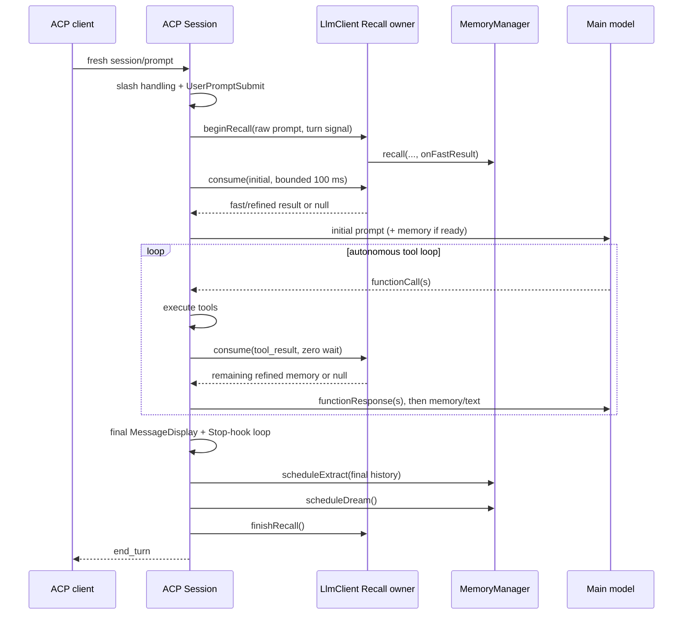

# ACP Managed Auto-Memory Lifecycle

**Status:** Implemented

**Target baseline:** `QwenLM/qwen-code@43d46be912f41e797e6a5aaa34bfaf4a16e06efa` (`0.22.0`)

**Issue:** [#9658](https://github.com/QwenLM/qwen-code/issues/9658)

**Related designs:** [Memory system](./memory-system.md), [Async memory recall](../2026-05-15-async-memory-recall-design.md)

## Summary

ACP sessions should use the existing managed auto-memory implementation, with
the same Recall delivery semantics as interactive sessions and with Extract and
Dream scheduled once after a complete, successful logical user turn.

This design deliberately does **not** add a new coordinator class. Every ACP
`Session` already has a per-session `Config`, and that `Config` already owns one
`LlmClient`. The `LlmClient` is therefore the existing correct owner for
the pending Recall handle, surfaced-document deduplication, recent-tool context,
cancellation, and Recall delivery telemetry. The ACP `Session` calls a small
public lifecycle API on that existing object.

The ACP `Session` remains the owner of its logical turn boundary. It schedules
the existing `MemoryManager.scheduleExtract()` and `scheduleDream()` methods
directly after its autonomous tool loop and Stop-hook loop finish. Recall state
is shared; Extract/Dream algorithms are not copied.

No ACP protocol extension, proxy change, setting, storage format, or new
background-task abstraction is required.

## Baseline and problem

The target branch must first be based on `43d46be` or a newer upstream commit.
The behavior below describes `0.22.0`; it must not be implemented against an
older tree and then mechanically applied to the target.

At the target baseline:

- `LlmClient.sendMessageStream()` owns the complete managed Recall state
  machine.
- A fresh interactive `UserQuery` starts Recall after `UserPromptSubmit` has
  allowed the request, but queries with the original pre-hook prompt text.
- Initial Recall has a bounded 100 ms ceiling. The wait ends early when the
  deterministic fast result arrives; the refined model-selected result remains
  pending.
- Refined Recall can be consumed on a later ToolResult send. Documents already
  delivered by the fast phase are removed before refined delivery.
- Pending Recall is cancelled on a new query, parent abort, reset, shutdown, or
  a turn with no later safe delivery point.
- `LlmClient` tracks surfaced memory paths for session-level deduplication and
  recent completed tool names for Recall relevance filtering.
- Extract and Dream are implemented and guarded by `MemoryManager`; their
  cursor, trailing-request merge, locks, pressure gates, and Dream thresholds do
  not depend on the UI.

ACP bypasses the orchestration above by calling `LlmChat.sendMessageStream()`
from `Session.#sendMessageStreamWithAutoCompression()`. The comment above
`Session.#buildInitialSystemReminders()` explicitly records that managed Recall
is absent. ACP also never schedules Extract or Dream after its complete tool and
Stop-hook loop.

The missing behavior is therefore lifecycle wiring, not a missing memory
algorithm.

## Goals

1. Give every fresh ACP user turn the existing fast/refined Recall behavior.
2. Preserve the original pre-hook prompt as the Recall query.
3. Preserve the provider requirement that all leading `functionResponse` parts
   remain before injected reminder text.
4. Schedule Extract and Dream exactly once after a successful logical user turn,
   using the final complete chat history.
5. Reuse existing cancellation, deduplication, telemetry, cursor, queue, lock,
   and pressure semantics.
6. Keep the production change small enough to audit exhaustively.

## Non-goals

- Reimplementing Recall, Extract, or Dream in ACP, a hook, a sidecar, or a proxy.
- Adding an ACP method or notification for memory task progress.
- Refactoring all `LlmClient` background work, including auto-skill, into a
  new shared scheduler.
- Changing memory paths, workspace scoping, file formats, settings defaults, or
  Dream thresholds.
- Enabling Recall for ACP Cron, background notification, or runtime-origin Goal
  turns in this PR. Cron parity can be added later using the same API if it is
  independently required.
- Guaranteeing that an immediately closed ACP session waits for background
  Extract/Dream completion. This PR preserves their existing background
  semantics.
- Changing `chrome-acp-v2` image persistence or startup ordering. Those are
  downstream deployment concerns described below.

## Ownership

| Concern                                                  | Owner                    | Reason                                                                                      |
| -------------------------------------------------------- | ------------------------ | ------------------------------------------------------------------------------------------- |
| Pending Recall promise and abort controller              | Per-session `LlmClient`  | It already owns this state for interactive turns and is shared by the ACP `Session`.        |
| Fast/refined arbitration, surfaced-path dedup, telemetry | Per-session `LlmClient`  | These invariants must not be copied into ACP.                                               |
| Fresh/retry/continue/runtime turn classification         | ACP `Session`            | Only `Session` knows ACP admission metadata and Goal origin.                                |
| ToolResult provider-send ordering                        | ACP `Session`            | It owns the autonomous tool loop and final outgoing `Part[]`.                               |
| Successful logical-turn completion                       | ACP `Session`            | It alone spans model calls, tools, mid-turn input, Stop hooks, and todo-stop continuations. |
| Extract/Dream jobs and durable state                     | Existing `MemoryManager` | It already owns cursors, merging, locks, gates, and task records.                           |

This ownership split avoids both bad extremes: copying the Recall state machine
into `Session.ts`, and introducing a general coordinator that would merely wrap
objects which already have the correct lifetime.

### Concurrency boundary

`Config` currently constructs one `MemoryManager` per session. Its
Extract trailing-request merge is therefore per `Config`, not a daemon-global or
cross-process lock. Two concurrently active sessions that point at the same
memory root are an existing broader memory-subsystem concurrency boundary; this
design must not claim that they are serialized merely because both call
`scheduleExtract()`.

Changing manager ownership or adding a filesystem Extract lock would affect
interactive multi-process use, runtime-output-dir isolation, and manager
cleanup. It is intentionally a separate design rather than speculative scope in
ACP lifecycle parity. This PR neither weakens nor attempts to extend the current
guarantee: within one ACP `Session`/`Config`, trailing Extract requests and Dream
gates keep their existing behavior.

## Logical turn contract

Only a fresh, model-bound user turn begins the lifecycle.

| ACP input                                            |                      Recall |          Extract/Dream | Notes                                                       |
| ---------------------------------------------------- | --------------------------: | ---------------------: | ----------------------------------------------------------- |
| Ordinary `session/prompt`                            |                         yes |              yes, once | Includes authenticated channel prompts.                     |
| Model-bound slash command or skill                   |                         yes |              yes, once | Locally handled slash commands return before Recall begins. |
| User-origin Goal turn                                |                         yes |              yes, once | `goalTurn.origin === 'user'`.                               |
| Retry                                                |                          no |                     no | It is another attempt at the same logical turn.             |
| Interrupted-turn continuation                        |                          no |                     no | It resumes persisted history without a new user turn.       |
| Restored `ask_user_question` answer                  |                          no |                     no | It resumes the tool loop without a new user turn.           |
| Runtime-origin Goal continuation                     |                          no |                     no | Machine-generated continuation.                             |
| Stop-hook, todo-stop, tool, or mid-turn continuation |        reuse pending Recall | no additional schedule | All are inside the original logical turn.                   |
| Hook-blocked or locally handled request              |                          no |                     no | Recall begins only after these early exits.                 |
| Cancelled, API-error, or loop-failed turn            | pending Recall is finalized |                     no | No partial history extraction.                              |
| Cron or background notification                      |                          no |                     no | Explicitly out of scope for the first PR.                   |

The predicate in `Session.#executePromptInner()` is therefore based on existing
facts, not a new turn type:

```ts
const isFreshUserTurn =
  !isRetry &&
  !isContinue &&
  !isRestoreAskUserQuestion &&
  goalTurn?.origin !== 'runtime';
```

The local-slash and blocked-hook paths already return before the begin call, so
they need no extra flags.

## Design

### 1. Expose the existing Recall lifecycle on `LlmClient`

Extract the current inline/private orchestration into three public methods on
the already-exported `LlmClient`:

```ts
beginManagedAutoMemoryRecall(query: string, signal: AbortSignal): void;

consumeManagedAutoMemoryRecall(
  deliveryPoint: 'initial' | 'tool_result',
): Promise<RelevantAutoMemoryPromptResult | null>;

finishManagedAutoMemoryRecall(): void;
```

These methods do not introduce new state or policy:

- `beginManagedAutoMemoryRecall()` performs the current enabled/available gate,
  cancels a previous handle as `new_query`, bridges the parent signal, starts
  `MemoryManager.recall()`, publishes the deterministic fast result, and installs
  the same `MemoryPrefetchHandle`.
- `consumeManagedAutoMemoryRecall('initial')` uses the existing 100 ms bounded
  fast-result wait.
- `consumeManagedAutoMemoryRecall('tool_result')` is a zero-wait consume of a
  settled refined result.
- Both consume paths update surfaced-path state, remove fast/refined overlap,
  and emit the existing delivery telemetry.
- `finishManagedAutoMemoryRecall()` is an idempotent close of any remaining
  handle using `no_safe_delivery_point`. Parent abort still wins because its
  listener cancels the handle first with `abort`.

The current lower-level helper may remain private so the interactive Cron path
can retain its existing zero-wait initial poll. No wait constant or new Recall
type is exported.

`LlmClient.sendMessageStream()` is migrated to these methods in the same
change, so the interactive path continues to exercise the shared API. Existing
Recall tests then protect both callers instead of leaving the new public path
ACP-only and weakly tested.

The complete downstream consumer list for the new methods is intentionally
small. It consists of three owning methods:

1. `LlmClient.sendMessageStream()` for interactive/headless UserQuery and
   ToolResult sends.
2. `Session.#executePromptInner()` for ACP begin, initial consume, and final
   cleanup.
3. `Session.#sendMessageStreamWithAutoCompression()` for ACP refined ToolResult
   consume.

No new coordinator file, class, interface, setting, or barrel export is added.
Mark the methods `@internal`: they are a cross-package CLI implementation
surface on an already-exported class, not a new supported SDK contract.

### 2. Begin ACP Recall after prompt admission, using pre-hook text

In `Session.#executePromptInner()`:

1. Parse `promptText` from the original ACP request as today.
2. Resolve local slash commands as today.
3. Run `UserPromptSubmit` as today. A block or error returns without starting
   Recall.
4. For `isFreshUserTurn`, call:

```ts
this.config
  .getLlmClient()
  .beginManagedAutoMemoryRecall(promptText, pendingSend.signal);
```

The call occurs after the hook decision but still uses `promptText`, not
hook-added `additionalContext` and not resolved file/editor content. This matches
the interactive path while allowing Recall to run concurrently with snapshot and
reminder preparation.

Retry, interrupted continuation, restored `ask_user_question`, and
runtime-origin Goal paths do not call `beginManagedAutoMemoryRecall()`.

### 3. Inject the initial result with existing reminders

Immediately after `#buildInitialSystemReminders()` returns for a fresh user turn,
consume the initial result:

```ts
const memory = await this.config
  .getLlmClient()
  .consumeManagedAutoMemoryRecall('initial');

if (memory?.prompt) {
  systemReminders.unshift({ text: memory.prompt });
}
```

The existing `insertAfterFunctionResponses()` call remains the single insertion
rule for the reminder group. The required invariant is:

```text
leading functionResponse parts
→ one-shot/session reminders, including memory
→ user or continuation content
```

For an ordinary fresh prompt there are no leading function responses. The
generic ordering still matters for future reuse and prevents an accidental
protocol regression.

### 4. Consume refined Recall at the final provider-send boundary

Do **not** consume refined Recall inside
`#buildNextMessageAfterToolRun()`. That method can construct a message which is
later discarded by loop protection, todo-stop validation, cancellation, or
pre-send preparation. Consuming there can mark memory as delivered even though
the message never reaches a provider send.

Instead, extend `Session.#sendMessageStreamWithAutoCompression()` after all of
its explicit send-drop gates have passed: `prepareBeforeCompression`, automatic
compression, the session-token limit, the compression diagnostic,
`beforeSend`, and the final abort check. Immediately before constructing the
request and calling `LlmChat.sendMessageStream()`:

1. Detect that the outgoing message starts with one or more
   `functionResponse` parts.
2. Zero-wait consume `tool_result` Recall.
3. Insert the returned reminder with `insertAfterFunctionResponses()`.
4. Continue directly into the existing provider send.

This is the narrowest common safe point for ordinary tools, Stop-hook tools,
todo-stop tools, and mid-turn tools. The current compression and session-token
checks inspect chat state rather than the unsent `message`, so moving this
insertion after those checks does not change their accounting. It does prevent
a known pre-send decision from marking memory as surfaced when no provider
request was attempted. A synchronous provider-send failure remains possible, as
it is on the interactive path after consumption.

The outgoing order is always:

```text
functionResponse[0..n]
→ relevant memory, if the refined result settled
→ active-todo/repeated-failure/mid-turn text
```

If Recall has not settled, the call returns `null` immediately. A later tool
send tries again. No model request waits for the refined selector.

### 5. Finalize Recall on every ACP exit

Attach a `finally` to the `Storage.runWithRuntimeBaseDir()` promise in
`Session.#executePromptInner()` and call `finishManagedAutoMemoryRecall()` when
the turn started Recall. A chained `finally` preserves the existing method body
and avoids a diff consisting only of indentation changes.

This covers normal no-tool completion, API exceptions, loop exits, and future
early returns without adding cleanup at every return statement. Cancellation and
session disposal already abort `pendingSend.signal`; the Recall signal bridge
records those as `abort` before the idempotent final close runs.

Because ACP executes the complete tool loop inside one `prompt()` call, the
pending Recall handle remains alive across all ToolResult sends and is finalized
only at the true logical-turn boundary.

### 6. Schedule Extract and Dream at the successful logical-turn boundary

After `#handleStopHookLoop()` returns, and before returning its successful ACP
prompt response, schedule background memory only when:

- the result is `stopReason === 'end_turn'`;
- the result was not a graceful loop-protection stop;
- the invocation is a fresh user turn;
- managed auto-memory is enabled.

Foreground user prompts throw on loop detection and already bypass this point.
Authenticated channel prompts and Goal turns intentionally convert the same
condition to a graceful `end_turn`, so `stopReason` alone is not sufficient.
Add one optional `loopProtectionStopped` field to the existing internal
`StopContinuationResult`/Stop-loop result and propagate it only from the two
existing loop-protection exits (`toolRun.loopDetected` and
`stoppedByRepeatedToolFailure`). This is outcome provenance, not a second turn
state machine.

At this point every model stream and `MessageDisplay` has finished, the tool loop
has no pending call, message rewriting has drained, and the Stop-hook/todo-stop
loop has reached its terminal decision.

Use one final history snapshot for Extract:

```ts
const memoryManager = this.config.getMemoryManager();
const projectRoot = this.config.getProjectRoot();
const sessionId = this.config.getSessionId();
const history = this.#getCurrentChat().getHistoryShallow();

void memoryManager
  .scheduleExtract({ projectRoot, sessionId, history, config: this.config })
  .catch((error: unknown) => {
    debugLogger.warn(
      'Failed to schedule ACP managed auto-memory extraction.',
      error,
    );
  });

void memoryManager
  .scheduleDream({ projectRoot, sessionId, config: this.config })
  .catch((error: unknown) => {
    debugLogger.warn(
      'Failed to schedule ACP managed auto-memory dream.',
      error,
    );
  });
```

Do not await either task and do not store their promises in
`LlmClient.pendingMemoryTaskPromises`; ACP has no TUI `memory_saved` item to
consume that queue. `MemoryManager` already tracks the work. The two rejection
handlers are required to prevent unhandled background rejections, not to add a
fallback path.

There is no new "once" field. The scheduling code has exactly one reachable
callsite, after the one `#handleStopHookLoop()` that terminates a fresh logical
turn. Tool and Stop-hook continuations never pass that callsite independently.

### 7. Feed existing recent-tool state from ACP

ACP currently executes tools without calling the already-public
`LlmClient.recordCompletedToolCall()`. Use `Session.runTool()`'s existing
outer `finally`, where `terminalStatus` and the effective `args` are already
known, to call it once when a registered tool reaches a non-cancelled terminal
state:

```ts
this.config.getLlmClient().recordCompletedToolCall(toolName, args);
```

This keeps Recall's recent-tool noise filter aligned with interactive sessions.
Calls served from duplicate history do not enter `runTool()` and are not
counted; cancelled calls remain excluded. Successful and error-terminal tools
are both counted, matching the interactive path. No ACP-specific recent-tool
collection is added.

This also updates the method's existing tool-call count and skill-write marker.
ACP does not invoke the interactive auto-skill scheduler, so this PR adds no ACP
auto-skill behavior.

## End-to-end flow



## File-level change set

### Production

| File                                                  | Change                                                                                                                                                                                                                                              |
| ----------------------------------------------------- | --------------------------------------------------------------------------------------------------------------------------------------------------------------------------------------------------------------------------------------------------- |
| `packages/core/src/core/client.ts`                    | Extract the existing Recall begin/consume/finalize operations into public methods and migrate the current UserQuery/ToolResult callsites to them. No behavior change for interactive use.                                                           |
| `packages/cli/src/acp-integration/session/Session.ts` | Classify fresh user turns, call the shared Recall API, inject initial/refined results at safe send points, finalize Recall, preserve graceful loop-stop provenance, record completed tools, and schedule Extract/Dream once after clean completion. |

No other production file should be necessary. In particular, do not add a file
under `packages/core/src/memory/`: the memory algorithms and manager API already
exist.

### Tests

| File                                                       | Purpose                                                                                                                                                                                                                           |
| ---------------------------------------------------------- | --------------------------------------------------------------------------------------------------------------------------------------------------------------------------------------------------------------------------------- |
| `packages/core/src/core/client.test.ts`                    | Keep all current fast/refined, timeout, cancellation, dedup, and telemetry tests green through the new public lifecycle methods. Add only a direct lifecycle assertion that is not already covered through `sendMessageStream()`. |
| `packages/cli/src/acp-integration/session/Session.test.ts` | Pin ACP turn classification, raw pre-hook query, injection ordering, cleanup, exactly-once post-turn scheduling, final-history snapshot, error/cancel exclusion, and recent-tool recording.                                       |
| `integration-tests/cli/acp-integration.test.ts`            | Deterministic real-ACP Recall test through the bundled CLI and fake OpenAI server.                                                                                                                                                |

The production scope is a small cross-package change. Before review, grep every
new public method and verify that its consumers remain inside the three owning
methods listed above.

## Test plan

### Core unit tests

Preserve the existing assertions for:

- deterministic fast result inside the 100 ms ceiling;
- a slow refined selector not blocking the initial main request;
- refined delivery after function responses;
- fast/refined path deduplication;
- new-query, abort, reset, shutdown, and no-safe-point cancellation;
- Recall delivery telemetry.

The refactor is acceptable only if these tests exercise the extracted public
methods through the interactive caller. Do not duplicate the Recall state
machine in test-only mocks.

### ACP unit tests

Add focused tests for the following observable contracts:

1. A normal prompt calls `beginManagedAutoMemoryRecall()` with the original ACP
   text even when `UserPromptSubmit` appends context.
2. A blocked hook and a locally handled slash command never begin Recall.
3. Retry, interrupted continuation, restored `ask_user_question`, and
   runtime-origin Goal turns neither begin Recall nor schedule Extract/Dream.
4. An initial memory result is present in the first model request.
5. A refined result appears after every leading `functionResponse` and before
   later text on the next actual tool-result provider send.
6. An unsettled refined result adds no delay and is retried on a later tool send.
7. Cancel, dispose, provider error, and loop failure finalize Recall and do not
   schedule Extract/Dream.
8. A complete tool loop plus one or more Stop-hook continuations schedules
   Extract once and Dream once with the final shallow history.
9. Foreground and graceful channel/Goal loop-protection exits do not schedule
   Extract or Dream.
10. A non-cancelled ACP tool calls the existing completed-tool recorder once;
    duplicate and cancelled tools do not.

### ACP integration test

Add one deterministic case to the existing ACP integration suite using
`startFakeOpenAIServer()` and the real bundled `qwen --acp` process:

1. Isolate `QWEN_HOME` and set `QWEN_CODE_MEMORY_LOCAL=1` for a transparent test
   path.
2. Seed a valid project topic file with a unique marker.
3. Delay the Recall selector response beyond 100 ms.
4. Submit a query with a lexical match and inspect the fake server's first
   matching streamed main-model request.
5. Assert that the unique marker is already present, proving real ACP transport,
   Recall, and deterministic fast delivery without selector latency.

Extraction, persisted-memory scanning, and Dream execution already have focused
`MemoryManager` lifecycle integration tests; the ACP unit tests prove that
`scheduleExtract()` and `scheduleDream()` receive the correct final boundary.
Re-running the complete extraction agent inside the ACP transport test would
duplicate those tests and make the boundary test depend on a scripted agent
tool loop unrelated to ACP.

Run focused tests from their package directories, then the required build and
typecheck:

```bash
cd packages/core && npx vitest run src/core/client.test.ts
cd packages/cli && npx vitest run src/acp-integration/session/Session.test.ts
npm run build && npm run bundle
cd integration-tests && QWEN_SANDBOX=false npx vitest run cli/acp-integration.test.ts -t "managed auto-memory"
cd .. && npm run typecheck
```

## Correctness invariants

The implementation is complete only if all of these hold:

1. Recall query text never includes `UserPromptSubmit` additional context.
2. A fresh logical ACP user turn owns at most one pending Recall handle.
3. Retry and machine continuations never create a new handle.
4. The initial provider request waits no longer than the existing bounded fast
   Recall ceiling.
5. Refined Recall never precedes a leading `functionResponse`.
6. A memory path is surfaced at most once per ACP session across fast and refined
   results and later user turns.
7. Every started ACP Recall is consumed or finalized on all exits.
8. Extract sees history after the final tool and Stop-hook continuation.
9. Extract and Dream are each scheduled at most once per fresh successful user
   turn and never for cancelled, failed, or gracefully loop-stopped turns.
10. The ACP prompt response does not wait for Extract or Dream completion.

## Rejected alternatives

### New `ManagedMemoryTurnCoordinator` class

Rejected for this PR. It would move the same fields out of `LlmClient`, add a
new exported entity, and force constructor/lifecycle plumbing even though ACP
already shares the exact `LlmClient` instance. Public lifecycle methods on the
existing state owner provide reuse with a smaller proof surface.

A standalone coordinator becomes justified only if a future runtime does not
own a `LlmClient` but still needs the same Recall state machine.

### Copy Recall state into `Session.ts`

Rejected. It duplicates fast/refined arbitration, path deduplication,
cancellation listeners, terminal telemetry, and every future Recall change.

### Put all post-turn scheduling in `LlmClient`

Rejected. ACP has the authoritative complete-turn boundary, while
`LlmClient.sendMessageStream()` is a physical model-send boundary in
interactive flows. Forcing ACP to call the interactive background-task method
would also enqueue TUI-only notification promises and couple this change to
auto-skill scheduling.

### Consume refined Recall in `#buildNextMessageAfterToolRun()`

Rejected. A built message is not necessarily sent. Consuming at the final
provider-send boundary is both later and shared by all ACP tool continuations.

### Hook or proxy implementation

Rejected. It cannot preserve the existing fast/refined delivery, session dedup,
abort propagation, and telemetry without rebuilding Qwen Code internals outside
their owner.

## Downstream image and persistence work

This upstream PR makes ACP memory behavior correct inside Qwen Code. It does not
make a container's filesystem durable. A `chrome-acp-v2` rollout still needs a
separate, deployment-owned change:

1. Build the image with the patched Qwen Code version.
2. Explicitly enable managed auto-memory and Dream in production settings if the
   image policy requires pinned defaults.
3. Persist both project runtime state and the user-level `memories` directory.
4. Complete restore before starting the ACP proxy, or explicitly declare a
   degraded first-turn consistency policy.
5. Namespace user-level memory by authenticated user/tenant before sharing NAS
   storage.
6. Verify `write -> sandbox restart -> new ACP session first-turn recall` in the
   deployed image.

The ACP/WebSocket proxy remains transport-only and requires no memory logic.

## Implementation sequence

1. Rebase the fork branch onto target baseline `43d46be` or a newer upstream
   commit and re-check the named symbols.
2. Refactor `LlmClient` Recall into the public lifecycle methods with no
   behavior change; run the core tests.
3. Add ACP begin/initial/refined/finalize wiring and focused Session tests.
4. Add exactly-once Extract/Dream scheduling and recent-tool recording tests.
5. Add the real-process ACP integration test.
6. Run build, typecheck, focused tests, and two clean diff-audit passes before
   opening the PR.
