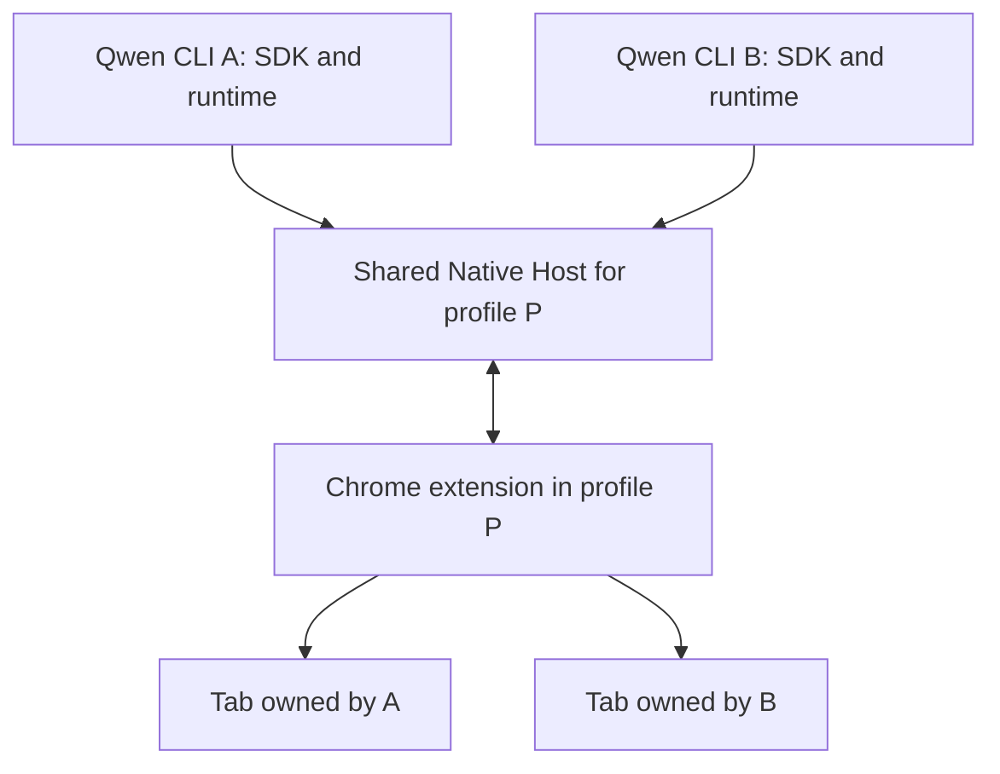

# Browser Use concurrent sessions

[English](browser-use-concurrent-sessions.md) | [简体中文](browser-use-concurrent-sessions.zh-CN.md)

Status: implemented, validation in progress, 2026-09-18. Tracks [#11609](https://github.com/QwenLM/qwen-code/issues/11609).

## Goal and current state

Two independent Qwen sessions should share one Chrome profile while operating
their own tabs. For example, session A investigates an issue while session B
reads documentation. Both use the existing browser login state; finishing A
leaves B usable.

The original [Browser Use design](browser-use.md) permitted one active runtime per
OS user. Each runtime listened on the same socket. The
[profile ownership fix](browser-use-profile-ownership.md) prevents another
profile from replacing that connection, while retaining the single-session
boundary. #11241 and #11242 have both merged into `main`.

This design fixes the process topology, ownership boundaries, identities and
lifecycle contract. The first implementation is under validation against the
acceptance criteria below; its remaining gaps are recorded explicitly. Concurrent control
of the same tab is outside scope. Sessions sharing a profile also share its
cookies and login state; separate profiles remain the way to use separate
browser identities.

## Process topology

Use one Chrome-launched Native Host per connected profile as the shared
connection endpoint. Each Qwen CLI retains its own SDK, Node runtime and
Playwright state, and connects to that Host as a client.

Chrome's extension starts the Host and owns its Native Messaging connection.
The Host listens for multiple CLI clients and remains available when an
individual CLI exits. A separate profile has a separate Host. This keeps shared
transport lifetime with the browser and avoids making the first CLI responsible
for every later session.

When the Native Messaging connection closes, the Host shuts down, disconnects
its clients and removes only its own endpoint/discovery entry. The extension
starts a fresh Host when it reconnects. Individual CLI shutdown never stops
the shared Host.

The extension maintains one active Host connection for its profile. The Host
publishes a discovery entry only after the profile handshake and listener are
ready. Entries identify both the persistent profile and the current Host
incarnation. CLIs discover and connect to these entries rather than competing
to bind a per-user socket. Reconnection validates the selected profile and
incarnation; stale entries cannot redirect an existing handle elsewhere.

Normal use selects an available default profile without an obligatory picker.
Explicit selection must be supported. Once selected, the session remains bound
to that profile until closed; another available profile cannot take it over.
The implemented discovery and selection contract is specified below.

## Responsibility and identity

| Component        | Owns                                                                                                              |
| ---------------- | ----------------------------------------------------------------------------------------------------------------- |
| CLI runtime      | Local SDK handles, Playwright state and operations for its session                                                |
| Native Host      | Client connections, session registration, request/response correlation, event routing and disconnect notification |
| Chrome extension | Authoritative tab ownership, per-session names/groups/managed tabs/popups, browser actions and resource cleanup   |

The extension is the single authority for tab ownership. The Host binds each
client connection to its registered session and routes requests and responses
accordingly. Tab events reach the owning session; profile lifecycle events
reach the sessions bound to that profile. A CLI's local view is a cache of its
session, not authority over other sessions' resources.

Keep three identities separate:

- `extensionInstanceId`: persistent Chrome profile identity, reused from the
  existing profile ownership design.
- `browserSessionId`: a dedicated Browser Use session identity registered by
  the Host and carried through the bridge. Closing and reopening creates a new
  session identity.
- CDP `sessionId`: the existing child-target identifier, such as an iframe's
  debugging session.

Routing and handles retain profile and session context. Numeric Chrome tab IDs
are meaningful only within a profile. A Host/connection generation distinguishes
restarts from the earlier connection lifetime. These identifiers provide
routing and lifecycle isolation; same-user processes remain within the existing
trust boundary. Preserve private endpoint ownership and permission checks.

## Concurrency and lifecycle contract

The following rules define the required behavior. The validation boundaries
below identify requirements the first implementation has not yet fully met:

1. **One active owner per tab.** The extension reserves ownership before an
   asynchronous attach. A competing claim returns a distinct Browser Use
   ownership conflict, preserving the current owner. DevTools/CDP debugger
   conflicts remain a separate error.
2. **Independent progress on different tabs.** Coordinate ownership changes,
   actions and cleanup per tab; a slow operation in A must not globally block
   B's unrelated tab. Late results and cleanup must still match the originating
   session and ownership generation.
3. **Session-scoped resources.** Names, groups, managed tabs, derived popups and
   pending operations belong to a session. A popup inherits its opener's owner;
   closing the opener preserves the popup's ownership. Group membership and
   names from other sessions remain unchanged.
4. **Session-scoped shutdown.** Closing or losing A's client connection moves A
   through active, closing and closed states. Stop accepting its requests,
   cancel queued work and perform bounded cleanup of its resources according
   to the exit reason below.
   B's transport, operations and tabs remain usable. Cancelling an individual
   operation stays scoped to that operation.
5. **Explicit recovery after shared failures.** A Host, extension-worker or
   profile restart invalidates affected sessions' old handles. Reconnect to the
   same profile, reconcile abandoned ownership and create fresh session handles
   before proceeding. Recovery never automatically replays browser actions.
   Other profiles remain unaffected.

Cleanup shares session-scoped bookkeeping and distinguishes the exit reason:

- **Explicit runtime close:** preserve current close/finalize semantics within
  the session's ownership set. Close still-controlled agent-created tabs and
  release claimed user tabs. Already released deliverables remain open.
- **Crash or unexpected disconnection:** preserve remaining pages, detach
  debugging, release ownership and ungroup that session's managed tabs.
  Host/worker recovery applies the same preservation rule to abandoned sessions.
  Connection loss alone never authorizes closing their pages.

An orderly shutdown sends an explicit session-close request before dropping
the connection. A connection ending without that request follows the unexpected
disconnection policy.

A live connection can be idle while the model thinks or the user pauses.
The extension waits up to 250 ms for session cleanup; unresolved tab cleanup
keeps that tab unavailable for reassignment until release is confirmed. A late
callback from a closing session must not affect a later owner. Restart recovery
must reconcile persisted groups and ownership with the sessions that actually
survived, including when the old Host could not send a shutdown notification.

Ownership bookkeeping uses `chrome.storage.session` so a restarted extension
worker can reconcile abandoned tabs within the same browser lifetime. A full
profile restart has a separate validation gap described below. The ownership
and isolation rules above remain the acceptance contract.

## Compatibility and implementation boundary

This changes the connection direction and adds session routing through protocol
v3, with actionable version-mismatch errors across CLI, Native Host and
extension. The wire and installation contracts are specified here.

Host files live in a per-user installation whose lifetime is independent of
individual CLI installations or worktrees. Initiating a Browser Use task opts
into automatic local setup. Without reading Chrome extension preferences, the
SDK installs the bundled Host if none
is installed, if the launcher predates installation records or is unusable, or
if it speaks an older protocol or carries a lower Host revision. The revision is
an integer bumped whenever the Host changes without a protocol change; without
it a Host fix would never reach a user who already installed one. A usable Host
of the same protocol and at least the bundled revision is reused; the SDK only
adds missing browser registrations and never repoints the launcher at its own
bundled copy, so CLIs from different checkouts do not take turns replacing it.
A Host installed by a newer Qwen Code is never downgraded; the
older CLI reports that Qwen Code must be updated.

Protocol 3 registers as `com.qwen.browser_use` with the launcher
`~/.qwen/browser-use/host.sh`. Released protocol 2 CLIs re-register
`com.qwen.browser` and `~/.qwen/browser-use/native-host.sh` on every first use.
Sharing that name would let any older CLI point Chrome back at a protocol 2
Host. Separate names keep the two registrations independent; the protocol 3
installer never reads, rewrites or removes the protocol 2 files.

Installation copies the bundled Host into a content-addressed file at
`~/.qwen/browser-use/hosts/<sha256>/native-host.mjs`, then atomically updates
the launcher. The launcher records the protocol version, Host revision and chosen Node
executable, whose path must remain available. Existing Host files and processes
remain in place. An update takes effect on the next Host launch; installation
does not restart a live Host or reconnect the extension. The explicit
`native-host-setup.js install` command switches a same-protocol installation to
the invoking CLI's Host. Real-Chrome validation of updates during active
sessions remains outstanding.

A second ordinary session becomes a supported client. The existing regression
that expected `BROWSER_USE_BUSY` from a second runtime now checks concurrent access;
protection against replacing a live endpoint or stealing a profile remains.
Retain existing SDK behavior for a single session and preserve the per-session
contracts of `tabs.list()`, claiming and finalization.

Work primarily spans the Browser Use transport/Native Host and Chrome extension.
Keep semantic browser operations in the existing CLI runtime. A separate
user-wide broker daemon or moving the entire Playwright runtime into a shared
process adds lifecycle and isolation work that this design does not require.

## Validation and delivery

### Implementation map

| Area                                   | Files                                                                                                                                           |
| -------------------------------------- | ----------------------------------------------------------------------------------------------------------------------------------------------- |
| Profile discovery and protocol         | `packages/browser-use/src/bridge/protocol.ts`, `packages/browser-use/src/bridge/discovery.ts`                                                   |
| Shared Host and client transport       | `packages/browser-use/src/bridge/native-host/index.ts`, `packages/browser-use/src/bridge/transport/chrome-extension-transport.ts`               |
| Installation and normal connection     | `packages/browser-use/src/native-host-installer.ts`, `packages/browser-use/scripts/native-host-setup.ts`, `packages/browser-use/src/runtime.ts` |
| Profile selection and session shutdown | `packages/browser-use/src/playwright/playwright-runtime.ts`, `packages/browser-use/src/playwright/playwright-session.ts`                        |
| Browser-side ownership and lifecycle   | `packages/chrome-extension/src/background/browser-use-bridge.js`, `packages/chrome-extension/public/manifest.json`                              |
| Regression and real-browser coverage   | Collocated transport, Host, installer, runtime and extension tests; `packages/browser-use/scripts/`                                             |

### Wire and discovery contract

Protocol v3 starts with the extension's profile `hello`. The Host creates an
incarnation-specific endpoint and atomically publishes a private discovery
record containing `extensionInstanceId`, `hostInstanceId`, `protocolVersion`,
`extensionProtocolVersion`, `socketPath` and `pid`. `QWEN_BROWSER_USE_DISCOVERY_DIR` isolates this directory
for tests. The existing `QWEN_BROWSER_USE_SOCKET_PATH` override selects one
explicit endpoint. A CLI sends `client.hello`; the Host allocates its
`browserSessionId`, registers it with the extension through `session.open`, and
returns the session hello only after registration succeeds. EOF during
registration still schedules cleanup after a late registration response.

Records and Host sockets live in a dedicated `qwen-hosts`
directory under the private per-user socket base, never directly in a shared
runtime directory such as `/run/user/<uid>`. The name is short because macOS
limits a socket path to 103 bytes and the per-user base under `/private/tmp`
already uses up to 40. Both levels are created with mode
`0700` and every ancestor is verified. Discovery removes the record and socket
of a Host whose endpoint is unreachable and whose process no longer exists;
a live process keeps its files.

Protocol 2 CLIs listen on `bridge.sock` in that socket base and wait for their
own Native Host, which a protocol 3 extension never launches. Once per new
listener, a protocol 3 Host connects to such a user-owned socket and sends its
`hello`. The older CLI then reports that Qwen Code must be updated instead of
a generic connection timeout. A Host serving an older extension does not send
it.

Requests, responses and events carry `browserSessionId`. The Host binds it to
the socket and remaps request IDs; clients cannot register extra sessions or
route requests through another session. An explicit `session.close` preserves
its graceful reason even if EOF follows. A client that disappears without it
gets `disconnected` cleanup. These lifecycle operations are idempotent.

`browsers.list()` discovers profile IDs of the form `chrome:<profileId>` without
binding. `browsers.get('chrome')` and `browsers.get('extension')` retain default
selection; `browsers.get('chrome:<profileId>')` selects an explicit profile before
binding. A runtime binds to a profile only once that profile's Host answers, so
a selection that never connects does not pin later ones. A bound runtime rejects
attempts to switch profiles.

Listing and connecting both wait up to the connect timeout, because the
extension relaunches a missing Host only on its 30-second alarm and an empty
snapshot does not mean that no browser exists. Listing returns only compatible
Hosts. A version mismatch is reported once the wait ends without a compatible
Host, since one may still appear, for example right after an upgrade while
another profile runs the previous extension. A connection reset by a Host that
is shutting down is retried within the same wait.

Profiles are named from Chrome's own `Local State`. The extension keeps its
instance ID in `chrome.storage.local`, which Chrome stores per profile under
`Local Extension Settings/<extension id>`, so the runtime maps each discovered
ID to that profile directory and reads its name and Chrome's
`profile.last_used`. With several compatible profiles, default selection
prefers the last-used one; otherwise it takes the newest Host. Unmapped
profiles keep their instance ID as the name.

Tab lifecycle operations serialize per tab. CDP commands remain independently
admitted so a command that opens a dialog can coexist with the command that
closes it. Only `tabs.attach` and `tabs.create` take ownership: a CDP command
for a tab the session does not own fails, so a command racing the user's
cancellation cannot re-attach the debugger they just dismissed. The extension
drops a debugger event larger than the 16 MiB bridge frame instead of forwarding
it, because the Host shuts down on an oversized frame and would disconnect every
session of the profile. Ownership cannot transfer until earlier operations and cleanup have
settled. The extension bounds the session-close wait at 250 ms; reaching that
deadline leaves unresolved tabs reserved until their cleanup settles. Completed
sessions are removed once their operations have settled and no tabs remain
owned by them; repeated close requests remain idempotent.

Terminal tab closure can remove the tab before renderer work settles. Chrome
confirms a removal only once the page is destroyed, which a "Leave site?" prompt
postpones and "Stay" prevents. The extension waits five seconds; after that it
releases the tab instead, notifies the owner that the tab was detached and fails
the close, so the page stays with the user and no session is blocked. Release
first detaches debugging to terminate dialog-blocked work, then waits for prior
operations and ungrouping before making the tab claimable. Advisory overlay
setup and cleanup yield after 250 ms so an open dialog cannot prevent attachment
or detachment; their pending work still retains the ownership reservation.
Post-allocation creation is tracked
before its first persistence wait, so late attachment cannot outlive ownership.

The extension persists a separate managed-tab set for pending ungroup work.
User cancellation removes permission to close the page while preserving that
ungroup obligation. Failed cleanup retains ownership and retries after one
second with one pending retry per tab; the owner can also retry release
explicitly after the failed attempt ends. Releasing a tab whose ownership has
already lapsed succeeds. User cancellation replaces a pending close retry with a
release. Chrome versions that cannot group the tabs of a popup window reject
every ungroup there, so release ungroups only a tab that is in a group.
Chromium 151 does group such tabs, and releasing them works as for any tab. Overlapping explicit release/close
requests report an ownership conflict while cleanup is pending. Failed startup
recovery retries through the existing reconnect alarm.

### Popup attribution

The extension requests the `webNavigation` permission and listens to
`chrome.webNavigation.onCreatedNavigationTarget`. Its `sourceTabId` identifies
the page that triggered the new target. Real Chrome testing showed that a
background page's `window.open()` can produce a `tabs.onCreated.openerTabId`
pointing to another foreground tab; Chrome can also automatically inherit a tab
group, so group membership alone does not establish ownership.

Adding `webNavigation` does not add an install warning: Chromium reports the
same warnings for the manifest with and without it, because the existing
`history` warning covers browsing-history access. An update therefore does not
disable an installed extension pending re-approval.

The navigation event must fall within the existing 2,500 ms causal input window
for an active, controlled source tab. Overlapping inputs extend the deadline
while retaining the earliest start, so delayed navigation events remain eligible.
The extension synchronously records the
new tab's owner and source, then asynchronously gets the tab, groups it and
notifies that session. Ownership survives subsequent source-tab closure.
Ordinary user popups without qualifying agent input remain unclaimed.

### First implementation validation boundaries

- **Claiming a page with a dialog nobody controls:** releasing a tab leaves an
  open dialog for the user, and a dialog that opens while no session controls
  the tab is Chrome's own UI. CDP cannot answer either (Chrome reports that no
  dialog is showing) and the blocked renderer never lets Playwright deliver the
  page. The claim therefore attaches and then probes the renderer for one
  second; attaching is outside that budget. If the renderer does not answer, the
  claim releases the tab and fails with `DIALOG_OPEN`, asking the user to close
  the dialog. Any other probe failure also releases the tab. A tab the session
  already controls is never probed, so its own open dialog cannot release it. Headful Chrome confirmed that the dialog stays
  visible and that claiming succeeds once the user closes it. This behavior
  predates concurrent sessions, and single-session `main` reproduces it.
- **Full profile restart:** real Chrome testing preserved pages but restored
  them in gray groups with empty titles and changed `groupId` values.
  `chrome.storage.session` is cleared when the browser restarts, so the prior
  ownership records are unavailable. Chrome tab and group IDs are only
  guaranteed within one browser session; old numeric IDs cannot safely identify
  restored resources. Old-handle invalidation and reconnection to the same
  profile are implemented, but restored-group reconciliation has not met the
  complete acceptance criterion. It remains open rather than being inferred
  from a successful reconnect or new claim.
- **Installation and updates:** content-addressed installation and reuse have
  unit coverage. Real-Chrome E2E coverage for an update while sessions are
  active, and clients from different CLI installation sources, is still
  outstanding.
- **Equal numeric tab IDs across profiles:** deterministic unit tests cover
  this isolation case. Previous real two-profile runs did not force Chrome to
  allocate matching tab IDs.

These boundaries keep the feature in validation; full issue acceptance is
still pending.

### Acceptance

First demonstrate two separate SDK/Node REPL processes connected to one real
Chrome profile: both create and operate their own tabs, receive correctly routed
events, and retain usable handles while the other session is active. Include a
competing claim and graceful shutdown of A while B has an operation in flight.
Capture process/socket ownership as well as page results.

Complete issue acceptance before declaring the feature finished:

- Run simultaneous commands and events on separate tabs; `tabs.list()` and
  session groups remain scoped to their owner.
- Stop and crash each session in turn while the other has work in flight.
  Verify the survivor, cleanup completion and late-result isolation, plus the
  distinct tab outcomes for explicit close and unexpected disconnection.
- Exercise derived popups and finalization, including opener closure.
- Restart the profile, extension worker and Host; verify explicit stale-handle
  behavior, abandoned-resource reconciliation and recovery to the same profile.
- Exercise two profiles and two sessions, including matching numeric tab IDs
  across profiles; retain the #11242 no-profile-takeover regressions.
- Verify single-session behavior and mixed-version diagnostics. Connect clients
  from different CLI installations and attempt a Host update while a session
  is active; its Host version, connection and tabs must remain usable until
  that session ends.

### Automated regression scope

The maintained real-Chrome script runs the core cross-process regression:
`node packages/browser-use/scripts/concurrent-sessions.mjs core` after building.
It reuses the managed-Chrome launcher and covers concurrent navigation, isolated
tab lists/groups, conflicting claims, explicit ownership transfer, graceful
session close and process crash while another session navigates, and shared
Host survival. It records socket FD ownership; listener state and client counts
are outside its assertions.

Transport, Host, installer and extension unit tests cover deterministic races,
protocol errors, discovery, replacement endpoints and popup cleanup. Broader
browser restart, dialog and installation scenarios remain in the validation
records instead of the maintained E2E script. Removing these runners leaves the
known acceptance gaps above open. The test plan records reproducible commands,
coverage and historical results separately.
