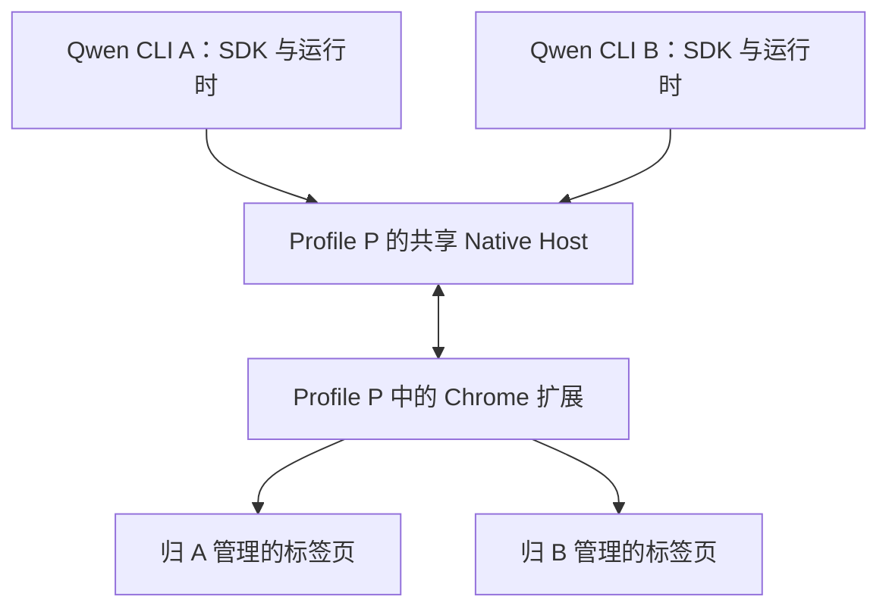

# Browser Use 并发会话

[English](browser-use-concurrent-sessions.md) | [简体中文](browser-use-concurrent-sessions.zh-CN.md)

状态：已实现，验证中，2026-09-18。对应 [#11609](https://github.com/QwenLM/qwen-code/issues/11609)。

## 目标与现状

两个独立的 Qwen 会话应当能够共享一个 Chrome profile，分别操作自己的标签页。例如，会话 A 调查 issue，会话 B 阅读文档。两者使用浏览器已有的登录态，A 结束后 B 继续正常工作。

原有 [Browser Use 设计](browser-use.zh-CN.md) 允许每个 OS 用户运行一个活跃 runtime，各 runtime 监听相同的 socket。[Profile 归属修复](browser-use-profile-ownership.zh-CN.md) 阻止其他 profile 替换当前连接，同时保留单会话边界。#11241 和 #11242 均已合入 `main`。

本文确定进程拓扑、归属边界、身份和生命周期契约。首版实现正在按下文验收要求验证，剩余缺口单独列明。同一标签页的多会话同时控制在本次范围之外。共享 profile 的会话也共享 cookie 和登录态；需要不同浏览器身份时使用不同 profile。

## 进程拓扑

每个已连接的 profile 使用一个由 Chrome 启动的 Native Host，作为共享连接入口。各 Qwen CLI 保留独立的 SDK、Node runtime 和 Playwright 状态，以客户端身份连接该 Host。

Chrome 扩展启动 Host 并持有 Native Messaging 连接。Host 监听多个 CLI 客户端，单个 CLI 退出后继续可用。另一个 profile 使用自己的 Host。共享传输的生命周期由浏览器负责，第一个 CLI 与后续 CLI 拥有相同的客户端地位。

Native Messaging 连接关闭后，Host 退出，断开其客户端，并仅移除自身的 endpoint/发现记录。扩展重连时启动新的 Host。单个 CLI 的关闭不会停止共享 Host。

扩展为本 profile 维持一个活跃的 Host 连接。完成 profile 握手且监听入口就绪后，Host 才发布发现记录。记录同时标识持久化的 profile 和本次 Host 实例。CLI 通过发现记录连接 Host，取代各自竞争绑定用户级 socket 的方式。重连时校验已选 profile 和实例；过期记录不能把现有 handle 引向其他目标。

正常使用时直接选取一个可用的默认 profile，无须强制经过选择器；同时支持显式选择。会话选定后始终绑定该 profile，直到会话关闭，其他可用 profile 不能接管它。已实现的发现与选择约定见下文。

## 职责与身份

| 组件        | 负责的状态和行为                                                            |
| ----------- | --------------------------------------------------------------------------- |
| CLI runtime | 本会话的本地 SDK handle、Playwright 状态和操作                              |
| Native Host | 客户端连接、会话登记、请求与响应关联、事件路由、断线通知                    |
| Chrome 扩展 | 权威标签页归属、各会话的名称/分组/管理标签页/派生窗口、浏览器动作和资源清理 |

扩展是标签页归属的唯一权威。Host 将客户端连接绑定到已登记会话，据此路由请求和响应。标签页事件发给所属会话；profile 生命周期事件发给绑定该 profile 的会话。CLI 的本地视图是本会话状态的缓存，其作用范围限于本会话。

分别维护三个身份：

- `extensionInstanceId`：Chrome profile 的持久化身份，沿用现有 profile 归属设计。
- `browserSessionId`：由 Host 登记、贯穿 bridge 的独立 Browser Use 会话身份。关闭后重新打开会产生新的会话身份。
- CDP `sessionId`：已有的子 target 标识，例如 iframe 的调试会话。

路由与 handle 保留 profile 和会话上下文。Chrome 数字 tab ID 仅在所属 profile 内有意义。Host/连接代次用于区分重启前后的连接生命周期。这些标识提供路由和生命周期隔离；同用户进程继续处于现有信任边界内。保留私有 endpoint 的归属和权限检查。

## 并发与生命周期契约

以下规则定义目标行为；下文验证边界列明首版实现尚未完整满足的要求：

1. **一个 tab 只有一个活跃 owner。** 扩展先预占归属，再执行异步 attach。竞争 claim 返回独立的 Browser Use 归属冲突，保持现有 owner。DevTools/CDP debugger 占用仍使用另一类错误。
2. **不同 tab 独立推进。** 按 tab 协调归属变化、操作和清理；A 的慢操作不能全局阻塞 B 的无关标签页。迟到结果和清理动作仍须匹配原会话及归属代次。
3. **资源按会话管理。** 名称、分组、管理标签页、派生窗口和待完成操作归属于会话。派生窗口继承 opener 的 owner；关闭 opener 后，窗口归属继续保留。其他会话的分组名称和成员保持不变。
4. **关闭只影响本会话。** 主动关闭或丢失 A 的客户端连接时，A 依次进入活跃、关闭中、已关闭状态。停止接收其请求、取消排队工作，并根据下文的退出原因，在有限时间内清理其资源。B 的传输、操作和标签页继续可用。取消单个操作的影响范围限于该操作。
5. **共享故障后显式恢复。** Host、扩展 worker 或 profile 重启后，受影响会话的旧 handle 失效。重新连接同一 profile，核对并处理遗留归属，创建新的会话 handle 后继续。恢复流程禁止自动重放浏览器动作。其他 profile 保持可用。

清理复用会话内的状态管理机制，并区分退出原因：

- **显式关闭 runtime：** 在本会话归属范围内沿用当前关闭/finalize 语义。关闭仍受控的 agent 创建标签页，释放临时接管的用户标签页。已经释放的 deliverable 页面继续保留。
- **崩溃或意外断线：** 保留剩余页面，解除调试连接、释放归属，并解除本会话所管理标签页的分组。Host/worker 恢复时，对遗留会话应用相同的页面保留规则。仅连接丢失不能作为关闭页面的依据。

正常退出应先发送显式的会话关闭请求，再断开连接。未收到该请求的连接结束按意外断线策略处理。

模型思考或用户暂停期间，活跃连接可以保持空闲。扩展等待会话清理最多 250 ms；某个 tab 的清理尚未完成时，保持其不可重新分配，直到确认释放。关闭中会话的迟到回调不能影响后续 owner。重启恢复需要根据实际存活会话核对持久化的分组与归属，也要覆盖旧 Host 来不及发送关闭通知的情况。

归属记录使用 `chrome.storage.session`，使扩展 worker 重启后能够在同一次浏览器运行期间核对遗留标签页。完整 profile 重启存在下文列明的验证缺口。上述归属与隔离规则继续作为验收契约。

## 兼容性与实现边界

本次通过协议 v3 改变连接方向并增加会话路由，在 CLI、Native Host 和扩展之间提供可操作的版本不匹配提示。本文列明具体协议和安装约定。

Host 文件位于每个用户的安装目录中，生命周期独立于单个 CLI 安装目录或 worktree。发起 Browser Use 任务即同意自动完成本机配置。SDK 无需读取 Chrome 扩展配置；若尚未安装 Host、启动入口早于安装记录或不可用、其协议较旧或 Host 修订号较低，SDK 会安装自带的 Host。修订号是一个整数，每当 Host 在协议不变的情况下发生变化时递增；没有它，Host 的修复将永远无法到达已安装过 Host 的用户。协议相同、修订号不低于自带版本且可用的 Host 直接复用：SDK 只补齐缺失的浏览器注册，不会把启动入口改指向自己自带的副本，因此不同 checkout 的 CLI 不会轮流替换它。由更新版 Qwen Code 安装的 Host 永不降级，较旧的 CLI 会提示需要更新 Qwen Code。

协议 3 以 `com.qwen.browser_use` 注册，启动入口为 `~/.qwen/browser-use/host.sh`。已发布的协议 2 CLI 每次首次使用都会重新注册 `com.qwen.browser` 和 `~/.qwen/browser-use/native-host.sh`。若共用该名称，任何较旧的 CLI 都能让 Chrome 重新指向协议 2 的 Host。使用不同名称可使两套注册互不影响；协议 3 的安装器不会读取、改写或删除协议 2 的文件。

安装时将自带的 Host 复制到按内容寻址的 `~/.qwen/browser-use/hosts/<sha256>/native-host.mjs`，随后原子更新启动入口。启动入口记录协议版本、Host 修订号和所选 Node 可执行文件，该 Node 路径须持续可用。已有 Host 文件和进程继续保留；更新在下一次 Host 启动时生效，安装过程不重启运行中的 Host，也不重连扩展。显式的 `native-host-setup.js install` 命令会把同协议的安装切换为调用方 CLI 自带的 Host。活跃会话期间更新的真实 Chrome 验证仍待完成。

第二个普通会话成为受支持的客户端。原有“第二个 runtime 返回 `BROWSER_USE_BUSY`”的回归测试已改为检查并发接入；保留防止替换活跃 endpoint、抢占 profile 的保护。保留单会话 SDK 行为，以及 `tabs.list()`、claim 和 finalize 的会话内契约。

工作主要涉及 Browser Use transport/Native Host 和 Chrome 扩展。浏览器语义操作继续留在现有 CLI runtime。额外引入用户级 broker daemon，或把整个 Playwright runtime 搬进共享进程，会增加本设计无须承担的生命周期与隔离工作。

## 验证与交付

### 实现范围

| 范围                   | 文件                                                                                                                                            |
| ---------------------- | ----------------------------------------------------------------------------------------------------------------------------------------------- |
| Profile 发现与协议     | `packages/browser-use/src/bridge/protocol.ts`、`packages/browser-use/src/bridge/discovery.ts`                                                   |
| 共享 Host 与客户端传输 | `packages/browser-use/src/bridge/native-host/index.ts`、`packages/browser-use/src/bridge/transport/chrome-extension-transport.ts`               |
| 安装与日常连接         | `packages/browser-use/src/native-host-installer.ts`、`packages/browser-use/scripts/native-host-setup.ts`、`packages/browser-use/src/runtime.ts` |
| Profile 选择与会话关闭 | `packages/browser-use/src/playwright/playwright-runtime.ts`、`packages/browser-use/src/playwright/playwright-session.ts`                        |
| 浏览器侧归属与生命周期 | `packages/chrome-extension/src/background/browser-use-bridge.js`、`packages/chrome-extension/public/manifest.json`                              |
| 回归与真实浏览器验证   | Transport、Host、installer、runtime 和扩展旁的测试，以及 `packages/browser-use/scripts/`                                                        |

### 协议与发现约定

协议 v3 由扩展发送带 profile 身份的 `hello` 开始。Host 创建属于本次运行实例的
endpoint，并原子发布私有发现记录，包含 `extensionInstanceId`、`hostInstanceId`、
`protocolVersion`、`extensionProtocolVersion`、`socketPath` 和 `pid`。`QWEN_BROWSER_USE_DISCOVERY_DIR` 用于隔离
测试发现目录，现有 `QWEN_BROWSER_USE_SOCKET_PATH` 保留为指定单个 endpoint 的覆盖项。
CLI 发送 `client.hello` 后，Host 分配 `browserSessionId`，通过 `session.open` 向扩展
注册，并在注册成功后返回会话 hello。注册过程中发生 EOF，仍需在迟到的注册响应后执行清理。

发现记录和 Host socket 存放在每用户私有 socket 基础目录下专用的 `qwen-hosts`
目录中，不会直接写入 `/run/user/<uid>` 这类共享运行时目录。目录名保持简短，因为 macOS 将
socket 路径限制在 103 字节以内，而 `/private/tmp` 下的每用户基础目录最多已占用 40 字节。
两级目录均以 `0700` 创建，
并逐级校验祖先目录。发现过程中，若某个 Host 的 endpoint 无法连接且其进程已不存在，
则删除该记录和 socket；进程仍存活时保留文件。

协议 2 的 CLI 会在该 socket 基础目录中监听 `bridge.sock`，等待它自己的 Native Host，
而协议 3 的扩展不会再启动那个 Host。协议 3 的 Host 对每个新出现、属于当前用户的此类
监听只连接一次并发送自己的 `hello`，旧版 CLI 因此会提示需要更新 Qwen Code，而不是
报告笼统的连接超时。为旧版扩展服务的 Host 不发送该 hello。

请求、响应和事件均携带 `browserSessionId`。Host 将其绑定到 socket，并重映射请求 ID；
客户端无法额外注册会话或借用其他会话路由请求。显式 `session.close` 一旦收到，后续 EOF
仍保留正常关闭原因；直接断开的客户端采用 `disconnected` 清理。这些生命周期操作支持幂等处理。

`browsers.list()` 发现 `chrome:<profileId>` 形式的 profile ID，尚不绑定会话。
`browsers.get('chrome')` 和 `browsers.get('extension')` 保留默认选择；
`browsers.get('chrome:<profileId>')` 在绑定前显式选择 profile。只有当该 profile 的
Host 应答后，runtime 才会绑定到它，因此从未连接成功的选择不会锁定后续选择。已经绑定的
runtime 拒绝切换 profile。

列举和连接都会等待至连接超时：扩展只在 30 秒的 alarm 触发时重新启动缺失的 Host，空的
快照并不代表没有浏览器。列举只返回兼容的 Host。版本不匹配要等到等待结束仍没有兼容 Host
时才报告，因为兼容的 Host 仍可能出现，例如刚升级后另一个 profile 还在运行旧版扩展。
正在关闭的 Host 重置连接时，会在同一等待期内重试。

profile 名称取自 Chrome 自己的 `Local State`。扩展把实例 ID 存在
`chrome.storage.local` 中，Chrome 按 profile 将其保存在
`Local Extension Settings/<扩展 id>` 下，因此 runtime 可将发现的 ID 对应到 profile
目录，并读取其名称和 Chrome 的 `profile.last_used`。存在多个兼容 profile 时，默认
选择优先使用最近使用的 profile，否则选择最新启动的 Host。无法对应的 profile 以实例
ID 作为名称。

每个 tab 的生命周期操作串行执行。CDP 命令独立接纳，保证打开 dialog 的命令可以与
关闭 dialog 的命令并存。只有 `tabs.attach` 和 `tabs.create` 会取得归属：针对本会话
不拥有的 tab 的 CDP 命令会失败，因此与用户取消调试竞争的命令无法重新附加用户刚关闭的
debugger。扩展会丢弃超过 16 MiB bridge 帧上限的 debugger 事件而不转发，因为 Host 遇到
超限帧会退出，从而断开该 profile 的所有会话。先前操作和清理全部结束后才能转移所有权。扩展将会话关闭等待
限制为 250 ms；到达期限时，尚未完成清理的 tab 继续保留所有权，直到确认释放。会话
操作全部结束且不再拥有标签页后，完成的会话记录会被移除；重复关闭请求保持幂等。

终止标签页可以先关闭页面，再由关闭动作终止 renderer 中的工作。Chrome 只有在页面
销毁后才确认移除，“离开此网站？”提示会推迟这一确认，选择“留下”则永远不会确认。扩展
等待五秒；超时后改为释放该 tab，通知 owner 该 tab 已 detach，并让关闭请求失败，
页面因此留给用户，也不会阻塞任何会话。释放标签页时先解除
调试连接，以终止被 dialog 阻塞的工作；先前操作和解除分组完成后，才允许其他会话认领。
辅助 overlay 安装和清理等待 250 ms 后让出执行，避免打开的 dialog 阻止 attach 或
detach；其未完成操作仍保留归属占用。创建标签页拿到 ID 后，在首次等待持久化前登记完整操作，避免迟到 attach
超出该 tab 的归属生命周期。

扩展另行持久化 managed-tab 集合，记录待解除分组的义务。用户取消调试后撤销关闭页面
的权限，同时保留解除分组义务。清理失败时保留归属，每个 tab 最多安排一个一秒后的
重试；失败尝试结束后，原 owner 也可显式重试 release。释放归属已失效的 tab 会直接
成功。用户取消调试会把待执行的关闭重试改为释放。无法为弹出式窗口中的 tab 分组的 Chrome 版本
会拒绝对它的每次解除分组请求，因此释放时只对已在分组中的 tab 解除分组。Chromium 151 可以为这类 tab
分组，释放它们与释放普通 tab 相同。清理仍在执行时，重叠的显式
release/close 请求返回归属冲突。启动恢复失败时，通过既有重连 alarm 再次恢复。

### 派生页面归属

扩展新增 `webNavigation` 权限，监听 `chrome.webNavigation.onCreatedNavigationTarget`，
使用其 `sourceTabId` 确定触发新页面的来源。真实 Chrome 测试发现，后台页面调用
`window.open()` 时，`tabs.onCreated.openerTabId` 可能指向另一个前台标签页；Chrome
还可能自动继承分组，因此仅凭分组无法确定会话归属。

新增 `webNavigation` 不会增加安装警告：Chromium 对包含和不包含该权限的 manifest
给出相同的警告，因为现有 `history` 权限的警告已涵盖浏览历史访问。因此更新不会让已
安装的扩展因等待重新授权而被停用。

导航创建事件须位于活跃、受控来源标签页现有的 2,500 ms 因果输入窗口内。重叠输入延长
截止时间并保留最早起点，使迟到的导航事件仍可归属。扩展同步记录
新 tab 的 owner 和来源，再异步获取标签页、分组并通知所属会话。随后关闭来源标签页
不会丢失派生页面归属。未满足 agent 输入条件的普通用户弹窗保持未认领状态。

### 首版验证边界

- **认领有无人控制的 dialog 的页面：** 释放标签页时，打开的 dialog 保留给用户；在没有
  会话控制时打开的 dialog 属于 Chrome 自身的界面。两者 CDP 都无法应答（Chrome 返回
  没有正在显示的 dialog），被阻塞的 renderer 也让 Playwright 永远无法交付页面。
  因此认领时先 attach，再用一秒探测 renderer；attach 不计入这一秒。无响应时释放标签页
  并返回 `DIALOG_OPEN`，请用户关闭 dialog。探测的其他失败同样会释放标签页。本会话已经
  控制的 tab 不做探测，因此它自己打开的 dialog 不会导致它被释放。有界面 Chrome 实测确认 dialog 保持可见，用户关闭后可以正常认领。该行为早于
  并发会话，单会话的 `main` 同样可以复现。
- **完整 profile 重启：** 真实 Chrome 测试保留了页面，但恢复后的页面位于空标题的灰色
  分组内，`groupId` 也发生变化。浏览器重启会清空 `chrome.storage.session`，原有归属
  记录随之丢失。Chrome tab ID 和 group ID 仅保证在同一次浏览器会话内有效，无法安全地
  使用旧数字 ID 识别恢复的资源。旧 handle 失效和连接回相同 profile 已实现，但恢复分组
  的核对清理尚未满足完整验收要求。该项继续保留为缺口，成功重连或重新 claim 无法代替
  这一验收。
- **安装与更新：** 按内容寻址的安装和复用已有单元测试覆盖。真实 Chrome 活跃会话期间
  更新，以及来自不同 CLI 安装来源的客户端接入，仍缺少 E2E 验证。
- **跨 profile 相同数字 tab ID：** 确定性单元测试覆盖了这一隔离场景。此前真实双 profile
  测试未强制 Chrome 分配相同 tab ID。

因此功能仍处于验证阶段，完整 issue 验收尚待完成。

### 验收

首先证明两个独立的 SDK/Node REPL 进程可以连接同一个真实 Chrome profile：分别创建和操作自己的标签页，接收正确路由的事件，并在另一会话活跃时保持原 handle 可用。首轮包含竞争 claim，以及 B 有进行中操作时正常关闭 A。记录页面结果，同时记录进程与 socket 归属。

完成以下 issue 验收后，才将功能标记为完成：

- 在不同 tab 上并发执行命令和接收事件，`tabs.list()` 和会话分组保持 owner 范围。
- 轮流正常退出和强制终止两个会话，另一会话始终有进行中的工作；验证存活会话、清理完成情况、迟到结果隔离，以及显式关闭和意外断线各自的标签页处理结果。
- 覆盖派生窗口、finalize 和 opener 关闭。
- 重启 profile、扩展 worker 和 Host，验证明确的旧 handle 失效、遗留资源核对，以及恢复到相同 profile。
- 覆盖两个 profile 和两个会话，包括不同 profile 中相同的数字 tab ID；保留 #11242 的 profile 防抢占回归测试。
- 验证单会话行为与混合版本诊断。从不同 CLI 安装目录接入客户端，并在会话活跃时尝试更新 Host；该会话结束前，其 Host 版本、连接和标签页须持续可用。

### 自动化回归范围

持续维护的真实 Chrome 脚本仅保留核心跨进程回归，构建后运行
`node packages/browser-use/scripts/concurrent-sessions.mjs core`。
它复用已有 managed-Chrome 启动器，覆盖并发导航、标签页列表与分组隔离、竞争 claim、
显式移交归属、另一会话导航期间的正常关闭与进程崩溃，以及共享 Host 持续存活。
脚本记录 socket FD 归属；监听状态和客户端数量未纳入断言。

Transport、Host、installer 和扩展单元测试覆盖确定性竞态、协议错误、发现机制、
endpoint 替换与弹窗清理。更广泛的浏览器重启、dialog 和安装场景保留在验证记录中，
从持续维护的 E2E 脚本中移除。上述已知验收缺口继续保留。测试计划分别记录可复现命令、
覆盖范围与历史结果。
