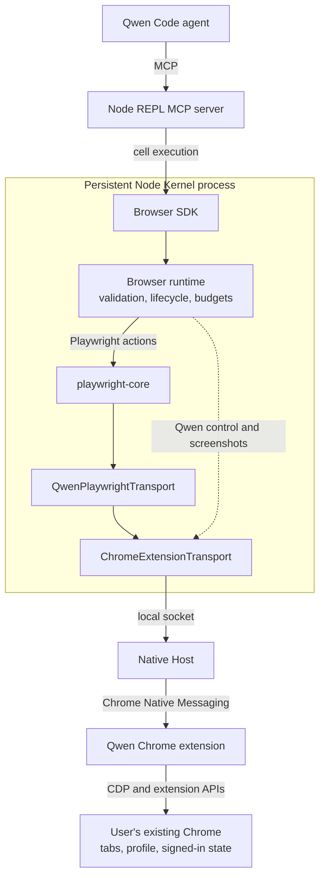

# Browser Use with Playwright Core

[English](browser-use.md) | [简体中文](browser-use.zh-CN.md)

This document describes the original single-session architecture. The
[concurrent-session design](browser-use-concurrent-sessions.md) supersedes its
socket ownership, Native Host installation and session lifecycle decisions.
That implementation is under validation; its remaining acceptance gaps are
recorded in the linked design.

## Goal

Browser Use gives models a structured API for controlling the user's existing
Chrome from Qwen Code.

- The Browser SDK runs as a library inside the persistent Node Kernel exposed
  by the Node REPL MCP server.
- `playwright-core` provides standard browser automation semantics.
- The Qwen Chrome extension and `chrome.debugger` connect the runtime to Chrome.
- The first release supports one active Browser Use session.

## Architecture

Standard browser actions pass through Playwright. Browser control operations
and screenshot acquisition share the same Native Messaging path but bypass
Playwright's browser-level CDP adapter.

`playwright-core@1.62.1` accepts a public custom CDP transport through
`chromium.connectOverCDP(transport)`. Qwen therefore keeps Native Messaging and
does not add a local WebSocket server.

Browser Use ships with Qwen Code as a bundled skill and its runtime resources.
No separate Browser Use runtime package or second Qwen extension is required;
the existing Qwen Chrome extension is reused. The skill's `runtime/` directory
contains the Browser SDK, Native Host, and pinned Playwright dependency. The
skill registers `runtime/node_modules` with the existing Node
REPL and imports `runtime/index.js`; the CLI does not execute browser logic.
The kernel evaluates that import in an isolated realm without Node globals, so
the runtime bundle binds `process` itself at its top through `createRequire`;
the build's load check runs in the main realm and cannot detect a missing
binding, so a kernel-backed test pins it. Source development, transpiled builds, and the published CLI use this same
layout. The generic Node REPL MCP server must be configured, and the Qwen
Chrome extension must be installed in the browser. Bundling does not connect
to Chrome at CLI startup; the SDK connects when first used.

No build step writes this runtime into the source tree. The bundle step copies
it into `dist/bundled/browser-use/runtime` for the shipped CLI, and `npm run
dev` copies the same files next to the source `SKILL.md` (a git-ignored
location) because only development mode reads bundled skills from the source
tree; the normal installation `prepare` hook builds the package those copies
come from. After changing Browser Use sources or dependencies, run
`npm run build --workspace=@qwen-code/browser-use` and start `npm run dev`
again to refresh the development copy. CLI and Core continue to run directly
from TypeScript source. If the runtime is missing, the skill's existing setup
check reports the incomplete runtime when invoked.

Browser Use is available to the model by default and is selected according to
the user's task. Users can disable it through `/skills` or `skills.disabled`,
using the same controls as Computer Use. Disabled skills are excluded
from model discovery and skill invocation. This is the existing generic skill
mechanism used by Computer Use, not a browser permission boundary: disabling
the skill does not unload instructions already in a conversation or disconnect
an existing SDK session.

Native Host registration is native-side product setup, not a Chrome-extension
operation. On macOS and Linux, initiating a Browser Use task opts into automatic
local Host setup. Initialization idempotently installs or reuses the launcher
and manifests for existing browser roots, then the transport discovers a live
Host and validates its extension, protocol and profile handshake. A configured
`QWEN_BROWSER_USE_SOCKET_PATH` or `QWEN_BROWSER_USE_DISCOVERY_DIR` keeps using its
externally managed setup.

Initialization does not read `Secure Preferences` or `Preferences` to detect
an installed extension. Those private configuration files may be unreadable,
and an installation entry cannot establish that the extension is enabled or
connected. Host registration can finish before the extension is available. If
no connection appears, tell the user to open Chrome and install or enable the
extension in the intended profile, then retry; a timeout alone does not prove
that the extension is missing. Protocol mismatches retain their update guidance.
Profile names remain optional enrichment and never gate the connection.

The launcher and Native Messaging registrations persist after Qwen exits. The
installer refuses to overwrite foreign files: a conflicting launcher aborts
initialization, while a conflicting browser manifest is skipped and named in a
warning on stderr. Running
`node <skill-base>/runtime/scripts/native-host-setup.js uninstall` removes files
owned by Browser Use; `status` checks them and `install` explicitly registers
them. A later Browser Use initialization can register the Host again. Only a
missing required Host file is treated as absent; other read failures abort the
operation without overwriting the unreadable file. The Chrome extension opens
the registered host through `connectNative()`.

Initialization acceptance includes unreadable Chrome preference files, setup
before extension availability, actionable disconnected guidance, and preserved
Host file-access errors. Existing extension identity, protocol, profile and
session ownership checks remain required before browser operations.

## Responsibilities

| Component                  | Responsibility                                                                                                  |
| -------------------------- | --------------------------------------------------------------------------------------------------------------- |
| Node REPL                  | Generic process isolation, persistent bindings, cancellation, and output budgets. It contains no browser logic. |
| Browser SDK                | Model-facing task API. Its private adapter enforces the JSON boundary without exposing transport details.       |
| Browser runtime            | Command validation, Qwen tab lifecycle, screenshot acquisition, output budgets, and diagnostics.                |
| `playwright-core`          | Locators, AI accessibility snapshots and refs, frames, navigation waits, actions, and events.                   |
| `QwenPlaywrightTransport`  | Adapts Playwright's browser-level CDP connection to Qwen tab and child-session identifiers.                     |
| `ChromeExtensionTransport` | Owns the local socket and directly exchanges requests and events with the Native Host.                          |
| Native Host                | Minimal framed relay between the local socket and Chrome Native Messaging.                                      |
| Chrome extension           | Chrome permissions, `chrome.debugger` attachment, and CDP forwarding.                                           |

## Browser SDK

The Browser SDK is the model-facing object API. `BrowserAgent` selects a
browser backend, `Browser` provides user-tab discovery and tab management, and
each `Tab` exposes navigation, screenshots, dialogs, and three interaction
styles. The current backend controls the user's Chrome through the Qwen
extension.

The SDK and browser runtime share one internal command contract. SDK objects
translate model calls into validated commands, and the runtime executes those
commands against a Playwright `Page` or the screenshot/control adapters.
Playwright objects, CDP sessions, and transport details are not exposed through
the SDK.

Every SDK object is bound to the runtime session that created it. Closing that
runtime marks its Agent, Browser, Tab, and Locator objects stale; initializing a
new runtime never redirects older objects to the new backend.

The model-facing API structure follows the Codex Browser Use SDK. Its three
tab interaction APIs are kept separate because they represent different ways
for the model to identify a target: semantic page structure, DOM snapshot
nodes, and visual coordinates. This is a grounding distinction rather than an
implementation distinction or an API compatibility layer.

Playwright is the common automation engine behind all three interaction
styles:

| API              | Grounding               | Playwright implementation                                      |
| ---------------- | ----------------------- | -------------------------------------------------------------- |
| `tab.playwright` | Semantic page structure | `Page`, `Locator`, and `FrameLocator`                          |
| `tab.dom_cua`    | Snapshot `node_id`      | AI accessibility snapshot and `aria-ref` locator               |
| `tab.cua`        | Viewport coordinates    | Mouse and keyboard input, with CDP for auxiliary mouse buttons |

`tab.playwright` is used when an element can be described semantically.
`tab.dom_cua` is used when the model identifies an element in a DOM snapshot.
`tab.cua` is used when the target is identified visually in a screenshot.
The extension renders a transient pointer overlay for coordinate mouse input,
but that decoration is best-effort and never delays the input command itself.
Its DOM node is created on mouse input and removed when the pointer expires;
read-only inspection does not create an overlay node. The extension creates
and retains its own node instead of adopting a page element with the same ID.

Browser operations run in the background. New tabs do not replace the user's
active tab, and input actions do not bring Chrome to the foreground. Page focus
emulation keeps background rendering and input active without changing desktop
focus.

Page and locator evaluation accept functions or strings. Functions are invoked
with their documented arguments; strings return their JavaScript `eval`
completion value, including trailing semicolons, comments, and statements.
String evaluation retains the SDK's lexical `arg`, `element`, and `elements`
bindings. A function-valued string is not invoked. Use async function arguments
for `await` and parenthesize object literals in strings. Evaluation deadlines
cover the whole call, including element lookup, and report `OPERATION_TIMEOUT`.
Explicit operation timeouts must be integers from 1 to 120,000 ms; zero is
rejected with `INVALID_ARGUMENT`. Omitted timeouts retain each operation's
default. The delay-only `waitForTimeout` accepts 0 to 120,000 ms, including a
zero-delay no-op. A deadline ends the caller's wait without
terminating JavaScript already running in the page.

Evaluation accepts JSON data: finite numbers, strings, booleans, null, arrays,
and plain records, including readonly TypeScript data. The public
`JsonSerializable` type constrains arguments and results. Non-JSON arguments
are rejected before dispatch; results are checked in the page before
Playwright serializes them. The runtime transfers encoded JSON text so object
keys such as `__proto__` retain their data meaning. Nested undefined values,
non-finite numbers, Date, RegExp, functions, and cycles are rejected rather than
silently converted. An omitted top-level argument remains undefined; a
top-level undefined result becomes null, reflected in the return type. A callback
typed as void may discard an actual return value, so its return type is the
broader JsonSerializable rather than promising null.

Locator plans support at most 32 steps per array and 32 plan levels, counting
the top-level array as level one. The depth limit applies equally to `and`,
`or`, `filter.has`, and `filter.hasNot`. Over-depth plans fail validation with
`INVALID_ARGUMENT` before browser startup; normal locator composition remains
supported.

Input actions and navigation waits have separate deadlines. Locator clicks,
locator key presses, and DOM CUA clicks disable Playwright's implicit
post-action navigation wait. The action deadline covers performing input;
`expectNavigation()` registers its listener before the action and waits for
the requested navigation state with its own deadline. Successful input does
not imply that the destination has loaded. A short, bounded renderer drain
allows queued input handlers to run without waiting for a new page context.

`tab.playwright.domSnapshot()` and `tab.dom_cua.get_visible_dom()` return the
same Playwright AI accessibility snapshot, subject to the existing 20,000-character
budget. Neither filters by role or cursor style: those hints cannot reliably
distinguish clickable elements from static content. The snapshot therefore
includes static text and containers alongside controls. A ref identifies a
node, not a guarantee that clicking it performs an action. DOM CUA actions
resolve these ids through Playwright's `aria-ref` locator. A ref resolves only
while the snapshot that emitted it is current: Playwright restarts ref
numbering on every new document, so a main-frame navigation invalidates the
refs of earlier snapshots. The adapter and its
tests are pinned to the same Playwright version because the snapshot text
format is version-sensitive.

Playwright's public CDP session API supplies coordinate CUA buttons 4 (back)
and 5 (forward), which the higher-level Playwright mouse API does not expose.
Snapshot truncation, screenshot encoding and budgets, stale-session detection,
and the JSON transport envelope remain runtime implementation details rather
than model-facing options.

Viewport screenshots return JPEG bytes, a MIME type, and metadata carrying the
original image dimensions, viewport, device pixel ratio, and CSS-pixel coordinate
space so visual coordinates remain usable when a model client resizes the
preview. The skill passes the complete screenshot to `nodeRepl.emitImage()`.
Metadata travels on the image event and is returned immediately before each
retained image, independently of the ordinary text output budget. Rejected or
omitted images do not leave metadata behind. There is no metadata-specific size
cap; the existing protocol-frame and client output limits still apply.
Bundling the Node REPL MCP server with Qwen Code is deferred to a follow-up.
This protocol support first ships in `@qwen-code/node-repl-mcp` 0.1.6 and is
absent from the published 0.1.2 through 0.1.5 packages, so the Browser Use
skill pins that version instead of `latest`.
Viewport screenshots are limited by their encoded byte size rather than rejected
from viewport dimensions alone. Explicit clips and full-page captures retain a
pixel budget because their dimensions are caller-controlled or potentially
unbounded.
The device pixel ratio probed from page script is trusted only within the range a real Chrome window can report; when a capture's pixels disagree with the requested CSS region, the runtime derives the real ratio from Chrome's own output and re-captures once.

Screenshot acquisition follows the Codex Browser Use strategy independently of
Playwright's screenshot preparation. A short, bounded rendering synchronization
lets pending paint catch up before capture. Normal viewport capture requests a
fresh CDP screencast frame with a two-second frame deadline, then falls back to
`Page.captureScreenshot` with a five-second command timeout. Clips and full-page
captures use the latter directly. Frames predating the request are discarded;
captures on each tab are serialized and their event listeners and screencasts
are cleaned up. The runtime owns these events so Playwright does not acknowledge
the same frames. Images use JPEG quality 80, retain CSS-pixel coordinates, and
never require activating the tab or bringing Chrome to the foreground. An
individual screenshot timeout does not detach the browser session.

Locator `downloadMedia()` triggers a media or file-link download, while
`waitForEvent("download")` provides synchronization for downloads triggered
by other page actions. The returned download object is opaque and does not
expose the host filesystem path.

`downloadMedia()` is a Qwen adapter because Playwright has no equivalent
locator method. Qwen resolves the element through a Playwright locator, briefly
creates a page-local download link for the resolved media URL, clicks it, and
removes it immediately. Callers synchronize through Playwright's `download`
event. The media bytes are read from the page origin, so a cross-origin
resource whose server sends no CORS headers cannot be downloaded this way:
the call fails with an error naming that cause rather than navigating the
claimed tab or saving an empty file. Downloading such resources with the
user's cookies needs a browser-side download path and is follow-up work.

JavaScript dialogs use type-specific actions: alerts and before-unload dialogs
can be dismissed, confirms can be accepted or dismissed, and prompts require
text when accepted. The SDK also exposes the dialog message and prompt default
value.

## Transport

`QwenPlaywrightTransport` implements Playwright's `ConnectOverCDPTransport` and
handles only the browser-level adaptation Playwright requires:

- browser discovery and version responses;
- registering Qwen-controlled tabs as attached Playwright targets and binding
  each Playwright `Page` by its exact CDP target id;
- Playwright session IDs mapped to Chrome tabs and child CDP sessions,
  including the explicit target sessions created by Playwright's public
  `newCDPSession(page)` API;
- popup, worker, iframe, and out-of-process iframe lifecycle.

Unknown browser-level commands fail as individual CDP requests; they do not
close the transport or get forwarded to an arbitrary tab.
Malformed target attachment data is a transport protocol violation: it closes
the Playwright connection and makes all objects from that session stale.

Page-level `Page`, `Runtime`, `DOM`, `Accessibility`, `Input`, `Network`,
`Fetch`, `Storage`, and `Emulation` commands and events pass through without
Qwen reimplementing them. Browser diagnostics retain a bounded in-memory view
of Playwright console events. HAR export is not included until a
product caller requires it.

Chrome reports downloads from an extension debugger target as `Page` events,
while Playwright consumes the corresponding browser-level events. The
transport translates only those event names and preserves their payloads; it
does not maintain a separate download state machine. Tab registration leaves
Chrome's download policy unchanged: the extension cannot call
`Page.setDownloadBehavior`, and the page events arrive after Playwright enables
the Page domain without that command.

The Qwen control plane retains operations that are not CDP, including
`openTabs`, `claimTab`, `session.name`, and `history.query`.
History defaults to Chrome's last 24 hours when `from` is omitted; an explicit
`from` includes older visits without requiring `to`.

Native Host messages sent to Chrome are limited to 1 MiB. Larger
backend-to-extension messages are split into bounded protocol chunks and
reassembled by the extension before dispatch. Extension responses must fit the
16 MiB bridge frame limit, measured as serialized UTF-8 bytes. An oversized
operation result returns a bounded `OPERATION_FAILED` response so the Native
Host and the browser session remain available for subsequent requests.

## Session model

The Node Kernel directly owns the local Chrome extension transport:

- one Browser Use session may be active for the current OS user;
- one session may control multiple tabs;
- a second session fails with `BROWSER_USE_BUSY`;
- closing the session closes still-controlled agent-created tabs, including
  handoffs, releases claimed tabs, and then releases the local socket;
- a transport disconnect invalidates the current Playwright connection;
- tab-scoped objects from the disconnected connection fail with
  `STALE_BROWSER_SESSION` and are never silently rebound.
- closing and reinitializing Browser Use creates a new SDK object generation;
  handles retained from the closed generation remain stale.

On Unix, both endpoints prefer an existing private, user-owned
`/run/user/<uid>/bridge.sock`; otherwise they use
`/tmp/qwen-browser-use-<uid>/bridge.sock` (`/private/tmp` on macOS). The
backend creates a user-owned directory with mode `0700` and a socket with mode
`0600`. Both endpoints reject unsafe ownership, permissions, and replaceable
ancestors; the Native Host also rejects socket symlinks before forwarding any
traffic. An explicit socket override must use the same private-directory
boundary. Same-user processes remain inside the trust boundary.

When no backend is listening, the Native Host exits. The extension schedules
one retry using a 30-second Chrome alarm, which survives worker suspension;
it does not run a one-second retry loop or rewrite empty session state on
failed discovery. Initial backend discovery can wait up to 35 seconds, with
the normal request execution timeout starting after connection. Browser
listing and selection both allow this discovery window; explicit short
transport request timeouts still cap discovery.
The active `runtime.connectNative()` port keeps the worker alive on Chrome 105
and later, and an active `chrome.debugger` session provides an additional
keepalive on Chrome 118 and later. This differs from the separate `/cdp`
WebSocket bridge and follows Chrome's documented extension service-worker
lifecycle. A real-Chrome session must remain usable after more than 60 seconds
without Browser Use traffic.

When the backend socket disappears after connecting, the Native Host exits and
Chrome closes its Native Messaging port. The extension handles that port
disconnect by detaching the session's controlled tabs, removing Browser Use
overlays, clearing ownership and derived-tab state, ungrouping managed tabs
without closing them, and scheduling Native Host discovery for a future backend.
Debugger attach and detach operations are serialized per tab. A successful
release waits for Chrome to complete detach; a timeout in disconnect cleanup
does not discard an unfinished per-tab operation. If new-tab initialization
fails, the extension removes that newly created tab. Explicit user cancellation
of debugging releases ownership and the derived relationship, persists that
state, and ungroups the tab on a best-effort basis.

At the end of a browser turn, `tabs.finalize()` treats `keep` as the complete
set for that call: it closes unlisted agent-created tabs and releases unlisted
claimed tabs. Deliverable tabs remain open but are released; handoff tabs
remain open and controlled until the next finalization or runtime close. A
handoff that is still needed must be included again in the next turn. An
agent-created popup keeps that ownership if its opener closes before
finalization. The extension is the source of browser-side ownership, while the
runtime keeps the corresponding session projection; agent-created ownership
takes precedence if a derived tab is observed through both paths.
Re-registering a crashed Chrome tab replaces its stale runtime entry and
preserves that ownership. Cleanup forgets a tab already removed in Chrome,
while other close or release failures retain the entry for retry.

`tabs.finalize()` validates the complete `keep` set before closing anything. An
unknown, stale, or duplicate entry aborts finalization so a malformed keep list
cannot accidentally close a page the model intended to preserve.
Derived-tab synchronization attempts each attachment independently. If one
attachment or the discovery query fails, finalization still cleans up the other
known tabs according to their dispositions, then reports the failure. A failed
attachment does not authorize closing an unregistered tab.

The first release adds no separate Browser Use authorization or process
authentication layer.

The `qwen serve` `/cdp` bridge is not part of Browser Use. It is a serve-mode
tunnel for an external automation adapter and the active Chrome tab. Browser
Use instead operates in a normal Qwen Code session and provides multi-tab
discovery and Qwen-specific control operations that are not CDP.

The two paths are independent debugger clients and are mutually exclusive per
tab. Browser Use fails clearly when `/cdp`, DevTools, or another debugger
already owns a tab.

## Playwright code reuse

The implementation adapts the following Apache-2.0 Playwright sources from
revision
`350d24a344b07543fdc4014339a7871fd1c1b227`:

| Upstream file     | Qwen use                                                                                    |
| ----------------- | ------------------------------------------------------------------------------------------- |
| `browserModel.ts` | Copy and adapt target discovery and browser-level CDP behavior.                             |
| `cdpRelayV2.ts`   | Fold its dispatch/event logic into `QwenPlaywrightTransport`; omit its WebSocket handshake. |

The Native Messaging protocol and extension relay also carry Qwen-only
operations such as tab discovery and History.

The adapted code uses only public Playwright APIs, conforms to Qwen's strict
TypeScript rules, and fails closed on attachment errors. Copyright headers, the
Playwright source revision, and NOTICE are preserved in the Browser Use
package.

The Browser Use package pins `playwright-core@1.62.1` independently because the
custom CDP transport API and the pairing between
`ariaSnapshot({ mode: "ai" })` output and `aria-ref` locators are
version-sensitive. Every Playwright upgrade must pass a real Chrome smoke test
that takes an AI snapshot and acts on one of its returned refs. Existing
workspace consumers remain on their current Playwright versions; this feature
does not require a repository-wide upgrade.

Managed smoke scripts use Chromium or Chrome for Testing. Automatic discovery
excludes branded Google Chrome, and an explicit Google Chrome 137+ executable
is rejected because it cannot load the unpacked extension. Normal completion,
SIGINT, and SIGTERM stop the managed browser process group and remove its
temporary profile before the script exits.

The managed preflight validates screenshot MIME type and decoded JPEG clip
dimensions. The SauceDemo smoke checks checkout state and prices; source-code
mentions of input or finalization methods are not evidence that those actions
ran, so its result does not claim to verify trusted input or tab finalization.
Its independent completion check starts the transport, allows the full
35-second discovery window, and retries only `TAB_DEBUGGER_CONFLICT` while the
previous session releases its debugger attachment.

## Product decisions

For the first release:

- installing the Qwen Chrome extension authorizes Browser Use;
- first use on macOS or Linux automatically registers the Native Host without
  a separate prompt;
- Browser Use may enumerate and claim top-level HTTP(S) tabs by default, and
  `tab.goto` navigates claimed tabs to http(s) URLs only;
- History is declared with the other required extension permissions; there is
  no Browser Use permission-management UI;
- there is no Browser Use-specific origin allowlist, upload-root allowlist, or
  snapshot redaction in this release;
- the existing Qwen toolbar action and side panel remain;
- the model can discover Browser Use by default; users can disable it through
  the existing `/skills` controls.

## Current boundaries and future work

- **Sessions:** One Browser Use session may be active per OS user, and that
  session may control multiple tabs. Future support for concurrent sessions
  must isolate tab ownership, event routing, cleanup, and reconnect behavior.
- **Turn cleanup:** Finalization is an explicit final browser action. Closing
  the runtime provides a fallback, but interrupting a model turn does not close
  the persistent runtime; still-controlled tabs remain managed until a later
  finalization or runtime close. A transport disconnect releases them without
  closing their pages. A future Qwen turn-lifecycle hook should invoke
  finalization independently of model behavior.
- **Browser backends:** The Qwen extension currently connects the SDK to
  Chrome. Other browser families or an in-app browser should be added together
  with capability discovery when products need them.
- **Product control:** Authenticate the local connection. Skill enablement
  controls availability, not direct SDK access or active browser sessions.
- **History:** Make Chrome History optional through a Qwen-owned grant and
  revoke flow outside the side panel.
- **Platform and optional APIs:** Native Host installation currently supports
  macOS and Linux. Windows support and optional APIs such as clipboard, page
  assets, HAR, and read-only evaluate should be introduced independently when
  a product workflow requires them.

## Dialog and navigation lifetimes

A dialog handle identifies the dialog instance returned by `getJsDialog`.
Accepting or dismissing an expired handle fails with `NOT_FOUND` and must not
act on a replacement dialog. Dialog ids are internal to the SDK protocol;
the public handle retains only its supported actions. Before-unload dialogs
support both accepting the navigation and dismissing it.

Chrome dialog-close events clear the runtime cache, including user actions
outside the SDK. Playwright hands a dialog over on a later turn than the
bridge reports its CDP events, so the runtime traces each tab's dialog
openings and closes in bridge order and drops a delivered dialog the bridge
has already reported closed; a close with no traced opening (a dialog open
before the tab was attached) is never charged to a later dialog. An opening
Playwright never delivers is retired once its delivery turn has passed, so it
cannot swallow a later dialog's charge. A dialog already open when the tab is
claimed emits no opening event at all; the runtime probes the renderer at
attach and, when the probe goes unanswered, gates the tab with `DIALOG_OPEN`,
with `getJsDialog` reporting it under a stable handle whose accept and dismiss
run over CDP. An
`expectNavigation` waiter
is released when either its action or its wait fails, including rejection by
the dialog gate before the wait implementation runs.

## Input completion

Locator fill delegates to Playwright, including its native input/change event
behavior. The runtime does not add a second change event after a successful
fill. Text-like inputs therefore commit change on blur; date-like inputs use
Playwright's existing change dispatch.

The typing diagnostic retains the original DOM element and its value in a
page-side handle. It reports `INPUT_BLOCKED` only while that editable element
remains connected and focused with the same value. Navigation, replacement,
or a non-editable keyboard target cannot turn successful input into this
error. The handle is disposed after both successful and failed input.

Modifier cleanup attempts to release every attempted key in reverse order even
after a failed keydown or keyup, and cleanup failures are discarded. Cleanup
never rewrites a completed action into a failure; only the action's own error
propagates.

## Attachment and session shutdown

BrowserModel owns Chrome debugger attachments, including attachments still in
flight. Attachment and release are serialized per provider tab; close rejects
new attachments and waits for admitted work before releasing owned tabs.
Explicit CDP session detach emits the parent-scoped target-detached event that
Playwright uses to dispose its session listeners.

Stopping the runtime unsubscribes session listeners, drains tab registration,
finalizes controlled tabs, and awaits transport cleanup before stopping the
bridge. Shutdown closes extension-reported derived tabs without admitting new
debugger attachments. Page close and crash release through the transport that
registered the page; a crashed tab retains its ownership until it is closed or
finalized. Reconnecting waits for the previous transport cleanup so old releases
cannot detach newly claimed tabs. A request cannot implicitly restart a stopped
bridge.

The adapter supplies a stable default-context id when CDP omits its optional
browserContextId, preserving supplied ids and rejecting malformed values
before Playwright receives the target. Direct message callback failures close
the transport and release its attachments.

## Contract validation

Regression checks must reject zero operation timeouts while preserving zero
delays, omitted defaults, and the 120,000 ms upper bound. Locator checks cover
all four recursive edges, the depth boundary, flat 32-step plans, and ordinary
composition in Chrome. Evaluation checks cover argument rejection, page-side
result rejection for all three APIs, actual TypeScript consumers, valid JSON
controls, repeated references, and top-level undefined normalization. Removing
the corresponding guard must make the regression checks fail.
