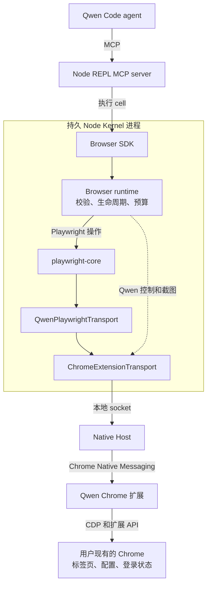

# 基于 Playwright Core 的 Browser Use

[English](browser-use.md) | [简体中文](browser-use.zh-CN.md)

本文描述原有的单会话架构。[并发会话设计](browser-use-concurrent-sessions.zh-CN.md)
更新了其中的 socket 归属、Native Host 安装和会话生命周期决策。该实现正在验证中，
剩余验收缺口见链接文档。

## 目标

Browser Use 为模型提供结构化 API，使其能够从 Qwen Code 控制用户现有的 Chrome。

- Browser SDK 作为库运行在 Node REPL MCP server 暴露的持久 Node Kernel 内。
- `playwright-core` 提供标准浏览器自动化语义。
- Qwen Chrome 扩展和 `chrome.debugger` 将运行时连接到 Chrome。
- 首个版本支持一个活跃的 Browser Use 会话。

## 架构

标准浏览器操作经过 Playwright。浏览器控制操作和截图获取共用同一条 Native Messaging 路径，但绕过 Playwright 的浏览器级 CDP 适配器。

`playwright-core@1.62.1` 通过 `chromium.connectOverCDP(transport)` 接受公共自定义 CDP transport。因此 Qwen 保留 Native Messaging，不添加本地 WebSocket server。

Browser Use 以内置 skill 及其运行时资源随 Qwen Code 一起发布，无需单独安装 Browser Use 运行时包或第二个 Qwen 扩展，复用现有的 Qwen Chrome 扩展。Skill 的 `runtime/` 目录包含 Browser SDK、Native Host 和固定版本的 Playwright 依赖。Skill 直接在现有 Node REPL 中导入 `runtime/index.js`，无需注册任何模块目录；CLI 本身不执行浏览器逻辑。kernel 在没有 Node 全局对象的隔离 realm 中执行该导入，且只从已注册的模块根和工作目录的 `node_modules` 解析裸包名，因此运行时 bundle 通过 `createRequire` 自行绑定 `process` 并加载固定版本的 `playwright-core`，后者从 bundle 自身所在位置解析。构建时的加载检查运行在主 realm，无法发现这两类问题，故由一个基于 kernel 的测试固定该行为。源码开发、转译构建和发布的 CLI 使用同一布局。仍需配置通用 Node REPL MCP server，并在浏览器安装 Qwen Chrome 扩展。内置资源不会在 CLI 启动时连接 Chrome；SDK 在首次使用时才连接。

没有任何构建步骤会把该运行时写进源码树：打包步骤把它复制到 `dist/bundled/browser-use/runtime` 供发布的 CLI 使用；`npm run dev` 把同样的文件复制到源码 `SKILL.md` 旁边（git 忽略的位置），因为只有开发模式会从源码树读取内置 skill；正常安装的 `prepare` hook 负责构建这些副本的来源包。修改 Browser Use 源码或依赖后，运行 `npm run build --workspace=@qwen-code/browser-use` 并重新启动 `npm run dev` 以刷新开发副本；CLI 和 Core 仍直接运行 TypeScript 源码。若运行时入口缺失，导入会失败，skill 会让模型停止并报告运行时不完整；若找不到固定版本的 `playwright-core`，SDK 会自行报告运行时不完整。Node 的查找会延伸到上层目录，因此 SDK 会校验找到的副本版本：其他版本按运行时不完整拒绝加载；固定版本的副本则照常使用，因为其代码完全相同。

Browser Use 默认对模型可用，由模型根据用户任务选择。用户可通过 `/skills` 或 `skills.disabled` 禁用，使用与 Computer Use 相同的控制方式。禁用的 skill 不参与模型发现和 skill 调用。这是 Computer Use 也使用的通用 skill 机制，不是浏览器权限边界：禁用 skill 不会移除已有对话中的指令，也不会断开现有 SDK 会话。

Native Host 注册属于本机产品初始化，不由 Chrome 扩展执行。在 macOS 和 Linux 上，发起 Browser Use 任务即同意自动完成本机 Host 配置。初始化为已存在的浏览器根目录幂等安装或复用 launcher 和 manifest，然后由 transport 发现存活的 Host，并验证扩展、协议和 profile 握手。配置了 `QWEN_BROWSER_USE_SOCKET_PATH` 或 `QWEN_BROWSER_USE_DISCOVERY_DIR` 时继续使用外部管理的安装。

初始化不通过读取 `Secure Preferences` 或 `Preferences` 检测扩展安装。这些私有配置文件可能无法读取，安装记录也无法证明扩展已启用或连接。Host 注册可以在扩展可用之前完成。若始终没有连接，应提示用户打开 Chrome，在目标 profile 中安装或启用扩展后重试；仅凭超时无法断定扩展未安装。协议不匹配仍提供更新指引。Profile 名称属于可选补充信息，不作为连接前提。

Qwen 退出后，launcher 和 Native Messaging 注册仍然保留。安装器拒绝覆盖其他程序的文件：launcher 冲突会终止初始化，浏览器 manifest 冲突则跳过该 manifest，并在 stderr 上给出指明该文件的警告。运行 `node <skill-base>/runtime/scripts/native-host-setup.js uninstall` 可删除 Browser Use 拥有的文件；`status` 检查这些文件，`install` 显式注册。后续 Browser Use 初始化仍可重新注册 Host。只有必需的 Host 文件不存在才视为缺失；其他读取失败会终止操作，不覆盖无法读取的文件。Chrome 扩展通过 `connectNative()` 打开已注册的 host。

初始化验收覆盖 Chrome 配置文件不可读、扩展尚不可用时完成配置、明确的未连接指引，以及保留 Host 文件访问错误。执行浏览器操作前仍必须通过已有的扩展身份、协议、profile 和 session 归属检查。

## 职责

| 组件                       | 职责                                                                  |
| -------------------------- | --------------------------------------------------------------------- |
| Node REPL                  | 通用进程隔离、持久绑定、取消和输出预算，不包含浏览器逻辑。            |
| Browser SDK                | 面向模型的任务 API；私有适配器执行 JSON 边界约束，不暴露传输细节。    |
| Browser runtime            | 命令校验、Qwen 标签页生命周期、截图获取、输出预算和诊断。             |
| `playwright-core`          | Locator、AI 无障碍快照和 ref、frame、导航等待、操作和事件。           |
| `QwenPlaywrightTransport`  | 将 Playwright 浏览器级 CDP 连接适配到 Qwen 标签页和子会话标识。       |
| `ChromeExtensionTransport` | 拥有本地 socket，直接与 Native Host 交换请求和事件。                  |
| Native Host                | 在本地 socket 和 Chrome Native Messaging 之间转发带帧消息的最小中继。 |
| Chrome 扩展                | Chrome 权限、`chrome.debugger` 附加和 CDP 转发。                      |

## Browser SDK

Browser SDK 是面向模型的对象 API。`BrowserAgent` 选择浏览器后端，`Browser` 提供用户标签页发现和管理，每个 `Tab` 暴露导航、截图、对话框以及三种交互方式。当前后端通过 Qwen 扩展控制用户的 Chrome。

SDK 与浏览器运行时共用内部命令契约。SDK 对象将模型调用转换为经过校验的命令，运行时通过 Playwright `Page` 或截图／控制适配器执行这些命令。SDK 不暴露 Playwright 对象、CDP 会话或传输细节。

每个 SDK 对象绑定到创建它的运行时会话。关闭运行时会使其 Agent、Browser、Tab 和 Locator 对象失效；初始化新运行时不会把旧对象重新指向新后端。

面向模型的 API 结构参考 Codex Browser Use SDK。三种标签页交互 API 分别对应模型识别目标的三种依据：语义页面结构、DOM 快照节点和视觉坐标。这种划分基于目标定位依据，而非实现方式，也不是 API 兼容层。

三种交互方式共用 Playwright 自动化引擎：

| API              | 定位依据       | Playwright 实现                      |
| ---------------- | -------------- | ------------------------------------ |
| `tab.playwright` | 语义页面结构   | `Page`、`Locator` 和 `FrameLocator`  |
| `tab.dom_cua`    | 快照 `node_id` | AI 无障碍快照和 `aria-ref` locator   |
| `tab.cua`        | 视口坐标       | 鼠标和键盘输入，辅助鼠标按钮使用 CDP |

可以用语义描述元素时使用 `tab.playwright`；模型从 DOM 快照识别目标时使用 `tab.dom_cua`；从截图视觉定位目标时使用 `tab.cua`。

扩展为坐标鼠标输入显示短暂的指针 overlay，但该装饰仅尽力提供，绝不延迟输入命令本身。其 DOM 节点在鼠标输入时创建，指针到期后移除；只读检查不会创建 overlay 节点。扩展创建并持有自己的节点，不会接管页面中同 ID 的元素。

浏览器操作在后台运行。新标签页不会替换用户当前的活跃标签页，输入操作也不会将 Chrome 置于前台。页面焦点模拟使后台渲染和输入保持活跃，而不改变桌面焦点。

页面和 locator 的 evaluation 接受函数或字符串。函数按文档规定的参数调用；字符串返回 JavaScript `eval` 的完成值，支持尾部分号、注释和语句。字符串求值保留 SDK 的词法绑定 `arg`、`element` 和 `elements`。值为函数的字符串不会被调用。需要 `await` 时使用异步函数参数，在字符串中使用对象字面量时加括号。Evaluation 的超时覆盖整个调用，包括元素查找，并返回 `OPERATION_TIMEOUT`。显式操作超时必须为 1 到 120,000 ms 的整数；零值以 `INVALID_ARGUMENT` 拒绝。省略超时时保留各操作的默认值。仅用于延时的 `waitForTimeout` 接受 0 到 120,000 ms，其中零表示不等待。超时结束调用方的等待，不会终止已在页面运行的 JavaScript。

Evaluation 接受 JSON 数据：有限数、字符串、布尔值、null、数组和普通记录，包括 TypeScript readonly 数据。公开的 `JsonSerializable` 类型约束参数和结果。非 JSON 参数在 dispatch 前拒绝；结果在页面内、Playwright 序列化之前校验。运行时传输编码后的 JSON 文本，使 `__proto__` 等对象键保留数据含义。嵌套 undefined、非有限数、Date、RegExp、函数和循环引用会被拒绝，不会静默转换。省略的顶层参数保持 undefined；顶层 undefined 结果转换为 null，返回类型也反映这一行为。类型为 void 的回调可能只是丢弃了实际返回值，因此其返回类型使用更宽的 JsonSerializable，不承诺一定为 null。

Locator plan 的每个数组最多包含 32 步，最多嵌套 32 层，顶层数组计为第一层。深度上限同样适用于 `and`、`or`、`filter.has` 和 `filter.hasNot`。超过深度的 plan 在浏览器启动前以 `INVALID_ARGUMENT` 校验失败；正常 locator 组合仍受支持。

输入操作与导航等待使用独立超时。Locator 点击、按键和 DOM CUA 点击关闭 Playwright 隐式的操作后导航等待。操作超时覆盖输入执行；`expectNavigation()` 在操作前注册监听器，并使用自己的超时等待请求的导航状态。输入成功不代表目标页面已加载。短暂且有上限的 renderer drain 允许排队的输入处理器运行，而不等待新的页面上下文。

`tab.playwright.domSnapshot()` 和 `tab.dom_cua.get_visible_dom()` 返回相同的 Playwright AI 无障碍快照，仍受现有 20,000 字符预算约束。两者都不按角色或光标样式过滤，因为这些提示无法可靠地区分可点击元素与静态内容。因此快照除控件外也包含静态文本和容器。ref 用于标识节点，并不保证点击该节点会产生动作。DOM CUA 操作通过 Playwright 的 `aria-ref` locator 解析这些 id。ref 仅在签发它的快照仍然有效时可解析：Playwright 在每个新文档上重新从 e1 开始编号 ref，因此主 frame 导航会使更早快照的 ref 失效。由于快照文本格式与版本有关，适配器及其测试固定使用同一 Playwright 版本。

Playwright 公共 CDP session API 提供坐标 CUA 的按钮 4（后退）和 5（前进）；较高层的 Playwright mouse API 不暴露它们。快照截断、截图编码和预算、会话失效检测及 JSON 传输封装属于运行时实现细节，不作为面向模型的选项。

视口截图返回 JPEG 字节、MIME 类型及元数据。元数据包含原始图像尺寸、视口、设备像素比和 CSS 像素坐标空间，使模型客户端缩放预览后视觉坐标仍可用。Skill 将完整截图传给 `nodeRepl.emitImage()`。元数据随图像事件传递，紧邻每张保留图像之前返回，独立于普通文本输出预算。被拒绝或省略的图像不会遗留元数据。没有元数据专用大小上限；已有协议帧和客户端输出限制仍然适用。把 Node REPL MCP server 随 Qwen Code 一起打包留待后续工作。该协议支持自 `@qwen-code/node-repl-mcp` 0.1.6 起首次发布；已发布的 0.1.2 至 0.1.5 包不具备该支持，因此 Browser Use skill 固定使用该版本而非 `latest`。视口截图根据编码字节数限制，不会仅因视口尺寸而拒绝。显式 clip 和整页截图保留像素预算，因为其尺寸由调用方控制或可能无界。从页面脚本探测到的设备像素比只在真实 Chrome 窗口可能报告的范围内被信任；当截图像素与请求的 CSS 区域不一致时，运行时根据 Chrome 自身的输出推算真实像素比并重拍一次。

截图获取采用 Codex Browser Use 策略，独立于 Playwright 的截图准备。短暂且有上限的渲染同步让待处理绘制在截图前完成。普通视口截图请求新的 CDP screencast 帧，帧期限为两秒，然后回退到命令超时为五秒的 `Page.captureScreenshot`。Clip 和整页截图直接使用后者。请求之前的旧帧会被丢弃；每个标签页的截图串行执行，事件监听器和 screencast 均会清理。运行时拥有这些事件，Playwright 不会重复确认同一帧。图像采用 JPEG quality 80，保留 CSS 像素坐标，不需要激活标签页或将 Chrome 置于前台。单次截图超时不会断开浏览器会话。

Locator `downloadMedia()` 触发媒体或文件链接下载；`waitForEvent("download")` 用于同步其他页面操作触发的下载。返回的下载对象不透明，不暴露宿主文件系统路径。

`downloadMedia()` 是 Qwen 适配功能，因为 Playwright 没有等价 locator 方法。Qwen 通过 Playwright locator 解析元素，为媒体 URL 临时创建页面内下载链接，点击后立即删除。调用方通过 Playwright `download` 事件同步。媒体字节在页面源内读取，因此服务端未返回 CORS 头的跨源资源无法用这种方式下载：调用会以指明该原因的错误失败，而不会让受控标签页跳转或保存空文件。带用户 cookie 下载此类资源需要浏览器侧的下载路径，属于后续工作。

JavaScript 对话框使用类型相关操作：alert 和 before-unload 可以 dismiss，confirm 可以 accept 或 dismiss，prompt 在 accept 时需要文本。SDK 同时暴露对话框消息和 prompt 默认值。

## 传输

`QwenPlaywrightTransport` 实现 Playwright 的 `ConnectOverCDPTransport`，仅处理 Playwright 所需的浏览器级适配：

- 浏览器发现和版本响应；
- 将 Qwen 控制的标签页注册为已附加的 Playwright target，并通过精确 CDP target id 绑定每个 Playwright `Page`；
- 将 Playwright session ID 映射到 Chrome 标签页和子 CDP 会话，包括公共 `newCDPSession(page)` API 创建的显式 target session；
- Popup、worker、iframe 和跨进程 iframe 的生命周期。

未知的浏览器级命令作为单个 CDP 请求失败，不会关闭 transport，也不会转发给任意标签页。格式错误的 target attachment 数据属于传输协议违规：会关闭 Playwright 连接并使该会话的所有对象失效。

页面级 `Page`、`Runtime`、`DOM`、`Accessibility`、`Input`、`Network`、`Fetch`、`Storage` 和 `Emulation` 命令及事件直接转发，Qwen 不重新实现它们。浏览器诊断保留有上限的 Playwright console 事件内存视图。在产品调用方提出需求前，不包含 HAR 导出。

Chrome 将扩展 debugger target 的下载报告为 `Page` 事件，而 Playwright 消费对应的浏览器级事件。Transport 仅翻译这些事件名并保留载荷，不维护单独的下载状态机。注册标签页时保留 Chrome 的下载策略：扩展无法调用 `Page.setDownloadBehavior`，而 Playwright 启用 Page 域后，无需该命令即可收到页面下载事件。

Qwen 控制面保留非 CDP 操作，包括 `openTabs`、`claimTab`、`session.name` 和 `history.query`。History 省略 `from` 时沿用 Chrome 最近 24 小时的默认范围；显式传入 `from` 可查询更早的访问记录，无需同时指定 `to`。

Native Host 发往 Chrome 的消息上限为 1 MiB。较大的后端到扩展消息拆分为有界协议分块，由扩展在 dispatch 前重新组装。扩展响应必须满足 16 MiB 的 bridge 帧限制，按序列化后的 UTF-8 字节数计算。超大的操作结果返回有界的 `OPERATION_FAILED` 响应，Native Host 和浏览器会话仍可处理后续请求。

## 会话模型

Node Kernel 直接拥有本地 Chrome 扩展 transport：

- 每个操作系统用户最多有一个活跃的 Browser Use 会话；
- 一个会话可以控制多个标签页；
- 第二个会话以 `BROWSER_USE_BUSY` 失败；
- 关闭会话会关闭仍受控的 agent 创建标签页（包括 handoff），释放认领的标签页，然后释放本地 socket；
- Transport 断开会使当前 Playwright 连接失效；
- 断开连接的标签页对象以 `STALE_BROWSER_SESSION` 失败，绝不静默重绑；
- 关闭并重新初始化 Browser Use 会创建新一代 SDK 对象，旧一代保留的句柄继续失效。

在 Unix 上，两端优先使用已存在、私有且由当前用户拥有的 `/run/user/<uid>/bridge.sock`；否则使用 `/tmp/qwen-browser-use-<uid>/bridge.sock`（macOS 为 `/private/tmp`）。后端创建当前用户拥有、权限为 `0700` 的目录，以及权限为 `0600` 的 socket。两端都会拒绝不安全的 ownership、权限及可被替换的祖先目录；Native Host 还会在转发流量前拒绝 socket 符号链接。显式 socket 路径覆盖也必须遵守相同的私有目录边界。同一用户的进程仍处于信任边界内。

没有后端监听时，Native Host 退出。扩展使用 30 秒 Chrome alarm 安排一次重试，可跨 worker 挂起保留；发现失败不会启动每秒重试循环或重写空会话状态。后端首次发现最多等待 35 秒，连接建立后才开始常规请求执行超时。浏览器列表和选择都允许这个发现窗口；显式指定的短 transport 请求超时仍会限制发现等待。Chrome 105 及以上的活跃 `runtime.connectNative()` port 会保持 worker 存活，Chrome 118 及以上的活跃 `chrome.debugger` 会话还提供额外保活。这与独立的 `/cdp` WebSocket bridge 不同，遵循 Chrome 文档规定的扩展 service-worker 生命周期。真实 Chrome 会话必须在超过 60 秒无 Browser Use 流量后仍可使用。

连接建立后若后端 socket 消失，Native Host 退出，Chrome 关闭其 Native Messaging port。扩展处理 port 断开时，会 detach 会话控制的标签页、移除 Browser Use overlays、清除 ownership 和派生标签页状态、取消托管标签页分组而不关闭页面，并安排 Native Host 发现以连接未来的后端。Debugger attach 和 detach 按标签页串行执行。成功释放会等待 Chrome 完成 detach；断线清理超时不会丢弃未完成的单标签页操作。新标签页初始化失败时，扩展会删除该新标签页。用户显式取消调试时，扩展释放 ownership 和派生关系，持久化状态，并尽力取消分组。

每轮浏览器操作结束时，`tabs.finalize()` 将 `keep` 视为本次调用的完整保留集合：关闭未列出的 agent 创建标签页，释放未列出的认领标签页。Deliverable 标签页保持打开但释放控制；handoff 标签页保持打开并受控，直到下一次 finalization 或关闭 runtime。下一轮仍需使用的 handoff 必须再次列入。Agent 创建的 popup 在 opener 先于 finalization 关闭时仍保留该 ownership。扩展是浏览器侧 ownership 的权威来源，runtime 维护对应的会话视图；从两条路径观察到派生标签页时，agent 创建的 ownership 优先。重新注册崩溃的 Chrome 标签页会替换其过期 runtime 条目并保留该 ownership。清理时会移除 Chrome 中已不存在标签页的条目；其他关闭或释放失败则保留条目以便重试。

`tabs.finalize()` 在关闭任何页面前校验整个 `keep` 集合。未知、过期或重复条目会终止 finalization，避免格式错误的保留列表意外关闭模型想保留的页面。派生标签页同步会独立尝试每次 attachment。某次 attachment 或发现查询失败时，finalization 仍按 disposition 清理其他已知标签页，然后报告失败。Attachment 失败不代表有权关闭尚未注册的标签页。

首个版本不添加独立的 Browser Use 授权或进程认证层。

`qwen serve` 的 `/cdp` bridge 不属于 Browser Use。它是 serve 模式下供外部自动化适配器与活跃 Chrome 标签页使用的隧道。Browser Use 在普通 Qwen Code 会话运行，提供多标签页发现和 Qwen 特有的非 CDP 控制操作。

两条路径是独立 debugger 客户端，在单个标签页上互斥。当 `/cdp`、DevTools 或其他 debugger 已拥有标签页时，Browser Use 会明确失败。

## Playwright 代码复用

实现适配以下 Apache-2.0 Playwright 源码，来源 revision 为 `350d24a344b07543fdc4014339a7871fd1c1b227`：

| 上游文件          | Qwen 用途                                                                      |
| ----------------- | ------------------------------------------------------------------------------ |
| `browserModel.ts` | 复制并适配 target 发现和浏览器级 CDP 行为。                                    |
| `cdpRelayV2.ts`   | 将其 dispatch／事件逻辑整合到 `QwenPlaywrightTransport`，省略 WebSocket 握手。 |

Native Messaging 协议和扩展 relay 还承载 Qwen 特有的标签页发现、History 等操作。

适配代码仅使用公共 Playwright API，遵循 Qwen 严格 TypeScript 规则，attachment 出错时关闭而不继续使用。Browser Use 包保留版权头、Playwright source revision 和 NOTICE。

Browser Use 包独立固定 `playwright-core@1.62.1`，因为自定义 CDP transport API，以及 `ariaSnapshot({ mode: "ai" })` 输出与 `aria-ref` locator 的配对均与版本有关。每次升级 Playwright 都必须通过真实 Chrome 冒烟测试：生成 AI 快照，并通过其中返回的 ref 执行操作。现有 workspace 消费方保留当前 Playwright 版本；该功能不需要全仓升级。

Managed 冒烟脚本使用 Chromium 或 Chrome for Testing。自动发现不选择普通 Google Chrome；显式指定的 Google Chrome 137+ 因无法加载未打包扩展而被拒绝。正常结束、SIGINT 和 SIGTERM 均在脚本退出前停止托管浏览器进程组并删除临时 profile。

Managed preflight 验证截图 MIME 类型及 JPEG 解码后的 clip 尺寸。SauceDemo 冒烟测试检查结账状态和价格；源码中出现输入或 finalization 方法名称不能证明执行过这些操作，因此该测试结果不声称验证了可信输入或标签页 finalization。独立的完成状态检查先启动 transport，允许完整的 35 秒发现窗口，并仅在前一会话释放 debugger attachment 期间重试 `TAB_DEBUGGER_CONFLICT`。

## 产品决策

首个版本：

- 安装 Qwen Chrome 扩展即授权 Browser Use；
- macOS 和 Linux 首次使用时自动注册 Native Host，无需单独提示；
- Browser Use 默认可以枚举和认领顶层 HTTP(S) 标签页，`tab.goto` 只允许把已认领标签页导航到 http(s) URL；
- History 与其他必需扩展权限一起声明，不提供 Browser Use 权限管理 UI；
- 不提供 Browser Use 专用 origin allowlist、上传根目录 allowlist 或快照脱敏；
- 保留现有 Qwen 工具栏操作和侧边栏；
- 模型默认可发现 Browser Use；用户可通过现有 `/skills` 控制禁用。

## 当前边界与后续工作

- **会话：** 每个操作系统用户最多一个活跃 Browser Use 会话，该会话可控制多个标签页。未来支持并发会话时，必须隔离标签页 ownership、事件路由、清理和重连行为。
- **轮次清理：** Finalization 是显式的最后一个浏览器操作。关闭 runtime 提供兜底，但中断模型轮次不会关闭持久 runtime；仍受控的标签页会保持托管，直到后续 finalization 或 runtime 关闭。Transport 断开会释放控制但不关闭页面。未来应由 Qwen 轮次生命周期 hook 独立于模型行为触发 finalization。
- **浏览器后端：** 当前 Qwen 扩展把 SDK 连接到 Chrome。当产品需要其他浏览器家族或内置浏览器时，应同时添加能力发现。
- **产品控制：** 认证本地连接。Skill 启用状态控制可用性，不控制直接 SDK 访问或活跃浏览器会话。
- **History：** 在侧边栏之外，通过 Qwen 管理的授予和撤销流程将 Chrome History 改为可选权限。
- **平台与可选 API：** Native Host 安装目前支持 macOS 和 Linux。Windows 支持，以及剪贴板、页面资源、HAR、只读 evaluate 等可选 API，应在产品工作流需要时独立引入。

## 对话框与导航生命周期

对话框句柄标识 `getJsDialog` 返回的具体对话框实例。Accept 或 dismiss 已过期句柄以 `NOT_FOUND` 失败，不能作用于替代对话框。Dialog id 属于 SDK 内部协议；公共句柄只保留其支持的操作。Before-unload 对话框支持接受导航和取消导航。

Chrome 的 dialog-close 事件清理运行时缓存，包括 SDK 之外的用户操作。Playwright 交付对话框的时机晚于 bridge 上报其 CDP 事件的轮次，因此运行时按 bridge 顺序记录每个标签页的对话框打开与关闭事件，并丢弃 bridge 已报告关闭的对话框；没有对应打开记录的关闭事件（标签页附着前就已打开的对话框）不会被记到后续对话框头上。Playwright 从未交付的打开记录会在其交付轮次过后被回收，不会再吞掉后续对话框的配对。附着时就已经打开的对话框完全不会产生打开事件；运行时在附着时探测渲染进程，探测无应答时以 `DIALOG_OPEN` 门控该标签页，`getJsDialog` 以稳定句柄报告该对话框，其 accept 与 dismiss 通过 CDP 执行。`expectNavigation` waiter 在 action 或等待失败时释放，包括在等待实现运行前被 dialog gate 拒绝的情况。

## 输入完成

Locator fill 委托给 Playwright，包括其原生 input／change 事件行为。运行时不会在 fill 成功后额外发送第二次 change 事件。因此文本类输入框在失焦时提交 change；日期类输入使用 Playwright 现有的 change 事件发送行为。

输入诊断通过页面内 handle 保留原始 DOM 元素及其值。只有可编辑元素仍连接、仍聚焦且值未变时才报告 `INPUT_BLOCKED`。导航、元素替换或不可编辑键盘目标不会把成功输入改报为该错误。输入成功或失败后均释放 handle。

Modifier 清理会按相反顺序尝试释放所有尝试按下的键，即使 keydown 或 keyup 失败，且清理失败会被丢弃。清理永远不会把已完成的操作改写为失败；只有操作自身的错误会向外传播。

## 附加与会话关闭

BrowserModel 拥有 Chrome debugger attachment，包括仍在进行中的附加。每个 provider tab 的附加和释放串行化；关闭时拒绝新的附加，并等待已接纳的工作完成后释放拥有的标签页。显式 CDP session detach 发送以父会话为作用域的 target-detached 事件，Playwright 据此释放 session 监听器。

停止运行时会取消 session 监听、排空标签页注册、finalize 受控标签页，并在停止 bridge 前等待 transport 清理。关闭过程中会关闭扩展报告的派生标签页，不接纳新的 debugger attachment。页面关闭和崩溃通过注册该页面的 transport 释放；崩溃的标签页保留 ownership，直到关闭或 finalize。重连等待前一个 transport 清理完成，防止旧的释放操作 detach 新认领的标签页。请求不能隐式重启已停止的 bridge。

当 CDP 省略可选 browserContextId 时，适配器提供稳定的默认 context id；保留已有 id，并在 Playwright 接收 target 前拒绝格式错误的值。直接消息回调失败会关闭 transport 并释放其 attachment。

## 契约验证

回归检查必须拒绝零操作超时，同时保留零延时、省略时的默认值和 120,000 ms 上限。Locator 检查覆盖四种递归边、深度边界、32 步平铺 plan，以及 Chrome 中的普通组合。Evaluation 检查覆盖参数拒绝、三个 API 在页面内的结果拒绝、实际 TypeScript 消费方、有效 JSON 对照、重复引用和顶层 undefined 归一化。移除相应保护后，回归检查必须失败。
