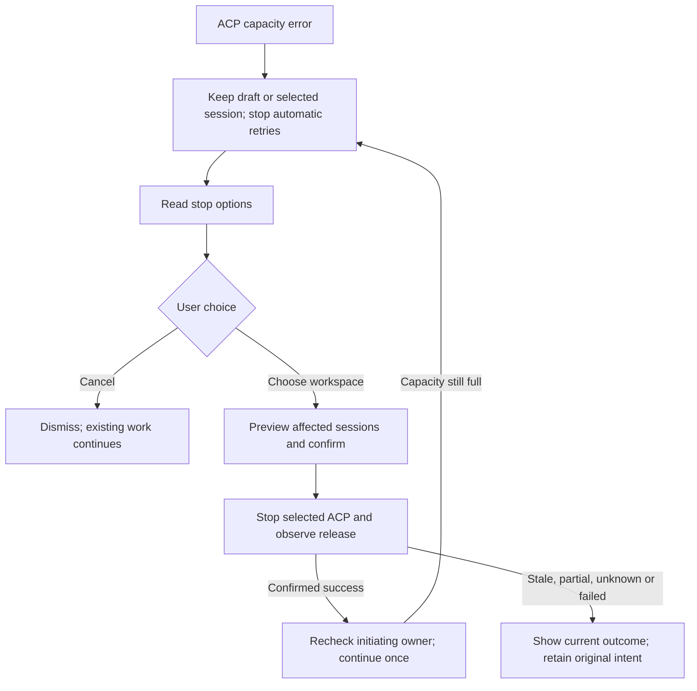

# PR3: User-directed ACP runtime stop when capacity is full

[English](daemon-acp-capacity-choice-pr3.md) | [简体中文](daemon-acp-capacity-choice-pr3.zh-CN.md)

## 1. Status, baseline and objective

Implemented locally, 2026-09-16; validation evidence and remaining platform limits are recorded below. Research baseline: `9071c4eb705cf92ba517e007eb03b6178d7b8352` on `origin/main`, including merged [PR1 #11911](https://github.com/QwenLM/qwen-code/pull/11911) and [PR2 #11940](https://github.com/QwenLM/qwen-code/pull/11940). Delivery tracker: [#11907](https://github.com/QwenLM/qwen-code/issues/11907). The tracker's unchecked milestones and broader idle-session proposal have not yet been reconciled with delivery; PR2 automatically reclaims only channels with zero loaded sessions and no pending work.

Integration baseline: `e4755ef6ab` includes the ACP control-plane/harness split (#11916). Session confirmation, stop receipts and terminal events live in the session control plane; startup/control gating and physical retirement stay in the channel harness. The research references below retain their original baseline.

When a new ACP cannot start after PR2's one-victim attempt, let the user choose an explicitly identified workspace's ACP to stop, or cancel the attempted operation. Preserve workspace registration, files, saved conversation history and the initiating draft. A successful stop permits one deliberate continuation through existing admission; it does not reserve a slot or guarantee that continuation succeeds.

This is a one-time ACP stop, not permanent workspace suspension or resident-runtime eviction. Keep the current `observe` default, budget formula, child heap arguments and PR2 automatic eligibility. Fixed heap enforcement and memory calibration remain separate work associated with #8182.

## 2. Research findings

Paths and line numbers below refer to the research baseline; existing behavior and proposed changes are distinct.

| Existing behavior                                                                                                                                                                             | Evidence                                                                                                                                                                                                    | Design consequence                                                                                                                                       |
| --------------------------------------------------------------------------------------------------------------------------------------------------------------------------------------------- | ----------------------------------------------------------------------------------------------------------------------------------------------------------------------------------------------------------- | -------------------------------------------------------------------------------------------------------------------------------------------------------- |
| Public runtime routes expose status and ensure, not stop; qualified routes resolve one trusted runtime without primary fallback.                                                              | [workspace-runtime.ts](../../packages/cli/src/serve/routes/workspace-runtime.ts#L50)                                                                                                                        | Add an explicit selected-runtime mutation; keep its ownership boundary.                                                                                  |
| Empty-channel reclamation requires no live sessions; it preserves the bridge and retires only one channel.                                                                                    | [bridge.ts](https://github.com/QwenLM/qwen-code/blob/9071c4eb705cf92ba517e007eb03b6178d7b8352/packages/acp-bridge/src/bridge.ts#L9899)                                                                      | Retain this automatic policy; add a separate explicit stop primitive for confirmed sessions.                                                             |
| Session close resolves pending interactions and requires the agent close acknowledgement; `requireAgentClose` also requires recorder flush. A failed close may already have interrupted work. | [bridge.ts](https://github.com/QwenLM/qwen-code/blob/9071c4eb705cf92ba517e007eb03b6178d7b8352/packages/acp-bridge/src/bridge.ts#L9333), [bridgeTypes.ts](../../packages/acp-bridge/src/bridgeTypes.ts#L982) | Reuse checked session close; report partial results rather than promising transactional cancellation or complete unsaved-state recovery.                 |
| Workspace removal deletes registration; runtime disposal also tears down daemon services. Bridge shutdown is permanent.                                                                       | [workspace-management.ts](../../packages/cli/src/serve/routes/workspace-management.ts#L1407), [workspace-runtime-coordinator.ts](../../packages/cli/src/serve/workspace-runtime-coordinator.ts#L151)        | Do not call removal, coordinator disposal or bridge shutdown for this action. Primary/startup workspaces can be stop candidates even when not removable. |
| Registry release is distinct from root exit and can precede a termination error. The channel currently exposes only root exit and kill methods.                                               | [process-registry.ts](../../packages/acp-bridge/src/process-registry.ts#L300), [channel.ts](../../packages/acp-bridge/src/channel.ts#L33)                                                                   | Add one per-child registry-release promise; neither a global count decrease nor `exited` proves the selected child's release.                            |
| Enabled scheduled tasks revive their missing bound sessions. Shared activity counters do not separately represent this responsibility.                                                        | [scheduled-task-keepalive.ts](../../packages/cli/src/serve/scheduled-task-keepalive.ts#L334), [workspace-activity.ts](../../packages/cli/src/serve/workspace-activity.ts#L24)                               | Read enabled task bindings in addition to activity; such workspaces are initially blocked instead of silently pausing their scheduler.                   |
| Capacity errors already stop automatic connection retries; the App presents a generic capacity toast.                                                                                         | [DaemonSessionProvider.tsx](../../packages/web-shell/client/daemon/session/DaemonSessionProvider.tsx#L4022), [App.tsx](../../packages/web-shell/client/App.tsx#L9935)                                       | Add a recoverable UI state with operation ownership; a toast alone cannot retain a safe continuation.                                                    |
| The existing provider stops reconnecting for `session_closed` with `reason: client_close`; a new reason falls into normal reconnect.                                                          | [DaemonSessionProvider.tsx](../../packages/web-shell/client/daemon/session/DaemonSessionProvider.tsx#L3866), [events.ts](../../packages/sdk-typescript/src/daemon/events.ts#L290)                           | Preserve this terminal reason and add a cause. New clients distinguish runtime stop from ordinary session close.                                         |

Do not use `readWorkspaceActivity().workspaceRuntime` or `coordinator.hasActiveWork()` as a blanket stop blocker: the current value also includes ordinary loaded sessions. Add a narrow read of existing coordinator management/queue counters and a bridge stop snapshot separating session work from starting/restoring/reserved/control/MCP work. No second activity-counting system is needed. The existing session summary supplies most display fields; obtain queued-work detail from the same live bridge entries for the stop projection.

The existing workspace-removal dialog exposes useful activity labels and shared dialog primitives, but its force-delete flow and repeated DELETE retries are unsuitable for this operation.

## 3. Scope and candidate policy

Offer trusted, current, active, registered, daemon-owned workspace runtimes with one identifiable live ACP and authoritative lifecycle/release support. Include an eligible primary or startup workspace. Exclude internal Conversations, Live, scratch and other special runtime lifecycles in this first version. Unknown ownership or missing observations must be represented as unsupported, not as zero activity.

| Condition                                                                                                                           | PR3 treatment                                                                                                                                                                                          |
| ----------------------------------------------------------------------------------------------------------------------------------- | ------------------------------------------------------------------------------------------------------------------------------------------------------------------------------------------------------ |
| Loaded ordinary sessions, including a running/queued turn or a permission/user-answer wait                                          | Selectable after a preview and explicit confirmation. Display every affected session, prompt/wait state and the warning that their work will be interrupted.                                           |
| Child-owned session background work                                                                                                 | Display the observed work and include it in the interruption scope. Close acknowledgement/flush and owned process-tree cleanup still have to succeed; irreversible tool side effects are not undone.   |
| Pending create/load/restore, channel replacement, stopping/quarantine, MCP discovery/OAuth or queued/running coordinator operations | Temporarily unselectable; refresh after these settle. Do not cancel lifecycle operations by guessing their ownership.                                                                                  |
| ACP transport connections, memory jobs, channel workers or voice sessions                                                           | Unselectable with a specific reason. Their independent cancellation and restart contracts are not part of this PR. Ordinary session SSE subscribers alone do not block user-confirmed stop.            |
| Enabled workspace/session scheduled tasks or an in-flight scheduler revive                                                          | Unselectable; direct the user to disable the task through the existing task controls and refresh. A future scheduled execution matters even when nothing runs now. Read failure means unknown/blocked. |
| Already cold, only an unreleased old child, untrusted, removed/draining, internal or unowned runtime                                | Unselectable with the appropriate state; do not infer a safely releasable process from a PID or cwd alias.                                                                                             |

Thus all workspaces having active ordinary conversations still permits user choice. If every workspace has unsupported independent work, show why none can be stopped and offer cancellation/manual cleanup. Do not silently broaden the interruption scope to make the chooser useful.

Initially exclude the initiating workspace when it is known: stopping its own replacement/restore dependency is a separate recovery problem. A standalone initiating operation can choose an ordinary registered workspace. Bind the recovery intent to the originating daemon client, workspace/product context and session; selecting another remote daemon must discard the old intent.

## 4. Proposed API and compatibility

Add capability `workspace_runtime_stop` for a fully managed daemon with the new stop, activity, task and release observations. Individual unsupported runtimes remain listed as disabled. Web Shell offers the chooser only for an actual ACP capacity error, this capability and a safely retryable initiating operation. Old daemons keep the existing capacity message and deliberate retry/cancel behavior. The feature does not add environment variables or public timeout settings.

### Read-only options

`GET /workspaces/runtime-stop-options` is process-global: it aggregates only authorized, visible registered workspace runtimes from the selected daemon. Register this literal route before generic workspace selectors. It never ensures a child, creates a session, refreshes MCP or warms LRU recency. Reuse the existing read authorization and workspace-visibility rules.

Return the shared admission counters plus each workspace's ID, cwd/display name, primary flag, runtime state, `canStop`, `blockedReasons`, shared activity counts and enabled-task count. For a selectable live child, include `channelId`, `runtimeEpoch`, a `stopToken` for the next confirmed attempt, and a projection of affected live sessions: ID, display name, active/queued work, permission/question wait and background-work observation. Include `unknown` where observation is incomplete; never serialize prompts, permission payloads, credentials or full transcripts for the chooser.

The UI reads every field for selection, impact display or confirmation. It displays selectable and blocked workspaces without preselecting a target. At most the currently loaded sessions are projected; this is not another persisted session catalog. Requester exclusion happens in the client from its captured owner; the server still validates the selected target independently.

### Confirmed stop

`POST /workspaces/:workspace/runtime/stop` is selected-runtime scoped. Use an exact workspace ID in the SDK/UI, the existing strict mutation gate (`mutate({ strict: true })`) and auth/trust checks, and the resolved runtime across all awaits. No legacy-primary alias is needed for PR3.

The proposed body contains `confirmInterruptions: true`, `expectedChannelId`, `expectedRuntimeEpoch`, `expectedStopToken`, and the `expectedSessionIds` displayed to the user. These express informed intent and stale-target detection, not additional authentication. Reject a missing/false confirmation or malformed input before side effects. Immediately before accepting the stop, recheck target identity, session membership and all independent-work blockers. Changed session membership or channel identity returns `409 workspace_runtime_stop_stale`; the client refreshes the read-only preview and requires confirmation again. Normal progress inside an already listed session is covered by the explicit warning that all its ongoing work will be interrupted. This is one state recheck, not a cross-service transaction or an activity-version lock.

A successful response identifies the target channel/epoch, `stopped: true`, `released: true`, affected/closed session IDs and the fresh global committed count. These facts mean the selected child was released, not that a slot is reserved for this caller. An unclean process exit after proven release may carry a warning; an unconfirmed session flush must still be surfaced as a partial/error outcome, even if the process is now gone.

Reuse the existing 60-second runtime observation budget and the SDK's 2-second transport headroom. Bound per-session close by the remaining overall budget and the existing initialization timeout used for bounded agent-close operations; do not allocate a fresh full budget for every session. If no close budget remains before the next session, start no further close or forced kill: report the already closed and unattempted sessions as incomplete, then release this operation's gate. Never pass a nonpositive `agentCloseTimeoutMs`; the current bridge treats zero as unbounded. Only an already-started close or teardown can remain in progress after the HTTP observation deadline. A request timeout/disconnect ends the HTTP wait, not cleanup already accepted by the server. Stop is never automatically retried by the SDK.

### In-progress and failed outcomes

Keep one opaque stop token and at most one accepted stop per bridge, with separate promises for its bounded response and cleanup completion plus its latest receipt. The token is created with the bridge and rotated synchronously when a stop is accepted; capture the consumed token alongside channel identity/epoch in the receipt. A duplicate of the latest accepted token observes that operation without repeating side effects; older tokens are stale. After a settled partial failure, a fresh preview and confirmation can consume the current token to retry the surviving sessions on the same channel. Recheck their membership and blockers; never close a replacement channel under an old confirmation. Expose this small in-memory receipt through the options endpoint; it is not a persistent operation queue. Recreating the bridge/daemon creates a fresh token and invalidates old confirmations. Receipts are available only while their runtime remains current and trusted; removal, trust changes or daemon recreation can make a receipt unavailable. A missing receipt leaves the outcome unknown and never authorizes continuation.

The response promise settles with `state: failed` when the existing total budget expires, even if cleanup cannot prove release. This does not release capacity or workspace isolation. The bridge exposes the captured cleanup completion separately to the selected-runtime route, which keeps its coordinator gate and keepalive pause until cleanup actually settles. A later release updates the latest receipt to `stopped` only if every session close was acknowledged; otherwise it reports `incomplete`. An already returned failure snapshot is unchanged. Read-only refresh can observe that later outcome without another stop POST. While release remains unconfirmed, show a failed stop with the workspace unavailable, not an indefinitely pending operation.

| Result                                                                | Contract                                                                                                                                                                              |
| --------------------------------------------------------------------- | ------------------------------------------------------------------------------------------------------------------------------------------------------------------------------------- |
| Unsupported capability/runtime                                        | `501 workspace_runtime_stop_not_supported`, no side effects.                                                                                                                          |
| Identity/session set changed                                          | `409 workspace_runtime_stop_stale`, no close begins.                                                                                                                                  |
| Independent activity present/unknown                                  | `409 workspace_runtime_stop_blocked`, no close begins. The initial preview supplies reasons; a later guard recheck can return only code/error, requiring a refreshed preview.         |
| Accepted stop exceeds its total budget                                | `503 workspace_runtime_stop_failed`, target identity and partial facts; retain isolation and registry accounting until cleanup settles. Refresh read-only status; do not resubmit.    |
| Close refused, flush failed or budget exhausted before the next close | `409 workspace_runtime_stop_incomplete`, closed/interrupted/remaining IDs and release status when known. Do not report that nothing happened or automatically kill to bypass refusal. |
| Teardown cannot prove release                                         | `503 workspace_runtime_stop_failed`, keep the captured child tracked and cleanup state visible. Never decrement the registry manually.                                                |
| Network response lost                                                 | Treat outcome as unknown. Read the matching receipt/state before offering an explicit continuation or another confirmation. Absence of a live root alone is not success.              |
| Slot taken after successful release                                   | The original operation receives the normal capacity error. Leave its draft/selection intact and require a new user choice; no second automatic active-workspace stop.                 |

Existing unknown/untrusted/ambiguous/bootstrap/draining/removed resolver errors retain their normal semantics. None may fall back to the primary runtime.

## 5. Minimal lifecycle implementation

Add a bridge stop operation separate from `reclaimIdleChannel`. Keep the daemon helper responsible for selecting/resolving the runtime and reading independent activity; the bridge owns session/channel identity, close and release.

1. Capture one channel, epoch and the confirmed session set. Reject overlapping startup/restore/management/stop work. Enter a temporary stopping state synchronously before the first await, using one bridge-local in-flight operation and a separate temporary coordinator stop gate checked by the existing accepting-work paths. The coordinator's removal/trust drain is an unowned boolean: stop must neither reuse nor clear it, and removal rollback must not clear stop. Cover both new channel starts and reuse of existing sessions/control entry points. Do not use registry removal-drain, which rejects primary runtimes and represents a different lifecycle.
2. Prevent a scheduled keepalive tick from starting during the operation using its existing per-workspace stop/start hook; the prior enabled-task check remains required. Recheck queued/in-flight work after entering the local guard. If a blocker appeared before any session close, unwind without interruption.
3. Close only the captured sessions through the existing close path with `requireAgentClose: true` and bounded acknowledgement. It resolves pending interactions, cancels work and drains recording. Track partial outcomes. A definitive child refusal stops further closes and releases the temporary guard; it must not await a release that was never initiated. An uncertain transport failure may already terminate the whole captured channel and must follow its release evidence instead.
4. Emit existing `session_closed` with `reason: client_close` and additive `cause: workspace_runtime_stop`. Extend the controlled close options and SDK event typing/validation for that cause. For stop-associated fatal channel exit, preserve a terminal user-stop signal for affected sessions while separately reporting unconfirmed persistence/teardown; do not let the normal crash auto-reconnect path silently undo the action. No `workspace_removed` event is emitted.
5. After confirmed sessions close and no unexpected work exists, clear the captured channel's soft keepalive and retire it through the same owned teardown as PR2. Reuse internal mechanics rather than relaxing PR2's no-session predicate or permanently shutting down the bridge.
6. Add only `registryReleased: Promise<void>` to the tracked-child handle and an optional forwarding property on daemon-owned channels. Resolve it exclusively in the existing registry release function, after removal from the counted registry. Do not resolve on root exit, kill signal, termination `finally` or a swallowed teardown error. On Windows, where the registry does not track descendant process groups, the root's settled exit is the release evidence and `released: true` does not prove the process tree is gone. Hold the captured channel reference even if root-exit cleanup removes it from the live-channel collection.
7. Report success only after that child's release promise resolves and session-close outcomes are known. Race the response against the existing total budget, but let the captured cleanup continue after a failed response. Expose cleanup completion through the internal bridge contract; only that completion removes the bridge/coordinator guards and resumes keepalive. It checks the current operation identity and cannot clear a later operation's guard. Preserve lifecycle `stopping` and capacity accounting while selected-child resources remain unconfirmed, even when the response receipt is `failed`. A close refusal without teardown still settles cleanup and lifts its own guard normally.
8. Preserve registration, generation identity, bridge/coordinator/service objects, files, saved history, environment/storage roots and unrelated terminals. Existing catalog invalidation follows session close; MCP/Skills become stale through the existing epoch mechanism. Restart keepalive observation only after the stop/guard settles and the captured runtime is still the current trusted active registration, with no removal/trust drain or daemon shutdown in progress; the operation never changes persistent task enablement. A later deliberate use cold-starts normally and loads saved session identity.

This local guard prevents this bridge from accepting conflicting work during an accepted stop. It does not promise a globally atomic snapshot, stop unrelated daemon services, reserve the freed slot, or permanently prevent new callers from using the workspace later.

## 6. Web Shell interaction and retry ownership

Use a dedicated capacity dialog built from shared Web Shell dialog primitives and the portal root. Reuse activity presentation where helpful, not workspace-removal actions. Labels should say “Stop this workspace's sessions and continue” and “Cancel”; explain that registration/files/saved history remain and unpersisted state or active work can be lost/interrupted. Never claim measured RAM exhaustion or that every workspace is busy.

Capture a small typed capacity-recovery intent where the operation actually fails, not by parsing a toast: originating daemon/client, owner snapshot, product context, operation kind, original session/draft identifier and revision, and its existing guarded continuation. The App handles its guarded first-submit creation and Skills ensure; provider load/resume failures drive recovery in both App and existing-session panes. An empty ChatPane does not create sessions through sendPrompt; embedded hosts own new-session creation and its error handling. Keep at most one intent, and report a second error normally if the existing chooser cannot accept it. Invalidate the intent on daemon/session/workspace or draft changes; refreshing options is read-only.

| Initiating operation                                                                                 | Continuation after release                                                                                                                                                                    |
| ---------------------------------------------------------------------------------------------------- | --------------------------------------------------------------------------------------------------------------------------------------------------------------------------------------------- |
| Fresh session/prompt rejected before dispatch                                                        | Retry the original guarded submit once with its original prepared payload and attachment ownership; clear the composer only after acceptance. Do not manufacture a second optimistic message. |
| Saved session load/restore or explicit Skills runtime ensure                                         | Retry that exact session ID/runtime owner once. Do not create a replacement conversation on 404.                                                                                              |
| Standalone create with verified pre-dispatch rollback                                                | Follow the existing rollback identity/retryability contract and its capacity cause. Preserve the original pending creation intent.                                                            |
| Submitted/uncertain create, accepted prompt, ambiguous connection loss or another unsupported action | Resolve through the existing outcome/recovery flow first. Do not attach a blind retry callback or offer “stop and continue” until non-dispatch or safe continuation is established.           |

The guarded first-submit continuation retains the originating composer draft only across the session ID reported by its own allocation callback. An unrelated session switch must load that session's saved draft without overwriting it. Keep the original admission/unknown-outcome bookkeeping on the one continuation, reject intervening editor changes, and clear the draft only after acceptance; host preparation is not repeated.

Confirmation cancellation before POST affects nothing. Dismissing the dialog after the server has accepted stop only stops local waiting; show that the selected stop may continue and never pretend it was rolled back. It also cancels automatic continuation of the original intent.

Other updated Web Shell tabs that receive the user-stop cause preserve their selected saved conversation/transcript and enter a stopped state with an explicit Resume action; suppress SSE reconnect, auto-load, auto-ensure and queued prompt resubmission for that attachment. Preserve unaccepted input as drafts; held prompts for sibling sessions in the stopped workspace become drafts when revisited, never automatic submissions. Clearing the selected session removes its stop/recovery markers. The chooser blocks global chat shortcuts, while stopped composers require explicit Resume. Old clients receiving `client_close` retain their existing terminal behavior (possibly clearing selection). Test reconnect/response-loss explicitly. A disconnected or independent legacy client can miss the terminal event and later request work again; this one-time stop does not introduce a durable suspended-workspace flag. Handle resulting slot competition through admission, without claiming permanent parking.

The selected remote daemon must remain the one that supplied the capacity error and options. If it changes while the dialog is open, discard confirmation and continuation; never route an old selection through the new default client.

## 7. Implementation slices and consumers

Keep this as PR3's user-choice delivery, implemented internally in dependency order; no new public three-PR program is needed.

| Slice                              | Files/components and consumers                                                                                                                                                                  | Deliverable                                                                                                                                                                          |
| ---------------------------------- | ----------------------------------------------------------------------------------------------------------------------------------------------------------------------------------------------- | ------------------------------------------------------------------------------------------------------------------------------------------------------------------------------------ |
| A: release proof and explicit stop | `packages/acp-bridge/src/process-registry.ts`, `channel.ts`, `spawnChannel.ts`, `bridgeTypes.ts`, `session-control-plane.ts`, `channel-harness.ts`; coordinator/activity and keepalive adapters | Per-child release fact, bounded confirmed-session close, reusable cold bridge, partial outcomes and terminal events. Unit tests prove root exit is insufficient.                     |
| B: daemon and SDK contract         | Serve runtime routes, `server.ts`/`run-qwen-serve.ts` dependency wiring, capabilities, shared status types; SDK `daemon/types.ts`, `events.ts`, `DaemonClient.ts` and exports                   | Read-only options, scoped stop, capability negotiation, disabled reasons, same-target readback and SDK methods without auto-retry. All managed construction sites must be exercised. |
| C: product flow and docs           | Web Shell session provider/actions/types, App, dedicated capacity dialog, shared UI primitives and `i18n.tsx`; daemon protocol/REST/user documentation                                          | One chooser, exact owner continuation, preserved drafts/history, cancelled or stopped states, all-open-tabs behavior and bilingual copy.                                             |

Audit each added field from producer through REST/SDK to its reader. Existing `workspace_runtime` capability alone must not imply stop support. New REST stop operations may remain REST-only in the SDK, like existing runtime ensure; preserve and test capacity detection from both REST and ACP errors entering the chooser. New stop failures need stable REST codes and must not accidentally be submitted as session RPC commands.

## 8. Validation and acceptance

The E2E plan is at `.qwen/e2e-tests/daemon-acp-capacity-choice-pr3.md`. The 2026-09-16 isolated global-CLI baseline reports version `0.22.3`; its parser accepts only `off`/`observe` and rejects `admit`. Consequently no HTTP admission/PR3 endpoint execution is claimed for that installed binary. Current-main source inspection independently confirms the stop capability/routes are absent; the baseline report records this limitation. Use isolated workspaces/home, deterministic local provider and owned PIDs. Global CLI baseline and built-artifact results must be recorded separately; an unsupported baseline endpoint is a baseline gap, not an acceptance test.

1. At one slot, loaded A protects itself from PR2 and B receives capacity exhaustion. The chooser identifies A and its sessions. Cancelling preserves A's PID/work and B's draft/attachments.
2. Explicit confirmation closes a loaded idle session and, separately, an active turn/tool/permission/question wait; saved history and workspace identity survive, the selected child releases before B starts, and B submits exactly once.
3. Multiple sessions in one ACP are all previewed and accounted for. New session membership or a replacement channel between preview and confirmation returns stale without closing it. Partial flush/refusal reports interrupted/closed/remaining sessions accurately.
4. Enabled cron, in-flight scheduler revival, ACP connections, memory jobs, worker, voice, MCP/control and pending start/restore each produce the documented blocked reason. Listing never starts a child. Task read failure cannot become an empty list.
5. Slow root/descendant teardown, SIGKILL/nonzero exit, process-tree uncertainty and a competing requester exercise the per-child release promise. The bridge response settles as failed at the total deadline on both release-wait paths, while admission, coordinator work, keepalive and registry accounting remain fenced until cleanup. Duplicate confirmation does not start cleanup twice; late release updates the receipt without mutating the returned failure or promoting an unconfirmed flush. The chooser distinguishes failure with retained isolation from an in-progress operation in both languages. HTTP timeout does not release accounting or allow late unsafe continuation. Budget exhaustion between session closes does not send an unbounded next RPC or bypass a refusal. Include Linux/Windows owned-tree verification before making cross-platform claims.
6. A double click, repeated identical POST, lost response, cancellation after acceptance, daemon restart and new channel epoch never close a second target. A fresh confirmation after partial refusal can retry remaining sessions on the same channel; replaying an older consumed token cannot. Same-target readback distinguishes release, partial failure and unknown state. Concurrent removal/trust drain and its rollback cannot clear the stop gate, and stop completion cannot clear another drain or restart a removed runtime's keepalive.
7. Existing primary/secondary/dynamic construction paths and direct managed embeds preserve runtime ownership; untrusted, unknown, removed/draining and unsupported runtimes never fall back. Internal targets remain disabled.
8. Fresh submit, exact restore, verified standalone rollback and uncertain creation each follow the continuation table. Owner/draft changes and remote-daemon switches invalidate old intents. No duplicate message, empty replacement session or automatic active-workspace cascade occurs.
9. Connected sibling tabs stop reconnecting on the terminal event; saved session selection/transcript remain in new clients. Lost-event/legacy-client re-entry is covered as a competing request, not promised suspension. Later deliberate Resume restores the same saved session under a newer epoch.
10. Older daemons and off/observe mode retain current behavior. PR1's no-automatic-capacity-retry UX and PR2's zero-session automatic rule remain unchanged. Validate dialog keyboard focus/confirmation, portal theme scoping, React 18/19 behavior, lint, build, typecheck and focused unit suites during implementation.

### Local implementation evidence (2026-09-16)

On macOS with Node 22.22.3, the built implementation passed seven real daemon/ACP HTTP groups (138 assertions), a complete two-page capacity-choice flow (27), an independent connected-page stop/Resume flow (15), and Chinese/long-path rendering checks (11). The real ACP groups include an active model stream, a pending write permission that never executes after stop, a running shell tool whose PID exits with the ACP, stale session membership, enabled cron and independent ACP connection blockers. Workspace registration, saved recordings, selected process release, original session restoration and test-owned process cleanup were checked. Browser evidence confirms cancellation preserves the draft, the resumed initial prompt is sent exactly once, and a connected sibling does not reload automatically during the observation window.

Build, bundle, typecheck, changed-file lint and focused ACP bridge, CLI, SDK and Web Shell suites passed. Mocked tests separately cover recorder refusal, missing acknowledgement, partial close budget expiry, delayed registry release after root exit, unknown close outcome, duplicate/old tokens, concurrent cleanup, drain ownership, lost HTTP response, stale daemon/draft ownership and late capability discovery. These tests do not claim real fault injection on every supported platform. The local report and run manifests live in `.qwen/e2e-tests/pr3-capacity-choice/verification-report.md`; unit/build logs and the self-audit record are retained alongside it and under `.qwen/investigations/pr3-capacity-choice/`.

Not validated with real processes/browsers: Linux/Windows process trees, React 18, AskUserQuestion waits, injected recorder/filesystem failures, real delayed descendant/kill failures, attachment drafts in the browser, or an exhaustive keyboard-focus matrix. Existing shared dialog primitives and model-independent close paths are reused, but this record does not turn those unrun cases into passing evidence. No actual memory-pressure or heap-safety claim is made.

## 9. Decisions and remaining gates

Recommended decisions are explicit user-confirmed session interruption, one selected child, two new routes, per-child release proof, a temporary local stop guard, existing terminal close reason plus additive cause, and one owner-checked continuation. Independent background-service work is initially blocked and clearly explained. No persistent suspension state, new lock service, extra admission queue, slot transfer, heap option or workspace deletion is included.

The validation record must distinguish real ACP/browser coverage from mocked failure tests. Linux/Windows process-tree behavior and React 18 browser behavior require their respective environments before making those platform claims. If these checks expose an unsupported interruption path, report it as disabled rather than claiming safe closure. Extending support to enabled scheduled tasks or autonomous services requires a separately designed pause/resume contract. The two deferred PR2 test-coverage suggestions remain separate from PR3's acceptance work.

The implementation makes no measured performance, RAM-safety or all-client persistence guarantee. It adds no environment variables and leaves default admission and automatic reclaim policy unchanged.
