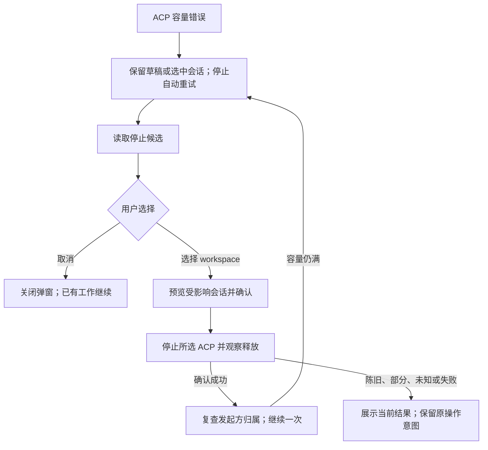

# PR3：容量已满时由用户选择停止 ACP 运行时

[English](daemon-acp-capacity-choice-pr3.md) | [简体中文](daemon-acp-capacity-choice-pr3.zh-CN.md)

## 1. 状态、基线与目标

已于 2026-09-16 在本地实现；验证证据及剩余平台限制见下文。调研基线为 `origin/main` 的 `9071c4eb705cf92ba517e007eb03b6178d7b8352`，包含已合并的 [PR1 #11911](https://github.com/QwenLM/qwen-code/pull/11911) 和 [PR2 #11940](https://github.com/QwenLM/qwen-code/pull/11940)。交付跟踪：[#11907](https://github.com/QwenLM/qwen-code/issues/11907)。Tracker 中未勾选的阶段和较宽的空闲会话提案尚未与交付同步；PR2 只自动回收没有已加载 session、没有待处理工作的 channel。

集成基线：`e4755ef6ab` 已包含 ACP control-plane/harness 拆分（#11916）。会话确认、停止回执和终止事件由 session control plane 负责；启动/控制请求拦截和物理进程回收留在 channel harness。下文调研引用保留原始基线。

新 ACP 在 PR2 单候选回收后仍无法启动时，让用户明确选择一个 workspace 的 ACP 停止，或取消本次操作。保留 workspace 注册、文件、已保存的聊天记录以及发起方草稿。停止成功后，允许通过现有准入路径主动继续一次；这不预留名额，也不保证继续操作一定成功。

这是一次性停止 ACP，不是永久暂停 workspace，也不是销毁常驻 runtime。保持默认 `observe`、预算公式、child 堆参数和 PR2 自动候选条件。固定堆上限及内存校准仍属于 #8182 关联的独立工作。

## 2. 调研结论

以下路径和行号基于调研基线；现有行为与建议改动分开描述。

| 现有行为                                                                                                                       | 依据                                                                                                                                                                                                        | 对方案的影响                                                                                                         |
| ------------------------------------------------------------------------------------------------------------------------------ | ----------------------------------------------------------------------------------------------------------------------------------------------------------------------------------------------------------- | -------------------------------------------------------------------------------------------------------------------- |
| 公开 runtime 路由提供 status 和 ensure，没有 stop；限定 workspace 的路由只解析对应可信 runtime，不回落 primary。               | [workspace-runtime.ts](../../packages/cli/src/serve/routes/workspace-runtime.ts#L50)                                                                                                                        | 新增明确归属所选 runtime 的变更接口，保持作用域边界。                                                                |
| 空 channel 回收要求没有 live session，保留 bridge，只退出一个 channel。                                                        | [bridge.ts](https://github.com/QwenLM/qwen-code/blob/9071c4eb705cf92ba517e007eb03b6178d7b8352/packages/acp-bridge/src/bridge.ts#L9899)                                                                      | 保持自动策略；为用户确认的 session 新增独立停止能力。                                                                |
| Session close 先处理等待交互，再要求 agent 确认关闭；`requireAgentClose` 还要求 recorder flush。关闭失败时也可能已经中断工作。 | [bridge.ts](https://github.com/QwenLM/qwen-code/blob/9071c4eb705cf92ba517e007eb03b6178d7b8352/packages/acp-bridge/src/bridge.ts#L9333)、[bridgeTypes.ts](../../packages/acp-bridge/src/bridgeTypes.ts#L982) | 复用受检查的 session close；报告部分结果，不承诺事务式取消或完整恢复未保存状态。                                     |
| Workspace removal 会删除注册；runtime disposal 还会销毁 daemon 服务。Bridge shutdown 是永久的。                                | [workspace-management.ts](../../packages/cli/src/serve/routes/workspace-management.ts#L1407)、[workspace-runtime-coordinator.ts](../../packages/cli/src/serve/workspace-runtime-coordinator.ts#L151)        | 不调用 removal、coordinator dispose 或 bridge shutdown。即使不可移除，primary/startup workspace 也可以成为停止候选。 |
| Registry release 与根进程退出不同，并且可能发生在终止报错之前。Channel 目前只暴露根进程退出和 kill 方法。                      | [process-registry.ts](../../packages/acp-bridge/src/process-registry.ts#L300)、[channel.ts](../../packages/acp-bridge/src/channel.ts#L33)                                                                   | 增加单 child 的 registry-release promise；全局计数下降或 `exited` 都不能证明所选 child 已释放。                      |
| 启用的定时任务会恢复缺失的绑定 session，共享活动计数没有单独表示这项责任。                                                     | [scheduled-task-keepalive.ts](../../packages/cli/src/serve/scheduled-task-keepalive.ts#L334)、[workspace-activity.ts](../../packages/cli/src/serve/workspace-activity.ts#L24)                               | 除活动计数外还要读取启用任务绑定；首版将这类 workspace 标为不可选，不隐式暂停调度器。                                |
| 容量错误已停止自动连接重试，App 目前显示通用容量 toast。                                                                       | [DaemonSessionProvider.tsx](../../packages/web-shell/client/daemon/session/DaemonSessionProvider.tsx#L4022)、[App.tsx](../../packages/web-shell/client/App.tsx#L9935)                                       | 新增绑定操作归属的可恢复 UI 状态；仅靠 toast 无法保存安全的继续操作。                                                |
| 当前 provider 收到 `session_closed` 且 `reason: client_close` 才停止重连；新 reason 会进入普通重连。                           | [DaemonSessionProvider.tsx](../../packages/web-shell/client/daemon/session/DaemonSessionProvider.tsx#L3866)、[events.ts](../../packages/sdk-typescript/src/daemon/events.ts#L290)                           | 保留该终态 reason，补充 cause；新客户端据此区分停止 runtime 和普通关闭 session。                                     |

不能直接将 `readWorkspaceActivity().workspaceRuntime` 或 `coordinator.hasActiveWork()` 作为统一的停止阻塞条件：当前值也包含普通已加载 session。应增加窄的只读方法，读取已有 coordinator 管理/排队计数，并由 bridge stop snapshot 区分 session 工作与启动、恢复、预留、control/MCP 工作。无需第二套活动计数系统。现有 session summary 提供多数显示字段；stop 投影中的排队工作细节从相同 live bridge entry 获取。

现有 workspace 移除弹窗的活动标签和共享对话框组件可以复用，但强制删除流程和重复 DELETE 重试不适合此操作。

## 3. 范围与候选策略

只允许可信、当前、active、已注册且由 daemon 持有的 workspace runtime，要求存在一个可明确识别的 live ACP，并提供权威生命周期/释放能力。符合条件的 primary 或 startup workspace 也可以选择。首版排除内部 Conversations、Live、scratch 及其他特殊生命周期 runtime。归属不明或缺少观测必须表示为不支持，不能当作零活动。

| 条件                                                                                                                | PR3 处理                                                                                                                  |
| ------------------------------------------------------------------------------------------------------------------- | ------------------------------------------------------------------------------------------------------------------------- |
| 普通已加载 session，包括运行/排队中的 turn、等待授权或用户回答                                                      | 预览并明确确认后可选。列出所有受影响 session、prompt/等待状态，说明工作将被中断。                                         |
| Child 内 session 自身的后台工作                                                                                     | 展示观测到的工作并纳入中断范围。仍要求 close 确认/flush 及自有进程树清理成功；已发生的工具副作用不会撤销。                |
| 待完成的 create/load/restore、channel 替换、stopping/quarantine、MCP discovery/OAuth、排队或运行的 coordinator 操作 | 暂时不可选，结束后刷新；不通过猜测归属来取消生命周期操作。                                                                |
| ACP 传输连接、memory job、channel worker、voice session                                                             | 不可选并显示明确原因。本 PR 不定义这些独立工作的取消/重启契约。普通 session SSE 订阅本身不阻止用户确认停止。              |
| 启用的 workspace/session 定时任务，或在途 scheduler revive                                                          | 不可选；引导用户先通过已有任务控制禁用任务，再刷新。即使当前不执行，未来已启用的任务也构成责任。读取失败按未知/阻塞处理。 |
| 已 cold、只剩尚未释放的旧 child、不可信、已移除/draining、内部或非自有 runtime                                      | 不可选并显示状态；不从 PID 或 cwd alias 推断存在可安全释放的进程。                                                        |

因此，所有 workspace 都在运行普通聊天时，仍允许用户主动选择。如果每个 workspace 都有首版不支持的独立工作，则解释不可停止原因，提供取消/手动清理。不能为了让选择器可用而默默扩大中断范围。

已知发起方 workspace 时，首版排除它自身：停止其替换/恢复依赖属于另外的恢复问题。Standalone 发起操作可以选择普通已注册 workspace。恢复意图绑定原 daemon client、workspace/product context 和 session；切换远端 daemon 时必须丢弃旧意图。

## 4. API 与兼容性提案

为具备新停止、活动、任务和释放观测能力的完整托管 daemon 增加 capability `workspace_runtime_stop`。个别不支持的 runtime 仍可列出，但不可选择。Web Shell 只在发生真实 ACP 容量错误、具备该 capability 且发起操作可安全重试时提供选择器。旧 daemon 保持原容量提示和用户主动重试/取消行为。不新增环境变量或公开超时配置。

### 只读候选列表

`GET /workspaces/runtime-stop-options` 属于 process-global：聚合所选 daemon 内已授权、可见的已注册 workspace runtime。将字面路由注册在通用 workspace selector 之前。它不能 ensure child、创建 session、刷新 MCP 或更新 LRU 使用时间。沿用既有读取授权和 workspace 可见性规则。

返回共享准入计数，以及每个 workspace 的 ID、cwd/显示名、primary 标记、runtime 状态、`canStop`、`blockedReasons`、共享活动计数和启用任务数量。对于可停止的 live child，包含 `channelId`、`runtimeEpoch`、用于下一次确认的 `stopToken`，以及受影响 live session 的投影：ID、显示名、活跃/排队工作、授权/问题等待和后台工作观测。不完整观测标为 `unknown`；不为选择器序列化 prompt、授权请求正文、凭据或完整聊天记录。

UI 消费这些字段用于候选选择、影响展示和确认。同时展示可选及被阻止的 workspace，不预选任何目标。只投影当前已加载 session，不另建持久会话目录。客户端根据捕获的 owner 排除发起方；服务端仍独立校验所选目标。

### 确认停止

`POST /workspaces/:workspace/runtime/stop` 属于 selected-runtime。SDK/UI 使用精确 workspace ID，沿用严格变更门禁（`mutate({ strict: true })`）及认证/信任检查，跨 await 始终使用已解析 runtime。PR3 不需要 legacy-primary 别名。

建议请求体包含 `confirmInterruptions: true`、`expectedChannelId`、`expectedRuntimeEpoch`、`expectedStopToken` 和向用户展示的 `expectedSessionIds`。它们表示知情意图及陈旧目标检测，不是额外认证。确认缺失/为 false 或输入格式错误时，在副作用前拒绝。接受停止前重新检查目标身份、session 集合和所有独立工作阻塞项。Session 集合或 channel 身份变化时返回 `409 workspace_runtime_stop_stale`，由客户端重新读取只读预览，要求重新确认。已列出 session 内的普通进度变化由“中断这些 session 全部进行中工作”的明确提示涵盖。这是一次状态复查，不是跨服务事务或活动版本锁。

成功响应标识目标 channel/epoch，包含 `stopped: true`、`released: true`、受影响/已关闭 session ID 和最新全局 committed 计数。它们证明所选 child 已释放，不意味着名额已为该调用方保留。确认释放后发生的不干净退出可以携带 warning；未确认的 session flush 仍必须作为部分/错误结果展示，即使进程已经消失。

复用现有 60 秒 runtime 观测预算和 SDK 的 2 秒传输余量。每个 session close 受剩余总预算及已有用于有界 agent-close 的初始化超时限制，不能为每个 session 重新分配完整预算。下一 session 开始前若已无 close 预算，不再发送 close 或强制 kill；将此前已关闭和未尝试的 session 报告为 incomplete，并解除本次门禁。不能传入非正数 `agentCloseTimeoutMs`；当前 bridge 会将零当作无界等待。只有已经启动的 close 或 teardown 可以在 HTTP 观测 deadline 后继续处于 in progress。HTTP 超时/断开只结束响应等待，不撤销服务端已经接受的清理。SDK 不自动重试 stop。

### 进行中与失败结果

每个 bridge 保留一个不透明 stop token，以及最多一个已接受的 stop；分别保存其有界响应 promise、清理完成 promise 和最近回执。Token 随 bridge 创建，在接受 stop 时同步更换；回执记录已消费 token 与 channel 身份/epoch。重复提交最近已接受的 token 时观察同一操作，不重复副作用；更早的 token 返回 stale。部分失败已收敛后，重新预览并确认可以消费当前 token，对同 channel 的剩余 session 重试；仍需复查 session 集合和阻塞项，不能以旧确认关闭替换后的 channel。通过候选接口暴露这个小型内存回执，不建立持久操作队列。重建 bridge/daemon 会产生新 token，使旧确认失效。回执仅在所属 runtime 仍为当前可信实例时可读；移除、信任变化或 daemon 重建可能使回执不可用。缺失回执仍按结果未知处理，不能据此继续原操作。

现有总预算耗尽时，响应 promise 以 `state: failed` 收敛，即使清理仍无法证明释放。这不解除容量计数或 workspace 隔离。Bridge 向所选 runtime 路由单独提供捕获的清理完成信号，路由在清理真正收敛前保留 coordinator 门禁并暂停 keepalive。稍后确认释放时，只有全部 session close 已确认才能将最近回执更新为 `stopped`，否则报告 `incomplete`；已返回的失败快照不变。只读刷新可观察稍后的结果，不再次提交 stop POST。释放仍未确认时，展示停止失败及工作区暂不可用，不能一直展示操作处理中。

| 结果                                          | 契约                                                                                                                                   |
| --------------------------------------------- | -------------------------------------------------------------------------------------------------------------------------------------- |
| Capability/runtime 不支持                     | `501 workspace_runtime_stop_not_supported`，无副作用。                                                                                 |
| 身份/session 集合变化                         | `409 workspace_runtime_stop_stale`，尚未开始关闭。                                                                                     |
| 存在独立活动或观测未知                        | `409 workspace_runtime_stop_blocked`，尚未开始关闭。初始预览携带原因；后续门禁复查可能只返回 code/error，需要刷新预览。                |
| 已接受的停止超过总预算                        | `503 workspace_runtime_stop_failed`，携带目标身份及部分事实；清理收敛前保留隔离及 registry 计数。只读刷新状态，不重新提交。            |
| Close 被拒、flush 失败或下次 close 前预算耗尽 | `409 workspace_runtime_stop_incomplete`，包含已关闭/已中断/剩余 ID，以及已知的释放状态。不能声称没有发生操作，也不自动 kill 绕过拒绝。 |
| Teardown 无法证明释放                         | `503 workspace_runtime_stop_failed`，保留捕获的 child 跟踪并显示清理状态，不手工减 registry。                                          |
| 网络响应丢失                                  | 按结果未知处理；读取对应回执/状态后，才允许显式继续或再次确认。仅根进程不再存活不是成功。                                              |
| 成功释放后名额被抢占                          | 原操作收到普通容量错误。保留草稿/选择，要求重新由用户决定，不自动停止第二个活跃 workspace。                                            |

Unknown/untrusted/ambiguous/bootstrap/draining/removed 等既有 resolver 错误保持原语义，任何分支都不能回落 primary。

## 5. 最小生命周期实现

增加独立于 `reclaimIdleChannel` 的 bridge stop 操作。Daemon helper 负责选择/解析 runtime 和读取独立活动；bridge 负责 session/channel 身份、关闭与释放。

1. 捕获一个 channel、epoch 和已确认 session 集合。拒绝重叠启动/恢复/管理/stop。在第一个 await 前同步进入临时 stopping，使用一个 bridge 局部在途操作及独立的临时 coordinator stop 门禁，由现有接收工作检查路径检查。Coordinator 的 removal/trust drain 是无所有者 boolean：stop 不能复用或解除它，removal rollback 也不能解除 stop。同时覆盖新 channel 启动及复用已有 session/control 的入口。不能使用 registry removal-drain；它拒绝 primary，且属于另一种生命周期。
2. 通过已有每 workspace 的 keepalive stop/start hook，防止停止期间定时 tick 新启动；此前仍必须检查启用任务。进入局部门禁后重新核验排队/在途工作。若 session 关闭前发现新增阻塞，退出且不中断工作。
3. 仅通过现有 close 路径关闭捕获的 session，使用 `requireAgentClose: true` 和有界确认。该路径处理等待交互、取消工作、排空记录。跟踪部分结果。Child 明确拒绝时停止后续关闭并解除临时门禁，不能等待从未开始的 release；传输结果未知时可能已经终止整个捕获 channel，需继续依据它的释放事实收敛。
4. 发出既有 `session_closed`，保留 `reason: client_close`，新增 `cause: workspace_runtime_stop`。扩展受控 close options 和 SDK 事件类型/校验。对于 stop 关联的致命 channel 退出，也要给受影响 session 保留终态用户停止信号，并单独报告未确认的持久化/teardown；不能让普通崩溃重连分支悄悄撤销用户操作。不发 `workspace_removed`。
5. 已确认 session 全部关闭且无意外工作后，清理捕获 channel 的软保温，走 PR2 相同的自有 teardown。复用内部机制，不放宽 PR2 零 session 条件，也不永久 shutdown bridge。
6. 仅为 tracked-child handle 增加 `registryReleased: Promise<void>`，并在 daemon-owned channel 上可选透传。只在已有 registry release 函数删除计数项之后 resolve。不能在根进程退出、发 kill 信号、termination `finally` 或吞掉退出错误时 resolve。Windows 上 registry 不跟踪后代进程组，根进程退出完成即为释放证据，此时 `released: true` 不证明进程树已消失。即使根退出清理已从 live-channel 集合移除它，也要保留捕获的 channel 引用。
7. 只有该 child 的释放 promise 完成、session-close 结果明确后才能报告成功。响应与现有总预算竞争，失败响应后仍继续捕获的清理。通过 bridge 内部契约暴露清理完成信号，只有该信号才能解除 bridge/coordinator 门禁并恢复 keepalive。完成回调核验当前操作身份，不能解除后续操作的门禁。所选 child 资源尚未确认时继续保留生命周期 `stopping` 和容量计数，即使响应回执已是 `failed`。没有触发 teardown 的明确 close 拒绝仍正常收敛清理并解除自身门禁。
8. 保留注册、generation 身份、bridge/coordinator/service 对象、文件、已保存历史、环境/存储根目录及无关 terminal。Session close 沿用 catalog invalidation；MCP/Skills 通过原 epoch 机制变为 stale。仅在 stop/门禁收敛、捕获 runtime 仍是当前可信 active 注册、且没有 removal/trust drain 或 daemon shutdown 时，才恢复 keepalive 观测；操作不修改持久任务启用状态。后续用户主动使用时正常冷启动，并加载原保存 session 身份。

此局部门禁防止同一个 bridge 在已接受停止期间接收冲突工作。它不承诺全局原子快照、不停止无关 daemon 服务、不预留释放的名额，也不永久阻止其他调用方稍后使用该 workspace。

## 6. Web Shell 交互与重试归属

使用共享 Web Shell dialog 组件和 portal root 构建专门的容量弹窗。可以复用活动展示，不复用 workspace 移除操作。按钮建议为“停止此工作区的会话并继续”和“取消”；说明保留注册/文件/已保存历史，未持久化状态或进行中工作可能丢失/中断。不声称测得实时内存耗尽，也不声称所有 workspace 都忙。

在操作实际失败处捕获小型类型化容量恢复意图，不解析 toast：原 daemon/client、owner snapshot、product context、操作类型、原 session/草稿标识和版本，以及已有受保护的继续操作。App 覆盖受保护的首次提交创建和 Skills ensure；provider 的 load/resume 失败驱动 App 和已有会话 pane 的恢复。空 ChatPane 不通过 sendPrompt 创建 session，嵌入宿主负责新会话创建及其错误处理。同时最多保留一个意图；已有弹窗不能接纳第二个错误时，应正常报告该错误。Daemon/session/workspace 或草稿变化时使意图失效；刷新候选是只读操作。

| 发起操作                                                                | 释放后的继续方式                                                                                                       |
| ----------------------------------------------------------------------- | ---------------------------------------------------------------------------------------------------------------------- |
| Dispatch 前被拒的新 session/prompt                                      | 按原 prepared payload 和附件归属，只重试一次原受保护提交；接受成功后才清空 composer。不制造第二条 optimistic message。 |
| 已保存 session 的 load/restore，或显式 Skills runtime ensure            | 只重试相同 session ID/runtime owner；不能在 404 时创建替代聊天。                                                       |
| 已确认 dispatch 前回滚的 standalone create                              | 遵循原 rollback 身份/可重试契约及其 capacity cause，保留原 pending creation 意图。                                     |
| 已提交/结果未知的 create、已接受 prompt、含糊的连接中断或其他未支持动作 | 先进入已有 outcome/recovery 流程。未确认没有 dispatch 或存在安全继续路径前，不挂盲重试回调，也不提供“停止并继续”。     |

受保护的首次提交续发只对本次分配回调报告的 session ID 保留发起方草稿。切换到无关会话时，应加载该会话已有草稿而不能覆盖它。单次续发沿用原来的接纳结果和未知结果处理；期间编辑器发生修改仍会拒绝续发，只有 prompt 被接受后才清空草稿，不重复执行宿主准备逻辑。

POST 前取消确认无副作用。服务端接受 stop 后关闭弹窗，仅取消本地等待；应说明所选停止可能继续，不能假装已回滚。此时也取消原意图的自动继续。

其他新版 Web Shell 页收到用户停止 cause 后，保留所选保存会话/聊天记录，进入带“恢复”操作的 stopped 状态；针对该 attachment 停止 SSE 重连、自动 load、自动 ensure 和排队 prompt 重提。未接纳输入保留为草稿；被停止 workspace 中兄弟会话的暂存提示在重新打开时恢复为草稿，不能自动提交。清空所选会话时移除其 stop/recovery 标记。选择器阻止聊天全局快捷键，已停止的编辑器要求显式恢复。旧客户端收到 `client_close` 后保持原终态行为（可能清空选择）。需明确测试重连/响应丢失。离线或独立旧客户端可能错过终态事件，稍后再次请求工作；这次一次性停止不新增持久 suspended-workspace 标记。由准入处理随后名额竞争，不承诺永久休眠。

所选远端 daemon 必须仍是产生容量错误和候选列表的那个。弹窗打开时切换 daemon，应丢弃确认和继续操作；绝不能用新的默认 client 执行旧选择。

## 7. 实现顺序与消费方

仍作为 PR3 的用户选择交付，内部按依赖顺序实现，不再另起一套公开的三个 PR 计划。

| 步骤                  | 文件/组件与消费方                                                                                                                                                                          | 交付内容                                                                                              |
| --------------------- | ------------------------------------------------------------------------------------------------------------------------------------------------------------------------------------------ | ----------------------------------------------------------------------------------------------------- |
| A：释放事实与显式停止 | `packages/acp-bridge/src/process-registry.ts`、`channel.ts`、`spawnChannel.ts`、`bridgeTypes.ts`、`session-control-plane.ts`、`channel-harness.ts`；coordinator/activity 和 keepalive 适配 | 单 child 释放事实、有界确认会话关闭、可复用 cold bridge、部分结果和终态事件；单测证明仅根退出不够。   |
| B：daemon 与 SDK 契约 | Serve runtime routes、`server.ts`/`run-qwen-serve.ts` 依赖接线、capabilities、共享 status 类型；SDK `daemon/types.ts`、`events.ts`、`DaemonClient.ts` 及导出                               | 只读候选、限定目标停止、能力协商、禁用原因、同目标回执及不自动重试的 SDK 方法；覆盖所有托管构建接点。 |
| C：产品流程与文档     | Web Shell session provider/actions/types、App、专用容量弹窗、共享 UI 组件与 `i18n.tsx`；daemon 协议/REST/用户文档                                                                          | 单个选择器、精确 owner 继续、草稿/历史保留、取消/stopped 状态、多页面行为和双语文案。                 |

每个新增字段都从 producer、REST/SDK 追踪到读取点。已有 `workspace_runtime` capability 不能隐含 stop 支持。SDK 中新增 stop REST 操作可以与现有 runtime ensure 一样保持 REST-only；进入选择器的容量错误仍需保留并测试 REST 与 ACP 两种来源。新的 stop 失败需有稳定 REST code，不能误发为 session RPC 命令。

## 8. 验证与验收

E2E 计划位于 `.qwen/e2e-tests/daemon-acp-capacity-choice-pr3.md`。2026-09-16 隔离运行的全局 CLI 基线版本为 `0.22.3`；参数解析只接受 `off`/`observe`，拒绝 `admit`，因此不宣称已针对该安装版本执行 HTTP 准入/PR3 接口测试。另行检查当前 main 源码，确认尚无 stop capability/路由；基线报告记录此限制。使用隔离 workspace/home、确定性本地 provider 和自有 PID。全局 CLI 基线与后续构建产物结果分别记录；当前不支持接口是基线缺口，不是对未来行为的验证。

1. 单名额下，已加载 A 被 PR2 保护，B 收到容量错误；选择器显示 A 及会话。取消保留 A 的 PID/工作和 B 的草稿/附件。
2. 明确确认后，分别关闭已加载空闲 session、活跃 turn/tool/授权/问题等待；保存历史和 workspace 身份保留，所选 child 释放后才启动 B，且 B 只提交一次。
3. 同 ACP 的多个 session 全部预览并计入。预览至确认期间新增 session 或替换 channel，返回 stale 且不关闭新目标。部分 flush/拒绝准确返回已中断/已关闭/剩余 session。
4. 启用 cron、在途 scheduler revive、ACP connection、memory job、worker、voice、MCP/control、pending start/restore 分别返回规定禁用原因；列表不会启动 child，任务读取失败不能成为空列表。
5. 根/后代延迟退出、SIGKILL/非零退出、进程树状态不确定和竞争请求覆盖单 child release promise。两条等待释放路径都必须在总 deadline 以失败响应收敛；清理前仍禁止准入、coordinator 工作与 keepalive，并保留 registry 计数。重复确认不能再次启动清理；迟到释放更新回执，但不修改已返回的失败快照，也不将未确认 flush 提升为成功。选择器的两种语言均区分失败后隔离与操作处理中。HTTP 超时不能释放计数或触发迟到的不安全继续。两次 session close 之间预算耗尽，不能发送无超时的下一次 RPC，也不能绕过拒绝。宣称跨平台前必须完成 Linux/Windows 自有进程树验证。
6. 双击、相同 POST 重复提交、响应丢失、接受后取消、daemon 重启和新 channel epoch 都不能关闭第二个目标。部分拒绝后重新确认可以重试同 channel 的剩余 session；重放更早已消费 token 不可以。同目标回执区分已释放、部分失败和未知。并发 removal/trust drain 及其 rollback 不能清掉 stop 门禁；stop 完成也不能清掉其他 drain，或重新启动已移除 runtime 的 keepalive。
7. Primary/secondary/dynamic 构建及直接托管 embed 路径保持 runtime 归属；不可信、未知、已移除/draining、不支持的 runtime 都不回落 primary；内部目标不可选。
8. 新提交、精确 restore、已确认 standalone rollback 和未知 creation 分别遵循继续操作表。Owner/草稿变化及远端 daemon 切换使旧意图失效。没有重复消息、空替代 session 或自动连锁关闭活跃 workspace。
9. 已连接的其他页面收到终态事件后停止重连；新版保留保存会话的选择与记录。丢事件/旧客户端重新进入按竞争请求覆盖，不承诺永久暂停。后续用户主动“恢复”在新 epoch 下加载原保存 session。
10. 旧 daemon 和 off/observe 模式保持现有行为。PR1 不自动重试容量错误的 UX、PR2 只自动回收零 session channel 的规则保持不变。实现时验证弹窗键盘焦点/确认、portal 主题作用域、React 18/19、lint、build、typecheck 和定向单测。

### 本地实现验证记录（2026-09-16）

在 macOS / Node 22.22.3 上，构建后的实现通过了七组真实 daemon/ACP HTTP 测试（138 项断言）、完整双页面容量选择流程（27 项）、独立的已连接页面停止/Resume 流程（15 项），以及中文和长路径渲染检查（11 项）。真实 ACP 测试包含活跃模型流、停止后未执行写入的待授权工具、随 ACP 退出的运行中 shell 工具 PID、过期 session 集合、启用 cron 和独立 ACP 连接阻塞项。验证了 workspace 注册、保存记录、所选进程释放、原 session 恢复及测试自有进程清理。浏览器证据确认取消保留草稿，恢复的首次 prompt 只发送一次，已连接的其他页面在观察窗口内不会自动重新加载。

Build、bundle、typecheck、改动文件 lint 及定向 ACP bridge、CLI、SDK、Web Shell 测试已通过。Mock 测试另行覆盖记录关闭拒绝、缺少确认、部分关闭预算耗尽、根退出后 registry 延迟释放、关闭结果未知、新旧 token 重复提交、并发清理、drain 归属、HTTP 响应丢失、陈旧 daemon/草稿归属及能力延迟返回。这些测试不宣称在所有支持平台完成真实故障注入。本地报告及运行 manifest 位于 `.qwen/e2e-tests/pr3-capacity-choice/verification-report.md`；单测/构建日志保存在同目录，自审记录位于 `.qwen/investigations/pr3-capacity-choice/`。

尚未用真实进程/浏览器验证：Linux/Windows 进程树、React 18、AskUserQuestion 等待、记录器/文件系统故障注入、真实后代延迟退出/kill 失败、浏览器附件草稿及完整键盘焦点矩阵。沿用已有共享弹窗组件和不依赖模型的 close 路径，但不将这些未执行的项目记为通过。不作实际内存压力或 heap 安全性结论。

## 9. 决策与剩余门槛

建议采用：用户明确确认 session 中断、一次只选一个 child、两个新路由、单 child 释放事实、临时局部 stop 门禁、原终态 close reason 加 cause，以及一次 owner 核验后的继续。独立后台服务工作首版禁用并解释。范围不包含持久暂停状态、新锁服务、额外准入队列、名额转移、heap 配置或 workspace 删除。

验证记录需区分真实 ACP/浏览器覆盖与 mock 故障测试。Linux/Windows 进程树行为及 React 18 浏览器行为需在对应环境验证后才能宣称支持验证通过。若验证发现不支持的中断路径，应标记不可选，不声称可安全关闭。支持启用定时任务或自治服务需要独立设计暂停/恢复契约。PR2 暂缓的两项测试扩展与 PR3 验收分别跟踪。

实现不作已测性能、RAM 安全或所有客户端状态持久化保证；不新增环境变量，默认准入和自动回收策略保持不变。
