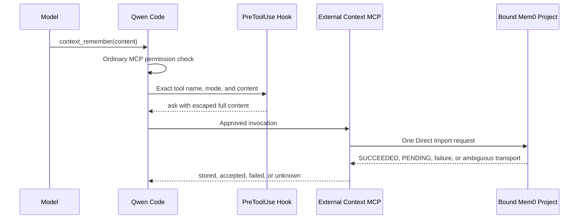

# Direct External Context Mem0 Write

**Status:** Implemented

**Date:** 2026-08-03

**Related proposal:** #7585

**Core replay prerequisite:** #8387

**Governed profile:** #7449

## Decision

Add one optional write tool to the private Direct External Context integration:
`context_remember({ content })`. It is registered only by a version 1 Mem0
configuration containing the strict `write: { enabled: true }` block. The
default extension manifest, existing version 1 configurations, Generic HTTP,
and version 2 auto-recall remain write-free.

The tool sends the validated text unchanged through Mem0 V3 Direct Import with
`infer: false`. It does not pre-search, summarize, normalize, retry, poll, cache,
or deduplicate. A separately installed `PreToolUse` command Hook displays a
reversible escaped representation of the complete text and asks the user to
confirm it. This confirmation is a direct-profile user-experience safeguard,
not a server-side authorization boundary.

## Scope

### Goals

- Let trusted collaborators save exact repository-shared text to one
  administrator-bound Mem0 Project.
- Keep the Project credential and `app_id` outside model-controlled input.
- Make the complete text visible before the MCP call executes.
- Perform at most one Provider request per approved tool invocation.
- Represent asynchronous and ambiguous Provider outcomes without claiming
  persistence or inviting automatic retry.
- Preserve all existing search and auto-recall contracts.

### Non-goals

- Generic knowledge-base ingestion or a provider-neutral write protocol.
- Personal memory, trusted user identity, per-user or per-document ACLs.
- Update, delete, delete-all, get-all, entity, event, or Project management.
- Client-side duplicate suppression or exactly-once delivery.
- DLP, retention, legal hold, tamper-resistant audit, or enforced approval.
- Protecting a Mem0 credential from trusted same-UID repository code.
- Auto-recall writes, headless approval, ACP, `serve`, or multi-workspace use.

## Architecture



The MCP process and confirmation Hook are separate processes. They share only
the pure content-validation and display-rendering code. The shipped Hook code
does not read the Provider configuration and contains no Provider write path.
Qwen command Hooks inherit ordinary third-party credentials from the parent
environment, however, so the Hook process may still receive the configuration
path and Mem0 key in its environment. This is not credential isolation. The
MCP never interprets a Hook decision; Qwen owns Hook execution and
confirmation.

The optional writer remains a private workspace interface:

```ts
interface ExternalMemoryWriter {
  remember(input: {
    content: string;
    signal: AbortSignal;
  }): Promise<RememberResult>;
}

type RememberResult =
  | { status: 'stored'; providerOperationId?: string }
  | { status: 'accepted'; providerOperationId: string }
  | { status: 'failed' }
  | { status: 'unknown' };
```

It contains no tenant, user, repository, namespace, `app_id`, metadata, filter,
or operation selector. The explicit factory creates a writer only for Mem0.

## Configuration and tool registration

The write block is deliberately not a Boolean toggle with a permissive false
case. Only this exact version 1 shape enables the tool:

```json
{
  "version": 1,
  "timeoutMs": 5000,
  "write": { "enabled": true },
  "provider": {
    "type": "mem0-platform-v3",
    "apiKeyEnv": "MEM0_API_KEY",
    "appId": "repository-memory"
  }
}
```

Missing `write` preserves the existing search-only server. `enabled: false`,
unknown write fields, Generic HTTP writes, and version 2 writes fail strict
configuration validation. The default extension manifest still includes only
`context_search`, so write capability cannot appear through ordinary extension
linking. Administrators must use the dedicated pinned MCP configuration whose
`includeTools` contains exactly search and remember.

The remember tool annotations are `readOnlyHint: false`,
`destructiveHint: false`, `idempotentHint: false`, and `openWorldHint: false`.
They describe behavior for clients; they are not permission or authorization.
The `idempotentHint: false` annotation also prevents the conservative MCP
replay policy introduced by #8387 from transparently repeating the call after
a connection failure.

## Content contract

The tool accepts one string named `content`. It rejects:

- More than 4000 Unicode code points.
- Empty text or text consisting only of Unicode whitespace, control, or format
  characters.
- Unpaired UTF-16 surrogates.

Valid content is not trimmed or normalized. Leading and trailing whitespace,
line breaks, astral characters, and ordinary control characters embedded in
otherwise visible content are sent exactly as supplied. The model cannot add
selectors or metadata to the Provider request.

The confirmation Hook validates the same content contract and reads at most
1 MiB from stdin. It requires the exact `PreToolUse` event and fully qualified
MCP tool name. Other events and tool names pass through so an accidentally
broad matcher cannot deny unrelated tools. `default`, `auto`, `auto_edit`,
`auto-edit`, and `yolo` return `ask`; matching requests with `plan`, unknown
modes, or invalid input return `deny`. The Hook accepts
both Auto Edit spellings because the Hook contract uses `auto_edit` while the
interactive scheduler currently forwards the `auto-edit` approval-mode value.
Extra tool arguments are ignored by both the Hook and MCP schema and never
reach the Provider.

The reason contains the complete text as a JSON string. JSON escaping makes
quotes, backslashes, newlines, and C0 controls reversible; the renderer also
escapes DEL/C1 controls and Unicode format characters such as bidi and
zero-width controls. Qwen marks synthetic Hook confirmations for literal text
rendering, so Markdown, inline code, HTML-like underline tags, and link targets
remain visible instead of being interpreted by the confirmation UI. The
Provider still receives the original string.

Literal rendering is implemented by the interactive TUI. ACP, headless, and
`serve` surfaces do not consume this display marker; the managed launcher must
continue to refuse those modes rather than relying on the confirmation text to
be rendered safely there.

When the complete reason does not fit in the constrained terminal view, the
confirmation shows the beginning plus an explicit hidden-line count. The
global `Ctrl-S` expansion then reveals the remaining reason before the user
decides. This display behavior does not change the
content sent to Mem0.

## Mem0 request and result semantics

The adapter sends exactly one request:

```http
POST /v3/memories/add/
Authorization: Token <repository-project credential>
Accept: application/json
Content-Type: application/json
```

```json
{
  "messages": [{ "role": "user", "content": "<exact content>" }],
  "app_id": "<administrator-configured value>",
  "infer": false
}
```

`infer: false` selects Direct Import. It skips Mem0 inference and duplicate
detection, so approving the same text twice can create two memories. The
integration intentionally does not add a hidden search or content hash because
neither would provide idempotency for an async remote operation.

Result mapping is conservative:

| Provider outcome                                                                                                                      | Tool result                    |
| ------------------------------------------------------------------------------------------------------------------------------------- | ------------------------------ |
| Valid `SUCCEEDED`                                                                                                                     | `stored`                       |
| Valid `PENDING` with UUID `event_id`                                                                                                  | `accepted` with operation ID   |
| Explicit `FAILED`, or HTTP 400, 401, 403, or 404                                                                                      | `failed` with stable MCP error |
| Timeout, cancellation, redirect, other HTTP status, broken or oversized response, invalid JSON, unknown status, or invalid identifier | `unknown` with MCP error       |

Mem0 Add normally returns `PENDING`, so `accepted` is the expected successful
result and means queued, not persisted. `stored` is retained only for a valid
synchronous `SUCCEEDED` response. `failed` is a definitive rejection and tells
the model not to retry without changing the content or configuration.
`unknown` states that the Provider may already have accepted the write and
tells the model not to retry automatically. The integration never polls the
event or retries. User cancellation likewise does not prove that no record was
created.

Errors and tool results never include the content, credential, Provider URL,
raw response, or raw upstream error. The integration emits no local per-request
log. Provider access logs remain outside its control.

## Confirmation and trust boundary

The managed settings put search in `permissions.allow` and remember in
`permissions.ask`. In a normal interactive session, Qwen therefore shows its
ordinary server/tool confirmation before `PreToolUse` shows the full content;
two confirmations are intentional. YOLO bypasses ordinary `permissions.ask`,
but a working Hook still asks once. A post-Hook ask is re-executed without
running the same Hook again, so approval does not create a loop.

Qwen command-Hook transport failures retain Qwen's existing fail-open
semantics. A user who can disable the Hook, alter the launcher, or obtain the
write credential can bypass this flow. The launcher reduces accidental bypass
by fixing Qwen, Node, MCP, Hook, configuration, settings, `QWEN_HOME`, working
directory, and an environment allowlist; refusing user arguments, headless,
ACP, `serve`, resume/continue, and startup YOLO; and disabling native memory,
speculation, chat recording, telemetry, and usage statistics. These measures
do not create process isolation. On Windows, the allowlisted `PATH` must
resolve `powershell` to the system executable, and PowerShell profiles must be
absent or administrator-controlled because Core invokes the configured shell
by name.

Each repository security domain requires a distinct Mem0 Project and
Project-specific credential. `app_id` is classification inside that Project,
not authorization. A key capable of Direct Import may also allow other Project
operations outside this MCP surface. Use the governed profile in #7449 when
credentials, identity, policy, approval, or audit must be enforced outside the
CLI user's process.

Search results remain untrusted reference data even when the model proposes
writing them back into the same corpus. Approval does not upgrade their trust.
The reviewer must inspect the complete content because storing retrieved or
injected text can propagate it to later users and model turns.

## Verification and rollout

Unit tests cover strict configuration, content boundaries, exact request
mapping, all result classes, transport ambiguity, conditional tool
registration, bounded stable MCP output, and confirmation escaping and modes.
Interactive E2E uses a fake model, real TTY Qwen process, pinned MCP process,
real command Hook, and fake Mem0 endpoint to verify denial creates no request,
approval creates one request, normal mode uses two confirmations, YOLO still
shows the content confirmation, and `PENDING` is reported only as accepted.

Roll out through a fake service, an isolated temporary Mem0 Project, one
trusted repository, and then a small trusted team. Roll back by removing the
write-enabled MCP configuration, Hook, and credential; restoring the read-only
version 1 configuration; and restarting Qwen. Existing Mem0 records are not
deleted or migrated by rollback and must be handled by an administrator at the
Provider.

## References

- [Mem0 Direct Import](https://docs.mem0.ai/platform/features/direct-import)
- [Mem0 Add Memories](https://docs.mem0.ai/api-reference/memory/add-memories)
- [Mem0 Organizations and Projects](https://docs.mem0.ai/api-reference/organizations-projects)
- [MCP Tool Annotations](https://modelcontextprotocol.io/specification/2025-11-25/schema)
