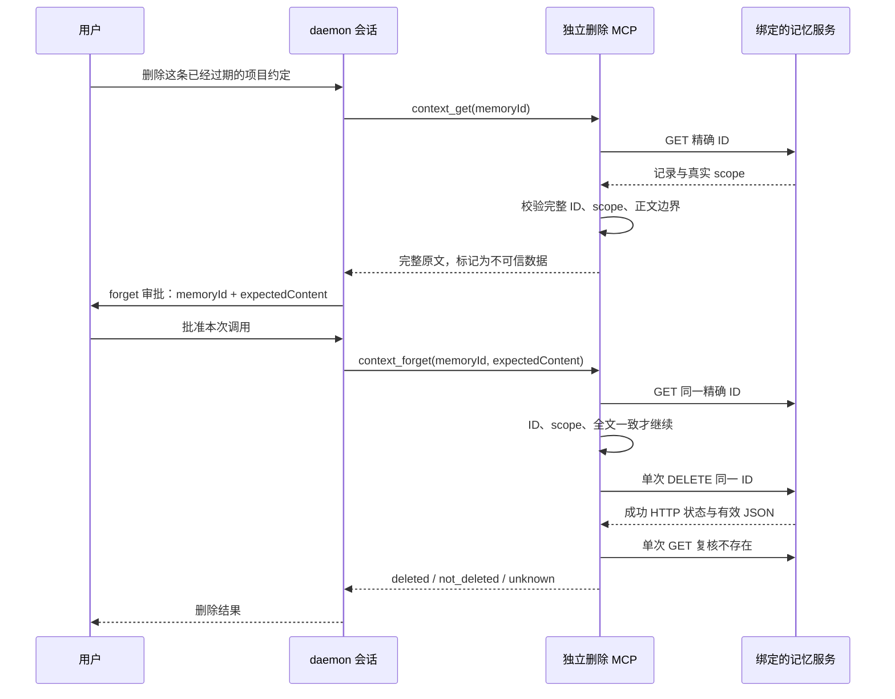

# Mem0 Extension：daemon 显式删除设计

**状态：** 本地实现完成，包内、daemon 和独立协议验收通过；浏览器批准/拒绝已验证，但额外 DOM 全文逐字比较因控制工具超时未完成。Holo 真实协议验收缺少凭证。本文保留设计决策，当前使用说明见 `integrations/external-context-mem0/README.md`，验收明细见 `.qwen/e2e-tests/external-context-mem0-explicit-delete.md`。

**日期与基线：** 2026-09-08；调研时 `origin/main` 为 `0e572dc82f7c02dc7a99f9499e72674a2e9bdf91`，已包含写入 PR [#11311](https://github.com/QwenLM/qwen-code/pull/11311)。本文引用的 Mem0、MCP 权限与参数展示源码已对照该基线，相关实现与开始实施前的工作树一致。

## 1. 决策与范围

首版为可信 daemon workspace 增加管理员单独启用的外部记忆删除入口，支持**读取一个明确目标，再按 ID 删除一条记录**。采用无状态的两个工具：`context_get({ memoryId })` 获取完整目标，`context_forget({ memoryId, expectedContent })` 经现有权限策略后复核目标并删除。

确认正文由模型搬运，但执行端必须从绑定的服务重新读取并核对；模型传入的 ID、正文或“已经确认”声明都不是服务端事实。无需新增确认 token、快照缓存、持久化删除任务或 Core 协议。

首版面向已注册、可信的普通 workspace，支持各 workspace 的独立服务绑定。以 Holo 为真实服务验收目标；针对 Holo 只完成公开协议和代码调研，不声明其删除链路已经可用。自动删除、语义匹配后直接删除、批量清空、级联删除、恢复、后台重试、CLI/TUI 接入、Conversations 和跨 workspace cwd 迁移不在首版范围内。本地 `/forget` 继续管理本地 auto-memory。

## 2. 实现前核对的事实

| 事实                                                                                                                                             | 设计影响                                                                              |
| ------------------------------------------------------------------------------------------------------------------------------------------------ | ------------------------------------------------------------------------------------- |
| V2 搜索输出把 ID 截断到 128 code point、正文截断到 1000，并为总输出预算继续缩短正文。                                                            | 搜索只能提供候选，不能提供完整删除确认；ID 不能继续静默截断后作为删除定位符。         |
| writer 的 `stored` 返回最长 256 字符的完整 ASCII memory ID；`accepted` 可能只有操作 ID。                                                         | 完整写入回执可提供候选 ID；不将 operation ID 自动转换成 memory ID。                   |
| 普通 MCP 的审批在实际执行工具之前发生，审批载荷携带当前完整参数。                                                                                | delete handler 内部的 GET 无法回填先前审批；完整正文须作为下一次 forget 调用的参数。  |
| Web Shell 已支持通用 MCP 参数的完整字面展示和格式字符转义。                                                                                      | 复用这条路径，预计不改 UI 和 daemon wire protocol。                                   |
| 现有 MCP client 没有协商 elicitation，MCP App 结果资源也不是执行前确认。                                                                         | 不依赖额外客户端弹窗，不安装 TUI 专属确认 Hook。                                      |
| Holo 文档列出单条 GET/DELETE 使用同一个带记录 ID 的路径，但未给出完整 GET/DELETE 回执或条件删除语义。                                            | 路径可作为验收起点；不能推断 scope 字段、404、响应正文或原子条件删除行为。            |
| Mem0 Platform 文档的 GET 返回顶层 scope，未找到为 404；当前 OSS server 的 GET 未找到可返回 HTTP 200 + JSON null，删除成功 message 的标点也不同。 | 明确配置未找到的表示；DELETE 按 HTTP 状态和 JSON 解析处理，不自动探测或改用批量接口。 |

Holo 路径依据：[创建和调用长记忆服务](https://www.alibabacloud.com/help/tc/hologres/user-guide/create-and-use-long-memory-service)。Platform 回执依据：[Get Memory](https://docs.mem0.ai/api-reference/memory/get-memory)、[Delete Memory](https://docs.mem0.ai/api-reference/memory/delete-memory)。OSS 依据为固定提交 [dae67f74 的 server](https://github.com/mem0ai/mem0/blob/dae67f74f5cc7bf138c7d7d6f9cec5ce4b4373b3/server/main.py#L443) 和 [memory 实现](https://github.com/mem0ai/mem0/blob/dae67f74f5cc7bf138c7d7d6f9cec5ce4b4373b3/mem0/memory/main.py#L1208)，它们不是 Holo 部署版本的实现证明。此次限定检索未找到独立的外部记忆显式删除 issue，不据此断言没有其他跟踪项。

## 3. 用户流程



上图采用推荐的人审配置。拒绝或取消审批时，forget handler 尚未执行，没有它的前置 GET，也没有 DELETE；之前独立的 context_get 可能已经读取过目标。没有完整目标、存在多个候选或全文超限时，应先澄清目标或使用服务管理接口，不把搜索摘要当作确认原文。

`context_get` 是正常流程中的辅助读取，并非授权前置凭据。用户已经提供完整 ID 和原文时，可以直接请求 forget；forget 自身的完整复核足以保护执行目标。无状态设计不要求证明之前发生过某一次 get。

## 4. 工具契约

### 4.1 读取目标：context_get

输入只有 `memoryId`，严格拒绝未知字段。输入及响应 ID、响应正文统一采用 4.2 的边界：1–256 个允许的 ASCII ID 字符，拒绝整段 `.`/`..`；正文允许空白，最多 4000 个 Unicode code point，拒绝未配对 surrogate，不截断或规范化。最多执行一次精确 GET。仅当响应 ID 完全相同、所有配置的 scope 字段都相等且正文能完整处理时，才返回目标；先验证归属，再向模型和客户端暴露正文。

成功结果包含 `status: "found"` 和 `untrusted_deletion_target: { notice, memoryId, content }`；失败返回 `status: "unavailable"` 或 `"failed"` 与固定说明，不回显异 scope 内容、服务地址或上游错误。未找到和归属不匹配都可归为 unavailable，不提供跨 scope 存在性探测结果。目标正文始终是数据，不是指令。

这是独立的完整目标协议，不复用 V2 搜索的 1000/4000 字符压缩器。annotation 为 `readOnlyHint: true`、`idempotentHint: true`、`destructiveHint: false`、`openWorldHint: true`。其授权仍由现有权限策略决定，不因 read-only annotation 自动授权。

### 4.2 删除目标：context_forget

输入严格限定为 `memoryId` 和 `expectedContent`。不接受 scope、URL、凭证、operationId、query、filters、批量数组、级联选项或 `confirmed: true`。

- `memoryId`：1–256 个 ASCII 字符，沿用 writer 的字母、数字、点、下划线、冒号、连字符集合，但必须额外拒绝整段 `.` 和 `..`。禁止空值、百分号、斜线、反斜线、查询、片段和控制字符，不 trim、不规范化、不补全 ID。
- `expectedContent`：0–4000 个 Unicode code point，拒绝未配对 surrogate，完整保留空白、换行和控制/格式字符。**允许空字符串或纯空白正文**，因为清理错误记录也包括空记忆；不能直接复用 writer 的“正文必须非空白”校验。超过上限明确拒绝，不能截断。
- 删除前精确 GET：必须核对返回 ID 与输入逐字符相等；所有配置的 user/agent/app scope 均须存在且逐字符相等；完整正文须等于 expectedContent。缺失、类型错误、歧义、模型摘要、Unicode 归一化差异或任何不匹配都产生零 DELETE。
- annotation 为 `readOnlyHint: false`、`idempotentHint: false`、`destructiveHint: true`、`openWorldHint: true`。HTTP DELETE 的通常幂等语义不能被用作在此 MCP 流程中透明重放的授权。

同一输入再次调用是新的显式请求，会重新走当前权限策略和 GET 复核；没有本地去重账本。若记录已不存在，返回 not_deleted，不再发送 DELETE，也不声称它一定由上次调用删除。

### 4.3 完整 ID 的来源

可使用 writer 的 `stored.memoryId`、完整目标读取结果或管理员明确提供的精确 ID。搜索结果只可用于选择候选，选中后仍应读取完整目标。

同一个实现 PR 应修正 Mem0 reader 的 ID 截断：保持其输出 schema 的 128 code point 上限，遇到超长 ID 时跳过该记录，不能返回裁剪后的前缀。正文的现有搜索摘要行为保持不变。长度 129–256 的完整 ID 仍可从 writer 回执或服务管理界面传入 context_get。无需扩大旧读取协议或自动恢复缺失的 ID 后缀。

不将 `accepted.providerOperationId` 当记录 ID；删除 API 不增加 operationId 字段。两种 ID 可能使用同一种字符串格式，不能声称仅靠正则就能区分，最终以精确记录读取为准。

## 5. 配置与有限协议

建议增加同一包内的独立 `dist/delete-main.js`，MCP server 名为 `external-context-mem0-delete`，只暴露 context_get 和 context_forget。管理员显式配置 workspace MCP 的 cwd/env/includeTools，默认 Extension manifest、V2 搜索、V3 Auto Recall、V4 writer 均不改变工具集合。

使用独立 `QWEN_EXTERNAL_CONTEXT_MEM0_DELETE_CONFIG` 和严格的 `DeleteInstanceConfigV5`。这里的 V5 仅指 Mem0 删除实例配置版本，不改变 Qwen settings 的版本。选择新入口和新 schema 可独立部署读取、写入、删除权限，避免已经启用 writer 的 workspace 自动获得删除能力。

```json
{
  "schemaVersion": 5,
  "repositoryRoot": "/workspace/project",
  "dialectPath": "/etc/qwen/external-context/delete.dialect.json",
  "endpoint": {
    "origin": "https://memory.example.com",
    "basePath": "",
    "allowInsecureHttp": false
  },
  "credentialEnv": "MEMORY_DELETE_API_KEY",
  "scope": { "userId": "repository-memory" },
  "timeoutMs": 10000
}
```

复用现有的有界配置读取、绝对路径、canonical repository/cwd containment、静态 endpoint 校验及最后读取凭证的顺序。至少固定一个 scope；凭证必须能在同一目标上读取并删除。配置一次加载，重启生效，不从请求、session/client ID 或 cwd 变化动态推导记忆库。

有限 `DeleteDialectV1` 的合成示例：

```json
{
  "deleteDialectVersion": 1,
  "id": "organization-memory-delete-v1",
  "auth": "authorization-token",
  "record": {
    "pathPrefix": "/memories/",
    "pathSuffix": "",
    "idField": "id",
    "contentField": "memory",
    "notFound": "http-404"
  }
}
```

这不是 Holo preset。语法只允许以下差异：

- Auth 复用已有 Token、Bearer、x-api-key 枚举。
- GET、DELETE 共享同一个记录地址。pathPrefix 是通过现有静态路径校验、以 `/` 结束的绝对路径；pathSuffix 只能为 `""` 或 `"/"`。把已验证的 ID 作为单个路径段进行编码。必须拒绝 `.`/`..`，避免 URL 规范化把单条 DELETE 变成集合 DELETE。禁止请求模板、动态 origin、任意 headers、GET/DELETE body、filters 和批量路径回退。
- 成功 GET 只接受 HTTP 200 的单个根对象；idField 复用 `id` / `memory_id`，contentField 复用 `memory` / `content` / `text`。scope 只读取服务定义的顶层 user_id、agent_id、app_id，全部已配置字段严格匹配，不从自定义 metadata 猜归属。
- `record.notFound` 只能为 `http-404` 或 `null-200`，分别匹配 HTTP 404、HTTP 200 且完整 JSON 值为 null。只按选定规则解释；空数组、空对象、缺字段和另一种形状不是“不存在”。
- DELETE 与官方客户端一致：接受成功 HTTP 状态并解析有界 UTF-8 JSON，不匹配 message 文案，也不额外约束 status/event/cascade_count/error 字段。随后必须执行一次精确 GET，只有确认不存在才返回 deleted。
- 202 等成功状态仍需有效 JSON 和随后的精确 GET 确认不存在；不轮询。204 空响应、无效 JSON 或非成功 HTTP 状态返回 unknown，不自动重试。

每个配置文件最多 64 KiB；每个 HTTP 响应最多 1 MiB，严格 UTF-8/JSON，有效目标正文再受 4000 code point 上限约束。禁用重定向。timeoutMs 允许 100–30000 ms，forget 的一个总 deadline 覆盖前置 GET、DELETE 和复核 GET，开始于工具实际执行后，不包含人工审批等待。合并调用取消信号，不给每个阶段重新发放完整时间预算。

## 6. 结果与请求次数

每次 forget 最多一个前置 GET、一个 DELETE、一个成功后的 GET 复核。没有内部重试、预搜索、后台任务或补偿写入。

| 状态          | 条件                                                                                 | 含义                                                                                                                          |
| ------------- | ------------------------------------------------------------------------------------ | ----------------------------------------------------------------------------------------------------------------------------- |
| `deleted`     | 成功 HTTP 状态与有效 JSON，且紧接的一次精确 GET 按选定协议确认不存在                 | 成功 HTTP 状态与有效 JSON，精确读取已复核不存在，不解释服务回执正文；不保证所有索引、备份或历史消息同步清除。                 |
| `not_deleted` | 输入/配置不可用、调用在 DELETE 前取消，或前置 GET 失败、找不到目标、scope/正文不匹配 | 本次没有发送 DELETE；使用固定 reason 区分 invalid_input、target_unavailable、target_changed、verification_failed、cancelled。 |
| `unknown`     | DELETE 已开始后取消、超时、断线、非预期 HTTP/回执，或成功回执后的 GET 没能确认不存在 | 本次可能已删除；停止，不自动重试，不声称恢复或撤销。                                                                          |

输出包含状态、合法输入的 memoryId 和固定说明；不回显正文、credential、endpoint 或上游 message。not_deleted/unknown 使用 MCP isError；非法 MCP schema 也可能在 handler 前被协议层直接拒绝。

DELETE 自身的 404 不能当作“本次删除成功”；成功响应后的 GET 失败也不能借搜索结果为空补成 deleted。非成功 HTTP 状态或 JSON 解析失败立即返回 unknown。用户可显式发起 context_get 核查。

## 7. 审批、信任与并发边界

### 7.1 复用 daemon 权限

推荐配置为默认审批模式、server `trust: false`、`permissions.ask` 精确匹配 `mcp__external-context-mem0-delete__context_forget`。includeTools 包含 context_get 和 context_forget。context_get 的只读授权单独按管理员现有策略决定；不使用 trust:true 一并放开两个工具。

现有 Web Shell 通用参数正文展示 memoryId 和完整 expectedContent，控制/格式字符用可逆转义显示；SDK 客户端读取已有 rawInput。模型伪造或改写原文会导致执行前复核失败，不能因为客户端批准了一个字符串就把它当作真实记录正文。该保证来自执行前比较，并不声称审批 UI 已经认证来源或每次调用都先执行过 context_get。

YOLO、普通 allow、PermissionRequest Hook 代批和改参数继续沿用现有语义。修改后的参数仍须通过相同 ID/scope/全文复核，但不能报告成用户已人工确认这些新参数。daemon 客户端回复不支持通过 updatedInput 改写正文；应拒绝后重新发起调用。无新 PreToolUse 确认 Hook，不新增不可绕过的人审模式。

### 7.2 明确 GET 与 DELETE 的间隔

本版提供的是“删除前核对完整正文，再按 ID 删除该记录”，不是版本原子删除。审批期间发生的正文变化会被执行前 GET 检出；**最后一次 GET 完成后到 DELETE 执行之间的变化仍可能发生**。该 ID 的记录在此间被更新，其最新内容仍可能一同删除。

随机 token、客户端内容哈希、进程内锁或多做一次 GET 都不能消除这段远端竞态。若要求删除瞬间必须仍是某一版本，需要服务真正实现 ETag/If-Match 或等价的原子条件删除。本次查阅的 Holo/Platform 文档没有提供该契约，不能直接假设发送 If-Match 就会生效；首版不增加伪条件删除开关。

workspace 归属同样不能依靠最后一次 GET 获得原子保证。首版受管部署必须核实记录 ID 不复用，并核实真实 scope 归属不可迁移，或由服务凭证/删除接口独立限制到固定 scope；所选返回 scope 字段必须是服务的真实分区字段，不能是可任意填写的 metadata。无法满足这些条件的服务，不作为多 workspace 安全删除 profile 验收通过，应先补服务端约束。凭证本身仍承担访问授权；scope 配置不是租户 ACL。

### 7.3 生命周期与删除后的数据

配置和 transport 依赖所属 runtime，继续用 live-session-owner 审批回复和 selected-runtime MCP 管理；不新增 memory REST 路由，不回退 primary。重启配置前结束待处理调用，再使新进程加载新绑定。此无状态方案没有 token TTL 或“进程重启使快照失效”的承诺；不得把已发送或中断的旧调用自动重新发起。

REST SSE 断开不等于取消 pending approval，需显式取消 prompt/session；其他传输按已有生命周期处理。取消或 runtime 退出发生在 DELETE 之后时不能撤销远端操作。跨 session/无效/重复/过期投票不能触发新执行，这些路径需要真实 daemon 回归。

deleted 不代表服务搜索索引已同步，也不会移除 Qwen 已有 transcript、已发给模型的上下文、服务访问日志或备份。自然语言复述旧信息不等于删除失败；验收应在新客户端/新会话检查实际搜索回执及模型输入。确认全文会进入普通工具参数与会话记录，本功能不新增正文日志、缓存或本地备份。

## 8. 实现拆分

| 层             | 预计改动                                                                                                                        |
| -------------- | ------------------------------------------------------------------------------------------------------------------------------- |
| 独立入口与工具 | 当前包新增 delete-main、delete-mcp、delete-profile，注册完整目标读取及显式删除。                                                |
| 配置与协议     | 新增 V5/delete dialect schema、类型和 loader，复用已有小型验证助手；保持 V2/V3/V4 严格版本回归。                                |
| HTTP           | 新增单条读取验证器和 get-check-delete-check 流程；复用认证、有界读取，避免复用会丢弃 scope 的搜索归一化。                       |
| 搜索候选       | 修正当前包 profile 的超长 ID 处理：跳过而非裁剪；保留正文摘要和输出 schema。                                                    |
| 展示与宿主     | 预计只新增现有 adapter/ToolApproval 与真实 daemon 回归，不改 Core、ACP 协议或 scheduler。若验证发现缺口，再做有证据的最小修复。 |
| 发布与说明     | 包 build/files 包含独立删除入口、受管 workspace 配置示例和 README；默认 manifest 不启用删除。                                   |

按一个聚焦实现 PR 组织上述范围。2026-09-08 经用户授权开展本地实现；真实 Holo 删除和云配置变更尚未执行。

## 9. 验收门槛与待确认事实

合成测试必须覆盖：候选 ID 不截断、点路径 ID 不得落到集合、空正文删除、scope 与全文复核、模型伪造参数、审批期间变更、单次 DELETE、删除后一次精确复核、未知回执、跨 workspace 隔离、取消与禁止透明重放、真实浏览器完整显示。计划及执行记录位于 `.qwen/e2e-tests/external-context-mem0-explicit-delete.md`；全局 CLI 基线见同目录 `external-context-mem0-explicit-delete-baseline.md`。

真实 Holo 验收前先核对当前访问条件。上一轮 2026-09-07 的隔离 scope list 返回 403，create 为零；该旧结果不能代表今天的连通性。2026-09-08 实施预检时，此前临时凭证已不可用，未发送任何真实服务请求；详见 `.qwen/e2e-tests/holo-delete-preflight.json`。

Holo 待确认的事实为：精确 GET 的完整 ID/正文/真实 scope 形状，未找到的表示，单条 DELETE 的同步回执、无级联/批量副作用，以及 ID/归属的生命周期保证。确认这些事实后，使用本次新建的合成目标和同/异 scope 对照记录完成拒绝、批准、精确 GET 消失、搜索传播和对照记录不变验证，再按精确 ID 清理。不得删除既有业务记录。

服务端协议验收通过后才能宣布相应服务支持。成功 HTTP 状态不是删除完成的充分条件，必须解析 JSON 并通过精确 GET 确认不存在；不静默选择其他路径。

## 10. 设计调研基线的代码依据

- `integrations/external-context-mem0/src/profile.ts:28`、`:98`、`:112`：输出 ID 上限及候选压缩。
- `integrations/external-context-mem0/src/request-engine.ts:233`：搜索 item 归一化不保留 scope。
- `integrations/external-context-mem0/src/write-request-engine.ts:128`、`src/write-config.ts:24`：写入 ID 范围、固定启动绑定和 credential 读取顺序。
- `packages/core/src/tools/mcp-tool.ts:359`、`:449`：普通 MCP 审批详情与禁止不安全重放。
- `packages/cli/src/acp-integration/session/Session.ts:12609`、`:12731`、`:13250`：Hook 改参、rawInput 审批与之后的实际执行。
- `packages/web-shell/client/adapters/transcriptAdapter.ts:76`：通用完整参数 fallback 与转义。
- `packages/core/src/tools/mcp-client.ts:446`、`packages/core/src/utils/invocation-context.ts:14`：client capabilities、调用标识不提供 cwd 或租户授权。
- `packages/cli/src/ui/commands/forgetCommand.ts:39`：已有本地记忆删除，与外部记录 API 分开。
