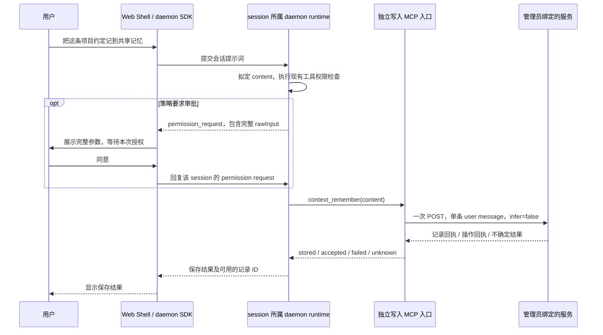

# 管理员自定义 Mem0 Extension：daemon 显式写入设计

**状态：** 已完成本地实现及合成服务验收；真实 Holo conformance 因 HTTP 403 未完成。

**日期：** 2026-09-07。

**实现基线：** 开发开始时更新的 `origin/main`，`63578c7eb3992aae9508b985af1660720b11380b`。实现位于本地 `codex/mem0-daemon-write` 分支；下文区分已验证行为、已有宿主语义与尚未完成的服务验收。

## 1. 决策与范围

在现有 `@qwen-code/external-context-mem0` 包中增加**管理员单独启用的写入 MCP 入口**，提供 `context_remember({ content })`，首版用于 daemon。用户从 Web Shell 或 daemon SDK 发起保存请求，工具沿用 daemon 的 MCP 调用与权限审批通道，将正文原样提交给该 workspace 绑定的服务。

推荐部署使用 `trust: false` 和针对 writer 工具的 `permissions.ask`：需要审批时，客户端展示完整参数，用户同意后执行一次写入。管理员配置自动授权时沿用现有权限语义。本版不增加独立正文确认 Hook，也不新增外部记忆 REST 写入路由。

第一阶段面向 daemon 中已注册、可信的普通 workspace，支持多个 workspace 分别配置，并允许可信协作者共享同一个 workspace 记忆库，以已经使用的 Holo 为首个真实服务验收目标。服务地址、凭证、固定 scope 和协议差异继续由管理员文件描述；不增加 Qwen 内置 provider 或厂商 preset。Conversations、自动创建的临时 workspace 和跨 workspace 的会话迁移不在首版验收范围内。

这一阶段交付的是“保存一条明确的外部记忆”：不自动提取会话、不自动写入、不合并或改写已有记录、不批量导入，也不增加删除工具。删除另行设计；同步成功返回真实 memory ID，为之后按 ID 删除保留基础；异步受理可能只有操作编号。

## 2. 调研结论

| 已核对事实                                                                                                                                       | 对设计的影响                                                                                                                          |
| ------------------------------------------------------------------------------------------------------------------------------------------------ | ------------------------------------------------------------------------------------------------------------------------------------- |
| 当前公开 Extension 的 `main.ts` 只接受 InstanceConfigV2，MCP 只注册 `context_search`；Auto Recall 入口只接受 V3；读取 dialect 的未知字段被拒绝。 | 不在已发布 V2/V3 或 DialectV1 中悄悄加入写入含义。                                                                                    |
| 默认 manifest 的 MCP `cwd` 是 Extension 安装目录，`includeTools` 只有搜索。                                                                      | 新写入需独立受管 MCP 配置，不能把安装目录当用户仓库，也不能只注册工具而忘记 allowlist。                                               |
| 旧 Direct 集成已在 #8507 实现 content-only 写入、完整正文确认、非幂等 annotation 和四态结果。                                                    | 复用已经验证的语义；不搬入旧的固定 Mem0 V3 provider 分支。                                                                            |
| Core 根据 read-only / idempotent annotation 决定是否透明重放 MCP 调用。                                                                          | 写工具必须同时声明 `readOnlyHint: false` 和 `idempotentHint: false`。                                                                 |
| daemon 的 ACP Session 在普通工具审批后执行 PreToolUse；其中 `ask` 被视为拒绝，没有 TUI 的再次确认流程。                                          | 删除原方案中的正文确认 Hook，使用 daemon 原生审批。                                                                                   |
| ACP 审批请求已有完整 `rawInput: args`；Web Shell 的通用 MCP 正文会回退到 title，并可能因与 title 相同而被隐藏。                                  | 补通用 MCP 参数展示即可，不为 Mem0 新增审批协议。                                                                                     |
| 每个 workspace runtime 使用自己的环境和 ACP bridge；本地 MCP pool 在 ACP agent 内，并将 stdio cwd/env 纳入连接指纹。                             | writer 按 runtime 配置；不能把 primary workspace 的配置放入 daemon 全局环境再继承给其他 workspace。                                   |
| 2026-09-07 留存的两次 Holo 写入响应都是 HTTP 200、`results` 中一条带 `id` 的记录，耗时 2933 / 3164 ms。                                          | 支持直接返回 memory ID 的同步结果；写入独立使用较长超时。该证据不等于本设计的 Qwen 写入链路已通过验收。                               |
| Holo 文档提供 `/v1/memories/`，但示例省略 `infer`，描述的是服务端抽取；搜索文档还存在 GET/POST 表述差异。                                        | 端点和协议用客户文件及实际接口验收固定，不通过产品名推断兼容性。当前留存响应没有完整请求正文，不能单独证明 `infer:false` 的完整语义。 |
| Mem0 当前 Direct Import 文档说明 `infer:false` 原样存储；其当前去重和同步响应描述已不同于旧 Direct 设计记录。                                    | 不把旧文档的“总是异步”或“不去重”泛化为所有服务的保证；Extension 自身不承诺去重或 exactly-once。                                       |

相关 issue 的定位：[#9951](https://github.com/QwenLM/qwen-code/issues/9951) 仍开放，包含 OSS 协议写入需求，但采用旧私有 provider 扩展路线；[#9964](https://github.com/QwenLM/qwen-code/issues/9964) 是对应旧路线的交互测试补充。两者可作为需求与验收参考，不能视为本设计已实现。[#7449](https://github.com/QwenLM/qwen-code/issues/7449#issuecomment-5350606639) 的企业 Gateway 已按 not planned 归档，本阶段不恢复该项目。

## 3. 用户流程与工具契约



拒绝、取消或仍在等待审批时不调用 writer；明确自动授权时省略人工审批。审批生命周期和策略边界见第 6 节。

工具唯一输入是 `content: string`。最多 4000 个 Unicode code point，拒绝空白、纯控制/格式字符、未配对 surrogate 和未知参数。有效正文保留首尾空白、换行和 Unicode，不截断、不归一化、不静默脱敏。正文需要调整时先重新展示并确认，不能在确认之后修改将要写入的文字。

模型不能提供 userId、appId、agentId、URL、headers、metadata、filters、memory ID、`infer` 或重试选项。工具说明要求只在用户明确要求保存时调用；这条说明是模型行为指导，是否允许执行由现有 daemon 工具权限策略决定。自动授权模式下不声称每次都有人工正文确认。

工具 annotation 为 `readOnlyHint: false`、`idempotentHint: false`、`destructiveHint: false`、`openWorldHint: true`。非破坏性描述以服务遵守“原样新增”协议为前提；annotation 本身不提供授权或服务端行为保证。

结果正文使用固定文本，不回显完整记忆、服务 URL、上游 message 或原始错误。结构化结果包含状态和经过校验的 memory ID / operation ID。ID 是不可信数据，界面按字面量显示；未来删除必须区分两种 ID，不能拿 operation ID 删除记忆。

## 4. 配置与部署

### 4.1 独立入口，而不是扩大默认工具集合

新增的 `dist/write-main.js` 继续放在同一个包中。管理员通过独立 MCP server 名 `external-context-mem0-write` 启动 writer，`includeTools` 精确包含 `context_remember`。默认 `qwen-extension.json` 仍只启动搜索入口，不静态安装写入或确认 Hook。

| 部署方式        | 读取入口                     | 写入入口                         |
| --------------- | ---------------------------- | -------------------------------- |
| daemon 首版闭环 | 现有 V2 `context_search` MCP | 在同一 workspace 单独启用 writer |
| 只写部署        | 不要求读取入口               | 可单独启用 writer                |
| 只读部署        | 现有读取入口                 | 不启动 writer                    |

writer 不额外执行搜索，也不改变读取入口的选择规则。Auto Recall 的 V3 Hook 与 writer 在配置上独立，但 daemon 是否提供其所需的非空 `submitted_prompt` 和 cwd 应单独验证；本设计不把 CLI/stream-json 上的 Auto Recall 验证当作 daemon 支持证据，也不把它列为 daemon 写入首版的前置条件。

### 4.2 明确的新写入配置

使用独立 `QWEN_EXTERNAL_CONTEXT_MEM0_WRITE_CONFIG` 环境变量和严格的 `WriteInstanceConfigV4`。新入口只接受 V4，原读取入口仍只接受各自的 V2/V3。V4 的存在及管理员启动 writer 即表示启用，不再叠加一个多余的 `enabled` 开关。

```json
{
  "schemaVersion": 4,
  "repositoryRoot": "/workspace/project",
  "dialectPath": "/etc/qwen/external-context/write.dialect.json",
  "endpoint": {
    "origin": "https://memory.example.com",
    "basePath": "",
    "allowInsecureHttp": false
  },
  "credentialEnv": "MEMORY_WRITE_API_KEY",
  "scope": { "userId": "repository-memory" },
  "timeoutMs": 10000
}
```

沿用现有 64 KiB 文件上限、绝对路径、固定 origin/static path、禁用重定向、配置校验后才读取凭证、启动时一次加载和重启生效规则。`timeoutMs` 明确必填，建议 10000 ms，允许 100–30000 ms；同时合并调用取消信号。这里的时间预算覆盖 HTTP 请求及响应读取，不包括用户考虑是否确认的时间。

受管 MCP 配置必须把 `cwd` 固定到对应 runtime 的真实 workspace。启动时 canonicalize `repositoryRoot` 与 `process.cwd()`，拒绝根目录、非目录、仓库外目录和软链接逃逸。这个检查只验证进程启动位置，**不能证明每次 MCP 请求来自哪个 workspace**；会话归属依赖 daemon 现有 runtime 路由。

管理员为每个启用写入的 runtime 配置专用 MCP 定义、V4 路径和凭证环境。现有 runtime 环境传入各自 ACP 子进程，再由 MCP 配置提供 writer 的 cwd/env。未启用写入的 runtime 不注册该 MCP server；不能在 daemon 全局 `childEnvOverrides` 或默认配置中放入 primary 的 writer 绑定，让其他 workspace、临时 workspace 自动继承。客户端在 session 创建时传入的同名 MCP 定义具有覆盖优先级，因此这套方案仍面向可信客户端，受管配置不是针对恶意客户端的服务端隔离边界。

记忆库绑定固定 workspace 配置，不从 prompt、session ID、client ID 或模型参数推导 scope。调用元数据目前只有会话、提示词和发起客户端标识，没有 cwd。`/cd` 不应被解释为自动切换记忆库；若原 writer 仍可用，它继续使用原固定 scope。切换到另一个记忆库，应进入已配置的另一个 workspace 会话。跨 workspace 的 cwd 迁移、临时 worktree 与仓库记忆的自动映射留到后续设计。

MCP pool 的连接指纹包含 cwd/env，但同一路径的配置文件内容变更不会自动变更指纹。更新配置应先结束该 runtime 待处理的写调用，再通过现有 selected-runtime MCP 重启/重载机制使配置重新加载；不在请求中途热切换目标，也不自动重放未完成写入。实现验收必须证明新进程读取了新配置。

读写配置可以引用不同权限的凭证环境变量；管理员必须将 endpoint 与逻辑 scope 配成同一个目标库，并通过“写入后另一用户召回”验收。不引入跨配置发现、自动复制或动态切换机制；独立配置也意味着本版不自动检测读写目标不一致。固定 scope 是路由参数，实际授权由服务端凭证和服务策略决定。

### 4.3 单独的有限写入 dialect

新增独立的 `WriteDialectV1`，与读取 `DialectV1` 分开解析，不给读取语法增加写字段。以下是无厂商标识的合成示例，不是已可使用的配置：

```json
{
  "writeDialectVersion": 1,
  "id": "organization-memory-write-v1",
  "auth": "authorization-token",
  "create": {
    "path": "/memories",
    "userIdLocation": "json",
    "agentIdLocation": "omit",
    "appIdLocation": "omit"
  },
  "response": {
    "completion": "records",
    "collection": "results",
    "idField": "id"
  }
}
```

封闭语法只覆盖已经明确需要的差异：

- Auth 沿用三种枚举：Token、Bearer、x-api-key。
- 方法固定 POST，JSON 固定为单条 `messages: [{role: "user", content}]` 和 `infer: false`，不提供 body 模板或 role 选项。
- user/agent/app 的位置只允许顶层 `json` 或 `omit`；配置有值必须发送，没有值必须 omit；至少绑定一个固定 scope。读取时使用 filters，不意味着写入也能使用 filters。
- `response.collection` 只允许 `results`、`root-array`、`root-object`；`idField` 只允许 `id` 或 `memory_id`。不在请求后自动探测另一种响应形状。
- `response.completion` 只允许 `records` 或 `records-or-event`。后者只允许搭配 `collection: "results"`，额外识别固定顶层 `status` 和 `event_id`，不提供可编程成功条件；不支持的组合在启动时拒绝。
- 不增加任意字段映射、JSONPath、headers、脚本、客户 provider 注册表、动态协议探测或 fallback endpoint。

这些配置表达的是管理员已经核实的服务协议。服务不遵守 `infer:false`、需要另一种正文结构或要求额外业务字段时，当前 writer 不声称兼容；应使用服务自己的 MCP，或在拿到具体协议证据后另行修改设计。

Holo 验收首先使用 `/v1/memories/`、Token、顶层固定 user_id、`records` / `results` / `id`。真实配置和真实响应证据留在客户环境；公共测试使用无厂商标识的合成协议。

## 5. 请求、结果与重复写入

每次通过验证的调用最多执行一次 fetch；没有预搜索、摘要、缓存、轮询、后台任务或自动重试。复用有限的 URL/auth/有界响应工具即可，不为写入建立通用 HTTP 框架，也不在两个 integration 包之间增加依赖。

响应最多 1 MiB，按严格 UTF-8 和 JSON 解析。同步成功必须取到**恰好一条**记录和一个合法 ID；不能像读取一样过滤坏记录后把剩余项当成功。memory ID 和 operation ID 都要求 1–256 字符，采用明确的可打印 ASCII 标识符字符集（字母、数字、点、下划线、冒号、连字符），不要求 UUID。零条、多条、非法 ID 或相互矛盾的状态均不能报 stored。

外层 `status` 存在时只接受协议识别的值；同步记录的 status 须缺省或为 `SUCCEEDED`。存在 `event` 时须是 `ADD`；`UPDATE`、`DELETE` 或未知事件不能当作原样新增成功。可识别的 error 字段或冲突回执同样归为 unknown。服务对新增、正文保真和 scope 的真实语义还需 conformance 验收，不能仅凭返回一个 ID 证明。

| 结果                               | 触发条件                                                                                                        | 用户语义                                                    |
| ---------------------------------- | --------------------------------------------------------------------------------------------------------------- | ----------------------------------------------------------- |
| `stored` + `memoryId`              | 2xx，符合所选 dialect 的单条新增记录回执                                                                        | 服务确认记录已保存；返回记录 ID。尚不承诺语义索引已可召回。 |
| `accepted` + `providerOperationId` | 2xx，`records-or-event` 模式下为 `PENDING` + 合法 event_id；或 `SUCCEEDED` 只有操作回执、没有可用的单条记录回执 | 已受理，未获得可确认的记录 ID；不声称已可召回，不自动轮询。 |
| `failed`                           | fetch 前的正文、配置、请求构造错误，或调用在 fetch 前已取消                                                     | 本次未提交写请求。配置错误通常直接使 writer 无法启动。      |
| `unknown`                          | 开始 fetch 后超时、取消、断线、任何非 2xx、重定向、坏响应、未知/失败状态或矛盾结果                              | 不能确认是否已写入；不要自动重试，先在服务端核对。          |

`PENDING` 优先于同一回执中可能出现的记录数据；`SUCCEEDED` 下畸形或矛盾的 records 不能降级成 accepted。`FAILED` 不自动当作“无副作用”，因为服务可能在部分处理后失败。第一版不把旧 Mem0 adapter 的 HTTP 400/401/403/404 分类直接推广到所有服务：通用写入层没有足够证据断言这些响应之前从未提交。错误可带固定本地原因类别，但不回显上游正文。

`failed` / `unknown` 返回 MCP `isError: true` 及结构化状态；`stored` / `accepted` 返回非错误结果。不符合 MCP 输入 schema 的调用可能在进入工具前直接被协议校验拒绝。调用连接本身断开时结构化结果可能无法送达，依赖 Core 已有的“不安全 MCP 调用结果未知、禁止自动重放”处理。

模型重新发起一个新调用不属于传输重放，会重新经过当前权限策略，也可能生成重复记忆；推荐的人审配置会再次等待审批，自动授权边界见第 6 节。用户主动重试必须知道这一点。客户端内容哈希、写前搜索或 requestId 本身都不能实现跨进程和服务端事务的幂等性；本版不增加这种本地状态。

## 6. daemon 权限、正文展示与生命周期

### 6.1 复用现有审批策略

推荐对规范工具名 `mcp__external-context-mem0-write__context_remember` 设置 `permissions.ask`，MCP server 使用 `trust: false`。现有规则顺序为 deny > ask > allow；显式 ask 会隐藏 always-allow 选项，AUTO 模式也进入人工审批。普通 allow 或之前的 always-allow 不覆盖显式 ask。

本版不强制一种全新的权限模式：移除 ask 后，已有 allow/always-allow 按原策略生效；YOLO 仍会绕过普通 ask，已有 PermissionRequest Hook 也可以代批。工具的非只读、非幂等 annotation 控制分类和透明重放，不等于不可绕过的人工审批。需要人审的部署使用默认权限模式、显式 ask，且不配置适用于该调用的自动批准 PermissionRequest Hook；自动授权的部署按现有策略直接执行验收。

调用顺序为现有权限判断、必要的客户端审批、既有 PreToolUse、工具执行。普通 MCP 的 PermissionRequest Hook 可返回 allow 并通过 `updatedInput` 改写执行参数，这一路径会跳过客户端审批。只有实际发出的 `permission_request` 才进入客户端确认，其 `rawInput` 表示待执行参数。daemon 的客户端审批回复只选择原有 option，不提供正文编辑；额外 `updatedInput` 不会替换 MCP 参数。修改正文应拒绝本次调用，重新拟定并发起新调用。不要把 direct stream-json SDK 的参数改写行为套到 daemon SDK 上。

### 6.2 补齐通用 MCP 参数展示

ACP 已发送 `rawInput: args`，无需增加 writer 专属 wire 字段。Web Shell 保留现有明确正文、diff、plan 和问答展示；普通 MCP 没有这些正文时，将实际存在的 `rawInput` / `input` / `args` 对象序列化成独立参数正文，使用现有可滚动的字面文本区域展示。

这里有两个必须处理的细节：不要把 adapter 的“整个 toolCall 对象”兜底当工具参数；参数正文即使与 title 相同也不能被隐藏。MCP title 当前可能就是参数 JSON，不能依赖 pretty-print 后字符串恰好不同来解决显示问题。通过现有显示逻辑明确识别参数正文即可，不按 `context_remember` 特判。

4000 code point 正文需完整可查看；控制字符、双向文本格式字符等应以可逆转义形式显示，防止视觉内容与实际参数不一致。显示转义只作用于预览，不修改 MCP/HTTP 中的字符串，不用摘要或截断正文替代确认内容。daemon SDK 自定义客户端使用已有 `rawInput` 实现对应展示；writer 不验证客户端是否真的绘制了 UI。

### 6.3 session 归属与取消

| 现有入口/能力                             | 归属                               | 本次使用方式                                                                        |
| ----------------------------------------- | ---------------------------------- | ----------------------------------------------------------------------------------- |
| `POST /session/:id/permission/:requestId` | live-session-owner                 | 通过 `requireSessionRuntime` 找到实际 owner bridge，再回复该 session 的待审批调用。 |
| workspace MCP 配置、重启/重载             | selected-runtime                   | 只作用于选中的 workspace runtime，不操作 daemon 全局或默认 primary。                |
| MCP `context_remember`                    | 所属 runtime 内的 session 工具调用 | 复用 ACP 执行与该 runtime 的 MCP transport，scope 固定在 writer 配置中。            |

不新增 sessionless memory 写入入口，也不使用 legacy `/permission/:requestId` primary 路由。不存在、歧义或不可用的 session/runtime 应遵循现有错误路径；不得改为 primary 执行。多 workspace 测试检查实际配置、凭证和 scope，而不只检查 URL 中的 workspace ID。移除 runtime 后，旧审批不能在重新注册的新 generation 中执行，这一路径已实测。单独撤销 trust、待审批时重启 MCP 的行为仍按宿主现有生命周期处理，本次没有实测，不作额外终止保证。

等待审批期间 writer 尚未执行。拒绝或显式取消活动 prompt/session 时不发 provider 请求。现有 `permissionResponseTimeoutMs` 默认 0，表示没有自动超时；需要限时等待时使用现有配置，不新增 writer 审批计时器。审批超时与第 4 节的 HTTP timeout 是两个不同阶段。

REST SSE 断开只会终止订阅；Web Shell 卸载还可能 detach 客户端，按既有 session 生命周期处理。有 pending prompt 时会话仍可能保留，因此关闭页面不等于取消 pending approval；需要取消时显式取消活动 prompt/session。重连可继续处理尚未解决的请求，无人回复时也不能自动批准。ACP-over-HTTP 客户端还要遵守其现有活动流与断连取消规则，不把某一种传输的断连行为泛化到所有 daemon 客户端。重复投票、跨 session 投票、无效 option 和过期请求都不能产生额外写请求。

一旦开始 provider fetch，取消、网络断线或 runtime 停止不能证明服务未提交，按 unknown 处理；结果通道已断开时，客户端可能只能获得工具执行中断信息。不得通过自动重放、恢复 session 后续写或补偿删除来猜测结果。

### 6.4 首版信任范围

这仍是可信协作者使用受管 daemon 的方案。固定 scope、目录、MCP 进程或 `QWEN_CODE_SERVE` 环境标记都不是独立的租户鉴权机制；同 UID 进程和可覆盖 MCP 配置的可信客户端属于已有信任范围。服务端凭证承担实际访问授权，不引入 Gateway、逐用户 ACL 或批准凭据协议。

关闭 writer、取消请求或卸载扩展不会删除已经提交的外部记录。普通对话记录可能保留用户输入和工具参数，本功能不新增正文日志。CLI/TUI 首版接入、自动写入及删除均不在本次实现范围内。

## 7. 实现范围与验收

| 层                            | 实际修改                                                                                                                      |
| ----------------------------- | ----------------------------------------------------------------------------------------------------------------------------- |
| 写入入口、MCP、正文与结果契约 | 当前包新增 `src/write-main.ts`、`src/write-mcp.ts`、`src/write-profile.ts`，通过 MCP 单元测试及 packaged stdio 集成测试覆盖。 |
| 配置与 schema                 | 新增 write instance / write dialect schema、类型和 loader；共享已有小型校验助手，保持 V2/V3/DialectV1 回归。                  |
| 请求                          | 新增写请求构造与结果解析；只抽取读取和写入确实共用的静态 URL、auth、有界读取逻辑。                                            |
| 审批展示                      | Web Shell 通用 MCP 参数正文 fallback 与显示条件；补 adapter / ToolApproval 回归，不新增确认 Hook。                            |
| 打包与说明                    | 构建产物、package files、无厂商的受管配置示例和 README；默认 manifest 不启动 writer。                                         |
| 测试                          | 合成 HTTP / stdio MCP / 真实 daemon + REST/SDK 审批 / Web Shell 展示 / 多 workspace 隔离与生命周期。                          |

生产代码集中在 integration 包和 Web Shell 的通用展示；ACP/daemon 复用现有协议，没有修改 Core 权限、路由或 scheduler。没有新增 `/remember` 子命令；本地 `/remember` 继续表达本地记忆。没有发布流程改造、采购或重新部署云服务的工作。

真实服务部署前仍需确认：Holo 的 `infer:false` 是否原样存储一条含空白/换行/Unicode 的 user message、是否会影响旧记录、回执是否对应新建记录、写入与召回 scope 是否一致。本次在新的隔离 scope 上执行前置 list，188 ms 返回 HTTP 403，未调用 create，也没有需要清理的新记录。未更改云端访问配置。网络/访问条件恢复后，再执行隔离写入、精确读回及清理，并通过真实 daemon 完成 Alice 写入、Bob 新会话召回与另一 workspace 不串库的验收。

单元和合成 E2E 可验证请求保真、结果分类及请求次数；真实 Holo 验收用于确认服务协议，不能用其中一项代替另一项。详细用例见工作区 `.qwen/e2e-tests/external-context-mem0-explicit-write.md`。

建议用一个聚焦的实现 PR 交付 writer、配置、通用审批展示及完整测试。删除、自动写入和 Auto Recall 的 daemon 适配保持独立后续范围。#9951 如继续跟踪该需求，应先把范围从内置 provider 改为当前 Extension 路线，避免并行实现两套方案。

## 8. 调研证据与当前交付

本地已实现独立 writer、严格 V4/write dialect、单次 HTTP 写入、四态结果、通用审批正文展示，以及配置示例和包级/daemon 集成回归。默认搜索 manifest 保持不变。

2026-09-07 的验收覆盖：包级 182 项测试、Web Shell 67 项回归，以及真实本地 bundle 的 18 组 daemon 合成服务测试。后者包含独立 workspace 的 scope/凭证隔离、逐次审批、取消和过期投票、配置重启、runtime 移除及新 generation、HTTP 中断与超时不重试、MCP transport 退出后 Core 跳过不安全重放，以及 Alice 写入后 Bob 新 session/client 按需搜索的闭环。真实 Chrome 还检查了 3046 code point 正文逐字符可还原、格式字符可见转义、滚动末尾可见、批准一次写入及第二次拒绝零新增写入。

这些结果使用合成 HTTP 服务和模型，不证明 Holo 协议兼容。尚未实测 ACP-over-HTTP 断线、单独撤销 trust、待审批时 MCP restart、跨 workspace cwd 迁移及 Conversations。后两项原本就在首版范围之外；其余生命周期路径沿用宿主现有语义，不作新增保证。实际测试脚本、逐项结果和浏览器证据位于 `.qwen/e2e-tests/mem0-daemon-write-verification-report.md`；长期回归入口为 `integration-tests/cli/external-context-mem0-daemon-write.test.ts`。

代码依据（均已对照上述 main 基线）：

- `integrations/external-context-mem0/src/{main,mcp,types,config,schemas,request-engine}.ts`：当前加载、工具和 HTTP 边界。
- `integrations/external-context-mem0/schemas/{instance-config,dialect}.schema.json`：严格读取配置。
- `integrations/external-context/src/{mcp,memory-content,write-confirmation,providers}.ts`：旧显式写入实现。
- `packages/core/src/tools/mcp-tool.ts`：不安全 MCP 调用不透明重放。
- `packages/cli/src/acp-integration/session/Session.ts`：审批前输入处理、rawInput、回复及 PreToolUse 拒绝语义。
- `packages/cli/src/acp-integration/session/permissionUtils.ts`：现有审批正文构造。
- `packages/core/src/core/permission-helpers.ts`、`packages/core/src/core/permissionFlow.ts`：显式 ask 与 YOLO 边界。
- `packages/acp-bridge/src/bridgeClient.ts`、`packages/acp-bridge/src/bridge.ts`：审批事件、回复白名单、超时默认值与取消。
- `packages/cli/src/serve/routes/permission.ts`、`packages/cli/src/serve/workspace-route-runtime.ts`：session owner 与 runtime 解析。
- `packages/cli/src/serve/run-qwen-serve.ts`，`packages/acp-bridge/src/spawnChannel.ts`：runtime 环境与 ACP 子进程。
- `packages/cli/src/acp-integration/acpAgent.ts`，`packages/core/src/tools/mcp-pool-key.ts`：MCP pool、客户端覆盖与连接指纹。
- `packages/web-shell/client/adapters/transcriptAdapter.ts`，`packages/web-shell/client/components/messages/ToolApproval.tsx`：已有 rawInput 与参数展示补齐。
- `packages/cli/src/serve/routes/sse-events.ts`：SSE 断开仅取消订阅。
- `integration-tests/cli/_daemon-harness.ts`、`integration-tests/cli/daemon-invocation-context.test.ts`：真实 daemon + 合成模型/MCP 的测试基础。

服务依据（2026-09-07 查阅，服务行为可能随版本变化）：

- [Holo 创建和调用长记忆服务](https://www.alibabacloud.com/help/tc/hologres/user-guide/create-and-use-long-memory-service)：认证、路径与基础请求/响应示例，不能据此补全未记载的 infer 语义。
- [Mem0 Direct Import](https://docs.mem0.ai/platform/features/direct-import)：当前原样保存说明及示例；去重说明不能泛化成其他兼容服务的幂等保证。
- [Mem0 Add Memories](https://docs.mem0.ai/api-reference/memory/add-memories)：同步 records 与异步 event 的不同结果形态。

两次历史写入响应由测试环境单独保留。设计只引用响应结构和耗时，不复制实例、账号、真实 scope 或记录正文；这些历史响应不作为新功能已通过测试的依据。
