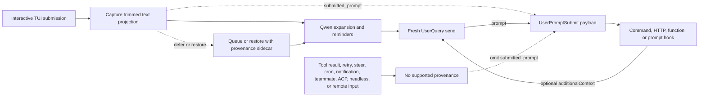

# Submitted Prompt Provenance for `UserPromptSubmit`

## Summary

`UserPromptSubmit.prompt` is the prompt for the current model invocation. It can
contain Qwen-generated reminders, expanded files and resources, slash-command
output, extension output, or context added by an earlier hook. It therefore
cannot reliably answer a different question: what text projection crossed a
supported interactive input boundary?

This change adds an optional `submitted_prompt` field:

```ts
interface UserPromptSubmitInput {
  prompt: string;
  submitted_prompt?: string;
}
```

The field is populated only when Qwen can carry provenance from a supported
interactive TUI submission to a fresh `UserQuery`. Consumers that require
user-submitted text must treat a missing field as unavailable and must not fall
back to `prompt`.

The change does not alter when `UserPromptSubmit` fires, the existing `prompt`
value, hook ordering or blocking, or `additionalContext` behavior.

## Goals and non-goals

Goals:

- Preserve the text submitted through the supported interactive TUI before
  Qwen expands it.
- Carry that text through deferred and restored submissions without associating
  it with the wrong model request.
- Add the field without breaking consumers that accept forward-compatible JSON.
- Make all data recipients and trust boundaries explicit.

Non-goals:

- Changing `UserPromptSubmit` trigger semantics.
- Inferring an original prompt from model-bound content.
- Supporting ACP, headless, remote, SDK, or other input producers in this
  change.
- Providing authentication, tenant identity, DLP, or an immutable security
  label.
- Implementing external-context recall.

## Data flow



The queue remains text-oriented for rendering. Provenance is associated through
an internal sidecar and is consumed only when the queued text becomes a fresh
turn. Any ambiguous transformation, partial batch, or edited restoration fails
closed by omitting `submitted_prompt`.

Large-paste placeholders remain compact in `submitted_prompt`; their full
content is expanded only into the model-bound `prompt`. This preserves the TUI
projection and avoids duplicating multi-megabyte pasted content in every hook
payload.

Cancellation restoration retains ownership of the main turn when a concurrent
`/btw` side question runs. Because that side question can write a newer user
entry to disk history, cancellation removes the latest logged entry only when
the main turn still exclusively owns it. This coupling keeps the restored
provenance sidecar and persistent history aligned instead of restoring one turn
while deleting another.

## Eligibility

| Path                                                                               | `prompt`                   | `submitted_prompt`                               | Rule                                            |
| ---------------------------------------------------------------------------------- | -------------------------- | ------------------------------------------------ | ----------------------------------------------- |
| Fresh interactive TUI submission sent as `UserQuery`                               | Existing model-bound value | Present                                          | Capture the trimmed projection before expansion |
| Deferred TUI submission that later becomes a fresh turn                            | Existing model-bound value | Present only with complete provenance            | Preserve the sidecar while queued               |
| Exact cancellation or queue restoration followed by resubmission                   | Existing model-bound value | Present only when the restored text is unchanged | Reuse the sidecar only for an exact restoration |
| Edited or partially known restored input                                           | Existing model-bound value | Absent                                           | Do not guess provenance                         |
| Prompt, command, or shell-history navigation or selected search match              | Existing model-bound value | Absent                                           | History can contain generated expansions        |
| Prompt restored from the cross-restart stash                                       | Existing model-bound value | Absent                                           | The stash stores text without provenance        |
| Prompt restored by conversation rewind                                             | Existing model-bound value | Absent                                           | Rewind history stores model-bound text only     |
| Same-turn steering input                                                           | Existing behavior          | Absent                                           | Steering is not a fresh supported submission    |
| Tool result or hook continuation                                                   | Existing behavior          | Absent                                           | Preserve legacy continuation behavior           |
| Retry, cron, notification, or teammate traffic                                     | Existing behavior          | Absent                                           | Preserve existing trigger behavior              |
| Configured `--prompt-interactive` initial prompt                                   | Existing model-bound value | Absent                                           | It did not cross the interactive input boundary |
| Non-empty input present while Vim mode is enabled, including after Vim is disabled | Existing model-bound value | Absent                                           | Vim registers do not carry provenance           |
| ACP, headless, `serve`, SDK, remote input, or accepted speculative input           | Existing behavior          | Absent                                           | No producer is added in this change             |

When restored or provenance-unavailable model-bound input is cleared or
submitted, the TUI discards its text-buffer undo and redo history before a
later input can become eligible. This prevents undo from restoring model-bound
text after its provenance marker or sidecar has been consumed.

Any non-empty input present while Vim is enabled remains ineligible after Vim
is disabled until the composer is cleared. This conservative rule also covers
drafts entered before enabling Vim. Vim registers can retain model-bound text
across buffer clears, so changing modes cannot restore provenance for existing
content.

The table defines provenance only. Existing event triggering remains unchanged,
including paths that do not fire `UserPromptSubmit`.

## Invariants

1. Core serializes `submitted_prompt` only for a fresh `UserQuery` carrying a
   non-empty string from a supported producer.
2. The value is preserved as received by Core; Core does not trim, reconstruct,
   or derive it from `prompt`.
3. Sequential `additionalContext` updates may extend `prompt` but do not rewrite
   `submitted_prompt`.
4. Recursive and machine-driven sends clear provenance.
5. A queued batch is attributed only when every included item has compatible
   provenance. Otherwise the batch omits the field.
6. A restored sidecar is single-use and applies only to an exact resubmission.
7. Missing provenance is a normal state, not an error.

## Compatibility and migration

The hook JSON contract is forward-extensible. Decoders should ignore unknown
fields. Consumers that intentionally reject unknown fields, for example a JSON
Schema with `additionalProperties: false`, must explicitly allow the optional
`submitted_prompt` property before upgrading. For a security-sensitive hook,
strict-decoder failure can change whether an invocation fails open or closed,
so administrators must test the upgraded payload with the deployed hook before
rollout.

Existing consumers that read only `prompt` retain their current behavior.
Source-sensitive consumers should read `submitted_prompt` and skip, ask the
user, or apply a documented fallback policy when it is absent. Silently using
`prompt` as the original user text is not a safe fallback.

## Trust and data boundaries

`submitted_prompt` is caller-supplied provenance. It is not an authenticated
identity, authorization decision, repository binding, or DLP result. It
inherits trust from the local Qwen process and supported TUI producer; it does
not establish a new trust boundary. In particular, a function hook receives an
in-process object and must be treated as trusted code; this design does not
claim runtime immutability against such a hook.

All configured hook executors receive the event payload:

| Hook type | Recipient                                                 |
| --------- | --------------------------------------------------------- |
| Command   | Child process through standard input                      |
| HTTP      | Configured endpoint through the POST body                 |
| Function  | Trusted in-process callback                               |
| Prompt    | Configured model provider after `$ARGUMENTS` substitution |

Operators must treat both `prompt` and `submitted_prompt` as potentially
sensitive. Prompt hooks send the payload to a model provider. File-backed debug
logging records the fully expanded prompt-hook request, so its retention and
access controls must match the submitted data. A hook can also copy its input
into its own output, error, logs, or downstream systems; those destinations are
outside this field's guarantees.

When both fields are present, prompt-hook payloads contain overlapping text and
can consume additional model input tokens. This contract does not provide
per-hook field suppression.

Hook-call telemetry currently exports hook metadata rather than the full input,
but that implementation detail is not a privacy boundary and consumers should
not rely on it.

## Why this differs from Claude Code

Claude Code runs `UserPromptSubmit` at its user-submission boundary, before
control enters the model query loop. Tool-result recursion does not cross that
boundary, so its existing `prompt` naturally represents submitted input.

Qwen Code runs the hook closer to its shared model-send pipeline and preserves
legacy behavior across more send paths. Moving the event would be a broader,
breaking semantic change. An additive provenance field gives supported TUI
callers the missing boundary signal while preserving existing integrations.

## Verification

Unit tests cover the Core serialization gate, hook chaining, TUI capture,
large-paste projection, deferred queues, exact and edited restoration,
provenance clearing, and incomplete batches. Interactive E2E coverage captures
a real command-hook payload and confirms that expansion can change `prompt`
without changing `submitted_prompt` and that a tool-result continuation omits
the field.
