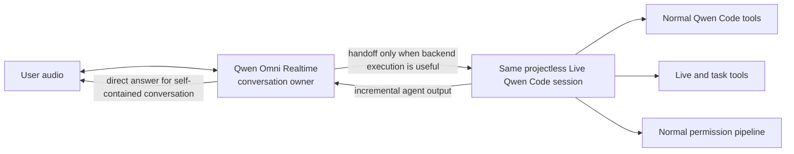

# WebShell Live Voice Codex-Parity Refactor Contract

## Status and authority

This document records the architecture direction accepted on 2026-07-30 for
the WebShell Live Voice refactor. On 2026-07-30 the user authorized completing
the implementation and its real provider, Host, and UI validation without
user-assisted testing. The bounded protocol qualification experiment completed
on 2026-07-30 is recorded below.

The reference is Codex `origin/main` at
`c126f206dafb9b7fe8e1d6b990e67f0535de79f4`, corroborated by a real Codex
Desktop Live session. The Qwen implementation must reproduce that architecture
and behavior. A Qwen or WebShell incompatibility is a stop condition: document
the exact incompatibility and obtain explicit approval before implementing any
substitution, approximation, fallback, or optimization.

The reference anchors were refreshed against Codex `origin/main` at
`f0c30e528a54bdf0fa9a4d52ff74b34383434811` on 2026-08-01. The relevant
Realtime prompt, session, Appshot, task-context, and permission behavior is
unchanged.

On 2026-08-04 the contract was updated with the later verified Codex
`speak_to_user` lifecycle and the explicitly approved Qwen transport mapping.
This update supersedes the earlier requirement to wait for handoff completion
before requesting one final Realtime response. It does not relax the exact
parity rule: the Qwen mapping may replace only a provider primitive that the
public DashScope protocol does not expose, and only with the approved behavior
recorded below.

This document supersedes the earlier design for these areas:

- conversation ownership and response authority;
- Realtime-to-backend handoff and backend-to-Realtime result streaming;
- Live task discovery, reading, creation, waiting, and follow-up;
- the backend session's normal and Live-specific tool surfaces;
- task and tool permission handling;
- interruption and steering during backend work.

## Non-negotiable architecture

WebShell Live is a normal projectless Qwen Code session with a
Realtime-model-driven, full-duplex voice conversation attached to it. The
Realtime model is the conversational frontend and the Qwen Code model is the
execution backend. The Realtime model is not an ASR/TTS wrapper around a text
model, and the backend is not a separate restricted Coordinator persona.

The following rules are mandatory:

1. The Realtime model directly answers ordinary, self-contained conversation.
   Such a turn must not start a Qwen Code backend turn.
2. The Realtime model requests a handoff only when execution, tools, task
   management, or deeper backend reasoning is useful.
3. A handoff becomes a normal turn in the same persistent Live Qwen Code
   session. It must not create or route through a restricted coordinator
   session.
4. The backend Live session retains the normal Qwen Code tool surface and adds
   the Live-specific and task-management tools. Live provenance must not hide,
   suppress, or replace normal tools or configured MCP tools.
5. Backend agent output is streamed incrementally back into the still-active
   Realtime conversation. Waiting for the complete backend answer and then
   converting that text to speech is not compliant.
6. The Realtime conversation remains active during a handoff. New user speech
   steers or interrupts the same backend turn and must not create an overlapping
   response, duplicate handoff, or duplicate task.
7. Backend tools use the normal Qwen Code permission and approval pipeline.
   Permission UI is asynchronous and must not terminate or deadlock the voice
   conversation. Raw approval, tool, and MCP protocol events are not spoken or
   injected into the Realtime conversational transcript.
8. Appshot is not a Realtime-provider tool. A screen request first causes a
   handoff; the same backend Live session then invokes its Live-only
   `capture_screen_context` tool and returns the result through the normal
   backend-to-Realtime path.
9. Backend progress and ordinary final text update Realtime context silently.
   Spoken backend output is requested explicitly by the backend-only
   `speak_to_user(message)` tool; backend completion alone never authorizes a
   Realtime response.
10. Response serialization is a technical overlap guard, not a user-message
    priority policy. Qwen must not invent normal, urgent, or interrupting
    message classes that Codex does not expose.

## Confirmed Codex reference behavior

### Conversation and handoff

Codex attaches a Realtime conversation to an ordinary persistent Codex task.
GPT-Live owns turn detection, direct conversational answers, output audio, and
the decision to request backend execution. A backend prompt explicitly tells
GPT-Live to respond directly when the request is self-contained and to request
a handoff when the Codex backend is useful.

The provider emits a dedicated handoff request. Codex converts its text into a
normal user turn on the same task. The handoff does not close the Realtime
conversation or transfer permanent ownership to another session.

### Incremental result return

Codex observes backend agent-message lifecycle events. Agent message deltas are
buffered per item and, on the current dedicated V3 protocol, flushed to GPT-Live
at an approximately 200 ms cadence by `handoff_append`. Completion is signaled
separately. Speakable content and progress/commentary are distinct channels.

Codex also contains a distinct Realtime V2 compatibility path. V2 keeps the
original handoff function call open, sends completed backend Agent messages as
`user` conversation items, then closes the original function call and requests
the Realtime response only when the backend turn completes. V2 conversation
items are message-level updates; they are not the V3 200 ms delta stream.

This bidirectional stream is essential behavior. It lets GPT-Live retain the
live conversation, react to progress, accept steering, and begin producing a
natural response without waiting for the complete backend turn.

### Explicit backend speech

The current Codex backend receives a dynamic `speak_to_user` tool with one
required `message` argument. Ordinary backend text is mirrored into GPT-Live as
silent context. It is not automatically spoken, including at turn completion.
When the backend decides that the user should hear a progress update, question,
or final result, `speak_to_user` routes through
`thread/realtime/appendSpeech`. Codex appends the message to the same Realtime
session as `StandaloneSpeech` on the `speakable` channel, and GPT-Live produces
the audio in the existing conversation and voice.

The tool has no `priority`, `urgent`, or `interrupt` argument. Codex does not
implement an application-level ordinary-versus-urgent queue. Provider protocol
ordering and user barge-in remain distinct from the backend's decision to
speak.

Delegation acknowledgement is also distinct from backend speech. Codex exposes
an optional `delegationAckFiller` provider setting, while the verified installed
client did not hard-code a prompt rule requiring one acknowledgement sentence.
Qwen's current pre-handoff acknowledgement must therefore remain an isolated
compatibility item until its provider event timing is measured; it must not be
added to, removed from, or justified by the silent-context implementation.

### Appshot ownership

GPT-Live does not receive Appshot as a provider tool. A deictic or screen-aware
request causes a backend handoff. The same ordinary Codex Live task invokes the
Voice/App-specific `capture_screen_context` tool alongside its normal tools.
The captured context is consumed inside that backend turn, whose Agent output
then returns to GPT-Live through the active handoff.

### Task reading and follow-up

Codex provides both passive context and active task operations:

- startup context includes the current task, recent work, workspace/project
  mapping, and relevant notes;
- task tools list and read existing tasks without opening or recreating them;
- wait observes an existing task until it completes or needs attention;
- send/follow-up adds work to an existing task;
- create starts a new project or projectless task only when requested;
- the Live task surface required for this implementation is exactly
  list/read/wait/send/create. Git/worktree task migration (`handoff_thread`),
  fork, title, archive, and navigation are outside this feature scope.

Reading or following an existing task must never be implemented as creating a
replacement task.

### Tool and permission layering

There are two internal layers behind one user-visible Live session:

- the Realtime provider receives the narrow conversation/handoff protocol;
- the same underlying Codex task, when handed work, receives normal Codex
  tools plus Voice/App/task tools.

The backend task follows the same sandbox, approval mode, and permission
handling as an ordinary task. Approval requests carry task, turn, item, and
request identity to the app UI and are resolved asynchronously. The Realtime
bridge mirrors agent messages, not raw approval or tool-protocol events.

## Qwen target mapping

The target reproduces the same ownership boundaries with existing Qwen Code
infrastructure:

| Codex responsibility             | Required Qwen mapping                                                                                                         |
| -------------------------------- | ----------------------------------------------------------------------------------------------------------------------------- |
| Persistent ordinary task         | One normal projectless Qwen Code session surfaced in the dedicated Live group                                                 |
| GPT-Live conversational frontend | `qwen3.5-omni-plus-realtime` owning ordinary dialogue, VAD, barge-in, and spoken output                                       |
| Selective backend handoff        | One narrow Realtime handoff operation routed into a normal turn on that same Live session                                     |
| Normal backend tool surface      | The existing Qwen Code tools, configured MCP tools, sandbox, and approval mode remain available                               |
| Voice/App tools                  | Built-in Appshot and call-control capabilities attached to the backend Live session, never exposed as Realtime-provider tools |
| Task operations                  | List/read/wait/send/create operations backed by existing WebShell session and bridge services                                 |
| Incremental backend return       | Agent-message deltas aggregated at about 200 ms and appended as silent ordered conversation context                           |
| Explicit backend speech          | A backend-only `speak_to_user(message)` tool flushes silent context and requests one Realtime spoken response                 |
| Steering                         | New speech during backend work uses the existing same-session mid-turn/steering path                                          |
| Permissions                      | Existing session permission events and WebShell approval UI; no child-session escape hatch                                    |

The Live overlay does not duplicate approval controls. While its coordinator
has an unresolved tool permission, it shows one shortcut that opens the exact
projectless Live session in WebShell; approval and denial remain owned by the
existing WebShell permission UI.

WebSocket transport is retained. WebRTC is not required for the Codex
conversation/session architecture and must not be used as an explanation for
missing handoff, task, tool, permission, or interruption behavior.

## Components retained and rejected

### Retained

- the installed Qwen Live Host and its global-shortcut/background ownership;
- Bluetooth and other selected input-device capture and audio output;
- the internal fixed Appshot implementation and its existing native permission
  ownership;
- the configurable shortcut, compact overlay, mute, stop, and new-call UI;
- the projectless Live group in WebShell;
- the existing `~/Documents/Qwen Code/Conversations/` storage root, with one
  direct child directory per projectless Live or projectless created task;
- authenticated daemon/Host transport;
- existing WebShell session, event, transcript, mid-turn, and permission
  infrastructure;
- the Qwen Realtime WebSocket audio transport.

### Rejected and to be removed from the active architecture

- a prompt that forces every meaningful utterance to call
  `delegate_to_coordinator`;
- treating Qwen Realtime only as transcription and speech synthesis;
- a separate restricted Coordinator persona or session;
- hiding normal tools from a Live-origin session;
- permitting only Appshot and `create_sub_session` in Live;
- mandatory child-session creation for shell, files, MCP, network, edits, or
  approval-bearing work;
- collecting backend text until `turn_complete` and returning it as one final
  function result for speech synthesis;
- implementing task read or follow-up by creating another session;
- creating another projectless runtime, storage root, or task ledger instead
  of using the existing Conversations runtime and session catalog;
- treating Git/worktree migration (`handoff_thread`) as Realtime voice
  handoff;
- solving approval handling by moving work away from the Live session;
- closing the handoff immediately with `accepted` and later presenting only a
  separate final-result announcement as though it were the same handoff;
- repeated response creation, sentence-by-sentence TTS, local TTS, or another
  unapproved approximation presented as incremental handoff.

Qwen does not expose Codex V3's `handoff_append` or a public `speakable`
channel. The user explicitly approved the following bounded mapping after the
real-provider ordering probe: aggregate backend deltas at approximately 200 ms,
append them as silent `conversation.item.create` text items without
`response.create`, and request a text-and-audio response only for
`speak_to_user`. The explicit modalities are required because a response to
text-injected backend speech may otherwise complete without audio. This is a
Qwen provider transport adaptation for the same observable lifecycle; it is not
authorization for sentence-by-sentence speech, local TTS, immediate handoff
completion, or multiple overlapping responses.

## Approved availability and onboarding contract

Live Voice is an experimental macOS WebShell capability. It must not be
advertised by the CLI/TUI, SDK-only daemons, non-macOS daemons, or a WebShell
started without its native Host integration. Platform support is decided by
the daemon from `process.platform`, never from browser user-agent data.

The complete first-use path is:

1. Open **Settings > Experimental > Live Voice** in a macOS WebShell.
2. Enter the dedicated DashScope API key for
   `qwen3.5-omni-plus-realtime` and optionally change the global shortcut.
3. Turn on Live Voice and confirm that the signed native Host will be
   installed.
4. The daemon downloads the architecture-matching release from the Aliyun OSS
   mirror, with the fixed Qwen Code GitHub release feed as fallback. It verifies
   the manifest checksum, bundle identity, signature, and Gatekeeper acceptance,
   installs it atomically in `/Applications`, and launches it.
5. The Host guides the user through Microphone, Accessibility, and Screen
   Recording authorization. macOS remains the sole grant authority; the
   application cannot pre-grant or bypass TCC permissions.
6. Live becomes available only when configuration, Host protocol, native audio,
   the global shortcut, all permissions, and built-in Appshot are ready.

The feature defaults to disabled. Enabling is resumable: closing either UI or
restarting the daemon may preserve completed setup steps, but cannot expose a
partially ready Live path. Disabling stops an active call, withdraws native
discovery, and removes the Live capability without uninstalling the Host or
deleting conversations.

The dedicated Realtime API key is user-scoped. WebShell receives only whether
a key is configured; it never receives the persisted value. API responses,
logs, telemetry, errors, renderer state, and Host messages must not contain the
key. Replacing or clearing it is explicit. Provider validation may make one
bounded Realtime connection for the user's enable action; status polling and
Host readiness must never open provider connections or retry billable traffic.

The settings UI reuses WebShell primitives and adds one compact Live Voice
card to Experimental settings. The card owns only enablement, masked key
replacement, shortcut capture, install progress, and permission/readiness
status. Native permission actions remain in the Host, and ordinary WebShell
dictation remains visible and unchanged.

Release publishing must include notarized arm64 and x64 Host ZIP/DMG assets and
a machine-readable manifest containing the protocol version, application
version, architecture, fixed asset name, size, and SHA-256 checksum. The
installer never accepts a caller-provided URL, path, executable, or shell
command and never falls back to an unsigned/development build.

Enabling or disabling Live is hot-applied. A user must not restart the daemon:
the same process publishes or removes Host discovery, creates the projectless
Live runtime lazily, refreshes capabilities, and keeps all conversation
ownership and handoff rules in this contract unchanged.

## Provider protocol qualification gate

Public Qwen Realtime behavior already establishes ordinary full-duplex
conversation and function-call output. The open-source qwen-audio-agent at
`ab203c2567334255c69606d88f334edac770ad5a` additionally demonstrates a
selective `spawn_thinking` call, an immediate `accepted` function output,
continued Realtime conversation while ACP work runs, and later final-result
injection through a new conversation item. This proves useful Qwen protocol
primitives, but its fixed cross-conversation backend session, private Work
ledger, immediately completed handoff, and final-only announcement lifecycle
do not reproduce Codex.

The bounded real-provider experiment verified:

1. an ordinary conversational request is answered directly without handoff;
2. an execution request produces one selective handoff;
3. the original handoff remains unresolved while one or more Codex V2-style
   `user` conversation items are acknowledged without starting a response;
4. completing that original function call and then requesting a response lets
   the Realtime model naturally answer using all injected message-level updates;
5. a separate qualification case confirms that 200 ms conversation-item
   injection is accepted and ordered; on 2026-08-04 the user explicitly
   approved this as the bounded Qwen mapping for silent backend context;
6. new user input during the open handoff can produce a second steering
   handoff without overlapping provider responses; routing it to the same
   backend work is an implementation requirement, not a provider-test result;
7. direct Realtime conversation remains usable after handoff completion.

### Qualification result: 2026-07-30

The approved probe used qwen3.5-omni-plus-realtime over the configured
DashScope WebSocket endpoint in text-only mode. It changed no product code,
did not record credentials, and did not exercise microphone input, output
audio, VAD, or audio barge-in.

All required protocol cases passed in the final run:

- with tools available in automatic mode, an ordinary request returned
  DIRECT_OK with zero function calls;
- an execution request produced exactly one handoff_to_backend call;
- while that call remained unresolved, five progress conversation items sent
  at offsets 0, 202, 402, 602, and 801 ms were acknowledged in order, with
  67-69 ms item acknowledgement latency;
- reproducing the Codex V2 order -- final backend Agent message as a user
  conversation item, then function-call output, then response.create --
  produced a completed answer containing P1 through P5 and COMPLETE_OK, with
  no further tool call;
- while a second original handoff remained unresolved, a new steering user
  item produced exactly one second handoff call; acknowledging that steering
  call and later completing the original call produced sequential responses
  with no provider overlapping-response error;
- after both handoffs completed, another ordinary request returned
  AFTER_HANDOFF_OK with zero function calls.

Two compatibility details are mandatory for implementation:

1. The provider replaces caller-supplied conversation item IDs. Sequential
   item acknowledgement therefore worked, but correlation must not assume the
   echoed provider item ID equals the requested item ID.
2. An intermediate probe omitted the final backend Agent conversation item and
   placed completion only in function-call output. Although all progress
   markers arrived, the model incorrectly answered that work was still
   running. The exact Codex V2 ordering is therefore behaviorally necessary,
   not merely a transport detail.

The result confirms that the public Qwen protocol accepts the primitives needed
for the approved silent-context mapping, but one protocol gate remains open:
the earlier probe requested a response only after closing the original handoff.
Before product code permits `speak_to_user` while backend work is still active,
a bounded provider probe must verify whether `response.create` is accepted while
the original `background_agent` function call remains unresolved. If it is not,
implementation must stop and report the incompatibility instead of closing the
handoff early or inventing an asynchronous replacement lifecycle.

The public Qwen protocol also has no confirmed exact equivalent of Codex's
`speakable` channel. A second bounded probe must establish whether a silent
context item followed by an explicit speech instruction produces a prompt,
complete, stable-voice response that preserves the requested message. Prompt
compliance is not assumed from schema acceptance.

### Speakable-context qualification result: 2026-08-04

The bounded text-input/audio-output probe kept one `background_agent` function
call unresolved, appended silent context, and requested two sequential spoken
responses before submitting the function output. Both requests succeeded on
`qwen3.5-omni-plus-realtime` over the configured DashScope WebSocket:

- both response transcripts exactly matched their requested `ALPHA` and `BETA`
  messages and returned non-empty, frame-aligned PCM audio;
- neither response emitted another tool call or an overlapping-response error;
- submitting the original function output as silent completion created no
  response during the following one-second observation window.

This qualifies mid-handoff response creation and exact short-message prompt
compliance for product implementation. Voice stability across longer real
microphone scenarios remains an E2E acceptance item rather than a schema
assumption.

The steering experiment qualifies the provider protocol only. Routing the
second handoff into the same existing backend turn, preventing duplicate
backend work, and preserving task identity remain Qwen Code implementation and
E2E acceptance requirements.

## Refactor sequence

Each phase is gated by the exact-Codex-parity rule and must not begin merely
because the preceding phase produced passing tests.

1. **Existing foundation (complete):** retain the normal projectless Live
   session, startup task context, normal and Live-specific tools, WebShell
   permissions, internal Appshot, selective handoff, and same-session steering.
2. **Protocol gate:** verify mid-handoff response creation and the Qwen mapping
   for explicit stable-voice speech. Stop on incompatibility.
3. **Backend speech tool:** register backend-only `speak_to_user(message)` in
   the existing Live session tool registry and route it through the authenticated
   ACP bridge to the owning Live coordinator. It is an internal communication
   tool and requires no user approval.
4. **Silent context stream:** buffer `agent_message_chunk` by item/turn, flush
   ordered non-empty context at approximately 200 ms, and force a flush before
   tool calls, `speak_to_user`, errors, and turn completion. Silent context must
   never call `response.create`.
5. **Completion and speech separation:** close the provider handoff without an
   automatic response. `speak_to_user` flushes pending context, appends the
   explicit speech request, and asks the existing response arbiter for one
   response.
6. **Interruption state:** bind queued speech to call, handoff, turn, and
   response generations. User barge-in cancels current audio and invalidates
   stale queued speech without cancelling backend work. New execution speech
   steers the active backend turn; simple dialogue remains provider-owned.
7. **Prompt alignment:** describe silent context and explicit speech to both
   models. Keep delegation acknowledgement separate. Audit `remain_silent` and
   retain it only if provider compatibility evidence requires it.
8. **Validation:** run unit, integration, real-provider, Host audio, WebShell,
   and full real-scenario tests, followed by two clean source-and-runtime parity
   audits.

Any source change that would introduce behavior not confirmed in Codex or not
confirmed compatible with Qwen Code must stop before editing and request
approval.

## Acceptance contract

The refactor is not complete until real scenarios demonstrate all of the
following:

| Scenario                | Required evidence                                                                                                                                     |
| ----------------------- | ----------------------------------------------------------------------------------------------------------------------------------------------------- |
| Ordinary conversation   | Natural Realtime answer with zero Qwen Code backend turns                                                                                             |
| Screen question         | Exactly one handoff followed by one backend-session internal Appshot, streamed result, and natural spoken answer; Realtime itself has no Appshot tool |
| List or inspect tasks   | Existing tasks are listed/read with no new session                                                                                                    |
| Follow an existing task | Message reaches the selected existing session and retains its identity                                                                                |
| Create a task           | Exactly one requested project or projectless session is created and linked                                                                            |
| Normal tool use         | Live backend can use the same normal tool surface as an ordinary session                                                                              |
| Permission request      | Correct WebShell approval appears, the Live overlay links to that exact session, and approve and deny both resolve while Live remains usable          |
| Long backend work       | Ordered agent deltas reach Realtime during the turn rather than after `turn_complete`                                                                 |
| Backend progress speech | Only an explicit `speak_to_user` produces audio; silent progress and final text do not create responses                                               |
| Simple talk during work | Realtime answers directly while the original backend turn and silent context stream continue                                                          |
| Second handoff          | A new execution request steers the active backend turn or starts the next turn in the same Live session; it never duplicates the task                 |
| Barge-in during work    | Existing audio stops, stale queued speech is discarded, backend work continues, and any execution instruction steers without overlap or duplication   |
| Speech fidelity         | Requested speech is complete, begins before backend turn completion when invoked, keeps the configured voice, and does not resume after interruption  |
| Continued conversation  | Realtime remains context-aware after backend work and can again answer directly                                                                       |
| Protocol isolation      | Raw approval, MCP, and tool events are not spoken as conversation text                                                                                |

Unit, integration, Host lifecycle, and microphone-to-spoken-response E2E are
reported as separate validation layers. Passing tests cannot substitute for
architecture or runtime evidence.

## Evidence anchors

- Codex Realtime prompt:
  `codex-rs/prompts/templates/realtime/backend_prompt.md`
- Codex Realtime session and handoff streaming:
  `codex-rs/core/src/realtime_conversation.rs`
- Same-task routing and agent-delta mirroring:
  `codex-rs/core/src/session/mod.rs`
- Realtime startup task context:
  `codex-rs/core/src/realtime_context.rs`
- Approval forwarding:
  `codex-rs/app-server/src/bespoke_event_handling.rs`
- Realtime event filtering:
  `codex-rs/core/src/session/turn.rs`
- Existing Qwen session catalog and task metadata:
  `packages/cli/src/serve/server/session-list.ts`
- Existing Qwen session prompts, events, mid-turn messages, and permissions:
  `packages/cli/src/serve/routes/session.ts`
- Qwen public-protocol reference implementation:
  `QwenAudio/qwen-audio-agent` at
  `ab203c2567334255c69606d88f334edac770ad5a`, especially
  `config/frontend-agent/PROMPT.md`,
  `server/src/voice/realtime-provider.mjs`, and
  `server/src/voice/tools/tool-call-handler.mjs`

These anchors must be refreshed against the current Codex source before the
corresponding implementation phase. Stale source or prior conclusions do not
authorize a change.
