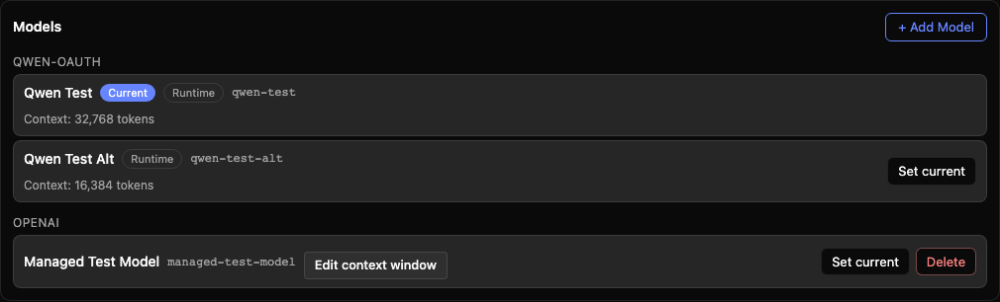
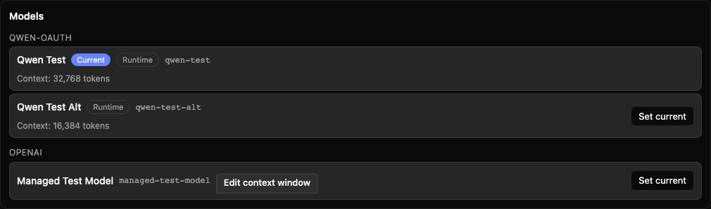

# WebShell 模型管理控制

[English](web-shell-model-management.md) | [简体中文](web-shell-model-management.zh-CN.md)

## 问题与范围

嵌入宿主可能从外部配置模型，同时保留原生模型选择。设置显隐无法阻止其他 WebShell 入口中的误增删。Issue #12335 提议实例范围的可选交互控制；这不是鉴权。daemon API、SDK、CLI、文件写入和外部下发保持不变。

## 设计

公开 `modelManagement?: WebShellModelManagementOptions`，包含独立的 `allowAdd?` 和 `allowDelete?`，默认均为 true。从公共入口导出类型。使用小型共享 helper 归一化默认值，并按 daemon 的 token 切分和命令解析身份识别配置命令。

App 隐藏增删 UI，在宿主斜杠命令回调拒绝之后、隐藏命令转发之前消费被禁用的 `/auth`（含别名 `/connect`、`/login`）；带内建标识的命令快照就绪后，拦截以会话命令解析结果为准。就绪前保守拒绝配置命令名称并提示新增已禁用。对于发送到 daemon 的命令，同名项目/用户命令在快照加载后仍可运行；App 本地 `/auth` 仍由配置弹框路由接管，直接检查该 UI 动作。宿主回调优先仅适用于输入框提交，不扩展到消息编辑和侧任务初始提示词。消息内联编辑路径在 rewind 之前同样拒绝，`/btw side` 路由在创建侧任务会话之前先检查提取出的问题。App 过滤建议，在收紧策略时关闭已开的配置弹框，并在增删回调读取最新策略。AuthMessage 在安装前再次检查。ModelManagementSection 清理旧删除确认。SplitView 和侧任务面板向具有独立命令路由和菜单的 ChatPane 透传策略。侧任务还会在发送初始提示词前检查策略。禁用新增时，疑似配置命令的初始提示词会保留并等待命令信息；五秒后提示仍未就绪，信息随后到达时重新判断。确定拒绝后清理活动 tab 和会话镜像，普通问题不等待命令信息。浏览器队列在 submit/enqueue 边界调用调用方提供的同步 `getPromptDispatchError` 校验，包括附件准备之后。队列不认识模型策略或 `/auth`；其内部拒绝类型区分主动拒绝与发送失败。拒绝的队列项被移除，不合并到用户正在编辑的新草稿；附件补偿清理继续执行。普通失败保留原有草稿恢复行为。SettingsMessage 内部的数据/回调集合命名为 `modelManagementSectionProps`，区别于公共 `modelManagement` 策略。不改变通用 SDK 行为。

动态限制影响之后发出的浏览器请求，不能撤销已发出的操作及 daemon 已接收的队列。恢复允许时不重新打开旧弹框。模型列表、当前标识、切换、`/model`、上下文窗口编辑和会话 `/delete` 保持原行为；设置排除策略独立组合。

## 为什么单一路由守卫不够

| 边界                | 职责                                                              |
| ------------------- | ----------------------------------------------------------------- |
| App 输入框          | 在宿主回调拒绝之后、隐藏命令转发之前处理主窗口/欢迎页输入。       |
| ChatPane 输入框     | 拥有分屏/侧任务的提交路径；它的宿主回调不是 App 的完整命令路由。  |
| 准备后发送及重试    | 在异步准备和会话分配后检查最终发送文本，覆盖 `/plan` 转换和重试。 |
| 消息内联编辑        | 直接 rewind 并重发，不经过输入框提交。                            |
| 侧任务初始提示词    | 直接调用 `actions.sendPrompt`，不经过输入框提交。                 |
| 浏览器队列发送      | 等待队列或准备附件之后重新检查，此时策略可能已改变。              |
| 配置/保存和删除回调 | 覆盖设置动作及跨策略更新保留的回调；不撤销已发出的请求。          |

这些是同一 UI 策略针对 `/auth` 及其别名 `/connect`、`/login` 在入口/发送边界的检查，不是六套独立权限系统。公共选项保持不变；内部命名和队列分层属于实现细节。

## 验证

覆盖不传/空配置及四种组合、公共透传、设置与命令入口、欢迎页和分屏、宿主回调与隐藏命令优先级、动态弹框及旧回调、队列发送时最新策略。断言禁用时不发安装/删除请求，并保留选择与参数编辑回归。使用已有 DOM 测试及模拟 daemon 路由的浏览器 harness 提供 UI 证据。执行受影响测试、build/typecheck/bundle 和 preflight，如实报告基线失败及未完成项。

## 待讨论

公共 API 仍待上游评审。按贡献者明确要求，在 issue 讨论未结束时推进实现。本次不包含后端权限设计。
