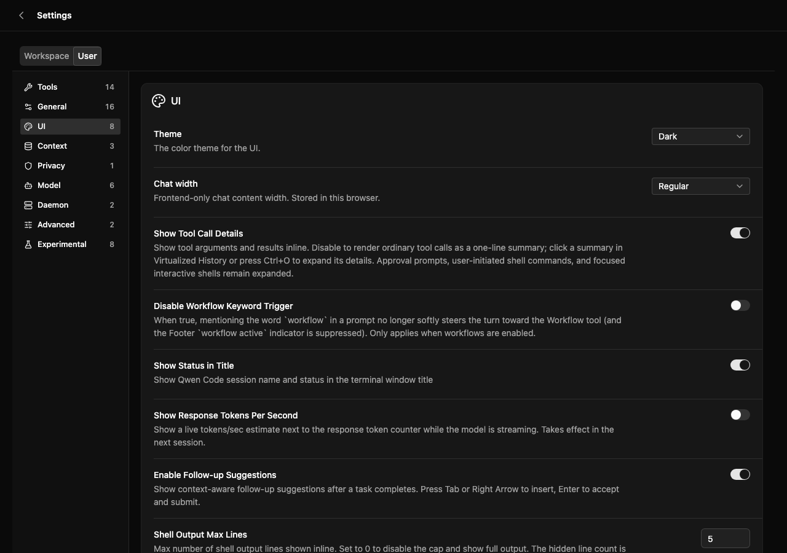
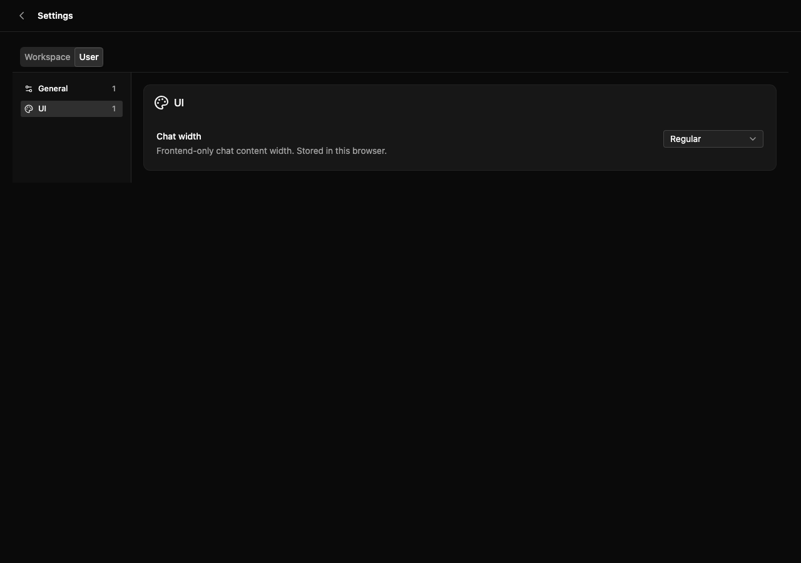

# 嵌入式设置白名单

[English](web-shell-settings-allowlists.md) | [简体中文](web-shell-settings-allowlists.zh-CN.md)

## 问题与范围

Issue #12320 延续 #11975 已发布的排除能力。只开放少量设置的宿主目前必须枚举其余所有条目，升级后新增设置还会自动出现。使用现有稳定 ID 增加可选的展示白名单。不改变 daemon 协议、已保存设置、底层功能启用、能力检查、排序或独立命令行为。

## 设计与决策

在 `excludeItems` 同层增加 `includeItems?: readonly WebShellSettingItemId[]`。缺省保持既有行为；空白名单明确隐藏所有原生设置条目，使用现有空状态，不警告。非空时仅显示满足既有条件且在白名单中的条目，黑白名单冲突时排除优先。普通设置和 builtin 区块在两个作用域下遵循相同规则。

保留已发布的排除 API 可避免迁移。mode 判别符要么替换该 API，要么引入另一套重叠形态。宿主动态生成的空白名单不能意外开放所有内容。这些是展示过滤，不是访问控制：命令与 daemon 写入仍然可用，不修改已保存值。

在正向 `isItemVisible` 和 `isSettingVisible` 谓词中集中处理策略。无白名单时无别名 schema 键保持可见以兼容既有行为；配置白名单后必须隐藏。未知运行时 ID 不能开启未映射的设置。现有硬编码隐藏规则与能力过滤先于展示过滤执行。

分类过滤、设置选择器入口守卫、待完成的语音选择请求与动态弹框关闭均使用相同谓词。空分类消失，选中分类回退到可见分类。独立命令弹框保持可用。浏览器 harness 必须区分缺省与空 include 参数。

## 文件与兼容性

修改 web-shell 设置辅助函数及 App、SettingsMessage 调用点，定向 helper/DOM/App/包装器测试、现有设置浏览器 harness/spec 和嵌入说明。公开选项已由 provider 包装器透传。不增加包依赖，不修改主仓库子模块指针。

## 验证与验收

验证缺省与纯排除兼容、空白名单、普通与 builtin 白名单、排除优先、未知与继承 ID、无别名键、能力过滤、两个作用域、分类回退和动态选择器清理（含待完成语音请求）。用真实 daemon 描述符在桌面和移动宽度下做浏览器验证，保留现有排除回归并截图。提交 Draft PR 前执行构建、类型检查、bundle、定向测试和完整 preflight，记录失败。对完整差异进行两轮无问题自审和独立审查。

## 状态与待定问题

2026-09-20：基于 `d52b409dcd` 完成实现，依据 Issue 自动评审及宿主作者明确要求推进。以 Draft PR 提供可执行行为供评审，公开 API 仍待维护者确认。原排除设计记录前一阶段，本文描述其白名单扩展。

## 浏览器证据

使用真实 daemon 设置描述符，在带模拟会话数据的隔离浏览器 harness 中回放。六种场景均在两个作用域通过：默认展示、全部排除、桌面白名单、空白名单、冲突及移动白名单。下图以当前实现未传白名单作为兼容性对照，再展示 1280×900 与 390×844 下仅包含语言/聊天宽度的白名单及空状态。这些检查不代表真实模型服务执行验证。

