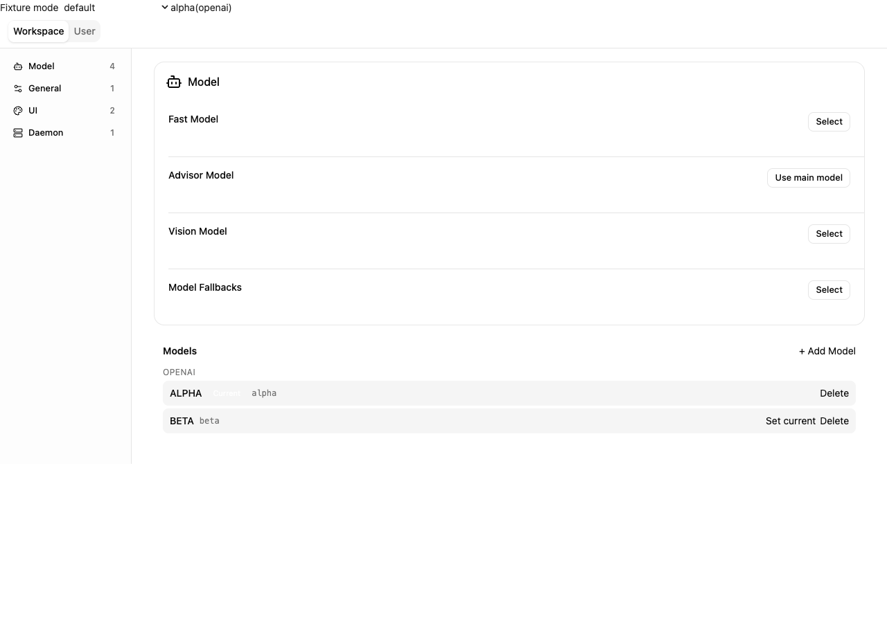
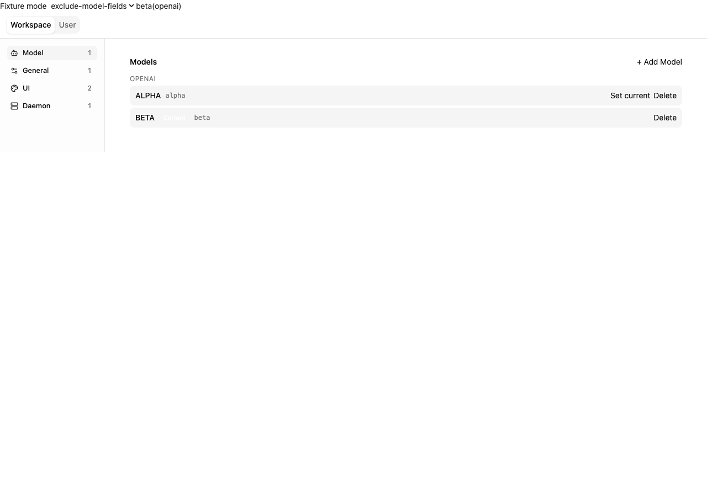
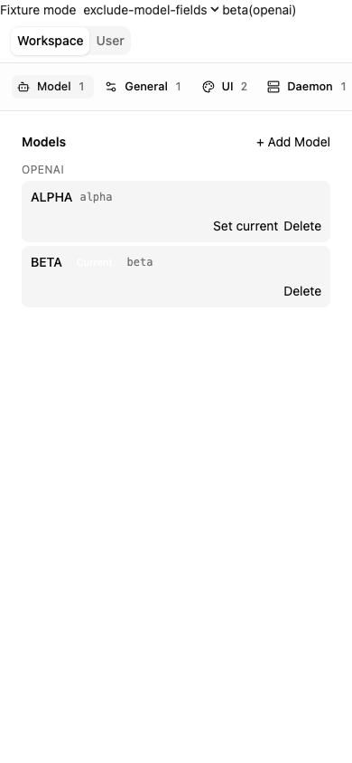

# Embedded settings exclusions

[English](web-shell-settings-exclusions.md) | [简体中文](web-shell-settings-exclusions.zh-CN.md)

## Problem and scope

The native settings page has hardcoded exclusions but no host presentation option. Its model-management card depends on ordinary Model descriptors. This proposal implements the reduced scope of #11949 in one PR: item exclusions, curated stable IDs, and independent model management. It does not add allowlists, category/scope policies, field overrides, item deep links, or an upgrade validator.

## Design

Export WebShellSettingsOptions with an optional readonly excludeItems list and a WebShellSettingItemId union plus WEB_SHELL_SETTING_ITEM_IDS. Curated aliases map explicitly to configuration keys; the mapping is internal and aliases remain stable across schema renames. Builtins cover chat width, browser notifications, Live setup, Local Control, and model management. Unknown runtime IDs match nothing. Missing options or an empty list preserve existing behavior.

Build the baseline settings categories before exclusions, then filter all items and remove empty categories. Insert model management as an independent item in Model, retaining its separate card and the existing row count when ordinary Model rows are present; a model-only category counts as one. Native capability and hardcoded exclusions always apply. Browser notifications do not depend on chat-width visibility. Category navigation falls back to a remaining category and all-empty output uses the existing empty state.

Forward options through App and the public provider wrappers. Settings-launched nested pickers must close when their source item is excluded; command-launched model pickers remain available. Exclusions do not change configuration, backend permissions, or model add/delete operations outside settings.

## Files and compatibility

Changes stay in the web-shell package: client/settings.ts, App.tsx, index.tsx, SettingsMessage.tsx, focused tests, and embedding documentation. No daemon protocol changes. Both scopes and all existing visual styling remain unchanged. Setting aliases are manually maintained; new schema settings remain visible until a supported alias is explicitly excluded.

## Verification

Test default/empty-list equivalence, ordinary exclusions in both scopes, builtin independence, empty categories and initial-category fallback, model list/select after all ordinary Model fields are excluded, model block exclusion, and dynamic exclusions of settings-launched dialogs. Exercise a browser fixture at desktop and mobile sizes, then build/typecheck, focused tests, full preflight, and two clean self-audit passes. Parent integration additionally verifies runtime, Console, extension, real model interaction and portable deployment packaging.

A gating browser smoke test reads settings descriptors from a real daemon and verifies that all published exclusions empty the page in both scopes. This detects newly rendered settings missing an alias without duplicating schema or hidden-key lists. App tests also pin host-option forwarding and runtime updates.

## Decisions and status

Implemented locally, 2026-09-16. Focused tests and desktop/mobile browser checks pass; full validation is pending. This reduced scope does not require scope-policy changes from #6974.

## Browser evidence

Isolated fixture with synthetic models: default presentation, excluded ordinary model fields, and mobile layout. Selection callbacks were verified; these images do not claim real-provider model execution.

