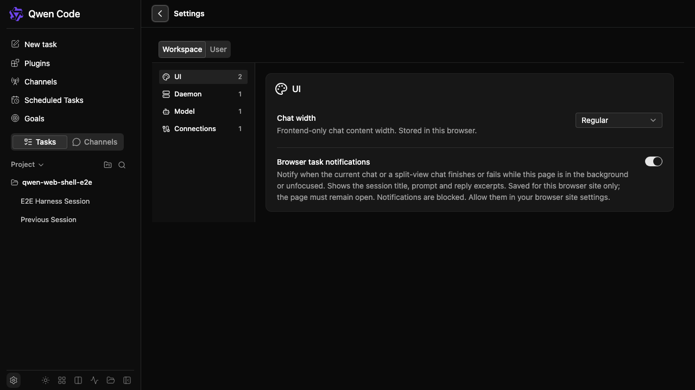

# Web Shell URL 导航

[English](web-shell-url-navigation.md) | [简体中文](web-shell-url-navigation.zh-CN.md)

## 问题与范围

本设计对应 #11073。独立入口当前用 replace 更新会话 URL；插件、频道、定时任务、目标和设置页仅保存在 React 状态中，刷新及分享 URL 会丢失页面。嵌入库需要复用同一实现，并支持可选 URL 管理和可配置基础路径。

## 协议与控制权

基础路径下并列提供 `/session/<encoded-id>`、`/plugins`、`/channels`、`/scheduled-tasks`、`/goals` 和 `/settings`。基础路径本身表示空白聊天，不请求创建会话。会话 URL 沿用 `workspace=<id>` 和 `context=standalone|live`；非工作区 context 优先于 workspace。页面 URL 不携带会话作用域。设置仅记录页面，不记录设置作用域、分类、模型或建议。

嵌入场景默认不启用 URL 管理，保留外部 session/workspace props 及现有行为。启用后，URL 提供初始目标；显式外部会话目标 props 存在时优先，后续外部目标变更也优先并 replace URL。宿主必须停止自行写 history。锁定工作区仍是宿主约束。独立入口启用同一实现并推断既有部署基础路径（默认根路径）；宿主配置 basePath 为 `/agentic-code`。instanceId、instanceType 等参数保持不透明并原样保留，其他无关 query 和 fragment 同样保留。

## 宿主接入

URL 管理覆盖组件自身的页面导航与浏览器历史。目前不提供受控 `page` prop、`onPageChange` 回调或公开页面导航 hook。会话目标 props 和 `onSessionIdChange` 保持支持，但页面没有对应的宿主受控 API。宿主可以通过普通深链进行整页导航；无需刷新地同步宿主面包屑或导航不在本次范围内。不要通过手动写 history 或伪造 popstate 代替受支持的页面 API。具体嵌入宿主需要时，可在独立改动中设计页面控制与通知 API。

## 状态与历史

WorkspaceSessionProvider 上方的公共导航边界统一管理路由回放与会话目标，App 在现有操作入口接入页面切换。进入页面保留后台会话。history.state 的命名空间记录返回目标，并保留宿主原有 state。直接打开页面链接没有来源时，返回空白聊天且不创建会话；复制页面 URL 不会继承来源状态。

主动导航 push，重复点击当前页面不写历史，初始化规范化及外部状态同步 replace，popstate 只回放不写历史。初始化空会话回调不能覆盖待恢复路由。页面可用性在能力加载后检查，不可用页面回到聊天。现有会话恢复、会话不存在、工作区和 standalone gate 保持权威；异步加载期间新导航不能被旧完成事件覆盖。侧栏会话加载失败时，保留请求目标及对应错误状态，URL 也保留该目标以供重试，而不是恢复此前会话。

## 兼容性与部署

保留 cockpit、connections settings、split 特殊链接用途，不新增分屏、详情、筛选、归档、工作区总览或产物路由。显式页面 path 优先于旧 view 提示。现有 history 写入方必须保留导航 state 命名空间。

Vite 和生产 daemon 必须为五个精确页面路径的文档 GET/HEAD 返回 HTML，包括带 token 的冷启动。JSON、API 子路径和写请求继续鉴权并保持 API 行为。这些路由属于进程级公开文档路由，响应不包含会话或工作区数据。宿主须为基础路径及深层路径提供 SPA fallback，并保持 API 路由优先；basePath 不负责配置服务端 rewrite。

## 验证与后续

协议及 React 集成测试覆盖编码、路径边界、未知参数、外部 props、初始化、缺失目标、history 和关闭 URL 管理。浏览器交互测试覆盖五页、根路径和嵌入路径、会话上下文、刷新、新标签页、前进后退及无多余会话创建。daemon 测试覆盖冷/热文档导航和 API 鉴权。提交聚焦上游 PR 前运行 build、typecheck、定向测试、完整 preflight、真实浏览器 smoke，并完成两轮无问题自审。

Console 接入另行进行：升级到已审查上游版本，配置基础路径并启用 URL 管理，删除重复 history 写入，保留宿主鉴权、连接逻辑、设置白名单及隐藏分屏入口。本任务不修改 Console 文件或子模块 pin。

浏览器 smoke 测试在刷新设置页 URL 后捕获以下画面：

## 评审回归覆盖

本轮修复在远程工作区清理及 daemon 切换失败时保留宿主和导航 history state。定向单元测试 49 项通过；真实 createServeApp 路由测试 5 组通过，验证公开文档 GET/HEAD、API 鉴权，以及关闭页面服务时的 API 响应一致性。URL 导航和远程工作区浏览器测试 17 项全部通过，包括侧栏会话加载失败后重试同一目标成功。本轮定向结果不替代完整仓库 preflight，也不表示该全量检查已通过。
