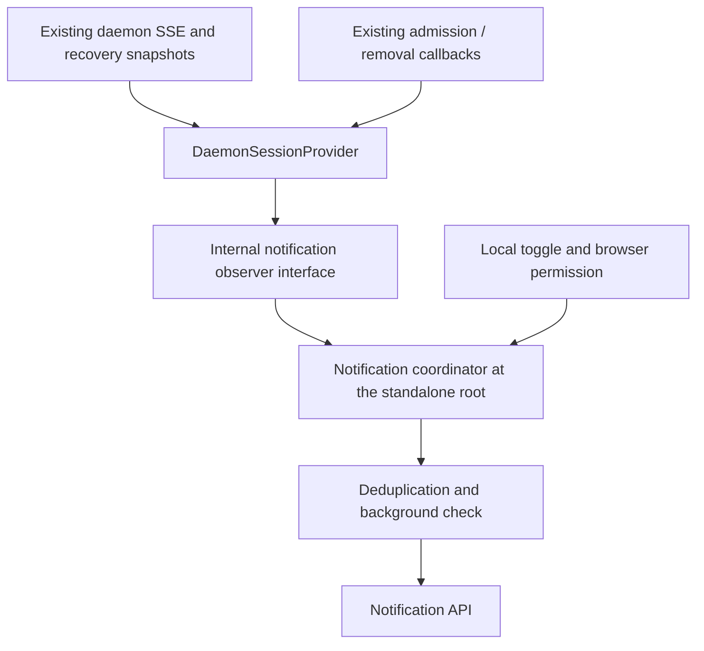

# Web Shell Browser Task Notifications: Independent Implementation Design

[English](web-shell-browser-turn-notifications.md) | [简体中文](web-shell-browser-turn-notifications.zh-CN.md)

Status: historical design for the 2026-09-08 baseline. The provisions below about being disabled by default, generic copy, focusing the window only on click, and adding no public API describe the baseline at #11398. For current behavior, see [notification content and session navigation](web-shell-browser-notification-details.zh-CN.md) and [configurable branding](web-shell-browser-notification-branding.zh-CN.md), which supersede this baseline. English counterparts are available through the language links in those two designs.

## Decisions and scope

Implement independently against the current main branch, without depending on #11251. The first version changes only the Web Shell client, reuses the existing `turn_complete` / `turn_error` events, and adds an internal event adapter dedicated to notifications and a user toggle. Deliver browser notifications first, then Channel support.

The product name is “browser task notifications,” but the event means that one assistant turn has ended, not that the entire project, a multi-turn goal, or every background agent has finished. The first version covers cases where the page is still running and the current chat or Split View is still being observed, including when the browser is in the background or the window loses focus. Immediate alerts for an unmounted session after switching chats, a closed page, a frozen browser, and system sleep are outside the guarantees of the first version.

## Current code basis

Source baseline: `1a73f5bff6201473f237c5106367e944ba2d092b`. The design is based on that revision; subsequent implementation and validation records appear at the end.

| Current implementation                                               | Reusable parts and limitations                                                                                                                                                            |
| -------------------------------------------------------------------- | ----------------------------------------------------------------------------------------------------------------------------------------------------------------------------------------- |
| `packages/acp-bridge/src/bridge.ts`                                  | Publishes authoritative turn_complete / turn_error events with session and prompt identifiers. Compatibility types allow promptId to be absent; notifications must not guess identifiers. |
| `packages/web-shell/client/daemon/session/DaemonSessionProvider.tsx` | Already has live observation, history recovery, reconnection, and transcript flush before terminal events. This is the notification observation integration point.                        |
| `packages/web-shell/client/daemon/session/actions.ts`                | Ordinary and queued submissions already have onPromptAdmitted, and confirmed removal has onPromptRemoved. These can be reused for recovery tracking.                                      |
| `packages/web-shell/client/main.tsx`                                 | StandaloneApp already manages browser-local theme/language; its root covers the main chat and Split View.                                                                                 |
| `packages/web-shell/client/components/messages/SettingsMessage.tsx`  | Already has a local chatWidth setting and shared Switch and SettingsRow components.                                                                                                       |
| `packages/cli/src/serve/routes/workspace-settings.ts`                | general.terminalBell and general.notificationMode are classified as TUI-only and cannot be reused for the browser toggle.                                                                 |
| `packages/sdk-typescript/src/daemon/DaemonSessionClient.ts`          | Supports lastEventId/epoch recovery. SSE termination also rejects pending promises, so an arbitrary rejection must not trigger a task-failure notification.                               |

The App's old onSessionChange(turn_complete) callback and the sidebar's completedUnread state come from UI/summary changes and are not inputs to the new notifications. The old prototype lives on the separate `codex/browser-turn-notifications` branch; use only its permission, copy, and settings logic as reference, without importing the full history of closed #10398. The host callback and final assistant-message extraction in #11251 are outside this feature's scope.

## User toggle

Entry point: **Settings → UI → Browser task notifications**. Disabled by default; changes take effect immediately without refreshing the page or restarting the daemon.

```text
Browser task notifications                      [Off / On]
Notify when a turn in the current chat or split-view chats ends or fails while the page is in the background or the window is unfocused.
Saved only for this browser site; notifications stop when the page is closed.

Status: Off / On / Awaiting permission / Blocked by browser / Unavailable in this environment
```

Reuse the existing Switch and SettingsRow. Add a local setting explicitly labeled “this browser site.” Switching the Settings workspace/user scope does not change the value, and no write is sent to the daemon settings API.

| Setting              | Decision                                                                                                                                          |
| -------------------- | ------------------------------------------------------------------------------------------------------------------------------------------------- |
| Internal name        | browserNotificationsEnabled: boolean                                                                                                              |
| localStorage key     | qwen-code-web-shell-browser-notifications                                                                                                         |
| Persisted value      | The string true/false; absent or invalid values mean false.                                                                                       |
| Scope                | Current browser profile + origin; independent of the workspace and not synchronized to other devices.                                             |
| Default and toggling | Defaults to false, even if permission is already granted. Disabling stops new notifications; enabling does not replay previously processed turns. |
| Tab synchronization  | Listen for storage events; the writing page updates its local state directly.                                                                     |
| Storage failure      | Remains usable within this page and displays “This setting applies only to the current page.”                                                     |

Do not write to `.qwen/settings.json`: browser permission is a device/site state, and daemon configuration cannot replace user authorization. The same workspace can be open in browsers with different permissions at the same time.

### Permission and settings state

The toggle represents user preference; the status text represents current availability. Sending requires the preference to be enabled, permission to be granted, environment support, and the background condition to hold.

| Action or state                           | Behavior                                                                                                                                                                                 |
| ----------------------------------------- | ---------------------------------------------------------------------------------------------------------------------------------------------------------------------------------------- |
| Off → on, permission=granted              | Save true and take effect immediately.                                                                                                                                                   |
| Off → on, permission=default              | Call requestPermission in the synchronous click call chain. Disable duplicate submissions while waiting and save true only after permission is granted. Denial or dismissal keeps false. |
| Off → on, permission=denied               | Keep false and direct the user to allow notifications in the browser's site settings, without requesting again.                                                                          |
| On → off                                  | Save false; do not revoke browser permission or replay notifications.                                                                                                                    |
| Saved true, permission later revoked      | Preserve the preference and show “Blocked by browser; notifications are currently unavailable.” The toggle can be turned off. Recheck permission before sending.                         |
| Saved true, permission returns to default | Show “Awaiting permission” and an “Allow notifications” action. Do not request automatically on page load.                                                                               |
| Insecure context or missing API           | Show the reason for unavailability and prevent enabling, without automatically rewriting the persisted preference.                                                                       |

Reread permission when the settings page opens, when the window regains focus, and before actually sending, without relying on a continuous permission subscription. A late permission result must not override a disable action from another tab while the request was pending. Discard stale results using a request generation and the latest preference check.

The first version targets desktop browsers. The presence of a Notification object does not mean its constructor is supported on mobile. Constructor failures or error events update local availability without affecting chat or repeatedly showing errors. For user gestures, secure contexts, and cross-origin iframe restrictions, see [MDN Notifications API](https://developer.mozilla.org/en-US/docs/Web/API/Notifications_API/Using_the_Notifications_API).

## Triggers and copy

| Input                                                        | Behavior                                                                                                           |
| ------------------------------------------------------------ | ------------------------------------------------------------------------------------------------------------------ |
| turn_complete, stopReason=end_turn                           | Notify “This turn is complete.”                                                                                    |
| turn_error                                                   | Notify “This turn failed. Return to view details,” without displaying the error body.                              |
| turn_complete, stopReason=cancelled                          | Do not notify; silently consume the terminal event.                                                                |
| Other valid turn_complete stopReason                         | “This turn has ended. Return to view details.” Do not describe token limits or other stop reasons as task success. |
| prompt_cancelled                                             | This is only a cancellation request; do not consume the final terminal state prematurely.                          |
| Queued prompt confirmed removed                              | Clear its tracking record and handle it silently, without changing other turns.                                    |
| SSE disconnects, retries, HTTP/permission errors, or UI idle | Not evidence of task failure.                                                                                      |
| Missing or conflicting sessionId/promptId                    | Do not notify or substitute the current session for the event source.                                              |

The display condition is `document.visibilityState !== 'visible' || !document.hasFocus()`. Consume terminal events without displaying notifications while the page is in the foreground and focused; losing focus later does not replay them. The first version adds no duration threshold, sound selection, or custom body.

The title is fixed to Qwen Code. The body uses only the generic copy above, with no prompt, response, error, session title, path, or workspace name. Clicking attempts window.focus() and closes the notification, without automatically switching sessions. The operating system may refuse to focus the window, so success cannot be guaranteed. A display failure does not change the turn result.

## Internal architecture



Add a package-internal notification observation Context under `client/daemon/session/`, defaulting to undefined. It carries only plain data and does not access Notification or localStorage. The standalone root coordinator provides the implementation, shared by the main chat and Split View. Non-standalone hosts without this ancestor do not track notifications, display the setting, or request permission. A standalone page loaded in an iframe also does not mount the notification coordinator.

The minimum interface data consists of the source scope, sessionId, promptId, event kind, stopReason, live/restore origin, and admission/removal signals. It carries no body, exports no public SDK API, and does not change existing host callbacks. The lower session layer depends only on internal types, consumed by the upper browser module, avoiding circular dependencies.

The source scope consists of the normalized daemon base URL, product session context, and resolved workspace identity, taken from the captured session owner. Asynchronous sending must not reread a global connection that has already switched. Tokens, URL query parameters, and fragments must not enter notification identifiers or shared records.

### Terminal events and recovery ordering

1. Publish notification data after existing live terminal processing completes normalization, flush, and assistant.done projection. Validate the owner first and avoid duplicate publication from the active/observer branches.
2. Reuse onPromptAdmitted, reading only owner/promptId and preserving existing turn navigation behavior. Register both ordinary and queued submissions; remove the record after confirmed removal. Live start evidence with an explicit promptId can also register a turn, but historical user messages cannot establish a new admission.
3. Real terminal events from the live stream, including incremental cursor recovery, can enter unified deduplication directly. Process terminal events even if they arrive before the local admission callback; a late admission must not register the turn as unfinished again.
4. Initial history, history pagination, and jump loads remain silent. A recovery snapshot's terminal event may notify only when it matches an unfinished prompt previously tracked by this page, and it is published after the snapshot is committed.
5. Preserve tracked identities across same-session reconnection, epoch resets, and ring eviction reloads. They must not exist only in activePromptsRef, which may be cleared. The root coordinator retains a minimal set.
6. Do not persist the tracking list across page refreshes. A new page does not replay history completed before the refresh, but new terminal events arriving live afterward can still notify. If recovery data lacks the target terminal event, do not infer success from hasActivePrompt=false.
7. Do not retain a separate connection after an explicit session switch or pane closure. Clear the tracking when the last corresponding observer leaves. Connection retries and same-identity reconstruction in React StrictMode do not count as the user leaving and must not incorrectly clear tracking.

Terminal events within the current observation scope are still consumed when the toggle is off or the page is in the foreground, preventing duplicate events from displaying later when notifications are enabled. These sets belong to the notification module and must not alter the transcript, input, or daemon lifecycle.

## Deduplication guarantees

The key includes source scope + sessionId + promptId. Notification tags and shared records use stable fingerprints; source data stays in memory, and neither bodies nor tokens are stored. Processed records use a bounded recent cache, with a proposed limit of 1024 entries and no new user configuration. Historical terminal events always pass through the tracking gate first, so cache eviction should not replay historical notifications.

- Within a page, claim the terminal event first, then check cancellation, the toggle, permission, and foreground/background state. Duplicate events from the main chat and split panes trigger only one notification attempt. Cancellation, foreground presence, and a disabled toggle also count as processed.
- Across same-origin tabs, when Web Locks and shared storage are available, protect the check and write of claimed fingerprints with a short lock, rechecking the toggle and permission inside it. Only pages meeting their local display conditions participate in cross-tab send claims; a page where notifications are disabled must not consume an eligible page's opportunity.
- Use a stable tag for the same key, with renotify=false where supported. Without locks or shared storage, fall back to same-page deduplication and replacement using the same tag, without guaranteeing strictly one alert across tabs.
- A cross-tab record means that an attempt has been claimed, not that the user received or saw it. A crash after writing or an operating-system notification failure may cause a missed alert. The first version adds no persistent delivery queue or retries and makes no exactly-once delivery claim.
- Visibility is determined by the sending page. If one tab is in the foreground and another is in the background, the latter may still notify. The first version adds no cross-tab read-state coordination.

Web Locks provide same-origin mutual exclusion; a tag replaces notifications rather than providing transactional idempotency. See [MDN Web Locks](https://developer.mozilla.org/en-US/docs/Web/API/Web_Locks_API) and [MDN renotify](https://developer.mozilla.org/en-US/docs/Web/API/Notification/renotify).

## Actual changes

The implementation involves the following locations and their corresponding tests.

| Location (packages/web-shell)                      | Responsibility                                                                                                                                          |
| -------------------------------------------------- | ------------------------------------------------------------------------------------------------------------------------------------------------------- |
| client/daemon/session/turn-notification-context.ts | Package-internal observer interface and types, not exported through the public barrel.                                                                  |
| client/daemon/session/DaemonSessionProvider.tsx    | Admission/removal, live terminal events, and recovery snapshot commit points.                                                                           |
| client/browser-turn-notifications.tsx              | Root coordinator, local settings context, permission/display handling, and bounded deduplication state; avoid building a general framework prematurely. |
| client/main.tsx                                    | Mount the coordinator only in top-level standalone mode and pass the current language.                                                                  |
| client/components/messages/SettingsMessage.tsx     | Local UI toggle, permission state, and authorization action.                                                                                            |
| client/i18n.tsx, README, corresponding tests       | Copy, product boundaries, and regression verification.                                                                                                  |

Do not add SSE connections or extra transcript providers, or change daemon routes, the settings schema, the CLI notification service, Channel workers, or public SDK contracts. If #11251 merges later, reusing its entry point can be evaluated, but that is not a delivery prerequisite.

## Validation and delivery

Before implementation, perform a baseline dry-run with the global qwen CLI as required by the repository; do not run it during the design phase. After implementation, run build, typecheck, relevant unit tests, and desktop-browser E2E tests. Unit tests that mock Notification cannot replace evidence of operating-system notification receipt.

| Test group            | Acceptance focus                                                                                                                                                                       |
| --------------------- | -------------------------------------------------------------------------------------------------------------------------------------------------------------------------------------- |
| Toggle                | Disabled by default; granted permission does not automatically enable it; unaffected by workspace/user scope; persistence after refresh; storage synchronization and failure fallback. |
| Permission            | Request only on click; all three permission states; revocation; late authorization; iframe/API/secure-context conditions; constructor and error-event failures.                        |
| Terminal events       | Completion, failure, cancellation, other stopReason values, conflicting IDs, cancellation requests not preempting terminal events, and network loss not counting as task failure.      |
| Identity and ordering | Projection precedes notification; terminal events before admission; duplicates from main chat/split panes; workspace switching and old-owner isolation.                                |
| Recovery              | Silent history; incremental/snapshot notifications for tracked turns; epoch/ring reloads; StrictMode; no old-history notifications after refresh.                                      |
| Deduplication         | No replay after consumption in the foreground or while disabled; cache boundaries; cross-tab lock contention; fallback without locks/storage; failures do not change chat.             |
| Manual                | Completion and failure in the background on desktop Chrome/Safari; OS permission; click to focus. Explicitly identify other browsers not tested and do not claim mobile support.       |

The E2E checklist is at `.qwen/e2e-tests/web-shell-browser-turn-notifications-independent.md`. After implementation, review the full diff and complete two clean self-audit passes and an independent code review as required by the repository. Submit the PR separately according to user instructions.

## Follow-up capabilities

To keep notifying for an old chat after switching chats, add lightweight observation for unfinished prompts or evaluate a workspace terminal-event stream. Do not infer completion from running-to-idle transitions or establish connections for every historical session.

Notifications after the page closes should preferably be handled by server-side Channels. Existing prompt delivery sends the final response for a normal end_turn; it is not equivalent to a status or failure notification. Brief completion/failure alerts need separate integration with server-side terminal events and must reuse an explicitly authorized target and its owning workspace, rather than having the browser relay messages after receiving events.

Browser push after the page closes requires a separate Push delivery path. Registering a Service Worker alone is insufficient and is outside the first version. See [MDN Push API](https://developer.mozilla.org/en-US/docs/Web/API/Push_API).

## Implementation and validation records

The implementation changed only Web Shell. The root component provides page-level notification state and local settings. DaemonSessionProvider observes authoritative terminal events after live/recovery transcript projection is complete, and existing submission callbacks support recovery tracking. No daemon route, SSE connection, or public SDK callback was added. Page validation also identified and fixed the shared Switch state selector: it matches Radix's data-state attribute to display the toggle color and thumb position correctly.

Unit tests cover terminal-event classification, permissions and preferences, duplicate consumption, silent history, restricted storage, notification-failure isolation, and the actual Provider's terminal projection ordering and epoch reset recovery. Page-level validation used the real Web Shell, mockDaemon SSE, Chromium, and a Notification stub, covering the settings entry point, absence of daemon settings writes, foreground/background differences, cross-tab toggle synchronization, and real Web Locks contention. Final operating-system display, mobile devices, and push after page closure were outside this validation. Detailed commands and results are in the local `.qwen/e2e-tests/web-shell-browser-turn-notifications-independent.md`.

The final source passed repository-wide `npm run build`, `npm run typecheck`, and `npm run bundle`, with 365 passing tests across 6 relevant test files. Changed-file ESLint, Prettier, and diff checks passed. Independent review found and fixed the race where a late permission grant could override a disable action from another tab; the review after the fix found no new issues.
