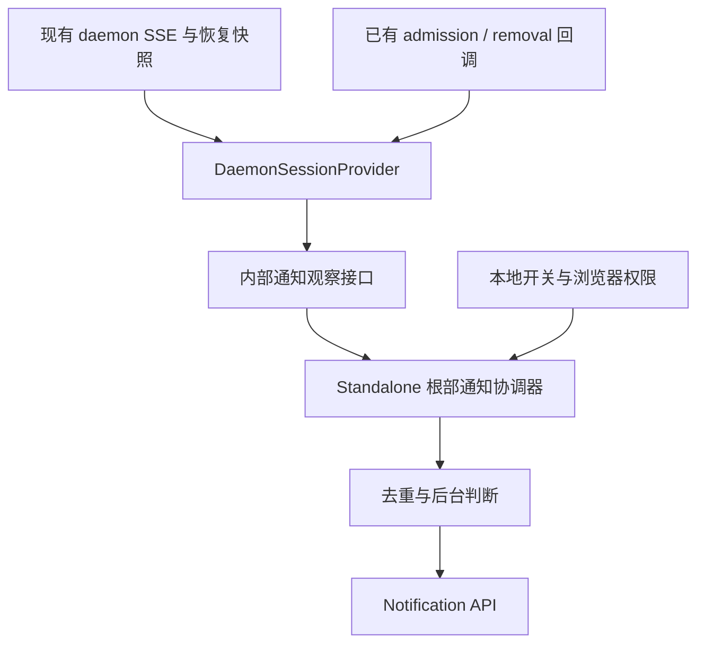

# Web Shell 浏览器任务通知：独立实现设计

状态：独立浏览器通知已实现，构建和自动化验证通过。调研及实现日期：2026-09-08。

## 决策与范围

基于当前 main 独立实现，不依赖 #11251。首版只修改 Web Shell client，复用已有 `turn_complete` / `turn_error`，增加通知专用的内部事件适配和一个用户开关。先浏览器通知，再支持 Channel。

产品名称为“浏览器任务通知”，但事件语义是一次 assistant 回合结束，不代表整个项目、多轮目标或所有后台 agent 都完成。首版覆盖页面仍在运行且当前聊天或 Split View 仍被观察的情形，包括浏览器切到后台、窗口失焦。切换到别的聊天后未挂载会话的即时提醒、关闭网页、浏览器冻结或系统休眠不在首版保证内。

## 当前代码依据

源码基线：`1a73f5bff6201473f237c5106367e944ba2d092b`。设计依据为该基线；后续实现及验证记录见文末。

| 当前实现                                                             | 可复用部分与限制                                                                                              |
| -------------------------------------------------------------------- | ------------------------------------------------------------------------------------------------------------- |
| `packages/acp-bridge/src/bridge.ts`                                  | 发布权威 turn_complete / turn_error，包含 session、prompt 标识。兼容类型允许缺少 promptId，通知不能猜测标识。 |
| `packages/web-shell/client/daemon/session/DaemonSessionProvider.tsx` | 已有 live 事件、历史恢复、重连及终态前 transcript flush；是通知观察接入点。                                   |
| `packages/web-shell/client/daemon/session/actions.ts`                | 普通及队列提交已有 onPromptAdmitted，确认移除已有 onPromptRemoved，可复用作恢复时的跟踪证据。                 |
| `packages/web-shell/client/main.tsx`                                 | StandaloneApp 已管理浏览器本地 theme/language；根节点覆盖主聊天和 Split View。                                |
| `packages/web-shell/client/components/messages/SettingsMessage.tsx`  | 已有本地 chatWidth 项及共享 Switch、SettingsRow。                                                             |
| `packages/cli/src/serve/routes/workspace-settings.ts`                | general.terminalBell、general.notificationMode 被归为 TUI-only，不能复用为浏览器开关。                        |
| `packages/sdk-typescript/src/daemon/DaemonSessionClient.ts`          | 有 lastEventId/epoch 恢复能力；SSE 结束也会拒绝 pending promise，不能据任意 reject 发任务失败通知。           |

App 的旧 onSessionChange(turn_complete) 和侧边栏 completedUnread 来自 UI/摘要变化，不作为新通知输入。旧原型位于独立的 `codex/browser-turn-notifications` 分支；只参考其权限、文案及设置逻辑，不整体引入已关闭 #10398 的历史。#11251 的宿主回调、最终 assistant 消息提取不属于本功能范围。

## 用户开关

入口：**Settings → UI → 浏览器任务通知**。默认关闭，立即生效，无需刷新或重启 daemon。

```text
浏览器任务通知                                  [关闭 / 开启]
页面在后台或窗口失焦时，提醒当前聊天和分屏聊天的回合结束或失败。
仅保存在此浏览器站点；关闭网页后不再提醒。

状态：未开启 / 已开启 / 等待授权 / 浏览器已阻止 / 当前环境不可用
```

复用已有 Switch 与 SettingsRow；增加 local 类型设置项，明确标注“此浏览器站点”。Settings 的 workspace/user scope 切换不改变该值，也不向 daemon settings API 写入。

| 配置项           | 决定                                                                           |
| ---------------- | ------------------------------------------------------------------------------ |
| 内部名称         | browserNotificationsEnabled: boolean                                           |
| localStorage key | qwen-code-web-shell-browser-notifications                                      |
| 持久化值         | 字符串 true/false；不存在或非法时为 false                                      |
| 范围             | 当前 browser profile + origin；不随 workspace 变化，不同步到其他设备           |
| 默认与启停       | 默认 false，即使权限已授予也不自动开启；关闭停止新通知，开启不补发已处理的回合 |
| 标签页同步       | 监听 storage 事件；写入页面直接更新本地状态                                    |
| 存储失败         | 本页面内继续可用，提示“设置仅在当前页面有效”                                   |

不写入 `.qwen/settings.json`：浏览器权限是设备/站点状态，daemon 配置不能代替用户授权；同一个 workspace 可以同时被权限不同的浏览器打开。

### 权限与设置状态

开关表示用户偏好，状态文字表示当前是否可用。发送需同时满足偏好开启、权限 granted、环境支持及后台条件。

| 操作或状态                           | 行为                                                                                                            |
| ------------------------------------ | --------------------------------------------------------------------------------------------------------------- |
| 关闭→开启，permission=granted        | 保存 true，立即生效。                                                                                           |
| 关闭→开启，permission=default        | 在点击的同步调用链中 requestPermission；等待期间禁用重复提交，允许后才保存 true。拒绝或关闭对话框则保持 false。 |
| 关闭→开启，permission=denied         | 保持 false，提示去浏览器站点设置允许通知，不重复请求。                                                          |
| 开启→关闭                            | 保存 false，不撤销浏览器权限，不补发。                                                                          |
| 已保存 true，权限后来被撤回          | 保留偏好，显示“浏览器已阻止，当前不会通知”；可关闭开关。发送前重新检查权限。                                    |
| 已保存 true，permission 回到 default | 显示“等待授权”和“允许通知”操作；页面加载不自动申请。                                                            |
| 非安全上下文、API 缺失               | 显示不可用原因并禁止开启，不自动改写持久偏好。                                                                  |

设置页打开、窗口重新聚焦和实际发送前重新读取权限，不依赖持续权限订阅。迟到的授权结果不得覆盖其他标签页在等待期间作出的关闭操作，使用请求代次和最新偏好检查丢弃失效结果。

首版面向桌面浏览器；Notification 对象存在不代表手机支持构造器。构造失败或 error 事件更新本地可用状态，不能影响聊天或重复弹错误。用户手势、安全上下文和跨源 iframe 限制参见 [MDN Notifications API](https://developer.mozilla.org/en-US/docs/Web/API/Notifications_API/Using_the_Notifications_API)。

## 触发与文案

| 输入                                   | 行为                                                              |
| -------------------------------------- | ----------------------------------------------------------------- |
| turn_complete，stopReason=end_turn     | 通知“本轮已完成”。                                                |
| turn_error                             | 通知“本轮执行失败，请返回查看”，不显示错误正文。                  |
| turn_complete，stopReason=cancelled    | 不通知，静默消费终态。                                            |
| 其他合法 turn_complete stopReason      | “本轮已结束，请返回查看”，不把 token 上限等停止原因说成任务成功。 |
| prompt_cancelled                       | 只是取消请求，不抢先消费最终终态。                                |
| 排队 prompt 确认 removed               | 清理对应跟踪记录并静默处理，不改变其他回合。                      |
| SSE 断开、重试、HTTP/权限错误、UI idle | 不作为任务失败证据。                                              |
| 缺失或冲突的 sessionId/promptId        | 不通知，不用当前会话替代事件来源。                                |

展示条件为 `document.visibilityState !== 'visible' || !document.hasFocus()`。前台聚焦时消费终态但不展示，后来失焦不补弹。首版不增加时长阈值、声音选择或自定义正文。

标题固定 Qwen Code，正文仅上述通用文案，不含 prompt、答复、错误、会话标题、路径或 workspace 名。点击尝试 window.focus() 并关闭通知，不自动切换会话；操作系统可能拒绝聚焦，不能保证成功。展示失败不改变回合结果。

## 内部架构



在 `client/daemon/session/` 增加包内通知观察 Context，默认 undefined，仅传纯数据，不访问 Notification 或 localStorage。实现由 standalone 根协调器提供，主聊天和 Split View 共用。非 standalone 宿主无此祖先时不跟踪、不显示设置、不申请权限；standalone 页面被 iframe 加载时也不挂载通知协调器。

接口最小数据：来源范围、sessionId、promptId、事件类别、stopReason、live/restore 来源，以及 admission/removal 信号。不传正文，不导出公共 SDK API，不修改既有宿主回调。下层 session 只依赖内部类型，上层浏览器模块消费它，避免循环依赖。

来源范围由规范化 daemon base URL、产品 session context 和已解析 workspace 身份组成，取自捕获的 session owner。异步发送不能再读取已经切换的全局 connection。token、URL 查询参数和 fragment 不得进入通知标识或共享记录。

### 终态与恢复顺序

1. 在现有 live 终态完成 normalize、flush 和 assistant.done 投影后发布通知数据；先校验 owner，避免在 active/observer 两个分支重复发布。
2. 复用 onPromptAdmitted，只读 owner/promptId，保留已有 turn navigation 行为。普通及队列提交都登记；确认 removal 后移除。带明确 promptId 的 live 启动证据也可登记，历史用户消息不能建立新 admission。
3. live 流（包括 cursor 增量恢复）的真实终态可以直接进入统一去重。终态先于本地 admission 回调抵达时先处理，晚到 admission 不能重新登记为未结束。
4. 初始历史、历史分页和跳转加载保持静默。恢复快照的终态只有匹配本页面此前跟踪的未结束 prompt 才可补发，且在快照提交后发布。
5. 同会话重连、epoch 重置和 ring eviction 重载保留待跟踪身份；不能只存在可能被清理的 activePromptsRef 中。根协调器保存最小集合。
6. 页面刷新不持久化待跟踪列表；新页面不补发刷新前已完成历史，之后 live 到达的新终态仍可通知。恢复数据不含目标终态时，不依据 hasActivePrompt=false 推测成功。
7. 明确切换会话或关闭 pane 后，不另保留连接；最后一个对应观察者退出时清理其跟踪。连接重试及 React StrictMode 的同身份重建不算用户离开，不能误清理。

当前观察范围的终态在开关关闭/前台时仍被消费，以防重复事件在后来开启时补弹。上述集合属于通知模块，不能反向改变 transcript、输入或 daemon 生命周期。

## 去重保证

键包含来源范围 + sessionId + promptId。通知 tag 和共享记录使用稳定指纹，源数据只留在内存，不存正文/token。已处理记录采用有界近期缓存，候选上限 1024 条，不增加用户配置；历史终态始终先经过跟踪门槛，因此缓存淘汰不应重放历史通知。

- 同页面先认领终态，再判断取消、开关、权限及前后台。主聊天和分屏重复事件只触发一次通知尝试；取消/前台/关闭也算已处理。
- 同源多标签页在 Web Locks 与共享存储可用时，用短锁保护已认领指纹的检查及写入，锁内重新检查开关和权限。只有满足本地展示条件的页面参与跨页发送认领；未开启的页面不能吞掉有效页面的资格。
- 同一键使用稳定 tag，支持时 renotify=false。无锁或无共享存储时退回同页面去重及同 tag 替换，不保证跨标签页严格只提醒一次。
- 跨页记录表示已认领一次尝试，不表示用户收到或看到。写入后崩溃或系统通知失败可能漏提醒；首版不增加持久投递队列与重试，不宣称 exactly-once delivery。
- 可见性以发送页面为准：一个标签页前台、另一个后台时，后者仍可能提醒。首版不增加跨页阅读状态协调。

Web Locks 提供同源互斥，tag 是通知替换而非事务幂等。参见 [MDN Web Locks](https://developer.mozilla.org/en-US/docs/Web/API/Web_Locks_API) 和 [MDN renotify](https://developer.mozilla.org/en-US/docs/Web/API/Notification/renotify)。

## 实际改动

实现涉及以下位置及对应测试。

| 位置（packages/web-shell）                         | 责任                                                                        |
| -------------------------------------------------- | --------------------------------------------------------------------------- |
| client/daemon/session/turn-notification-context.ts | 包内观察接口及类型，不导出公共 barrel。                                     |
| client/daemon/session/DaemonSessionProvider.tsx    | admission/removal、live 终态及恢复快照提交点。                              |
| client/browser-turn-notifications.tsx              | 根协调器、本地设置 context、权限/展示及有限去重状态；避免提前建设通用框架。 |
| client/main.tsx                                    | 仅顶层 standalone 挂载协调器，传入当前语言。                                |
| client/components/messages/SettingsMessage.tsx     | UI 本地开关、权限状态及授权操作。                                           |
| client/i18n.tsx、README、对应测试                  | 文案、产品边界和回归验证。                                                  |

不新增 SSE 连接或额外 transcript provider，不改 daemon route、settings schema、CLI 通知服务、Channel worker 或 SDK 公共合同。#11251 若后来合并，可评估复用入口，但不是交付条件。

## 验证与交付

实施前按仓库要求使用全局 qwen 做基线 dry-run；设计阶段不运行。实施后运行 build、typecheck、相关单测与桌面浏览器 E2E。模拟 Notification 的单测不能代替 OS 通知接收证据。

| 测试组     | 验收重点                                                                                        |
| ---------- | ----------------------------------------------------------------------------------------------- |
| 开关       | 默认关闭、granted 不自动启用、workspace/user scope 不影响、刷新持久化、storage 同步及失败降级。 |
| 权限       | 点击才请求、三个权限状态、撤回、迟到授权、iframe/API/安全上下文、构造及 error 事件失败。        |
| 终态       | 完成/失败/取消/其他 stopReason、冲突 ID、取消请求不抢占终态、断网不是任务失败。                 |
| 身份与排序 | 投影先于通知、终态先于 admission、主聊天/分屏重复、workspace 切换和旧 owner 隔离。              |
| 恢复       | 历史静默、跟踪回合的增量/快照补发、epoch/ring 重载、StrictMode、刷新不补旧历史。                |
| 去重       | 前台/关闭消费后不补弹、缓存边界、多页锁竞争、无锁/存储降级、失败不改变聊天。                    |
| 手工       | Chrome/Safari 桌面后台完成和失败、OS 权限、点击聚焦；其他浏览器未测需明确标注，手机不宣称支持。 |

E2E 清单见 `.qwen/e2e-tests/web-shell-browser-turn-notifications-independent.md`。实现完成后审阅完整 diff，按仓库要求完成两轮干净自审和独立代码复核；提交 PR 另按用户指示执行。

## 后续能力

切换聊天后仍提醒旧聊天，可另加针对未结束 prompt 的轻量观察或评估 workspace 终态流，不能靠 running-to-idle 猜测，也不为全部历史会话建立连接。

关闭网页后提醒优先由服务端 Channel 承担。已有 prompt delivery 投递正常 end_turn 的最终答复，不等同于状态通知或失败提醒；简短完成/失败提醒需另接服务端终态，并沿用明确授权目标和所属 workspace，不由浏览器收到事件后代发。

网页关闭后的浏览器推送需要另外的 Push 投递链路，单独注册 Service Worker 不够，首版不包含。参见 [MDN Push API](https://developer.mozilla.org/en-US/docs/Web/API/Push_API)。

## 实现与验证记录

实现仅修改 Web Shell：根组件提供页面级通知状态和本地设置，DaemonSessionProvider 在 live / recovery 已完成 transcript 投影后观察权威终态，既有提交回调用于恢复跟踪。没有新增 daemon 路由、SSE 连接或公开 SDK 回调。页面验证同时发现并修正共享 Switch 的状态选择器：匹配 Radix 的 data-state 属性，以正确显示开关颜色和滑块位置。

单元测试覆盖终态分类、权限与偏好、重复消费、历史静默、存储受限、通知失败隔离，以及实际 Provider 的终态投影顺序和 epoch reset 恢复。页面级验证使用真实 Web Shell、mockDaemon SSE、Chromium 和 Notification stub，覆盖设置入口、无 daemon 设置写入、前后台差异、双页开关同步与真实 Web Locks 竞争。操作系统最终展示、移动端及关闭页面后的推送不属于本次验证。详细命令和结果位于本地 `.qwen/e2e-tests/web-shell-browser-turn-notifications-independent.md`。

最终源码通过全仓 `npm run build`、`npm run typecheck`、`npm run bundle`，6 个相关测试文件合计 365 项通过；修改文件 ESLint、Prettier 和 diff 检查通过。独立复核发现并修复迟到授权覆盖其他标签页关闭操作的竞态，修复后的复核无新增问题。
