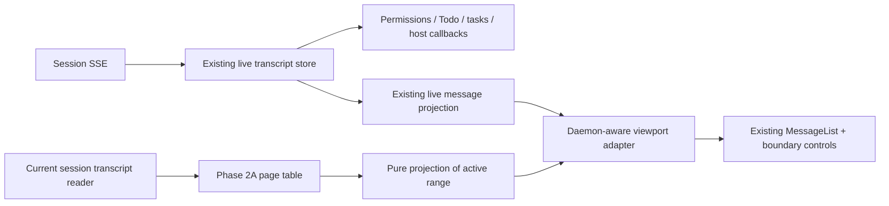

# Web Shell turn navigation Phase 2B: historical viewport integration

## Status and decision

Implemented in [#11208](https://github.com/QwenLM/qwen-code/pull/11208),
2026-09-07. Review and verification status are tracked on that PR.
The same open PR now includes the agreed Phase 3 global rail, implemented at
`02e975e9fa`. Its final interaction preserves ordinary upward pagination and
adds compact ticks with hover/focus previews and distant on-demand selection;
there is no historical snapshot toolbar. The original integration rationale
below is superseded where it describes explicit sequential-entry controls.
See the [parent design](web-shell-global-turn-navigation.md) for current scope
and the distinction between completed frontend tests and real-daemon acceptance.
Implementation started on `1a86cd6c5`. User approved the compatibility variant:
keep `HistoricalTranscriptRange` and the legacy navigation snapshot unchanged;
expose sequential ranges through an additional viewport snapshot/command surface
over the same page table. Never synthesize turn IDs for before-record origins.
Global baseline evidence is recorded in
`.qwen/e2e-tests/phase2b-baseline-result.md`.
Tracks [#10750](https://github.com/QwenLM/qwen-code/issues/10750), building on
[#11054](https://github.com/QwenLM/qwen-code/pull/11054).
Code observations below are pinned to `ec572f68e16c954927d20fee57a0507411c72702`.
Implementation is based on main `1a86cd6c5`; the listed consumers were rechecked.

Use **one visible contiguous historical range**, backed by the existing bounded
page table, while the live transcript continues independently. A daemon-aware
presentation adapter selects the visible source. Do not replace the live SDK
store, merge historical pages into it, or concatenate unrelated cached ranges.

This supersedes the **Phase 2B migration and UI deferral** portions of the
[Phase 2 implementation plan](../../plans/2026-09-04-web-shell-global-turn-navigation-phase2.md).
That plan proposed an atomic-prepend compatibility projection and deferred the
historical viewport to Phase 3. Here, Phase 2B includes the minimum viewport,
boundary controls, and scroll preservation needed to make sequential browsing
use the bounded history cache. Phase 3 owns the global virtualized rail,
ordinal navigation controls, previews, and rail keyboard interaction; that work
has now been delivered in the same PR with the final scrolling interaction above.

## Outcome and non-goals

A user can load earlier history, continue in either direction beyond the cache
cap, and return to the live tail. Pages and missing ranges remain distinguishable;
background output and current approvals continue while history is visible.
The existing loaded-only path remains available for unsupported daemons.

The Phase 2B data/viewport scope excludes the rail delivered as Phase 3 in the
same PR. Neither phase adds search, browser persistence, a new
daemon route, an SDK reducer rewrite, or a second navigation/ledger store.
It does not migrate subagent detail pagination or the public read-only
`WebShellTranscript` component. It does not promise a low-latency recovery of an
arbitrarily long backward-only gap.

## Current code and integration constraints

Paths below are relative to `packages/web-shell/client/`.

| Area                                                                                                      | Verified behavior                                                                                      | Design consequence                                                                                   |
| --------------------------------------------------------------------------------------------------------- | ------------------------------------------------------------------------------------------------------ | ---------------------------------------------------------------------------------------------------- |
| `App.tsx:894`, `:3188`, `:3814`                                                                           | Structural live snapshots feed the outer App; `LiveMessageList` projects streaming updates separately. | Preserve this split and live update throttling.                                                      |
| `App.tsx:935`                                                                                             | The live wrapper updates `messagesRef` and calls the host transcript callback.                         | Historical visibility must not change host callback semantics.                                       |
| `App.tsx:4073`, `:6455`, `:6488`, `:6603`                                                                 | Messages/blocks also drive output associations, permissions, Todo, workflow, and task activity.        | Keep business/control consumers on live data.                                                        |
| `adapters/localizedMessages.ts` (`transcriptBlocksToLocalizedMessages`); `hooks/useTranscriptViewport.ts` | The localized adapter retains source identity without live background-agent reconciliation.            | Use the pure localized adapter for history, not a second live hook.                                  |
| `components/MessageList.tsx:2887`, `:3263`                                                                | Grouping, metrics, collapse, and the local timeline assume contiguous input.                           | Project one continuous range; do not use a synthetic message to hide a gap between unrelated ranges. |
| `components/MessageList.tsx:3448`, `:4168`, `:4590`                                                       | Session reset, virtual rows, and prepend restoration already exist.                                    | Extend their view identity and anchor contracts instead of replacing the virtualizer.                |
| `components/MessageList.tsx:3820`, `:5130`                                                                | Quiet-period reload and new-message events can enable bottom following.                                | Historical mode must suppress both behaviors.                                                        |
| `components/MessageList.tsx:2855`, `:5400`; `App.tsx:13094`                                               | Edit/rewind uses a locally counted user-turn index.                                                    | Never enable these actions for a historical fragment.                                                |
| `components/ChatPane.tsx:1354`                                                                            | Split panes have a separate MessageList consumer and provider.                                         | Share the integration adapter, not viewport state.                                                   |
| `components/artifacts/SubagentDetail.tsx:204`; `components/WebShellTranscript.tsx:275`                    | Other consumers include a child session and a provider-free public renderer.                           | MessageList must remain usable without navigation context.                                           |
| `daemon/session/DaemonSessionProvider.tsx:4277`                                                           | Legacy history loads prepend into the live store and update repair checkpoints.                        | Leave this as the compatibility path; capable built-in views use page-table admission.               |
| `daemon/session/transcript-page-table.ts:176`, `:833` in `turn-navigation-store.ts`                       | Page selection is available only through turn lookup; gap recovery rereads a turn anchor.              | Add viewport pinning and a non-turn bootstrap origin for sequential browsing.                        |

The #11143 comparison identified useful interest in rendered identity, but the
current `sourceBlockIds` projection already supports the first integration.
Do not cherry-pick unused `Message.promptId` or `sourceRecordIds` fields merely
for symmetry. Add a field only if a named consumer cannot use the existing map.

## Ownership and visible source

Add an internal `useTranscriptViewport` integration shared by the main live
wrapper and `ChatPane`. It owns only presentation intent: live versus one
historical range, a pending transition, and a scroll anchor. It must not copy
blocks, cursor state, or page maps into another stateful cache.

The live projection continues running while hidden. Historical projection is
memoized by the active range's ordered page identities and locale; unrelated
SSE changes must not rerun it. Project the entire contiguous range together so
tool relationships can cross a page boundary, but never across a range boundary.
Discard derived projections when their pages leave the cache.

Historical tools use the existing pure projection without a background-agent
status poll, retaining normal tool payloads and details. A completed background
launch tool records successful launch, not the agent's eventual completion.
Only an in-range background notification supplies the agent's terminal status
and end time. Without it, the agent remains nonterminal snapshot state, not
proof that it is currently running. Do not enable `safeToolProjection`: that
also removes tool content and changes input/output projection.

Keep App/ChatPane live messages as the input to session-wide business logic.
Only row-local display data, such as historical output cards, use the historical
projection. Outputs must have an exact backing tool/record association; omit
unmatched cards rather than associating them with a fragment's last user turn.
Session latest-review, recap, copy-last-answer, and host callbacks stay live.

The generic MessageList receives optional presentation props and callbacks.
It must not call daemon navigation hooks. Reuse its renderer, virtualizer,
expansion, and locate helpers. The daemon-aware wrapper renders the small
history status/return controls; it is not a second MessageList implementation.

## Entering history from the live window

The current `locateOrdinal()` is insufficient for sequential pagination: it
correctly returns a live location for an already loaded turn, and an older page
may contain only assistant/tool records. Never invent a turn ID or fetch every
metadata page to find a convenient navigation anchor.

Add an `openBeforeLive()` command to the existing navigation store, backed by a
provider-observed **live older boundary**. The provider supplies its exact
persisted `beforeRecordId`, reachability, and owner-local boundary revision from
the existing load/trim/replay events. An ID-less optimistic echo is not a boundary.
Legacy cursor-only sessions remain on the existing history path.

Reachability here means persisted records exist before the boundary. It must be
captured before legacy capacity gating: legacy `hasMore=false` can mean the live
window is full, not that history ended. A count/byte-saturated live window with a
valid persisted boundary must still be able to enter the independent history
cache. Provider repair completeness remains authoritative; an unresolved repair
gap must be signalled explicitly, not treated as a proven contiguous live edge.

The command performs this sequence:

1. Capture the current client owner, chain, live boundary, and transition intent.
2. Obtain a successful fresh index-head snapshot whose read starts after that
   boundary capture. An older in-flight head request must be followed by a fresh
   read. `refreshHead()` currently catches errors, so completion of its promise
   alone is not evidence of a fresh usable snapshot.
3. Read `{ beforeRecordId, snapshot, limit }` through that session client. Do not
   pair a signed cursor with a snapshot or reinterpret it as a forward cursor.
4. Validate owner, chain, response integrity, and the captured live boundary
   revision. On trim/reload/rewind during the read, discard the result and offer
   retry; do not silently retarget the reader to a different record.
5. Admit the complete page under the existing historical budget. If no visible
   block is produced but the response has more records, advance with the legal
   backward continuation; retain cancellation/progress checks.
6. Switch the viewport only after admission succeeds. Initially show the newer
   edge of the preceding page with an explicit control back to the live view.
   Existing live blocks remain unchanged.

The first entry into history is an explicit view transition, not a prepend into
the live array. The control must say that it opens earlier history. No blank
intermediate view and no attempt to preserve the live array's scroll height
across this source replacement. Returning to latest is always available.

## Small extensions to the existing data layer

### Sequential range origin and reversible gaps

A sequentially opened range has a **frozen before-record origin**, whereas a
randomly opened range has a frozen turn origin. Represent these as distinct
origin cases, never synthetic ordinals or turn IDs. Keep turn-origin behavior
unchanged. A before-record range has no selected navigation turn by default.

Gap recovery must carry the origin plus the exact retained `afterRecordId`:
reread either `{ atRecordId, snapshot }` or `{ beforeRecordId, snapshot }`, then
walk backward until the retained edge is found, reusing Phase 2A's bounded
current-response/immediate-newer-candidate algorithm. It admits the nearest
missing page or the suffix following the exact retained record, without
splitting a persisted record group. A before-record origin never yields a forward
cursor by itself.
Its newer terminal boundary is the captured live edge, not transcript end.

Range origin, boundary recipes, and their strings count toward the same byte
budget. There is no tombstone list of every evicted page. Update range types,
request identity comparison, byte estimates, and all origin read sites together.
`HistoricalTranscriptRange` is exported today: widening it is a public type
change requiring maintainer/API review, not an undocumented compatibility claim.

The approved compatibility implementation leaves that exported type and the old
navigation snapshot intact. Sequential ranges are visible only through the
additional viewport API. Both origin families share one page table and one byte/page
budget, but overlap deduplication and cached-neighbor links stay within each
family; the old API must never point at a hidden sequential range. Concurrent
legacy and viewport callers can therefore retain an overlapping page twice,
charged twice to the same budget. Viewport pins protect both families.

The provider captures persisted reachability separately from legacy admission
capacity, together with the exact before-record ID and an owner/generation guard.
Cursor-only loads keep their existing loader. A pending legacy load or unresolved
repair cannot supply a bootstrap boundary. If legacy loading extends live across
a historical edge later, exact record overlap suppresses unnecessary gap recovery.

### Viewport retention anchor

Add a narrow `setViewportAnchor(viewportId, pageId | undefined)`
command. Each mounted viewport has a stable local registration ID and releases
its pin on unmount or return to live. Its caller supplies the representative
page of the first visible content row, synchronously before starting a boundary
load and when that row moves to another page. This extends page-table retention
selection; it does not change the rail's logical selected turn, fetch metadata,
or require a user prompt inside that page.

Main/split providers naturally isolate pins. Multiple embedded views sharing
one provider must not overwrite each other's pin: retain at most one reading
anchor per mounted viewport, and exclude all registered anchor pages/ranges
from eviction. Registration cleanup is mandatory; this is bounded by mounted
views, not visited turns. If their pins exhaust the shared budget, report
capacity pressure rather than evicting another visible view's reading anchor.

Eviction protects the reading-anchor page and the incoming page, removes the
opposite outer edge when possible, and restores that edge's recovery recipe.
Do not pin every page ever seen or the entire range. A constrained window stays
readable and reports capacity pressure; moving the reading anchor and retrying
must make progress. An individually oversized page is terminal for that request,
not a reason to disable navigation session-wide.

### Historical view revision

Expose a monotonic history revision derived from the existing reset/owner
epochs. It changes on chain reset or owner replacement, not on normal append or
page admission. Page/range IDs are currently reused after reset, so a session ID
and range ID alone cannot identify the lifetime of a historical view.
The presentation adapter uses this revision with the session and range identity
to reset stale focus, expansion, and pending scroll operations.

Viewport-originated fetches also carry that viewport's registration and current
navigation-intent token into the store's request guard. Check it before further
recovery reads and before cache admission, not only after the promise returns
to React. Return-to-live, a different requested view, and unmount invalidate the
token; ordinary scroll/pin movement does not. Existing headless callers retain
their session/chain guards. Cancellation of one embedded viewport must not
cancel another viewport's work or release its pin.

## Boundaries and transitions

| Boundary/state                              | Visible behavior                                                             | Command/ownership                                                         |
| ------------------------------------------- | ---------------------------------------------------------------------------- | ------------------------------------------------------------------------- |
| Older/newer loadable                        | Explicit load control at that edge; no implied complete history.             | Existing `loadOlder` / `loadNewer` for the active range.                  |
| Loading                                     | Keep current rows; disable repeated requests at that edge.                   | One in-flight request per boundary identity.                              |
| Retryable error                             | Inline retry while keeping readable rows.                                    | Retry that boundary; do not clear unrelated metadata errors.              |
| Page too large / partial / invalid response | Explain that the requested section is unavailable; retain the old view.      | No truncated-page success or automatic retry loop.                        |
| Cached neighbor                             | Offer continuation into the named cached range.                              | Switch only after validating neighbor lifetime and pinning its near edge. |
| Live boundary                               | Offer return to latest; do not append a live array to the range.             | Clear historical reading pin and resume existing live follow behavior.    |
| End                                         | Show start/end of the frozen history where proven.                           | No more fetches in that direction.                                        |
| Missing origin / expired snapshot           | Keep or explicitly retire the old frozen view; offer reload/retry or latest. | Never guess a new ordinal, workspace, or cursor.                          |

A `live` boundary records overlap/adjacency at an earlier instant. Live trimming
can remove that overlap. It must not be displayed as proof that current live
rows immediately follow the historical range. To continue through that newly
unloaded interval, capture the new live older boundary, obtain a fresh snapshot,
and recover from that before-record origin back to the exact retained historical
edge. Commit only if that edge still exists on the active chain; otherwise
report invalidation. A plain "return to latest" remains an explicit jump that
may skip the gap, not a claim that the gap was loaded.

Do not auto-fetch both directions or chase a growing live tail indefinitely.
Keep sequential edge loading coalesced; an error requires an explicit retry.
The historical bottom is not the live bottom. Remote output updates the live
status/return affordance without scrolling or switching the historical view.
An explicit local send or existing "resume bottom follow" action returns to live
before showing its optimistic prompt. Merely typing a draft does not switch.

## Identity, fragments, and scrolling

Use `turnId -> location.blockId -> message.sourceBlockIds -> display row` for
future random targets. For sequential tool-only pages, use exact block/record
identity. Persisted record identity is for lookup; message and virtual-row IDs
remain presentation identities. One record can create several rows, so record ID
alone is not a unique virtual key. Same-text prompts must remain distinct.

For same-range continuation/eviction, capture the first visible content row and
its pixel offset, pin its page, then restore that surviving row after layout.
Extend the current row-source helper: it only exports source block IDs for plain
message rows today. Every anchorable row needs a representative source, including
compact/parallel-agent groups, collapsed turns and output rows. For an expanded
group use the first actually visible child; for a collapsed group use its stable
representative tool/block; output rows resolve through their exact owning turn
or tool. A cross-page row pins that representative source's page, not every page
in the group. Pure controls are not reading anchors. If a row has no exact source,
use the nearest source-backed content row and make that limitation explicit.

Reuse row-key restoration with this complete row-to-source/page map. If a projection
regroups the row, resolve its exact source block to the new row. A full rematerialize
may require record identity plus a block-role discriminator; if no exact target
survives, report a source transition instead of jumping to similarly worded text.
Do not rely only on scroll-height deltas: prepend and opposite-edge eviction can
cancel each other's height changes.

Separate view identity from data updates: changing source/range/revision resets
transient scroll state, while appending within that range does not remount it.
Carry session/view keys through split panes as well as the main view. Delay a
target scroll until the target row exists; folded targets use the existing
expand-then-locate path. Any later user navigation cancels pending scroll effects.

Historical first/last fragments can be partial turns. They stay expanded by
default and must not present incomplete totals as complete duration, usage, or
final-answer summaries. A historical last row is never marked as the active live
answer. Hide the local loaded-message timeline in historical mode for this phase;
do not relabel a window-local count as the session-wide turn count.

Historical mode disables new-user bottom-follow and the 500-block/15-second
quiet reload. Live mode preserves them. Provider-driven repair remains enabled
for live correctness; its owner/chain changes invalidate affected history work.
Do not retain an extra full historical message array just to preserve a viewport
whose pages have already been evicted or invalidated.

## Interaction and lifecycle safety

| Concern                              | Required behavior                                                                                                                   |
| ------------------------------------ | ----------------------------------------------------------------------------------------------------------------------------------- |
| Approvals / AskUser / Todo / tasks   | Remain connected to live state and reachable through the composer/current approval UI. Historical permission rows are display-only. |
| Edit, rewind, retry-last             | Disabled on historical fragments; never pass a fragment-local turn index to session mutation.                                       |
| Branch and turn-output mutations     | Remain disabled in the historical viewport in this phase. Stable-identity mutation UX is separate follow-up work.                   |
| Copy, attachment, file/tool detail   | Read-only inspection remains available using exact identifiers and the same session/workspace owner. No "latest turn" fallback.     |
| Historical background agents         | Pure projection only; do not start an extra status reconciliation loop for recorded pending tools.                                  |
| Session/workspace/split change       | Clear viewport intent and pin; ignore old requests and scroll callbacks using owner guard, history revision, and view generation.   |
| Same-session reconnect               | Freeze readable rows while disconnected; disable history I/O. Owner replacement or chain invalidation retires old view state.       |
| Rewind / divergent head              | Invalidate before old rows or reused IDs can be treated as current and return to live.                                              |
| Capability absent / indexing ceiling | Use existing live/legacy history behavior, without new navigation requests.                                                         |
| Transient index error                | Preserve usable history; expose retry. Do not switch data sources on each temporary error.                                          |

All reader commands remain **live-session-owner scoped** through the bound
`DaemonSessionClient`. No new daemon route or workspace resolver is introduced.
Provider, actions, normalization, attachment/detail readers, and error paths
must preserve that owner; unknown or removed owners never fall back to primary.

## Compatibility and delivery

Keep public `useTranscriptHistory()` and raw transcript hooks unchanged. They
continue to describe the legacy live-store path for existing consumers.
Built-in main/split views use the new viewport adapter only when the navigation
data layer and exact bootstrap boundary are ready; otherwise they use the old
history props. Do not silently change what external hook consumers receive.

Choose one pagination route when an action begins. Wait for an existing legacy
load to settle before enabling the new route; never admit one response into both
stores. Capability/error transitions do not reinterpret an in-flight request.
The old provider boundary bookkeeping remains necessary for fallback and
external consumers; removing it is not a Phase 2B acceptance criterion.

Implementation is ordered in two reviewable slices, both required for Phase 2B:

1. **Data-layer bridge:** sequential origin/bootstrap, viewport pinning, revision
   visibility, live-edge gap recovery, and pure regression tests. Preserve
   Phase 2A turn-origin tests and the legacy history contract.
2. **Presentation integration:** shared adapter, main/split wiring, boundary
   controls, safe historical interactions, scroll restoration, DOM and browser
   tests. Enable the built-in capable path only when these tests pass.

Do not revive #11143's flat-array ledger in parallel. Reuse a small identity
change from that PR only when a test demonstrates a missing identity consumer.

### Expected files

| Files under `packages/web-shell/client/`                                     | Work                                                                                        |
| ---------------------------------------------------------------------------- | ------------------------------------------------------------------------------------------- |
| `daemon/session/transcript-page-table.ts`, `turn-navigation-store.ts`, tests | Sequential origins, recovery, pinning and lifecycle revision.                               |
| `daemon/session/DaemonSessionProvider.tsx`, tests                            | Feed exact live boundary and owner; keep normalization side-effect-free.                    |
| Session/export barrels                                                       | Expose only the required navigation contract additions; verify generated declarations.      |
| New `hooks/useTranscriptViewport.ts`, tests                                  | Source selection, commands, derived history projection and transition guards.               |
| `App.tsx`, `components/ChatPane.tsx`, tests                                  | Integrate only at display boundary; preserve live business consumers.                       |
| `components/MessageList.tsx`, tests; a small boundary component              | View mode/key, anchor reporting/restoration, edge controls and historical read-only policy. |
| Existing locale resources                                                    | Boundary, retry, invalidation and return-to-latest labels.                                  |
| `client/e2e/` (relative to package root)                                     | Focused browser regression spec using existing Playwright setup.                            |

Verify the pure adapter's launch-only and in-range notification projections
without changing live reconciliation or discarding historical tool details.

No changes to `packages/core`, `packages/cli`, or `packages/sdk-typescript` are
planned. No new library or global CSS rewrite. New controls reuse shared UI
primitives; preserve React 18 refs, portal-root scoping, themes, and embedded use.

## Acceptance and verification

The execution test plan is
`.qwen/e2e-tests/web-shell-global-turn-navigation-phase2b.md` (local artifact).
The following requirements remain committed even when that local file is absent:

- Capable live view opens the immediately preceding page, including a tool-only
  page and a saturated live window; initial failure leaves the live view unchanged.
- Read beyond five historical pages in both directions, move the viewport pin,
  reverse direction, and recover exact record order without duplicates.
- A live trim that removes the joining edge exposes and can recover the gap;
  a frozen cursor never silently skips to the new live tail.
- After same-range admission/eviction, the anchor row remains within 2 CSS pixels
  of its previous offset once deterministic layout settles. Test virtual and
  non-virtual lists, regrouping, and late media measurement separately.
- First-visible parallel-agent, collapsed-turn and output rows resolve to an
  exact retained page; multiple embedded viewports do not overwrite each other's
  reading pin or leak pins after unmount.
- Background-agent launch records remain nonterminal without an in-range
  completion notification; terminal status and end time come from that
  notification when available. Tool details remain readable in both cases.
- Stream, approve a live request, update Todo/tasks, and queue a prompt while
  history is visible. Live callbacks continue; historical rows do not act live.
- Reconnect, rewind, snapshot loss, source switch, and split-pane changes reject
  late state/scroll updates, including reuse of the same numeric range ID.
- Transient failures recover after retry; full/oversized windows have distinct
  behavior. Tests must assert subsequent progress, not just an error enum.
- No-capability, index ceiling, legacy cursor-only, subagent detail, and
  provider-free `WebShellTranscript` remain usable.
- Historical projections and retained page metadata remain bounded by the
  current window, not total turns or number of previous navigation actions.
- Only the legacy/live path schedules quiet-period transcript reload; browser
  history does not disable provider repair or current approval handling.

Before implementation, dry-run the planned baseline with the installed global
CLI and record gaps rather than pretending the feature exists. Then verify the
local build with focused package tests, root build/typecheck/bundle, and real
browser runs. Mock-daemon browser tests prove UI behavior, not signed-cursor
protocol correctness: retain separate real-reader/signed-cursor tests.

The installed global CLI `0.22.2` baseline ran in an isolated daemon/browser and
did not advertise turn navigation. Real-reader probes subsequently verified
tool-only bootstrap, signed backward continuation, bounded bidirectional gap
recovery, cancellation, multiple pins, and a fresh before-origin after live trim.
Separate Chrome mock-daemon runs verified main/split viewport transitions,
six older and two newer admissions (including equal-sized eviction windows),
live background output, and composer approval during history. Ordinary-list
anchor drift measured at most 0.125 CSS pixels; virtual-list drift was zero.
Mock-browser checks do not prove signed-cursor behavior; real-reader probes do
not prove React layout. Reports remain under `.qwen/e2e-tests/`.

Final root build, typecheck and bundle passed. The broad focused run passed
1,726 tests; after the virtual-transition fix, the affected renderer/viewport,
store/table and build-artifact run passed 282 tests. These runs overlap and
must not be added together. Two clean self-audit passes were completed.

The committed-style Chrome regression uses 16 and 200 records per page. Both
cases passed six older and two newer admissions with the exact source offset
within 2 CSS pixels for four consecutive 100ms samples, followed by actual newer
record assertions. The 200-record case caught and now covers ordinary-to-virtual
anchor loss and delayed index recentering after subsequent user wheel input.
Historical restoration ignores its own scroll events and uses immediate virtual
offset positioning instead of leaving a long-lived index target behind.

The native review runner captured all 26 changed files, including five new files,
but its ten-minute unattended run returned `completed: false`, `timedOut: true`
and no verdict. This is not an approval. Integrated browser-to-real-HTTP-daemon
coverage and comprehensive grouped-row/media cases remain unverified; the
separate UI and signed-reader results do not cover them. Subsequent verification
at `02e975e9fa` passed eight browser lifecycle scenarios for reconnect, rewind,
branch, and late-request isolation using deterministic HTTP/SSE fixtures, plus
105 targeted unit tests. These unit runs overlap previous totals. See the parent
design for the tested behavior and remaining real-daemon acceptance boundary.

## Review gates and tradeoffs

The decisions above are the approved defaults, not unresolved implementation
choices. Before code lands, review the additive viewport contract and
confirm the main/split consumer map against the implementation base. If that
requires a breaking public API or a cross-package protocol change, stop and
re-scope rather than silently expanding this phase.

The final UI preserves ordinary upward scrolling and opens an isolated historical
window when a distant rail target is selected. That window does not concatenate
all cached ranges with the live tail. This limits cross-gap grouping and mutation
risk. Smooth simultaneous multi-range rendering would require a separate
gap-aware projection design.
Long-gap recovery is memory-bounded but can require many reads; record request
counts and latency, allow logical cancellation, and do not advertise constant-time
recovery. Protocol optimization belongs in a separate measured follow-up.
