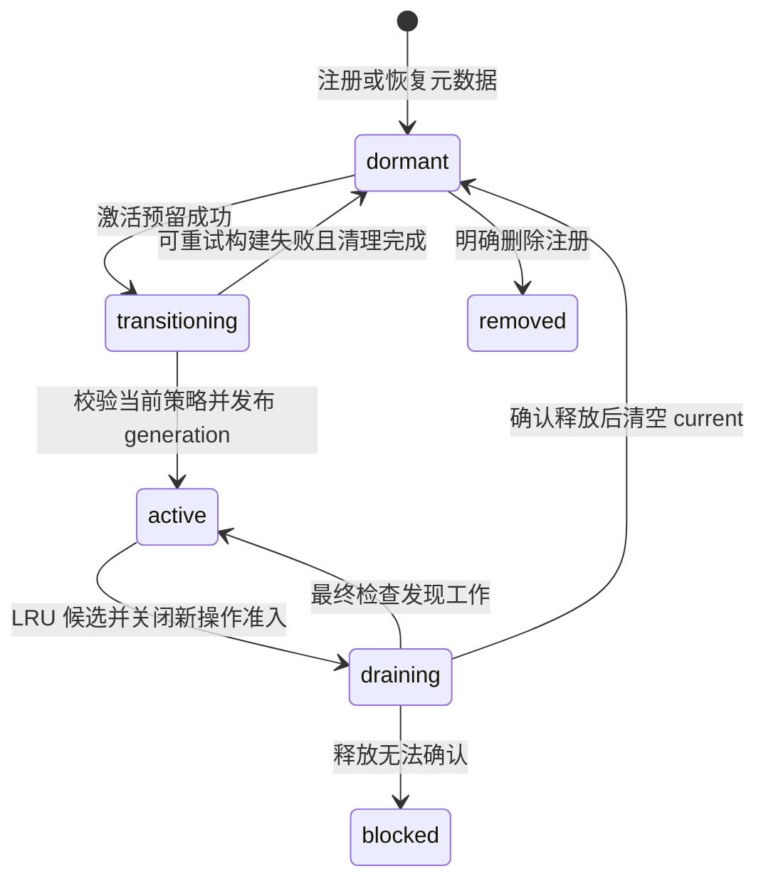

# Workspace 注册扩容与运行时休眠调研

## 定位与结论

关联 [#11386](https://github.com/QwenLM/qwen-code/issues/11386)。本稿为 2026-09-08 的方案调研，核查基线为 `1a73f5bff6201473f237c5106367e944ba2d092b`（调研开始时的远端 main）。没有实现业务代码。随后已完成 1/25/256 空 workspace 的容量基线测量，见 [实测报告](workspace-capacity-baseline-2026-09-08.md)；这不是 LRU 实现或真实模型负载验证。Issue 提及的同名草稿未在本 checkout 或当前已登记的本地 Git worktree 中找到；本文件是本次新稿。

后续 P0 实现见 [容量常量解耦设计](workspace-capacity-decoupling.md)。它保留默认上限 25，独立管理注册、child 观测模型和 channel 超时预算；下文的源码事实与实测数据仍保留上述调研基线，扩容和 LRU 仍属后续工作。

建议接受“注册与常驻资源解耦”的目标，但调整容量模型和交付顺序：

1. 分别管理注册条目、daemon 内常驻的 WorkspaceRuntime 聚合、实际 ACP 子进程，不能用一个 live 数量同时代表后两者。
2. 保持 child-heap 为独立的观测模型；内存硬准入继续由 #8182 负责。
3. 根据后续实测，25→256 的空宿主增量约为 21 MiB 保留堆，尚不足以把完整 LRU 作为扩容的硬前置。先拆分常量，再处理 session 默认准入、channel 事务超时和持久化兼容，单独验证注册扩容；懒加载/LRU 作为有目标部署数据支持时再实施的独立优化。
4. 若实施 LRU，首版只自动回收已无 session、无子进程、无后台责任和在途操作的宿主对象。更积极地关闭空闲 session、停止仍存活的 ACP 子进程，另行扩展 bridge 的安全回收协议。
5. 若实施懒加载，开启的定时任务和 channel 服务仍需要在启动时发现并恢复；“只有 primary 急切构建”不满足当前后台服务契约。

## 已核实的代码事实

以下引用均相对上述基线；它们是静态源码证据，不是运行或性能验证。

| 事实                                                                              | 源码依据                                                                                                                                                                                                      | 对方案的影响                                             |
| --------------------------------------------------------------------------------- | ------------------------------------------------------------------------------------------------------------------------------------------------------------------------------------------------------------- | -------------------------------------------------------- |
| 注册常量已有别名，但值仍来源于 ACP 包的 25                                        | [workspace-inputs.ts](../../packages/cli/src/serve/workspace-inputs.ts#L8)、[channel-control-timeouts.ts](../../packages/acp-bridge/src/channel-control-timeouts.ts#L7)                                       | P0 是切断耦合，不只是改名                                |
| child-heap 仅支持 `off \| observe`，spawn 路径忽略拒绝结果                        | [child-heap-policy.ts](../../packages/acp-bridge/src/child-heap-policy.ts#L14)、[spawnChannel.ts](../../packages/acp-bridge/src/spawnChannel.ts#L479)                                                         | 当前没有可直接“接线”的 enforce 模式                      |
| 512 MB 是 child 堆分区模型的下限；不足时容量为 0                                  | [child-heap-policy.ts](../../packages/acp-bridge/src/child-heap-policy.ts#L104)                                                                                                                               | 不能 clamp 到 1；该数字也不是 daemon 宿主对象的实测成本  |
| 一个 bridge 通常一个当前 channel，但旧 child 正在退出时可以有两个存活 child       | [bridge.ts](../../packages/acp-bridge/src/bridge.ts#L14843)                                                                                                                                                   | runtime 数不能替代真实进程和在途 reservation 数          |
| 实际 child admission 已有同步 reservation 计数基础                                | [process-registry.ts](../../packages/acp-bridge/src/process-registry.ts#L144)、[spawnChannel.ts](../../packages/acp-bridge/src/spawnChannel.ts#L469)                                                          | 将来 enforcement 应放在真实 spawn 点并保持退出期间的占用 |
| 启动仍遍历所有 secondary 构建 runtime                                             | [run-qwen-serve.ts](../../packages/cli/src/serve/run-qwen-serve.ts#L5971)                                                                                                                                     | 存在 O(注册数) 常驻成本；是否懒加载由测量和目标部署决定  |
| registry 的 entry 与 current generation 已分离，但尚无 dormant                    | [workspace-registry.ts](../../packages/cli/src/serve/workspace-registry.ts#L60)、[workspace-registry.ts](../../packages/cli/src/serve/workspace-registry.ts#L106)                                             | 可扩展现有 registry，不必再建一套 workspace registry     |
| 现有 runtime ensure 会启动 ACP 并准备 Skills/MCP，附带 10 分钟保活                | [workspace-runtime-coordinator.ts](../../packages/cli/src/serve/workspace-runtime-coordinator.ts#L20)、[workspace-runtime-coordinator.ts](../../packages/cli/src/serve/workspace-runtime-coordinator.ts#L174) | 宿主对象激活与 ACP ensure 必须分层，不得覆盖既有语义     |
| Conversation manager 有 single-flight，但没有普通 workspace 的唤醒和驱逐协议      | [conversation-runtime-manager.ts](../../packages/cli/src/serve/conversations/conversation-runtime-manager.ts#L50)                                                                                             | 复用模式，不把该 manager 当成通用生命周期实现            |
| 非 force removal 把任何 resident session 视为 busy；终态删除注册和 registry entry | [workspace-management.ts](../../packages/cli/src/serve/routes/workspace-management.ts#L1257)、[workspace-management.ts](../../packages/cli/src/serve/routes/workspace-management.ts#L1631)                    | 可借用 drain 顺序；不能直接调用删除路由完成休眠          |
| session reaper 检查订阅者、restore、权限/工作，并可能向 child 请求条件关闭        | [bridge.ts](../../packages/acp-bridge/src/bridge.ts#L3195)                                                                                                                                                    | session 恢复不证明整个 workspace teardown 无损           |
| runtime teardown 停止 cron keepalive、channel worker、子会话并释放 Web Terminal   | [run-qwen-serve.ts](../../packages/cli/src/serve/run-qwen-serve.ts#L7166)、[run-qwen-serve.ts](../../packages/cli/src/serve/run-qwen-serve.ts#L7254)                                                          | issue 的 pinning 表还须覆盖 terminal、管理操作及在途 I/O |
| cron 在 session child 内触发；keepalive 也负责恢复和为 unbound task 建立绑定      | [scheduled-task-keepalive.ts](../../packages/cli/src/serve/scheduled-task-keepalive.ts#L7)、[scheduled-task-keepalive.ts](../../packages/cli/src/serve/scheduled-task-keepalive.ts#L75)                       | 冷启动只建 primary 会跳过 secondary 的后台任务恢复       |
| metrics refresh 已在无 live channel 时立即返回，且 bridge 内部 single-flight      | [bridge.ts](../../packages/acp-bridge/src/bridge.ts#L6588)                                                                                                                                                    | 外层预过滤只是小优化，不是从 25 扩容的主要安全条件       |
| 默认全局 session 上限为每 workspace 上限乘启动 workspace 数                       | [run-qwen-serve.ts](../../packages/cli/src/serve/run-qwen-serve.ts#L465)                                                                                                                                      | 25→256 可把默认 800 放大到 8192，必须单独核对            |

## 三种容量

以下 resident 容量和休眠协议是后续可选 LRU 的设计约束，不表示本次测量已证明必须新增该准入层。当前可先独立拆分注册、child model 和 channel timeout 常量。

| 容量                      | 建议语义                                                                                                           | 首版处理                                                                                                                                 |
| ------------------------- | ------------------------------------------------------------------------------------------------------------------ | ---------------------------------------------------------------------------------------------------------------------------------------- |
| `maxRegisteredWorkspaces` | 用户可见的 workspace identity 数，包含 primary；持久化 secondary、显式启动和动态注册按 canonical identity 去重计入 | 最终默认 256，CLI/env 可配置与否按 #9304/#9316 的诉求单独确定；若支持覆盖，所有入口使用同一个解析结果                                    |
| `maxResidentWorkspaces`   | 已物化宿主对象，以及激活预留和尚未确认释放的宿主对象数                                                             | 先用独立的 25 作为操作容量默认值，不宣称是内存安全值；可采用 issue 中 `--max-live-workspaces` 作为用户参数名，但文档须解释 resident 含义 |
| `maxConcurrentChildren`   | 实际存活、正在创建、退出尚未确认完成的 ACP child 数                                                                | 沿用独立 child-heap model；不随注册数增加，不在本需求里提前启用 enforcement                                                              |

Primary 和 internal runtime 只豁免自动驱逐，不能从资源统计中消失。它们物化时也应占 resident 配额；内置功能或后台责任导致全部名额不可回收时，返回明确容量错误，或要求运营者扩大配置。已知启动必须恢复的受保护集合超过配额时，应在启动阶段报出具体 workspace 和原因，避免随机丢失后台服务。

Issue 的 `floor(childPoolMb / 512)` 可以是独立 child 固定分区模型的输入，不能证明“这些宿主对象安全常驻”。将来 enforcement 还须检查 fixed ceiling 不低于 floor、不超过 legacy ceiling，并允许计算结果为 0；它约束的是 old generation ceiling，不等于整个进程树的 RSS。代表性 old-generation 峰值和 GC 成本验证仍是 [#8182](https://github.com/QwenLM/qwen-code/issues/8182) 的前置条件。

`maxTotalSessions` 继续是独立准入值。自动推导时应以明确的运行容量为基数，保留已有单 workspace 和显式无限值语义；不能把 256 条元数据默认换成 8192 个运行 session 名额。具体默认变更须在扩容 PR 中作为可见行为单独说明。

## 最小生命周期设计

继续使用 WorkspaceEntry 保存身份、注册关联、trust revision 和 generation；`current` 为空表示没有宿主对象。新增 dormant，激活复用 transitioning 和 generation 发布，不再创造另一个相似的 registry。

图仅描述新增休眠路径；保留已有 trust replacement、blocked 恢复和删除流程。容量不足在改变 entry 状态前拒绝，不把正常 dormant 写成 blocked。清理失败保留占用和不可用状态，禁止在同一 cwd 再创建可能与旧资源重叠的 generation。

建议增加 daemon 内部的 `ensureWorkspaceHost(entry)`（内部名称待实现时确定）。它先确保宿主聚合存在，再由原 `WorkspaceRuntimeCoordinator.ensure()` 决定是否启动 ACP；无需新增第二套用户可见 ensure API。

激活算法：

1. 在 await 之前取得 canonical workspace 对应的 single-flight operation；与注册、删除、trust replacement、休眠及 daemon seal 协调。
2. 以同步 reservation 计入 `resident + activating + retiring`，不同 workspace 的并发激活不能各自看见同一个空位。无空位时选一个安全的 LRU 候选；没有候选就返回建议的 `503 workspace_capacity_exhausted` 和可重试标记，不排无限队列。
3. 构建前重新检查路径身份、trust、settings/env、runtime storage 根目录与最新 policy revision，沿用现有 workspace factory，不从 primary 补值。
4. 发布前复查 daemon seal、entry 身份及策略版本。删除、trust 降级或 shutdown 已发生时，销毁候选并释放 reservation，不能让迟到的 Promise 重新发布。
5. generation 单调增加；继续使用已有按 cwd 保存的 runtime epoch source，不能因 bridge 重建把 epoch 重置。
6. 调用方在操作执行期间持有 generation 使用计数，`finally` 释放；不能只在 resolver 返回瞬间更新 LRU，否则 await 中的文件写入、认证或进程执行可能被驱逐。

上述三个占用集合互斥：active 宿主转为 retiring 时移动同一个席位，成功发布把 activating 移到 resident，不能重复计算同一个 generation。请求取消只结束该调用方的等待；共享构建的其他调用方仍需结果，daemon shutdown 则关闭所有新准入并等待候选清理。

LRU 的排序只使用成功的交互或真实后台工作完成时间。capabilities、状态轮询、metrics 和历史浏览不续期、不激活宿主。优先在需要容量时回收一个候选；周期性 reaper 若增加，应复用同一个动作及串行门，不引入第二套驱逐逻辑。首版无需为已冷的空宿主增加复杂的压力分级。

## 保守回收与 pinning

首版自动回收以 `sessionCount === 0` 且 bridge lifecycle 为 cold 为必要条件，同时要求下面的所有责任为空。不是仅检查 `activePromptCount === 0` 或 `isChannelLive() === false`；后者遗漏 starting/stopping 和在途物理工作。

| 责任                                                       | 回收约束                                                           |
| ---------------------------------------------------------- | ------------------------------------------------------------------ |
| primary、已物化 internal                                   | 禁止自动回收，照常计入资源统计                                     |
| 运行、排队 prompt；permission / question；restore / spawn  | 禁止回收；先关闭准入再读最终快照                                   |
| session / workspace 事件订阅、ACP 连接                     | 禁止回收；仅 HTTP 客户端计数不足以覆盖 SSE/WS                      |
| RuntimeCoordinator 的 Skills/MCP 队列、认证、preheat lease | 等物理工作和现有保活期结束；不缩短已有 10 分钟 ensure 承诺         |
| Web Terminal / PTY，包括断连后仍存在的终端                 | 存活则 pin，避免休眠释放 shell 进程                                |
| voice、子会话、memory lane、文件/Git/导出操作              | 对真实在途操作持有 generation 使用计数；未知计数不得视为 0         |
| channel worker、webhook 与 delivery                        | 首版有效 channel 服务 pin；启停/reload 参与同一准入和生命周期协调  |
| enabled cron                                               | 首版 pin，并在冷启动时恢复其宿主；任务元数据读取失败不当成“无任务” |

首版等待现有 session reaper 安全关闭 session、现有 ACP idle reaper 释放 child，然后回收剩余宿主对象。这样能服务“大量从未使用或长期不用的注册 workspace”，但不保证在 25 个尚有 resident session 或后台服务的 workspace 之外立即获得第 26 个运行名额；这是明确的保守边界。

后续若要提前回收仍有空闲 session 的 workspace，应在 bridge 内提供整个 generation 的条件回收操作，复用 session close 的 child 确认、能力覆盖、restore 和订阅检查；不能由外部 reaper 读取几个布尔量后调用强制 shutdown。持久化 transcript、选定模型等恢复路径是可复用基础，但工具进程、连接、交互 ID、未持久化状态和事件订阅不因此自动恢复。

## Cron 与 channel 冷启动

启动分两步：先读取全部合法注册元数据，再用符合现有 trust 规则的轻量检查发现需要常驻的后台责任。Primary、enabled scheduled task 所属 workspace、当前选择的 channel owner 先获得名额并物化；其他 entry 保持 dormant。当前 keepalive 会给 eligible unbound task 建立 session 绑定，因此不能只检查 `task.sessionId` 是否已存在。

任务启用、channel 选择变更时，应先通过目标 workspace 的激活准入，再提交会依赖它运行的配置；现有配置持久化语义若要求先保存，必须明确返回“已保存但尚未运行”的状态，不能静默成功。切勿将 dormant workspace 从 channel 配置发现中直接过滤：当前 channel 分组只遍历 `registry.list()`，改变列表语义后可能遗漏原 owner 或将所有 channel 错归 primary。

不建议首版加入 `eviction-pending` 和 cron 强制逐出确认机制。显示 `pinnedReasons: [scheduled_tasks]` 已能解释名额占用，操作者可禁用任务。若未来保留 `POST /workspaces/:ws/evict`，默认只能回收安全候选；对仍 enabled 的任务，必须定义持久化禁用/暂停以及重启恢复契约。单次确认后让任务显示 enabled 却不再触发，不是透明休眠。

## 路由与客户端兼容

不能把 `resolveWorkspaceRuntimeFromParam()` 统一改成“所有访问自动 ensure”。当前同步 resolver 在非 active 时返回不可用；机械改法会让轮询和浏览 256 个 workspace 反复唤醒、驱逐。

| 所属边界            | 示例                                                                               | dormant 时行为                                                                                    |
| ------------------- | ---------------------------------------------------------------------------------- | ------------------------------------------------------------------------------------------------- |
| process-global      | capabilities、daemon status、全局 channel 控制                                     | 读取 entry 或当前实际宿主；不为聚合唤醒全部 workspace                                             |
| legacy-primary      | `/workspace/*`                                                                     | 保持当前 primary scope 与不可用语义，不处理 secondary 唤醒                                        |
| persisted-workspace | 注册列表、session 列表/搜索、持久化 transcript、可离线读取的配置                   | 使用受约束的轻量磁盘读取上下文；不依赖完整 bridge/service，也不启动 ACP                           |
| selected-runtime    | workspace runtime ensure、创建/恢复 session、需要运行能力的管理操作、文件/Git 操作 | 先确保正确 workspace 的宿主，再执行现有行为；纯文件能力不因此预热 ACP                             |
| live-session-owner  | SSE、prompt/cancel、permission 回复、既有 session attach                           | 精确路由现存 owner；过期 session 按原协议显式 restore 或返回原错误，不能靠 sessionId 猜 workspace |

当前受影响的明确入口包括：

- [workspace-route-runtime.ts](../../packages/cli/src/serve/workspace-route-runtime.ts#L170) 及使用其同步 resolver 的 qualified routes；[session.ts](../../packages/cli/src/serve/routes/session.ts#L1191) 的 catalog target、[live-state](../../packages/cli/src/serve/routes/session.ts#L8468) 和 persisted transcript 路由。
- [capabilities](../../packages/cli/src/serve/routes/capabilities.ts#L127) 当前把非 active entry 投影为 `trusted: false`；[WorkspaceSelector](../../packages/web-shell/client/components/WorkspaceSelector.tsx#L175) 据此禁用选择。必须单独投影最新 trust decision 与宿主 residency；dormant 不等于 untrusted。
- [workspace-management.ts](../../packages/cli/src/serve/routes/workspace-management.ts#L257) 用 `listManaged()` 校验身份和嵌套路径；所有注册准入、更新、删除、forget 和 alias 处理须检查所有 entry，加上在途注册，避免与 dormant cwd 重复注册或发生嵌套。
- [trust reconciler](../../packages/cli/src/serve/workspace-trust-reconciler.ts#L267) 对无 current 的条目目前只推进 configured revision；dormant 的能力投影和下次物化必须重新使用最新策略。

新增可选 capability 字段，例如 workspace 的 `residency`、limits 的 `maxRegisteredWorkspaces` / `maxResidentWorkspaces`，以及状态中的 resident、activating、retiring、dormant 和 pinned 原因。保留 `trusted` 的安全语义与原有 ACP lifecycle 五态，避免用一个 state 字段混合信任、宿主常驻和 child 冷热。

`POST /workspaces` 的成功边界改为注册成功：保留现有 identity、trusted、persisted 等字段，新增可选 residency；resident 席位已满也能返回 201 和 dormant。只有随后真正需要宿主的操作才可能遇到运行容量不足。保留 `persist: false` 的进程内注册语义；forget 只改变持久化意图，delete 移除注册身份，evict 只释放宿主。这是从当前“构建成功后才注册”到懒加载的 API 语义变化，须在 SDK、UI 和发布说明中一起表达，不能把注册成功宣称为运行能力已经 ready。

Dormant 的 live-state 可返回空 live sessions，但必须提供有效且跨宿主重建不冲突的 catalog version；不能固定返回 0。休眠/激活/持久化修改须触发现有 catalog invalidation 协议，使 `live A → full catalog → live B` 握手继续成立。

Channel timeout 应由服务器可执行的最大串行 worker 事务规模推导，并在 capabilities 下发。现有公式是 `2 × N × (12s + 30s) + 30s`：N=25 时为 35.5 分钟，直接换成 256 为约 359 分钟。只在 worker 目标和 rollback 集合都受 resident 容量约束后，才能直接用 resident 上限作为 N；否则需要更保守的事务上界，不能先缩短超时。

SDK 可参考现有 `cachedSessionRestoreTimeoutMs`，增加超时字段校验、缓存与旧服务端 fallback。控制 API 可能在 `capabilities()` 从未调用时直接执行，因此 mutation 前须有可用的已协商超时或保守 fallback。用户显式 timeout 优先。新服务端允许超过旧 25 上限时，旧 SDK 的固定超时不会自动变长，必须记录兼容限制；若需要完全支持旧 SDK，则另做可查询的异步操作协议，不夹带在 P0。

## 持久化与降级

Dormant 是进程内状态，不必写入现有 schemaVersion=1 的注册文件。身份、displayName 和 alias 继续持久化；恢复时重算 residency。轻量磁盘读取仍须得到目标 workspace 正确的 sessionRuntimeBaseDir / env overlay，不能为了省 runtime 就改用 primary 或默认全局路径。

Schema 不变不等于旧版本可读大文件：旧 [store parser](../../packages/cli/src/serve/workspace-registration-store.ts#L224) 拒绝超过 24 个 secondary；旧 [boot catch](../../packages/cli/src/serve/run-qwen-serve.ts#L3884) 会忽略整个持久化列表，只保留显式 workspace。发布文档必须给出备份与缩减到旧上限的降级步骤，或先交付只读兼容的 store reader；禁止截断覆盖用户的大列表。注册数、文件字节上限、displayName/路径最大长度也须一起核查。

## 建议交付顺序

| PR 阶段                    | 内容                                                                                                                       | 可独立验证的边界                                                                           |
| -------------------------- | -------------------------------------------------------------------------------------------------------------------------- | ------------------------------------------------------------------------------------------ |
| P0：拆分语义               | 断开注册、child model、channel timeout 三者共享常量的关系；默认数值仍为 25；核对所有读取点                                 | 不增加 runtime 数、不更改 child heap 参数、channel 超时和默认 session admission            |
| P1：注册扩容               | 单独处理注册上限与配置入口、默认 session admission、channel 事务上界和 SDK 协商、store/降级兼容，并在目标部署验证          | 可以不引入 dormant/LRU；不能仅凭本机空目录数据宣称 256 已适合所有主机和负载                |
| P2：可选懒加载与冷宿主回收 | 在实际宿主成本或启动时延成为问题时，实施 entry-only 注册、dormant、单飞激活、reservation、保守 LRU、路由/UI 和后台责任恢复 | 同一请求按需激活；列表与状态不会激活；正在使用的宿主不被回收；按实测成本决定 resident 容量 |
| P3：更积极的回收，可选     | bridge 条件关闭空闲 session/child，精确 lease/pin 协议和逐出恢复验证                                                       | 扩大可回收集合，不切断未决工作和连接                                                       |
| 独立 #8182                 | 经代表性工作负载校准后启用 fixed partition 与进程准入                                                                      | active + in-flight + terminating 计数和 heap/RSS 边界分别验证                              |

这调整了最初“先完整 LRU、再扩到 256”的建议。实测目前支持先交付较小的解耦和注册扩容工作，但没有验证默认 256 的全部兼容性，也没有证明 LRU 无价值。若后续实施 LRU，仍应按本稿的生命周期约束拆成可审查的增量，避免保留两套 runtime registry。

## 验证计划与未决项

以下是未来 LRU/扩容实现的验收条件；本次仅执行了另附报告中的空目录、单 child 和资源回收基线，不等于下列行为已验证：

1. 注册 256 个目录后重启，核对数量/alias/displayName、不活跃 workspace 的列表和历史；第 257 个在所有入口一致拒绝。验证超大 store 不被旧版本覆盖。
2. 同 workspace 并发首次访问只构建一次；多个 workspace 竞争最后一席只允许一个 reservation 成功；旧资源退出未确认时不能释放席位。
3. 激活与删除、forget、trust 降级、配置更新、路径替换、daemon shutdown 交错，迟到构建不复活，generation 和 epoch 不倒退。
4. 保持一个 SSE、Web Terminal、MCP 刷新、voice、memory job、子会话或文件写入，分别确认不会休眠；unknown activity 保守阻止回收。
5. enabled cron 和 channel 的 secondary 在重启后无需打开 UI 也能恢复服务；任务禁用后才释放 pin；后台集合超过容量时得到明确诊断。
6. Web Shell 浏览/轮询 256 个 workspace 不触发一轮激活风暴；dormant 仍可选择，历史/搜索可用，激活后 catalog 正确刷新。
7. 运行 session 正常结束且无订阅后，沿用既有 reaper 等到 cold，再执行宿主休眠；restore 验证 transcript、模型选择、工作区环境及新 epoch。
8. SDK 显式超时、未先读取 capabilities、新 SDK/旧 daemon、旧 SDK/新 daemon，以及 channel 替换失败 rollback 分别验证。
9. 对比 1/25/256 注册数量的启动耗时、root heap/RSS、watcher/FD/timer 数、空闲 CPU、冷激活延迟与重复 churn 后的资源回落；同时记录固定 1/7/25 个活动 child，避免把“注册成本”与“运行成本”混在一起。

仍需数据才能决定的项目：25 个 resident 是否适合作为跨环境默认值、冷激活延迟能否接受、UI 大列表/历史扫描是否需要单独分页优化、真实 workloads 在 child 固定分区下的 fit margin/GC 成本。本稿不把这些未知项作为已证实的性能收益或内存安全保证。
