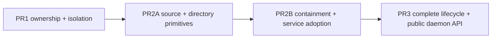

# 实施计划：Standalone PR2 —— Session core 与私有目录隔离

日期：2026-08-14

上游设计：`docs/design/standalone-daemon-sessions.md`

关联：Issue #8908、PR0 #8890、PR1 #9181

设计与实现审计基线：`origin/main` at `7091b8c76157501fab5761f96dafbc1612723456`。PR1 已通过 [#9181](https://github.com/QwenLM/qwen-code/pull/9181) 合入，merge commit 为 `889f0d8bbdf24ed55b32061cac3db7451afd80c0`。2026-08-17 integration checkpoint 已直接读取最终 main，而不是把脏设计分支先 rebase 到预期接口上。

Integration checkpoint 锁定以下最终接口与增量：

- `ConversationRuntimeManager` 当前只公开 one-flight `ensure()`；它会取得 ownership、重验 root，并要求 registry 中 exact cached runtime 仍为 active/current。PR2B 才增加无 I/O 的 `assertCurrent()`和terminal `quarantine()`。Standalone service 的 `ensureRuntime` 必须直接注入manager `ensure()`，不能复用server的`ensureLiveConversationRuntime()`，后者还会绑定三个Live handler、触发Appshot/feature publication并受Live enable/seal状态约束。
- PR1 只构造一个server-owned `ConversationRuntimeActivityGate`，现有API为`run()`与`sealAndWait()`。它已覆盖Conversations list及部分internal workspace mutation，但没有覆盖owner-routed prompt、continue、shell、fork-agent、rewind、artifact或ACP active-session操作；PR2B必须在这些handler进入bridge/filesystem前显式复用同一个gate，不能假设PR1 wrapper已经代劳，也不能在service里创建第二个gate。
- PR1 已允许internal runtime上的active owner control，并把REST transcript branch与side-task扩为internal owner-routed；PR2B必须按source在对应handler内拒绝standalone，不能依赖primary-only routing。REST `/session/:id/fork`是当前session内的background fork-agent，属于受cwd guard保护的支持路径，不得与transcript branch混淆。ACP `session/fork`在Conversations mount仍由`liveSessionIsolation`整体拒绝，保持该边界。
- `SessionService.findSessionIdIgnoringCase()`现有ACP child load/resume consumer会先走exact `sessionExists()` fast path，`RequestedSessionIdAdmission`也会先走exact location；这会漏掉lowercase exact与uppercase twin并存的case-only duplicate。PR2A必须移除所有resolver consumer的exact bypass，并让唯一resolver在active/archived两个目录收集完整候选后返回authoritative spelling或抛typed conflict。
- `killSession(..., { requireZeroAttaches: true })`现在会在child明确拒绝close时返回`false`并保留session，而不是升级为channel kill。PR2B cleanup必须把`false`视为“未证明关闭”；activation poison、dispatched spawn ambiguity或其他要求terminal containment的路径不能在该结果后删除目录/transcript或释放UUID，必须进入既定quarantine流程。
- `9f8f65dde0`增加durable Assistant-response transcript branching，但没有改变上述产品边界：REST transcript branch和ACP `session/fork`仍是独立的新transcript产品；background fork-agent仍是在当前standalone session私有child内运行的cwd-bound work。`4257916e7e`增加daemon Git worktree mutation guard，不能替代standalone对Agent `working_dir`/worktree isolation与enter/exit-worktree工具的source-aware deny。

依赖：PR1 Conversations runtime ownership 与 ordinary-workspace isolation 已满足。PR2A从上述main基线开始；PR2B开始前再次刷新main并重建source/create/prompt/automatic-turn consumer inventory。

## 结论

PR2 是完整 standalone daemon API 出现前的内部核心阶段。它让 daemon 能在唯一的 Conversations runtime 中安全创建、识别、恢复和运行 standalone session，但不注册 `/standalone/sessions` 路由，不声明 `standalone_sessions_v1` capability，也不增加 SDK 或 UI。PR2B 会把现有 projectless LiveTask 创建迁移为 explicit standalone source和私有目录，并在legacy projectless session上收紧generic cd/branch/side-task与persisted approval mode；这些都是既有内部表面的用户可观察变化，必须执行下述E2E计划，但不等同于公开 standalone v1。

深度盘点后的生产逻辑预计为 1,720–2,500 行、测试为 3,400–5,050 行。为保持 review 边界，PR2 作为一个逻辑阶段交付为两个串行、可独立回归的 PR：

- **PR2A — source 与 directory primitives**：280–420 行生产逻辑，550–850 行测试。
- **PR2B — containment 与 standalone session service**：1,440–2,080 行生产逻辑，2,850–4,200 行测试。

PR2B 依赖 PR2A；二者都依赖 PR1。它们不与 PR1 以 stacked PR 形式同时送审，也不修改 PR3 的公开 API/lifecycle 范围。当前估算已超出单 PR 的可审核范围，因此 PR2A/PR2B 拆分是必须的；不以压缩测试、隐藏辅助逻辑或合并职责来追求原估算。

## 已锁定的语义修正

### Archived session

沿用 daemon 现有 archive contract：archived standalone 可以 list 和 exact lookup，但 `load`/`resume` 返回既有 `session_archived`，必须先由 PR3 的 unarchive 操作恢复为 active。PR2 不引入“直接恢复 archived transcript”的第二套语义。

### Deletion journal

PR3 才创建 deletion journal 和 staged directory。PR2 没有 delete 入口，因此 PR2 的 create/load/repair 不读取不存在的 journal namespace，也不预埋 no-op recovery abstraction。PR3 必须在 capability 发布前，把 journal reconciliation 加到同一个 service 与 lifecycle coordinator 的 create/load/repair 前置区。

### Managed relocation token

继续复用内部 token `managedRelocation: "live-conversation"`。它实际表示可信 private ACP parent 对 Conversations direct child 的 managed relocation；PR2 不做高风险的协议 token rename。新用户可见错误和代码符号使用中性 `conversation`/`standalone` 名称，历史 token 与现有 Live 错误文本保持兼容。

### Runtime quarantine

创建在 session 尚未安全收口时若 ACP session 无法关闭，仅保留 transcript 或释放 UUID 都不安全。PR2B 增加一个仅供 Conversations manager 使用的 terminal quarantine seam：关闭 manager admission、从 registry drain internal runtime、dispose bridge/ACP child，并使本 daemon 后续 `ensure()` 固定返回 `conversation_runtime_unavailable`。它不释放跨 daemon owner record；owner 仍由 PR1 的 daemon shutdown gate 释放。

## 不变量

- Standalone 只存在于已验证且由当前 daemon 持有的 Conversations runtime。`sourceType: "standalone"` 本身不能把 project transcript 变成 standalone。
- 新 top-level transcript 固定写 `sourceType: "standalone"`，没有 `sourceId` 和 `parentSessionId`。
- Standalone child 固定写 `sourceType: "standalone"` 和 `parentSessionId`；现有 depth-1 sub-session 限制不变。
- Live 继续使用 `sourceType: "default"` 和 `sourceId: "realtime_voice:<id>"`；project source 和其他 feature source 不被重新分类。
- 兼容 legacy standalone 只在 Conversations runtime 中成立：top-level、无 `sourceId`，且 `sourceType` 缺失或为 `default`。只读时归一化，不重写 transcript。
- Generic REST/ACP creation 对任何 `sourceType: "standalone"` 都拒绝，即使同时携带非法 `sourceId`；只有 standalone service 可创建该 source。
- PR1 已允许的 active owner-routed session control（prompt、cancel、status、subscribe、permission、close和live metadata）继续按owner工作；PR2不得借新classifier让explicit standalone进入generic cold transcript/export/archive/unarchive/delete/organization或catalog API。完整standalone lifecycle仍由PR3 dedicated routes发布。
- 每个 standalone session 使用 deterministic direct child。有效现有空目录可在 create 时复用；无 transcript 的非空目录是 conflict，不自动采用、清空或删除。
- PR2不删除standalone private child。Node当前只有路径式`rmdir`，无法把删除原子绑定到已验证inode；校验后同path替换会让“exact identity delete”误删replacement。持久化前clean rollback因此保留可复用empty child；durable reread已证明active explicit standalone后的失败保留transcript与child，由exact lookup/load收敛。Wrong source/location/metadata proof仍terminal quarantine。PR3 deletion journal再实现有durable阶段证明的用户删除，不把创建回滚伪装成安全删除。
- `sourcePersisted: true` 不是唯一提交证据。成功返回前必须再次从 SessionService 证明 active transcript 存在且 source 是 explicit standalone。
- Client/Live-task caller 的取消不会传入创建事务。创建从 UUID reservation 开始后必须运行到 success、clean rollback 或 outcome unknown。
- Prompt admission 必须同时通过 daemon-side root/child/current-cwd preflight 和 ACP-child turn guard；session-only cron、background notification 等绕过 HTTP 的自动 turn 由 child guard 覆盖。
- Direct shell、background fork-agent和`rewindFiles: true`同样是cwd-bound work，必须在执行前走同一个daemon preflight；generic session `cd`与ACP Session内的`/cd` slash command对explicit与legacy standalone一律拒绝，只能使用managed relocation或repair。ACP当前command-mode过滤即使已把`/cd`排除，也不能替代source-aware hard gate。
- Standalone允许普通Agent/fork在private child内运行，但不允许Agent tool的`isolation: "worktree"`或`working_dir` pin，也不允许`enter_worktree`/`exit_worktree`工具。ACP Session在tool build、Git probe、directory creation或subprocess前按trusted tool identity和参数拒绝；shell中用户明确执行Git仍由现有approval边界处理，不把私有目录描述成OS sandbox。
- Workflow tool的snapshot与resume journal固定写`Config.storage.getProjectDir()/workflows`，而standalone transcript Storage按设计仍属于共享Conversations runtime；不能把它误当child-local。Normalized standalone的`Config.isWorkflowsEnabled()`必须在settings/env判断前固定false，使workflow factory不注册，ACP `/workflows`也在canonical dispatch前拒绝且不读取shared snapshot。Source normalization在Config初始化与tool registration前完成，因此standalone Session不存在需要另设relocation blocker的running Workflow路径。
- Bridge的session artifact store当前会相对bound workspace执行realpath/stat/hash，ACP restore也会构造cwd-rooted `FileHistoryService`；normalized standalone在managed relocation前不得让artifact restore/replay/list/upsert或file-history hydrate/validation触碰共享Conversations root。Workspace artifact只在exact child绑定后处理，且每次daemon GET/POST artifact操作先走同一个cwd preflight；file-history metadata在binding commit从child Config hydrate并随restore finalize，实际file rewind仍走turn guard。Attachments/uploads仍不进入MVP，但模型生成的私有目录artifact不能因此被错误绑定到root。
- Generic REST `branch`和`side-task`都是创建新transcript的独立产品语义，不得复用ordinary/Live bridge派生路径处理explicit或legacy standalone；PR2在bridge调用前明确拒绝，避免生成无reserved source或无私有目录的session。它们不等同于在当前session内运行、且受cwd guard保护的background fork-agent，也不等同于本阶段明确支持的`create_sub_session` child。
- Standalone的approval mode可以按session切换，但generic `persist: true`会写共享Conversations root的workspace setting，必须在persist callback前拒绝；不能让一个standalone session改写Live和其他conversation的默认值。User-global language设置不是project setting，保持现有行为。
- Tool permission的“Always Allow in project”同样会写共享Conversations root。Normalized standalone的primary和nested sub-agent exec/MCP/info permission request都不提供`ProceedAlwaysProject`，也不接受这些类型上的deprecated `ProceedAlways`作为project outcome。`ProceedOnce`、edit/plan的session-local `ProceedAlways` mode transition以及`ProceedAlwaysUser`保持可用。ACP host返回未提供的project option时继续由offered-option validation拒绝，且必须在tool `onConfirm`、settings callback和in-memory persistent-rule mutation之前失败。Ordinary与Live的permission options和persistence保持不变。
- Standalone primary model选择同样必须session-local。ACP child的`Session.setModel()`在normalized standalone source下无条件把effective `persistDefault`设为false，覆盖create/attach的`modelServiceId`、HTTP model route和任何ACP caller；request不能重新打开persistence。Bridge的create/attach `applyModelServiceId()`和HTTP `setSessionModel()`仍发布目标session自己的`model_switched`/failure事件，但normalized standalone成功切换不得再广播workspace-wide `settings_changed(model.name)`，否则同一Conversations runtime中的Live和其他standalone session会收到并不存在的共享default变更。不得写任一scope的`model.name`、`model.baseUrl`或`security.auth.selectedType`；Live/ordinary保留现有persistence与workspace event语义。
- Create-time `modelServiceId`仍可在managed relocation前更新尚未初始化的session Config；这依赖deferred bootstrap保证`contentGeneratorConfig`尚不存在，使现有model-change callback不refresh auth、不构造model context也不执行hook。实现不得通过提前初始化content generator破坏该前提；首次child binding必须用已经选定的model完成唯一一次auth和Gemini/system-instruction初始化。
- ACP slash command与HTTP control不是同一个入口。Normalized standalone必须给`handleSlashCommand()`传internal execution policy：canonical dispatcher list禁止`cd`、session reset、directory/Git、cwd-derived transcript和project-skill命令；argument-level gate禁止workspace settings与model/reasoning持久化。`/clear|/reset|/new`在hook、background abort、metrics和`Config.startNewSession()`前拒绝；`/directory`在realpath、WorkspaceContext mutation和settings write前整体拒绝；`/diff`、`/dream`、`/export`、`/learn`和`/curator`在各自Git/storage/skill helper前拒绝；`/language ... --project`与`/import-config ... --scope project`在任何write/helper调用前拒绝；`/model --project|--global`以及auxiliary selector（fast/voice/vision/compaction/image）在PR2中拒绝，普通`/model <id>`与`/effort <tier>`只修改当前session Config且不写任何scope。安全的child-local与user-global命令保持既有语义。Ordinary、Live及非ACP caller使用policy默认值，行为不变。
- Config构建和初始化本身也是cwd side-effect边界。Normalized standalone在调用`loadCliConfig()`前建立可信`provisionalWorkspace` host policy并强制`experimentalLsp: false`：loader不构造initial `FileDiscoveryService`、不探测Conversations-root project output-language，并把该policy固化为Config构造时默认false、只读的internal state。Config initialize直接读取这一状态，蕴含skip Gemini，并跳过eager file service、initial hierarchical/managed/team-memory refresh或sync、MCP discovery、strict tool warmup、auto-skill curator和stale-worktree cleanup；不再增加第二个可与loader状态漂移的initialize boolean。Loader仍可只读装配被明确允许的Conversations shared settings/hooks/extensions/skills/MCP配置与transcript storage；这些不能被误称为私有child配置。ACP同样不安装filesystem wrapper、不执行initial auth refresh，也不启动per-cwd OpenAI log housekeeping。LSP在PR2/MVP中明确不可用；现有loader因`isLspEnabled() === false`不注册或广告`/lsp`。Managed relocation在child target生效后才由既有Config relocation创建child-rooted file discovery、刷新memory并reconcile MCP；binding commit在guard ready前由现有Gemini initialization严格warm工具、以child构建system instruction并执行`SessionStart` hook，再完成auth、安装以child Config计算read roots的ACP filesystem wrapper，并启动child-scoped log housekeeping。这样file/Git discovery、project output-language、model context、`SessionStart`/`AuthSuccess` hook、memory/team git、MCP subprocess、LSP process、project maintenance、local-read fallback和log cleanup都没有以共享root作为standalone workspace的窗口。Transcript/harness storage仍属于Conversations runtime，因此`registerSessionProjectDir()`和nested Qwen helper的`QWEN_CODE_PROJECT_DIR`保留该storage project dir；不得把它误改成child。它不改变process cwd、Config target、WorkspaceContext或tool filesystem root，也不构成OS sandbox授权。Live与ordinary初始化保持不变。
- Settings或daemon argv中的`context.includeDirectories`/`--include-directories`不是允许继承的shared配置。`provisionalWorkspace`必须在loader解析处把两类输入都固定为空，令Config的`explicitIncludeDirectories`为空；managed relocation后的`WorkspaceContext`必须只含exact child。否则Shell/Monitor等tool的`directory`参数会把ambient project path重新变成合法workspace root。该host gate不改变用户在shell命令文本中经approval显式访问绝对路径的既有能力，也不声称OS sandbox。
- Team memory、auto-skill management和Workflow persistence是project/shared-storage mutation，不因relocation变得安全。Core Config的现有source getter在normalized standalone下固定`getTeamMemoryEnabled() === false`、`getTeamMemorySyncEnabled() === false`、`getAutoSkillEnabled() === false`和`isWorkflowsEnabled() === false`，覆盖settings与环境变量；managed auto-memory仍可在private child使用，显式user/shared skills仍可只读装配。该source gate在`setSessionSource()`后、任何Config initialize/tool registration/refresh前已生效。Live与ordinary保持现有settings/env优先级。
- 所有未知、冲突、root/child compromised、runtime generation closed 和 quarantine 状态 fail closed，不回退 primary。
- PR2 不增加 cwd、workspace、project、branch、worktree 或 source override。

## PR2A：Source 与 directory primitives

建议标题：`feat(cli): Add standalone conversation isolation primitives`

### 1. Source classifier

扩展 `packages/cli/src/serve/conversations/session-source.ts`，增加：

```ts
const STANDALONE_SESSION_SOURCE_TYPE = 'standalone';

type ConversationSessionKind = 'live' | 'standalone';

interface LoadableConversationSession {
  kind: ConversationSessionKind;
  persistence: 'explicit' | 'legacy';
  metadata: {
    parentSessionId?: string;
    sourceType?: string;
    sourceId?: string;
  };
}

interface ConversationSessionMetadataStore {
  getSessionLocation(
    sessionId: string,
  ): Promise<'active' | 'archived' | 'conflict' | undefined>;
  readCreationMetadataIfReadable(
    sessionId: string,
    state: 'active' | 'archived',
  ): Promise<LiveSessionCreationMetadata | undefined>;
}
```

提供三个窄操作：

1. `isReservedStandaloneSessionSource()`：只看 `sourceType === "standalone"`，供 generic create gate 使用。
2. `classifyTopLevelConversationSource()`：同步分类 list/live summary；只有 exact Live、explicit standalone、compatible legacy standalone 三类结果。
3. `readLoadableConversationSession()`：从 transcript metadata 分类 exact session，并返回给 restore/task/sub-session 调用者。它接收上述existence-aware store，而不是只接收`readCreationMetadata()` callback；后者用空object同时表示“existing legacy transcript”与“missing transcript”，会把deleted legacy parent误判为top-level standalone。Reader必须先检查location，missing/conflict parent都返回unknown，绝不从`{}`猜存在性。

PR2A保留现有`readLoadableLiveConversationMetadata()`导出作为薄兼容adapter，改为接收同一个existence-aware store并复用新reader的分类结果，但对现有Live与legacy projectless caller返回PR2前的metadata shape：legacy不能在这一子PR提前被改写成ACP看到的normalized standalone source。它也不能让explicit standalone穿过generic REST/ACP restore。这样PR2A只提供可审查的分类primitive和reserved-source gate，不在daemon preflight/service存在前部分激活containment。PR2B再把explicit standalone cold restore以及generic legacy standalone兼容恢复迁移到service：generic REST/ACP只调用`restoreLegacyForCompatibility()`窄入口，该入口在任何materialize/bridge调用前重读并要求`kind: "standalone"`且`persistence: "legacy"`，并从此处开始把legacy source归一化为ACP所见的standalone；explicit standalone仍只允许dedicated service consumer。Live和legacy-Live-child继续走Live adapter。若grep确认旧adapter只剩Live consumer则收窄为Live-only或删除无调用导出，不同时维护两套分类规则。

Generic legacy restore在调用reader前也必须通过唯一case-insensitive resolver把canonical caller ID解析为authoritative storage ID。Archive/lifecycle admission与daemon bridge的live entry key继续使用canonical ID；metadata与ACP child Config/session storage使用storage spelling；conversation-directory hash继续使用canonical ID，与daemon bridge live entry key以及现有全部materialize/discard调用点保持一致。这样同一session的私有目录不会在restore与后续Live/task调用之间分裂成两个hash，同时后续owner-routed REST/ACP请求仍能以canonical UUID找到同一bridge entry。仅大小写不同的重复transcript在任何materialize/bridge调用前fail closed。

Lineage规则固定为当前daemon支持的depth 1，同时保持父子lifecycle独立：

- top-level explicit standalone：`standalone` 且无 `sourceId`。
- top-level legacy standalone：无 parent/sourceId，type 缺失或 `default`。
- explicit standalone child：`standalone`、无`sourceId`、有非self且语法有效的parent ID。它的reserved source与已确认的`parentSessionPersisted`使其自描述；read时不要求parent transcript仍存在，因此parent archive/delete后child仍可独立load。Depth-1由创建时parent summary gate和任何child的非空`parentSessionId`共同强制，explicit child不能再spawn child。
- legacy child：有parent且完全没有source；必须读到top-level standalone或compatible Live parent才能分类，并拒绝grandparent/cycle/self。父transcript已删除的legacy child因无法消歧而返回unknown，不猜测上下文。
- child携带其他source、explicit standalone带sourceId、invalid/self parent、legacy parent不存在、grandparent、循环或source/sourceId不配对都返回unknown。

Standalone 的 normalized restore metadata 始终带 `sourceType: "standalone"`。PR2B的service adoption保证legacy restore进入ACP Config前就被识别，durable cron guard生效，但transcript不被改写。`persistence`只供daemon分类/admission，绝不传给ACP或写入transcript。PR2A compatibility adapter和Live metadata保持原样。

修改 generic create 的两个边界：

- `packages/cli/src/serve/routes/session.ts`
- `packages/cli/src/serve/acp-http/dispatch.ts`

两者都先检查 raw `sourceType`，再调用通用 source parser；因此即使 request 同时带非法 `sourceId`，也在 bridge、UUID reservation 和 runtime mutation之前按 reserved standalone source拒绝。Catalog source filter不被当成创建入口，不需要禁止查询该字符串。

PR2A不改变legacy projectless session的现有runtime行为。Generic REST `cd`、`branch`、`side-task`、approval-mode `persist: true`拒绝，与legacy normalization、managed identity writer和daemon cwd preflight在PR2B同一子PR原子启用，避免先把legacy session置为standalone却留下direct-shell保护缺口。Explicit standalone在此之前没有受支持的create/restore consumer；generic create与restore仍拒绝它。

### 2. Conversation directory identity

把 `ConversationWorkspace` 当前 root/direct-child 校验提取到 `packages/cli/src/utils/conversation-directory-identity.ts` 的纯安全 primitive，供 daemon 和 ACP child 复用。它不能依赖 `serve/`、Express、registry 或 ACP protocol 类型，避免形成 `acp-integration → serve` 的反向层依赖。`ConversationRootIdentity` 一并移到该中性模块。新增类型：

```ts
interface ConversationDirectoryIdentity {
  root: ConversationRootIdentity;
  storageSessionId: string;
  name: string;
  canonicalPath: string;
  device: number;
  inode: number;
}
```

`ConversationWorkspace` 新增窄方法：

- `prepareStandaloneDirectory(sessionId)`：返回 `{ identity, created }`；valid existing empty child 可复用，existing non-empty 返回 conflict。
- `ensureStandaloneDirectory(sessionId, expected?)`：load/repair 使用；与expected同identity的existing返回`ready`；missing后首次创建（无expected）返回`created`，已捕获identity后重建（有expected）返回`recreated`；existing replacement返回compromised。
- `inspectStandaloneDirectory(sessionId, expected?)`：区分 `ready`、`missing`、`compromised`；给 prompt preflight 使用。
- 现有`discardEmptyConversationDirectory(sessionId)`保持Live-only兼容实现；standalone路径不调用它。路径式删除无法原子绑定到前一次`lstat`得到的identity，PR2A不增加一个名为exact但仍有replacement race的overload。

每个检查执行 root identity revalidation、child `lstat → realpath → lstat`、owner/mode/direct-child/device/inode 校验。传入 `expected` 时，inode/device 变化也是 compromised。Windows 继续只声明现有 API 可验证的 non-reparse/canonical identity，不虚构 POSIX mode/uid 保证。

Child validation还必须证明basename等于对authoritative storage ID计算出的deterministic hash；“同一root下任意direct sibling”不满足条件。新建session的storage ID就是lowercase canonical ID；legacy mixed-case restore保留transcript filename spelling。ACP managed relocation用Session自己的storage ID计算expected name，防止server wiring错误把两个standalone session指向彼此的目录。

目录检查绝不 `chmod` 既有目录，不跟随 link/junction，不递归删除，不接受 nested child，不把路径写入用户可见错误。`readdir` 只用于 create 的 empty-orphan gate；检查失败不自动清理。

Primitive 用 typed scope 区分 `root` 与 `child`，并保留内部 reason 供日志和测试断言。`ConversationWorkspace` 把 root failure 映射为 PR1 的 `conversation_root_compromised`/runtime unavailable，service只把 child missing/compromised映射为 standalone working-directory错误；任何 root error都不得被包装成 session conflict。对外error data不携带canonical path、目录名、device或inode。

现有`materializeConversationDirectory()`、`discardEmptyConversationDirectory()`和Live managed relocation继续使用原有错误文本与行为；typed primitive不能借中性化之名改变Live-visible message/status。只有新增standalone service/guard路径映射中性structured code。

## PR2B：Containment 与 standalone session service

建议标题：`feat(cli): Add standalone session creation and restore`

### 1. Managed relocation identity 与 ACP-child turn guard

Standalone managed relocation不能让daemon与ACP child各自捕获“当时看到的”身份。内部bridge shape固定为：

```ts
interface BridgeConversationDirectoryExpectation {
  storageSessionId: string;
  root: {
    canonicalPath: string;
    device: number;
    inode: number;
  };
  child: {
    name: string;
    canonicalPath: string;
    device: number;
    inode: number;
  };
}

interface ChangeSessionCwdRequest {
  // Existing fields omitted.
  conversationDirectoryExpectation?: BridgeConversationDirectoryExpectation;
}
```

Daemon把已经pin住的`ConversationDirectoryIdentity`转换成该expectation；`packages/acp-bridge`只定义结构并把字段原样转发给现有`sessionCd` ext method，不执行filesystem判断。ACP child先按固定字段、绝对canonical path、非空storage ID/name及non-negative safe-integer device/inode做严格schema校验，再要求`allowedRoots`恰好是expectation root、request `path`恰好是expectation child，使用自己的session storage ID重新计算deterministic basename，并在Config mutation前后都要求root、child、platform-canonical path、device和inode与expectation完全一致；daemon收到成功响应后再以原pin执行第三次检查。这样root/child在daemon precheck与child precheck之间、child mutation期间或RPC返回后被替换时，至少一个检查或下一次turn guard会拒绝。Wire expectation只允许`managedRelocation: "live-conversation"`携带，standalone source缺失或malformed expectation直接在filesystem/Config mutation前返回compromised；Live现有managed relocation不安装standalone guard，保持原request和行为。Identity字段不进入日志、warning或HTTP response。

该字段在TypeScript层可以为Live兼容而保持optional，但对normalized standalone语义上是required，不能成为无人设置的dead switch。PR2B在同一个子PR中同时增加wire字段和全部生产writer：generic legacy REST/ACP restore、所有被归一化的projectless restore/sub-session relocation、create、load/resume、repair、LiveTask和standalone child路径都必须传入daemon已pin的expectation；Live source明确不传。每次实现审计都要grep全部`managedRelocation`写入点，证明不存在“standalone request无expectation仍到达Config mutation”的生产路径。

Daemon preflight无法覆盖 session-only cron、loop wakeup、background notification 和其他 child-internal automatic turn。PR2B 在 ACP session 中安装第二道 guard：

- CLI `Session` 在构造时读取 `config.getSessionSourceType()`；standalone session立即进入“relocation required”guard状态，在daemon确认binding release前，外部turn返回`working_directory_missing`。Guard和`automaticWorkHeld`必须在构造器调用`#bindGoalRuntime()`、注册background notification/sub-session/workflow callback之前同步建立，使恢复出的Goal或即时registry callback只能排队，不能在构造窗口启动turn。Child-internal automatic producer在该状态下只保留/排队已有work，不消费cron、Goal continuation或background notification，也不把一次预绑定拒绝当成terminal task failure。
- Standalone `Session`在slash dispatch前按解析出的canonical builtin command identity硬拒绝一组固定命令，并从available-command更新中排除它们：`cd`、`clear`（覆盖`reset`/`new` alias）、`directory`、`diff`、`dream`、`export`、`learn`、`curator`和`workflows`。`cd`/`directory`是workspace管理，`diff`引入Git project语义，`learn`/`curator`依赖PR2明确不支持的project-skill管理；`dream`/`export`当前又从cwd构造transcript storage，迁移后会错误指向private child而不是Conversations storage；`workflows`从不可relocate的shared Storage读取project snapshot。不能只依赖各command当前的`supportedModes`或action内校验，因为通用声明将来可能变化且alias/子命令可能绕过。拒绝不调用command action、不读取Git/transcript/skill/workflow/filesystem、不修改Config，并返回固定无path的`unsupported_action`。`init`、`summary`、`remember`、`forget`和stats export可继续在ready guard后的private child内工作；`skills`、`hooks`和`extensions list`只投影允许的shared read-only配置。
- `sessionCd`在close gate内按“对daemon提供的exact expectation做pre-validation → drain/blocker check → `Config.relocateWorkingDirectory`（same-path也执行）→ 对同一expectation做post-validation → 原子记录pending guard”的顺序运行。Pending仍阻止external turn并暂停automatic producer，不能在daemon post-check前直接变成ready。Fresh/cold standalone的Gemini尚未初始化，因此现有`addWorkingDirectoryChangedContext()`是no-op，新的child system instruction和`SessionStart` context留给binding commit完整构建；已ready session的same-path repair若Gemini已初始化，则保留既有model-context refresh并把失败作为sanitized warning。若post-validation失败，Config可能已刷新到相同path string，但旧guard保留并阻止所有turn，调用返回compromised；绝不把race后的identity提交为可信。Standalone request没有exact expectation或identity与本session deterministic child不一致时，在Config mutation前拒绝。
- Daemon以原pin检查`sessionCd`响应后，调用internal且幂等的`commitManagedConversationBinding(sessionId, expectation)`。CLI Session以`expectation + session event epoch`为key保存独立`bindingPromise`：一个cycle执行中只有同key并发/response-loss重试可以join，不同key拒绝；Promise settle后保留activation state但清除pending引用。前一cycle完成后，只有新的成功`sessionCd`已原子安装另一个pending expectation时才允许repair开启新cycle；已经完成的初始activation bits沿用，只做该identity的重验、guard promote和artifact-base commit。`activationPoisoned`永远不能开启新cycle。Bridge先让ACP Session在close gate内重验pending expectation；首次cold/fresh binding在开始任何activation前原子标记entry为`activating`，然后在已经relocate的child Config上调用现有`geminiClient.initialize()`，由其严格warm lazy tool factories、以child构建initial history/system instruction并调用一次`SessionStart` hook；随后完成initial auth refresh（因此异步调度的`AuthSuccess` hook也以child为cwd）、从child Config hydrate file-history snapshot并在其后`finalizeSessionRestore()`、跳过worktree restore、恢复paused background agents、安装以当前child Config计算local-read roots的ACP filesystem wrapper、启动child-scoped OpenAI log housekeeping，再次重验后把identity guard提升为ready，并让bridge把同一expectation的artifact store从pending同步提交为ready；该store transition不执行filesystem I/O。独立release latch仍阻止external与automatic turn，因此identity/artifact ready不等于可运行。`SessionStart`失败和`AuthSuccess`异步失败继续沿用core现有best-effort日志/吞错语义，不把它们升级为standalone fatal error；activation bit在现有API成功返回后立即提交。Guard/artifact ready后仍保持独立`automaticWorkHeld`，不启动cron、不释放Goal/background/notification、不发布commands、不调度MCP failure surface。每个成功步骤使用独立activation bit；相同ready expectation重试只补齐尚未完成的ACP/bridge activation step，不重复Gemini/tool warm、`SessionStart`调用/`AuthSuccess`调度、file-history hydration/finalization、background-agent restore、filesystem wrapper或housekeeping registration。Commit明确返回activation error时entry原子变为`activationPoisoned`。Transport层失败不猜测poisoned：daemon以同一expectation做至多一次有界重试/状态读取，它会join仍在执行的one-flight或读取settled bits；仍无法判定或entry/channel不可达则terminal quarantine。除既有best-effort hook结果外，poisoned entry不能在同一ACP Session上重试：service关闭该session；无法证明关闭（包括并发attach导致zero-attach close拒绝）时进入runtime quarantine，保留持久化transcript/child而不把半初始化Session重新交付。尚未进入`activating`的expectation/identity拒绝仍保持pending且可安全重试。Daemon对组合commit响应再做一次原pin检查，只有匹配才写入带event epoch且`released: false`的binding record；所有reuse和`assertCwdReadyUnderShared()`只接受`released: true`。随后在仍持有runtime activity和session lifecycle admission时调用幂等`releaseManagedConversationBinding(sessionId, expectation, eventEpoch)`。Release在child再次重验ready guard/identity/epoch后原子清`automaticWorkHeld`、启动scheduler并释放排队automatic work；source-filtered command publication和`surfaceMcpFailuresWhenReady()`各用独立scheduled bit维持best-effort，response-loss重试不重复。Release确认成功后daemon才把同一record提升为可复用`agentBound`（`released: true`）；成功前service不返回且并发owner preflight会因unreleased record失败。Release明确失败或identity变化时清本地record并按activation失败的close/quarantine规则收口；一次有界重试后仍unknown时也清record并terminal quarantine，因为child可能已经release，不能承诺零automatic execution。该语义保证成功binding和响应丢失重试的调用/调度幂等，不虚假承诺外部hook执行成功，也不承诺失败后新entry的跨进程exactly-once。Commit/release都不接受request metadata，Live不调用它们。
- `Session.assertCanStartTurn()`在调用现有`Config.assertCanStartTurn()` writer-lease检查的前后各执行一次guard。guard每次重新验证root、deterministic exact child、expected identity和`config.getTargetDir()`；这样等待writer lease期间发生的替换也会被第二次检查拒绝。missing与compromised使用无path的structured ACP error。
- ACP child的file-restoring rewind与background fork-agent入口在任何文件恢复、child session创建或background process启动前复用同一guard；history-only rewind不要求目录。Agent tool在同一层拒绝standalone的worktree isolation/working-dir pin以及trusted enter/exit-worktree tool，普通fork/sub-agent继续使用parent private child。Direct shell不在ACP turn入口执行，由daemon owner route的shared preflight和bridge内已绑定的effective cwd共同保护。
- repair 对同一路径的新 inode执行 managed `sessionCd`；即使字符串 cwd 没变，也必须在 child close gate内重验并刷新 guard，不能被当前 no-op return 跳过。
- 最新main把running background agent、未完成notification与shell暴露为Session active-work holds，但Monitor被该健康协议明确排除。Standalone managed`sessionCd`因此使用child-local `hasStandaloneRelocationBlockers()`：在close gate内等待active turn后，原子重读active-work holds与running Monitor；任一blocker存在就返回typed`session_busy`并保持旧guard，不执行relocation或identity refresh。Workflow因source gate不注册，不能成为standalone active work。Paused background agent和paused Goal没有驻留的cwd-bound执行体，后续resume从已迁移的parent Config重建，因此不阻塞；queued cron/loop同样不阻塞，真正active的automatic turn已由现有turn drain覆盖。Untracked external process不在本产品保证内。不能只依赖daemon heartbeat/cache，因为它既非完整集合也不是原子授权。Live和普通`sessionCd`保持原行为。

只有 normalized standalone source安装该 guard。Guard状态、一次性post-replay activation和刷新方法留在 CLI `Session`，不为单一调用者扩大 core `Config` API。ACP load/resume的既有`#restoreWorktreeOnResume()`对standalone永远跳过；`#restoreBackgroundAgentsOnResume()`不在pre-relocation hook执行，而由上述commit在child Config就绪后执行。History/artifact replay仍可在pending状态完成metadata处理，但任何workspace artifact filesystem工作继续由下面的deferred store拦截。Live 与普通 workspace 的启动、relocation、worktree/paused-agent restore和错误语义不变。

`newSessionConfig()`必须在调用`loadCliConfig()`和`config.initialize()`前，从可信的normalized source建立一次不可由request覆盖的bootstrap policy。该policy沿用`loadCliConfig()`已有的internal `hostPolicy`参数增加`provisionalWorkspace?: true`，由loader写入Config构造参数并由Config initialize读取；只有ACP manager根据normalized source设置，不增加argv/settings/env字段：

- `argvForSession.experimentalLsp = false`。`NativeLspService`捕获初始`WorkspaceContext`且没有relocation协议，PR2不尝试晚绑定；standalone的`Config.isLspEnabled()`固定为false，现有loader因此不注册或广告`/lsp`，且不创建LSP process/watcher。LSP支持留给单独后续设计。
- `loadCliConfig()`收到host policy后不创建或传入initial `FileDiscoveryService`，不执行Conversations-root project `output-language.md`的`existsSync`选择；user-global output-language仍可只读装配。它继续使用Conversations root的`SessionService`读取/创建transcript，并可读取shared settings、`.mcp.json`和MCP approval配置，因为这些按产品定义属于Conversations shared configuration；但MCP连接仍延迟。Loader不得运行Git discovery、hook、tool factory或subprocess。该窄host policy不改变普通caller。
- 同一loader分支忽略settings的`context.includeDirectories`、`loadFromIncludeDirectories`与argv的`includeDirectories`，构造空`explicitIncludeDirectories`；不能只清argv而保留shared settings值。Relocation重建WorkspaceContext后断言root set恰为exact child，外部路径不能通过Shell/Monitor的`directory`参数或local-read roots进入。Ordinary/Live仍使用现有include-directory语义。
- `ConfigParameters`增加默认false、构造后只读的internal `provisionalWorkspace` state，唯一生产writer是上述loader host policy。Config initialize读取它并蕴含`skipGeminiInitialization: true`，跳过会把初始target当作真实project的工作：eager `getFileService()`、initial hierarchical/managed/team-memory refresh（包括team index/git sync）、MCP discovery、`toolRegistry.warmAll()`、auto-skill curator和stale-agent-worktree cleanup。ToolRegistry仍创建lazy factories，settings/hooks/extensions/skills/permission rules的只读装配仍按允许的Conversations shared configuration进行；MCP配置、runtime overlay和transport pool也只装配不连接。`createToolRegistry()`内部若只做不依赖cwd的process capability probe可以保留，但任何factory construction、Git/file discovery或subprocess不得发生。`sessionCd`把Config target切换到exact child后，既有`relocateWorkingDirectory()`清空旧cache并负责首次child-rooted file discovery、memory refresh和MCP reconcile；stdio MCP subprocess的cwd因此是child。Binding commit直接调用现有Gemini initialize，复用其strict warm而不增加第二套tool activation API。Standalone不支持的auto-skill curator/worktree cleanup不在binding后补跑。Ordinary/Live保持默认false；不得顺势重构各scheduler。
- ACP new/load/resume在bootstrap阶段除跳过`ensureAuthenticated(config)`、`setupFileSystem(config)`和`startNonInteractiveOpenAILogHousekeeping(config, settings)`外，还给`createAndStoreSession()`传一个仅内部的`deferWorkspaceActivation: true`。这个单一开关避免其现有兜底Gemini初始化在relocation前构建chat/system instruction和执行`SessionStart`，同时延迟`hydrateSessionRestoreFileHistory()`、`sessionData.fileHistorySnapshots` restore、`finalizeSessionRestore()`、post-replay services、cron和available-command publication；不要为这些步骤增加一组容易漏设的独立boolean。Session仍可注册、恢复纯transcript metadata并replay UI/history projection，但不能调用需要`GeminiChat`、cwd-rooted FileHistory或workspace artifact filesystem的路径；这些调用由测试逐一证明延迟。Binding commit从Session持有的internal activation state取得所需restore data，在child上按上述顺序完成并以activation bit保证成功/response-loss重试不重复；后续session内auth操作已在ready guard后，沿用普通路径。Filesystem若提前安装会把auto-memory/local-read fallback按root Config固化，housekeeping则会把default OpenAI log cleanup target按root入队；commit在最后一次promote前各执行一次。`setupFileSystem`生成的storage/runtime/user-global roots保持既有语义，唯一cwd-derived auto-memory root必须属于child。任一步失败不得留下ready guard；non-repeatable部分初始化失败必须关闭该session并按上述close/quarantine规则收口，其他cleanup走现有session shutdown/quarantine。

Config初始化中对Conversations-root settings、hooks、extensions、skills和ancestor instructions的只读装配是设计允许的shared configuration，不伪装成per-session私有；除这些只读shared-configuration装配及其filesystem watcher和明确证明不读取cwd的process-global capability probe外，任何会执行hook、实例化cwd-sensitive tool/file service、启动subprocess/worker、写project memory/skills、运行Git或清理文件的初始化必须落入上述provisional gate。`Config.relocateWorkingDirectory()`已刷新target、WorkspaceContext、runtime status、file-discovery/session/file-history cache、memory和MCP；transcript `Storage`按设计继续归属Conversations runtime。实现审计必须逐项核对这些已知root-capturing consumer，不能把“无turn”误当作“无cwd副作用”。

同一source-aware边界还约束model persistence：`Session.setModel()`计算最终`persistDefault`时，standalone固定为false，不能只在HTTP route改request，因为create/attach的`modelServiceId`和ACP config-option也会直达该方法。该限制不阻止当前session切换model或发布session-scoped事件，但跳过整组model route persistence（`model.name`、`model.baseUrl`和`security.auth.selectedType`）。Bridge在`applyModelServiceId()`和`setSessionModel()`成功后也按entry的normalized source决定是否广播workspace `settings_changed`：standalone跳过该广播，只保留entry bus上的model事件；Live和ordinary保留caller option/default及现有workspace broadcast。Agent-originated slash model update本来只走session event，不增加第二个分支。

ACP slash command action会直接拿到`Config`和`LoadedSettings`，不能假定HTTP route的source gate会保护它。PR2B给`handleSlashCommand()`增加一个internal optional execution policy，默认值完全保留现有caller；normalized standalone Session显式传入：

```ts
interface NonInteractiveSlashCommandPolicy {
  allowSessionReset: boolean;
  allowWorkspaceSettingsWrite: boolean;
  persistModelSelection: boolean;
  blockedBuiltinCommandNames: readonly string[];
}
```

该policy不是public capability，也不由request metadata控制。它定义在command types中，并以optional `CommandContext.executionPolicy`透传；缺失时使用全allow/empty-blocked默认。Normalized standalone Session从可信Config source构造一次immutable policy，不能接受caller覆盖。唯一的`isCommandAllowedByPolicy()`先把alias/subcommand解析回canonical top-level builtin identity，再执行blocked判断；`handleSlashCommand()`的普通parse、`getAvailableCommands()`、`buildAvailableCommandsSnapshot()`、Session的available-command update、ACP `buildSessionSupportedCommandsStatus()`以及model-invocable provider/executor全部使用该predicate，不能维护第二份名单。后两个ACP快照caller必须从目标Session取得其policy，不能只拿Config后隐式回到默认。`clearCommand`、`directoryCommand`、workspace-scoped language/import-config action仍在第一个副作用前检查对应allow位，作为非Session internal caller的防御；`/directory show`也拒绝，避免把project-only workspace-root管理误当作standalone功能。`modelCommand`在`persistModelSelection: false`时只支持无scope的primary `/model <id>`，切换当前Config但跳过上述全部setting write；显式`--project|--global`与所有auxiliary selector在Config mutation前返回固定`unsupported_action`，避免报告一个无法持续或查询的半生效选择。`effortCommand`仍apply当前Config，但跳过`model.reasoningEffort` persistence。`/config`只写User scope，默认/user-global language和auth也是明确的跨session user preference，继续沿用现有行为。其他可在ACP执行的slash command仍位于现有`Session.assertCanStartTurn()`之后；其cwd文件访问使用已经验证的private child。实现时必须枚举全部ACP-supported builtin、file、skill和MCP command，逐项检查workspace/session-reset/model persistence、Git、transcript-storage推导、project-skill管理以及直接filesystem/process副作用；新增consumer要么接入policy，要么在PR描述解释为何在private child或user-global scope内安全。Live与ordinary不传policy，不能被这套限制改变。

以审计基线`7091b8c761`为准，ACP command inventory锁定如下；PR2B实现checkpoint必须对新增/改名命令重做同一分类：

| 分类                            | 命令                                                                                                                                                   | PR2语义                                                                     |
| ------------------------------- | ------------------------------------------------------------------------------------------------------------------------------------------------------ | --------------------------------------------------------------------------- |
| Canonical dispatcher deny       | `cd`、`clear`（`reset`/`new`）、`directory`、`diff`、`dream`、`export`、`learn`、`curator`、`workflows`                                                | action前固定`unsupported_action`且不广告                                    |
| Argument-level deny             | `language ui --project`、`import-config --scope project`、scoped/auxiliary `model`                                                                     | helper或Config mutation前拒绝                                               |
| Session-local                   | `btw`、`compress`、`compress-fast`、`effort`、`goal`、`insight`、plain primary `model`                                                                 | 只修改/读取当前session，不持久化workspace/model default                     |
| Child-local file/memory         | `init`、`summary`、`remember`、`forget`、`stats export`                                                                                                | ready guard后只访问validated child；其余stats为read-only                    |
| Shared/user-global or read-only | `about`、`auth`、`bug`、`config`、`context`、`docs`、`doctor`、`extensions list`、`hooks list`、default/global `language`、`skills`、`tasks`、`update` | 保持既有user-global/process-global或read-only语义；不得宣称per-session私有  |
| Explicitly disabled service     | `lsp`                                                                                                                                                  | 不注册、不广告，也不创建service/process/watcher                             |
| Dynamic file/skill/MCP commands | 已加载的file command、shared skill和MCP prompt                                                                                                         | 先过ready guard；后续tool执行沿用child context与现有approval/permission边界 |

`bug`、`doctor`和`update`包含既有process-global side effect，但不读取或持久化workspace语义；PR2不借standalone功能改变它们。若后续产品要限制daemon-host全局操作，应以所有ACP session一致的新策略单独设计，不能只对standalone临时分叉。

Tool permission用独立的CLI-local option filter，不把permission scope塞进slash policy。`toPermissionOptions()`增加默认兼容的scope filter；normalized standalone的primary `Session`和其构造的`SubAgentTracker`都传`allowProjectPersistence: false`、`allowUserPersistence: true`。该filter仅从exec/MCP/info移除`ProceedAlwaysProject`，保留`ProceedAlwaysUser`；edit与plan使用`ProceedAlways`表达session-local approval-mode transition，继续保留。`resolvePermissionOutcome()`仍以过滤后的snapshot校验host响应，因此伪造project option在`confirmationDetails.onConfirm`和`event.respond`前拒绝。Primary path只对exec/MCP/info调用permission persistence，并在调用前拒绝project/deprecated-project outcome；edit/plan的`ProceedAlways`仅交给既有`onConfirm`更新当前session mode，绝不进入permission-rule helper。Nested path只能把过滤后outcome交给core scheduler；edit details不携带permission rules且tracker不转发伪造payload rules，exec/MCP/info因此至多写User scope。Workflow tool在standalone不注册；Live/ordinary的既有workflow once/cancel approval保持不变。实现时同时盘点core scheduler与CLI Session两个`persistPermissionOutcome()` consumer，不能只修primary dialog。

Bridge侧的`SessionArtifactStore`也必须随standalone managed relocation切换effective workspace，但不复制identity validator：

- `createSessionEntry()`看到normalized standalone source时，以`workspaceAccess: "deferred"`构造artifact store。该状态下任何会解析、realpath、stat、hash或refresh `workspacePath`的restore、history replay、list、upsert入口都不得访问bound Conversations root；workspace-backed snapshot/update排入该session的bounded deferred queue，非workspace URL/published metadata可继续按既有规则处理。
- Exact expectation通过ACP child pre/post validation后，`changeSessionCwd`只在bridge entry/store记录与该expectation绑定的`pending` child base，清除旧ready状态，但绝不解析或排空workspace artifact；否则会在daemon最终post-validation前形成文件读取窗口。上述组合`commitManagedConversationBinding()`在ACP guard commit成功后，要求当前entry、effective cwd和artifact pending expectation完全匹配，随后只同步发布ready base并清除realpath cache，不执行artifact filesystem I/O。Expectation mismatch或entry generation变化fail closed，service不得写binding record；final validation后只能先写`released: false`，release确认后才能提升为可复用`agentBound`。
- Deferred snapshot/update仍按原sequence留在bounded queue，直到下一次有独立cwd授权的artifact操作才惰性排空：daemon GET/POST先做fresh shared preflight，tool/hook update依赖当前turn已经通过ACP guard，file rewind在其child guard后执行。单条恢复失败沿既有metadata-only语义降级并只产生固定、无path的bounded日志，不反转已经提交的cwd relocation。Queue沿用artifact store现有snapshot/input上限；超限按固定truncation warning丢弃最旧可恢复metadata，绝不能无界缓存。
- Standalone的`rewindFiles: false`走artifact store的metadata-only snapshot path：before/after list不refresh workspace status，restore只对relative path做无filesystem的语法/containment normalization并保留已持久化status，不realpath/stat/hash。这样纯history rewind在child missing时仍可用；`rewindFiles !== false`继续在child guard和daemon preflight后执行完整artifact/file恢复。Live/ordinary rewind保持现有实现。
- Same-path repair也必须重新经历pending → daemon post-check →组合commit → daemon final check → unreleased record → release → `released: true`并清cache，使新inode下的后续status refresh不复用旧realpath Promise。Store不得自行接受任意request path或allowed root；pending只由exact-expectation relocation queue建立，commit/release只由持有同一expectation和runtime/lifecycle admission的standalone service调用。
- 在bind完成前，外部artifact list/upsert返回structured `working_directory_missing`，不能把deferred内容或root-relative status暴露出去。Bind后，REST artifact GET/POST与ACP artifact list/add handler仍在其PR1 activity lease和session lifecycle shared admission内调用`assertCwdReadyUnderShared()`再进bridge；REST DELETE/ACP remove只删artifact metadata/sidecar且不读取workspace file，可保持普通owner-routed路径。Tool/hook artifact update发生在已经通过ACP turn guard的turn内。
- Live与ordinary entry继续以当前workspace立即ready，不改变artifact restore、refresh、warning或cwd-change行为。

### 2. Durable cron boundary

不要把 `experimental.cron` 设为 false，因为那会同时移除 session-only cron。采用两个窄 gate：

- `Session.#startCronSchedulerIfNeeded()` 在 standalone source 下跳过 `enableDurable(sessionId)`；scheduler本身保持`automaticWorkHeld`，直到daemon final check和幂等release完成，之后仍根据in-memory `hasPendingWork`启动；daemon只在release确认后把binding record提升为`released: true`。
- `CronCreateInvocation.execute()` 在 `durable === true && config.getSessionSourceType() === "standalone"` 时返回明确 unsupported error；`durable: false` 保持原行为。

Legacy standalone restore在PR2B service adoption时normalized，因此ACP scheduler在任何durable read/watch/fire之前就能识别。Live behavior unchanged。

### 3. Lifecycle wait 与 terminal quarantine

复用现有单例`SessionArchiveCoordinator`，不创建第二张per-session lock map。PR2只增加单ID的`runExclusiveAfterShared(sessionId, fn)`：同步检查maintenance seal/existing exclusive，先把ID加入现有`exclusive`并增加`activeMaintenance`，再等待该ID现有shared count归零，最后运行fn。`runSharedMany()`在最后一个shared release时唤醒waiter；因为exclusive在等待前已发布，之后没有新shared能穿过。并发waiting exclusive继续fail-fast，不形成无界队列。fn失败、等待失败和shutdown都在finally清exclusive/maintenance count；`sealMaintenanceAndWait()`把正在等待shared的operation也算active并等到它完成。本次增加不改变现有archive/delete的fail-fast`runExclusiveMany()`语义；PR3再决定哪些lifecycle route迁移到wait语义。

`ConversationRuntimeManager` 增加 terminal quarantine：

```ts
quarantine(
  expectedRuntime: WorkspaceRuntime,
  reason: 'standalone_session_containment_failed',
): Promise<void>;
```

它先验证`expectedRuntime`仍是manager cached且registry active/current的同一实例；错误expected不得把manager置为terminal。合法调用才设置不可恢复terminal state并以one-flight合并同一runtime的并发调用。Manager在terminal state写入后、启动任何异步dispose前，同步且仅一次调用构造时注入的`onTerminalQuarantine` observer；server assembly用该无throw observer冻结service当前全部`creating` entry和reservation。这样错误expected不冻结service，并发quarantine不重复冻结，而runtime teardown也不可能先于状态冻结。随后manager调用server注入的`quarantineRuntime`。所有已经in-flight的`ensure()`在返回runtime前重查terminal epoch，quarantine开始后不得向新consumer交出runtime。无论observer或disposal成败，后续`ensure()`都返回typed`conversation_runtime_unavailable`；observer异常只记bounded日志且不能阻止dispose。不得清缓存后publish第二个runtime。

Server wrapper先复用/扩展现有Live seal-and-wait路径：seal Live adapter，等待in-flight Live binding与Appshot probe都settle并清除三个handler，同时把`liveVoiceEnabled`及`app.locals.liveVoiceEnabled`置false、把Appshot readiness设为unavailable、撤销Live discovery并invalidate feature cache；probe晚完成不得重新发布readiness，后续hot-enable会因sealed manager明确失败。它还同步seal PR1的Conversations runtime activity gate并等待既有lease退出；manager terminal state已经阻止service取得新lease，因此该gate不需要、也不得重新开放。等待动作发生在触发transaction按两阶段sentinel释放自己lease之后，避免自等待。随后调用`WorkspaceManagementHandle.quarantineOwnedRuntime(expected)`。该internal方法沿用workspace-management的cwd mutation lane和shutdown计数，但绕过公开remove route的`removable`与persistence逻辑：依次执行`workspaceRegistry.beginDrain → runtimeRemoval.beginDrain → workspaceRegistry.commitDrain → runtimeRemoval.disposeRuntime(runtime, "workspace_removed") → runtimeRemoval.completeDrain → workspaceRegistry.completeDrain`。复用既有dispose reason，避免扩大runtime-removal协议；日志仍记录conversation quarantine reason。Terminal transition后任何begin/commit/dispose错误都不得调用cancel-drain或恢复active：已取得的gate保持draining，并继续尝试不会重新开放admission的后续containment；只有dispose明确成功才调用两个`completeDrain`，且一个complete失败不阻止尝试另一个。`beginDrain`若发现shutdown已先行取得gate，则不争抢，改为等待/依赖统一shutdown disposal。若management已sealed，同样交由daemon shutdown统一dispose，manager仍保持terminal。所有结果都让Live surface保持unavailable。该seam不暴露给普通workspace route，不操作ACP ordinary mount，不删除workspace registration，不release owner record，也不尝试重启runtime。

Quarantine completion不是“记录日志后遗忘”的best effort。`WorkspaceManagementHandle`把每个未完成或失败的containment阶段保留在它现有的lifecycle/shutdown proof中；统一shutdown重新等待或继续尚可安全执行的drain/dispose/complete步骤，并聚合最终错误。只在runtime disposal和双方complete都已证明完成后，owner shutdown gate才可主动unlink owner record；若直到进程退出仍无法证明，则shutdown返回聚合错误并保留record，让PR1的stale-owner recovery在确认旧进程已死亡后处理。Manager admission仍永久关闭，重试证明不得调用cancel-drain、恢复Live或重新发布runtime。

### 4. Service boundary

新增 `packages/cli/src/serve/conversations/standalone-session-service.ts`。构造器只接收窄依赖，不做 I/O、不 ensure runtime、不启动 ACP：

```ts
interface StandaloneSessionServiceOptions {
  ensureRuntime(): Promise<WorkspaceRuntime>;
  assertRuntimeCurrent(runtime: WorkspaceRuntime): void;
  quarantineRuntime(runtime: WorkspaceRuntime): Promise<void>;
  runRuntimeActivity<T>(
    runtime: WorkspaceRuntime,
    operation: () => Promise<T>,
  ): Promise<T>;
  workspace: ConversationWorkspace;
  lifecycle: SessionArchiveCoordinator;
  requestedSessionIdAdmission: RequestedSessionIdAdmission;
  invalidateSessionListCache(runtime: WorkspaceRuntime): void;
}
```

公开给 daemon assembly 的方法固定为：

- `createWithInitialPrompt(request, prompt)`
- internal `createChildWithInitialPrompt(parentSessionId, request, prompt)`
- `get(sessionId)`、`list(options)`
- `load(sessionId, options)`、`resume(sessionId, options)`
- internal `restoreLegacyForCompatibility(action, sessionId, options)`
- `assertCwdReadyUnderShared(expectedRuntime, sessionId)`、`dispatchPrompt(sessionId, dispatch)`、`continueSession(sessionId, dispatch)`

PR2不预先暴露无人调用的prompt-less `create()`、独立`repairDirectory()`、public `classify()`或`childSourceFor()`。Top-level LiveTask与standalone child都走带首prompt的同一create engine；load/resume内部复用private directory-repair engine，分类继续复用source helper和service私有读取。PR3在注册对应public route时再增加必要的窄adapter，不复制事务、repair或source构造逻辑。

Service不持有第二个 runtime/bridge、不根据 cwd选择 runtime、不把 manager 放入 `app.locals`。Manager提供不做I/O、不触发publication的`assertCurrent(expectedRuntime)`：同步验证terminal epoch、cached runtime identity和registry active/current状态，并通过`assertRuntimeCurrent`窄依赖注入service。除两个明确例外外，每个daemon-facing method都从`ensureRuntime()`得到active/current exact Conversations runtime，再进入PR1提供的Conversations runtime activity gate，并在gate admission后、每次bridge调用前以及提交/返回结果前调用该校验。第一个例外是`get()`对本service已登记的in-flight `creating`直接返回202；它只读process-local事务状态，不触碰root、transcript或bridge。第二个例外是`assertCwdReadyUnderShared(expectedRuntime, ...)`：它只供已经持有PR1 runtime activity lease和`SessionArchiveCoordinator` shared admission的owner-routed handler调用，不重复ensure或进入任一gate，而是先通过同一校验证明expected runtime仍是manager active/current cached instance，再执行validation primitive。其他ID在manager terminal时返回runtime unavailable。Activity gate只管理runtime lifetime，不替代per-session lifecycle lock，且service不得自行创建第二个gate。

`restoreLegacyForCompatibility()`不是一个可由request flag切换的通用restore。PR1的generic resolver形成internal restore candidate后，在取得route-local reservation、activity或archive lock之前，把整个legacy standalone transaction委托给该入口；Live candidate保留原路径。Service内部读取authoritative storage ID/source/location并强制legacy persistence，再委托同一个load/resume engine；caller不得先持gate再嵌套调用。这样PR2A阶段可先维持旧路径，PR2B阶段则由service建立`pinned`和`agentBound`；generic restore完成后紧接的owner prompt不会因daemon state缺失而被误拒绝。Explicit source进入该入口只得到not-found且不触碰directory/bridge，任一阶段都不能让它通过generic restore。

Quarantine采用两阶段退出以避免activity-gate自等待：失败transaction在gate/lifecycle内部调用manager `quarantine()`完成同步terminal transition与creating freeze，保存其completion Promise，然后抛出仅service内部可见的sentinel；所有`finally`先保留frozen reservation并释放writer/lifecycle/activity gate。Public method在`runRuntimeActivity`外捕获sentinel，才等待quarantine completion并返回`standalone_creation_outcome_unknown`。不得在activity callback内`await` runtime disposal，因为`quarantineOwnedRuntime`会seal并等待同一个gate。并发transaction共享manager one-flight，各自先退出gate；shutdown或dispose失败也只影响completion结果，不允许transaction恢复或释放frozen UUID。

### 5. 创建状态机

Service维护process-local `creating: Map<normalizedUuid, state>`，state只区分`running`与`quarantine-frozen`。它表达尚未到达可查询durable terminal state的创建，不替代全局UUID admission。第一次terminal quarantine开始前，service同步设置terminal/frozen并把现有entry标记为`quarantine-frozen`；后续transaction finally不得移除或release这些entry。这样并发创建不会在共享runtime被隔离后各自猜测持久化结果。Source已经持久化且runtime仍可证明安全的失败不需要第三种process-local恢复状态：事务停止mutation、保留transcript与child、释放本地reservation/map，普通exact lookup直接从durable事实返回200。

`creating` insert与service terminal flag检查必须是同一个无`await`同步临界区。已经拿到runtime但尚未insert的请求若在此之前观察到terminal，直接返回runtime unavailable且不得取得global reservation；observer不需要追踪一个尚未拥有任何资源的request。若insert先发生，随后observer必定看到并冻结该entry。Insert后、每个下一次异步边界前仍执行`assertRuntimeCurrent()`；finally同时按entry object identity和service terminal/frozen状态决定是否移除，不能因该transaction本地还未看到quarantine completion而释放reservation。

Service同时维护`directoryStates: Map<normalizedUuid, { pinned, agentBound? }>`。`pinned`是本daemon ownership lifetime的child identity，合法写入只有三处：new create materialization、daemon启动后该session第一次load/repair安全观察、以及exclusive load/repair证明old child absent后创建的新identity。普通load遇到已有pin必须传给workspace检查；同路径不同inode不能被当成“重新发现”。`agentBound`包含pinned identity、bridge session event epoch和`released` phase：同一runtime generation的managed relocation完成、daemon再次inspect得到同一pinned identity后先写`released: false`，只有child release确认成功才原子提升为`released: true`。所有reuse和cwd preflight只接受true；failure/unknown在close/quarantine前先清record。复用时重读`getSessionEventEpoch(canonicalSessionId)`，因此ACP channel/session重建不会误用旧bound。Cold session、epoch变化或pin替换都使它无效。PR3接入archive时保留pin但清除agentBound，clean rollback或PR3 delete确认child absent后才清除整个state；PR3也负责deletion journal恢复时的更新。ACP Session内的turn guard保留独立副本作为child-side defense，不能替代daemon state。

所有接受session identity的service方法都先执行同一个UUID v1-v5 parser并得到lowercase `canonicalSessionId`；malformed id返回`invalid_request`，map、reservation、lifecycle lock和wire DTO只使用canonical value。新建session的`storageSessionId`和canonical value相同。恢复历史mixed-case transcript时，service通过SessionService的case-insensitive resolver得到文件名中的authoritative `storageSessionId`，并且只在SessionService filename和ACP-child Config/session storage操作中使用该原始拼写；daemon bridge的live entry lookup（包括`getSessionEventEpoch`）一律使用canonical ID——`packages/acp-bridge`的`byId.get`是精确匹配且无id归一化，storage拼写会错过canonical key的live entry。这保持现有ACP mixed-case load语义。私有conversation directory由canonical ID派生，因此restore与后续Live/task调用得到同一个child目录。若active/archived namespace中存在两个仅大小写不同的持久化ID，resolver返回conflict，service fail closed；不依赖`readdir`顺序选择其中一个。

创建步骤：

1. 校验 UUID v1-v5和 request fields；内部 request也不接受 cwd/source/sessionScope/project/branch/worktree。
2. `ensureRuntime()`，验证 root，再以同步 map insert完成本进程same-UUID admission；成功insert后 exact lookup返回 `202`。并发create在调用全局admission前就返回 conflict。
3. `RequestedSessionIdAdmission.reserveCreate()` 做 daemon-wide live/pending/active/archived冲突检查。
4. 进入 lifecycle exclusive-wait；再次确认 transcript location absent。
5. `prepareStandaloneDirectory()`；valid empty orphan复用，non-empty orphan返回 `standalone_session_conflict`。
6. `bridge.spawnOrAttach()` 固定 `sessionId`、`sessionScope: "thread"`、`sourceType: "standalone"`，传入允许的 model/approval/client context。
7. 要求 `attached === false`、返回 UUID exact match、`sourcePersisted === true`。
8. 在任何workspace activation前从SessionService重读唯一authoritative storage ID、location和creation metadata；只有reserved canonical UUID对应单一active transcript且持久化source为explicit standalone才继续。`sourcePersisted`回执本身不授权relocation、Gemini初始化、hook或automatic work。错误source、location或case conflict直接进入post-persistence unwind。
9. managed relocate 到 identity path；要求 `newCwd` exact match，然后daemon以原pinned identity inspect root/child，再用同一expectation执行组合binding commit，并在响应后再次inspect。只有relocation RPC、两次daemon validation、ACP guard/post-replay activation和artifact ready commit都成功才能写`released: false`的binding record；随后必须完成幂等release并把record提升为`released: true`，才允许事务继续和automatic work运行。Identity/entry generation race按compromised回滚。Fresh binding的memory/MCP warning不回滚已成功relocation；model-context在未初始化Gemini时由binding完整构建，失败是fatal activation而不是warning。只有已初始化live session的repair refresh才可能产生model-context warning。Service不得透传ACP原始异常字符串；仍只暴露固定、安全的`workingDirectory.warnings`分类消息，raw cause只进入bounded、control-character-safe内部日志。Create engine随后只做同步process-local commit、best-effort catalog cache invalidation和map移除，不再执行可失败的durable或workspace I/O。

`createWithInitialPrompt()`也必须先完成步骤8的durable reread和步骤9的binding release，但暂不移除`creating`。随后在同一exclusive内调用“exclusive already held”的内部preflight/dispatch helper，不再次获取shared lock。只有prompt被bridge admission接受才提交；同步admission失败走创建rollback。Admission callback之后不再执行任何可失败I/O；只允许同步重查terminal epoch、best-effort cache invalidation和map移除。若另一个transaction已terminalize manager，则保留frozen map并返回outcome unknown，绝不回滚已接受turn。其他已接受后的turn error是正常session结果，同样不回滚。这样不会因prompt已经开始后的一次transcript reread失败而反向撤销正在运行的用户工作。

`createChildWithInitialPrompt()`不复制事务：launcher先生成canonical UUID v4，service先解析parent/child canonical ID并在任何lock或reservation前拒绝两者相同，再把caller解析为canonical parent lock key与authoritative parent storage ID，在parent lifecycle shared内重读parent source并拒绝已有parent的child，然后复用cwd validation primitive证明parent root、pin、current cwd、agentBound epoch与`released: true`仍可信；只有该preflight成功才调用同一create engine并对child ID持有exclusive。Bridge与persisted `parentSessionId`使用parent storage spelling以匹配现有live ACP session；wire summary返回canonical parent ID。它与top-level唯一差异是固定parent、同时要求`sourcePersisted`与`parentSessionPersisted`、并返回首prompt的turn handle/event cursor供sent/wait completion编排。Parent shared先于child exclusive获取；PR2没有反向child→parent lock路径，PR3若新增多ID操作必须统一排序重新审计。Parent在创建期间若已进入repair/archive exclusive则child创建直接拒绝。ID相同或parent preflight失败均不得预留child UUID、创建目录或调用bridge。

#### Failure unwind

每个 fault injection点记录 `phase`，但用户错误不带 path：

- `spawnOrAttach()`尚未dispatch且transcript可证明未留下：释放reservation并返回`standalone_creation_rolled_back`。本次准备的empty child保留，下一次同UUID create可以安全复用；PR2不执行有replacement race的路径式目录删除。一旦bridge调用已经dispatch，“没有收到response”就不等于“没有session”：transcript尚未出现也不能证明ACP child没有创建到source-persistence前的live entry。
- Spawn一旦已经dispatch而response-loss或返回shape无法确认，就立即terminal quarantine并保留UUID、child和任何transcript，返回outcome unknown；不得用后发summary/lookup的暂时absence推断clean rollback，因为原new-session调用可能仍在异步执行。PR2不为这个故障新增starting-state或request-order barrier协议。只有bridge明确报告调用未dispatch时，才回到上一条的clean rollback证明。
- 只有`attached === false`且returned UUID exact match时，才证明本次request拥有fresh bridge session并可在失败时调用`killSession({ requireZeroAttaches: true })`。返回`false`只证明child明确拒绝close，不等于关闭成功：若durable reread已证明active explicit standalone，且ACP binding状态证明尚未进入`activating`，事务可保留pending live session、释放本地map/reservation并让后续load重试binding；没有durable marker、activation已开始/poisoned、release outcome unknown或状态无法证明时必须terminal quarantine。不用force `closeSession`越过意外attach。
- `attached === true`在caller-supplied thread scope下属于bridge invariant violation：只回滚本次client attach，绝不force-close、删除或改写既有session，然后terminal quarantine并返回outcome unknown。
- PR2不删除standalone child，也不在durable reread已证明active explicit standalone后删除transcript。只有这份验证过的transcript才是可查询的durable outcome marker；若fresh ACP session能clean close，事务保留transcript与child、释放本地map/reservation并返回`standalone_creation_outcome_unknown`，随后普通exact lookup返回200且load/resume完成repair/binding。错误source、location conflict或无法读取metadata不满足该分支，必须按下一条terminal quarantine，不能释放UUID后把foreign/malformed transcript留成不可查询占用。这样不会因一个无法原子绑定inode的目录删除，把可恢复session变成non-empty orphan或误删replacement。
- 任一close/identity/source证明失败、active/archive conflict、wrong returned UUID、transcript metadata未知或 quarantine失败返回 `standalone_creation_outcome_unknown`。无法证明session已关闭或identity仍可信的情况走terminal quarantine。若bridge返回错误UUID且明确`attached === false`，只能尝试关闭该returned session后quarantine；绝不删除returned UUID对应的transcript或目录，也不把它改写为reserved UUID。若attached或ownership不明，连force-close也禁止，只撤销本次client registration并quarantine。
- terminal quarantine一旦开始，manager不能再提供exact persisted lookup。所有当时仍在`creating`中的entry和reservation都保留到daemon shutdown，exact按map返回202；同daemon内不虚构404/200。重启释放旧reservation并重新取得owner/runtime后，普通exact lookup才根据持久化事实收敛为200或404。connected caller始终得到outcome unknown；该路径不伪装为普通rollback。

Reservation仅在success、已证明pre-persistence clean rollback、或未发生quarantine且已重读到durable transcript可阻止重复创建时释放。Quarantine路径统一保留到shutdown。所有release幂等。全局reservation失败或进入exclusive前的任何错误也必须在同一catch/finally中移除本次owned的`creating` entry；map entry使用object identity校验，旧请求不得删除后来请求的状态。

### 6. Exact lookup 与 listing

`get(sessionId)`：

1. canonical UUID对应`running`或`quarantine-frozen`时直接返回 `{ state: "creating" }`，不等待exclusive operation；quarantine-frozen不触碰terminal runtime。
2. 其他ID ensure owner/runtime/root，在 lifecycle shared中解析唯一storage ID并读取 `getSessionLocation()`；active/archive或case-only duplicate conflict为409。
3. 读取并分类 metadata。只有 standalone结果返回 summary；Live、project/other、source metadata malformed和 absent统一 `standalone_session_not_found`，不透露 foreign context。Request UUID malformed已在入口按`invalid_request`返回400，不进入此步。
4. active runtime summary可合并volatile字段；persisted metadata对source/parent/created identity权威。Archived只返回cold summary，不load。

Listing复用 `server/session-list.ts` 的全量 persisted snapshot/cache和 live merge，不在 page之后过滤。新增 internal standalone predicate path：先筛选 compatible top-level standalone、排除所有 child/Live/other，再按 `(activityTime, sessionId)`排序分页。Cursor绑定 `archiveState + catalogKind: "standalone"`，不能与 generic metadata cursor互换。`truncated`/abort/liveMergeFailed语义保持现有实现。

列表对外返回canonical UUID，但service内部record保留storage ID供SessionService filename/ACP-child路由使用（daemon bridge entry lookup与conversation directory hash使用canonical ID，bridge包内无id归一化）；storage ID是non-DTO字段，不能被object spread或error serialization带到响应。同一canonical UUID出现多个storage spelling时不选择或合并，而是记录bounded conflict并从列表排除；exact lookup仍返回409。列表不 probe child directory；工作目录状态只在 create/load/resume/repair/prompt中检查。

### 7. Load、resume 与 repair

Load/resume只接受 active standalone。流程：

1. exact source/location/root验证；archived沿用 `session_archived`，conflict为 `standalone_session_conflict`。
2. reserve restore，检查 runtime generation；reservation在success、attach/fresh cleanup和所有throw路径的`finally`中幂等释放。
3. 若 child missing，先用 lifecycle exclusive-wait重验并 `ensureStandaloneDirectory(sessionId, pinnedIdentity)`；记录 `recreated` warning并原子替换pin。Compromised path直接409。没有pin表示本daemon首次安全观察，可接受valid existing identity；一旦建立就不能在非repair路径变化。
4. 进入lifecycle shared，重新验证durable source/root/child。若bridge已有同UUID live summary，在调用load/resume或应用attach model/approval前，要求其storage ID、normalized source、parent lineage和event epoch与durable fact及service record一致；Live/foreign/malformed summary直接conflict，不attach、不relocate、不配置mutation。然后使用normalized standalone metadata调用bridge load/resume，并在返回后再次验证返回ID/source/parent与调用前event generation；不一致时detach本次client并按可能已发生attach-side mutation的containment规则close/quarantine，绝不把它采用为standalone entry。
5. 已有live ACP session只有在上述ownership proof成立、bridge summary的`currentCwd`存在且canonical value等于pinned path，并且service的`agentBound`等于同一pinned identity、event epoch也匹配且`released: true`时，才可在daemon post-inspect后直接复用，不因idle状态重复刷新MCP/memory；该状态也意味着同一expectation的ACP ready guard、post-replay activation、filesystem/housekeeping activation、artifact ready commit和automatic-work release均已完成。若bound/cwd不满足且有active prompt，则detach本次client并fail closed；service不发明不存在的“远程读取ACP guard”能力。只有idle且unbound/stale的session才执行managed relocation并收集warning，RPC后由daemon inspect pinned identity、执行幂等组合binding commit、再次inspect，写入`released: false`后在仍持有runtime activity与lifecycle admission时完成幂等release并提升为true才返回。
6. relocation/restore失败：attach只detach本次client；fresh registration也先detach本次client，再用`killSession({ requireZeroAttaches: true })`尝试关闭。若失败发生在entry进入`activating`前且已有其他attach导致拒绝，则保留这个已持久化且仍受pending turn guard保护的live session，不force-close、不quarantine、不删除transcript或目录，允许重试。若ACP返回`activationPoisoned`，zero-attach close拒绝或关闭结果不确定都必须terminal quarantine，保留transcript/有效目录但不允许本daemon重用半初始化Session。Transport response-loss不直接判poisoned，先以相同expectation重试幂等commit读取真实activation state。

Repair只处理 active standalone：

- lifecycle exclusive-wait阻止新 daemon prompt admission；ACP `sessionCd` close gate等待 child-internal/active turn。
- valid current child保持 `ready`；missing创建为 `recreated`；compromised不修改。
- session live时即使cwd字符串相同也执行managed relocation；随后执行daemon check →组合binding commit → daemon final check → unreleased record →幂等release → `released: true`；Config relocation负责cwd-derived memory/MCP/file services，组合commit恢复尚未激活的post-replay state并刷新ACP identity guard/artifact base但保持external/automatic work held，release才启动scheduler并释放排队工作。若child报告任一relocation blocker则返回`session_busy`，保留已创建目录但不刷新guard，caller在background work停止后重试。cold session只修复目录，不为repair启动ACP，也不伪造不存在的bridge/ACP ready state。
- 返回 working-directory state/warnings，不 replay失败 prompt。

### 8. Cwd-bound work admission

Cwd-bound admission分成两个不会嵌套lock的窄入口：

- `assertCwdReadyUnderShared(expectedRuntime, ...)`只做runtime identity/generation、source/root/pinned child/current-cwd/agentBound epoch与`released: true`验证，要求caller已经持有PR1 runtime activity lease与现有`SessionArchiveCoordinator` shared admission；它不嵌套进入任一gate。
- `dispatchPrompt()`/`continueSession()`供Live task、sub-session等未持锁caller使用，自行获取shared admission后调用同一validation primitive。

对 `sendPrompt`，shared gate持有到 `onPromptAdmitted`、同步失败或turn promise在admission前settle三者之一；不持有到整轮完成。对 `continueSession`，持有到bridge返回accepted/refused。任何提前settle都必须释放shared计数。这样repair先标记exclusive后不会再有新daemon prompt穿过，同时现有active turn由ACP close gate等待。

`routes/session.ts` 的owner-routed prompt、continue、direct shell、background fork-agent、rewind和session artifact handlers已有通用`SessionArchiveCoordinator` shared wrapper，但PR1没有给这些路径套Conversations activity gate。PR2B必须在shared handler内、任何bridge/filesystem调用前复用server-owned activity gate；取得gate后对standalone传入已解析runtime调用`assertCwdReadyUnderShared()`，再执行prompt、continue、shell、fork-agent、`rewindFiles !== false`以及artifact GET/POST。纯history rewind必须显式选择上述metadata-only artifact path，artifact DELETE不读取workspace file，二者不要求child。Generic `POST /session/:id/cd`、`POST /session/:id/branch`与`POST /session/:id/side-task`在任何bridge、fresh-session admission或目录调用前拒绝explicit和legacy standalone；branch/side-task不是PR2的dedicated child API，不能借owner routing绕过service transaction。`POST /session/:id/fork`是current-session background agent，保留但必须走相同gate与cwd preflight。`POST /session/:id/approval-mode`只允许standalone的`persist !== true`，持久化请求在bridge及workspace settings callback前返回固定`400 unsupported_action`。Ordinary runtime与Live分类保持原路径。

ACP HTTP/WebSocket的active owner methods是另一组caller，不能因workspace-qualified mount被PR1隔离就遗漏。`session/prompt`、`qwen/session/shell`、`qwen/session/artifacts` list/add分别在bridge前取得相同activity/shared admission并调用`assertCwdReadyUnderShared()`；artifact remove是metadata-only，不要求child。`session/set_config_option`的mode + `persist: true`在bridge前使用同一`unsupported_action`拒绝，model与reasoning仍由ACP child的session-local规则处理。ACP cold create/restore和workspace mount仍不能选择internal runtime，既有Conversations `session/fork`拒绝保持不变，不新增standalone bypass。REST与ACP两套handler必须用同一个source classifier和validation primitive，不能只给其中一套打补丁。

ACP child guard再次检查所有真正开始的turn，覆盖HTTP route之外的 session-only cron、loop、sub-session completion与background notification。
带文件rewind在child实际修改file-history前、fork-agent在调用agent tool前也调用同一guard-only validation；direct shell由daemon bridge在`effectiveCwd`执行，其daemon preflight与shared lifecycle admission是授权边界。Recap、btw和stateless generate不声明工具执行且不访问working-directory filesystem，不误纳入该gate。

### 9. Live task 与 sub-session compatibility

`LiveTaskService`：

- projectless `create_thread`调用 `createWithInitialPrompt()`并在发送前生成 UUID；不再创建 `sourceType: "default"` legacy session。
- list在ordinary runtime继续使用既有catalog；在Conversations runtime直接调用service的standalone list，让source/child过滤发生在全量snapshot分页之前，不能从generic catalog取一页后再过滤。这样大量Live coordinator/worker或child不会挤掉projectless task，cursor也继续绑定standalone query。
- read/wait/send的Conversations exact locate调用service `get`/`load`路径并根据classifier识别explicit与legacy standalone；不能扫描到或操作Live source。Project runtime保持既有exact locate行为。
- cold standalone ensure-resident调用 service resume，不直接materialize/relocate。
- task响应可继续返回 `projectlessOutputDirectory`兼容字段，但值只来自service结果。

`create-sub-session` launcher增加一个窄 conversation hook，由 server assembly注入：

- caller是explicit或legacy standalone时，调用service的`createChildWithInitialPrompt()`；child UUID由launcher预生成canonical UUID v4并经request传入，service先在任何lock/reservation前拒绝parent/child相同，再做global reservation、directory pin、spawn/relocation/durable reread/prompt admission与统一rollback。Launcher不得保留第二套standalone spawn/cleanup状态机。Live caller保持现有auto-ID、无child source与materialize流程。
- standalone parent的sent-completion/background follow-up也通过 admission；Live路径保持现有逻辑。
- standalone child只有在`sourcePersisted === true`且`parentSessionPersisted === true`时才可dispatch首个prompt；任一false/absent都按fresh child rollback。只验证source不足以证明重启后仍能恢复lineage。失败关闭不确定时复用service quarantine policy。

不增加 nested children；现有 depth-1 gate和每caller/total cap保持不变。

## 逐文件实施清单

### PR2A

- Create: `packages/cli/src/utils/conversation-directory-identity.ts` 及collocated test。
- Modify: `packages/cli/src/serve/conversations/session-source.ts`、`conversation-workspace.ts`及各自tests。
- Modify: `packages/cli/src/serve/routes/session.ts`、`packages/cli/src/serve/acp-http/dispatch.ts`及REST/ACP tests，只增加raw reserved-source create/restore gate，并让既有legacy internal restore在metadata/materialize/bridge前解析唯一storage ID；不在PR2A归一化legacy ACP source或启用新的standalone mutation surface。
- Modify: `packages/cli/src/acp-integration/acpAgent.ts`及load/resume tests，移除exact-lowercase `sessionExists()` fast path；ACP child必须直接调用唯一case-insensitive resolver，才能在exact与case-only twin并存时于Config/filesystem初始化前fail closed。
- Modify: `packages/cli/src/serve/live/live-task-service.ts`及现有caller tests，只把旧source adapter调用改为传入existence-aware SessionService store；不在PR2A迁移Live task的创建或restore语义。
- Modify: `packages/cli/src/serve/session-id-admission.ts`及test，让case-only duplicate resolver结果按persisted UUID conflict处理，而不是被外层catch误映射为临时`session_id_admission_unavailable`；该适配只改变重复持久化ID的fail-closed分类，不改变I/O失败的retryable unavailable语义。
- Modify: `packages/cli/src/config/config.ts`及test，让caller-supplied `--session-id`/ACP requestedSessionId的create admission从exact `sessionExistsInAnyState`改走唯一case-insensitive resolver，resolver冲突即占用（R5-2）；不改变正常创建路径。
- Modify: `packages/cli/src/serve/server/session-archive.ts`及test，把coordinator锁key（`exclusive`/`shared` map与`assertNotTransitioning`）经`normalizeSessionIdForLookup`归一化，使caller id的任意大小写变体竞争同一把锁，关闭大小写不敏感文件系统上跨拼写batch delete/archive/unarchive在restore mid-section去链transcript的窗口；batch helper的raw-spelling去重保持原样（归一化去重会让Linux上case-distinct legacy twin的exact-path lookup失配）。
- Modify: `packages/core/src/services/sessionService.ts`及test，让case-insensitive persisted-ID resolver无论exact lowercase文件是否存在都扫描active/archived候选；单一candidate返回authoritative spelling，仅大小写不同的多个candidate抛typed conflict。同一文件新增`readCreationMetadataIfReadable()`，把creation metadata读取与existence state绑定，corrupt metadata fail closed。
- Modify: `packages/core/src/utils/jsonl-utils.ts`及test，新增`readLinesWithIntegrity()` fail-closed reader，供`readCreationMetadataIfReadable()`区分missing与corrupt transcript；不新增其他core util。
- Modify: `packages/cli/src/serve/server/error-response.ts`及test，把core `SessionIdCaseConflictError`映射为与`SessionConflictError`相同的无path 409 `session_conflict`形状，作为routes/dispatch翻译之后的defense-in-depth。

PR2A跨到`packages/core`的生产改动只允许`SessionService`既有case-insensitive resolver的唯一性收紧及`readCreationMetadataIfReadable()`，外加`jsonl-utils.ts`的`readLinesWithIntegrity()`。第二个core文件的重审计结论：creation metadata的integrity判定属于core fail-closed边界，CLI routes/dispatch在classify前无法用空读区分missing与corrupt，因此与resolver同属PR2A而不是留给PR2B containment。除此之外不增加core field、setter或新service；PR2A的core生产改动止于这两个文件。

### PR2B

- Create: `packages/cli/src/serve/conversations/standalone-session-errors.ts`、`standalone-session-service.ts`及collocated tests。
- Modify: `packages/acp-bridge/src/bridgeTypes.ts`、`bridge.ts`、`sessionArtifacts.ts`及tests，增加managed relocation的internal exact-identity wire字段/透传、standalone artifact deferred→pending→ready binding和commit后独立的idempotent release RPC，并让create/attach与HTTP model成功路径对standalone只发布session model事件、不广播workspace `settings_changed`；不在bridge层复制filesystem validator，且wire与全部production writer在同一PR出现。
- Modify: `packages/cli/src/acp-integration/session/Session.ts`、`SubAgentTracker.ts`、`permissionUtils.ts`、`packages/cli/src/acp-integration/acpAgent.ts`及tests，增加standalone turn guard、managed relocation identity校验和刷新、commit/release one-flight、Agent worktree deny、primary/nested permission scope filter，并用单一内部`deferWorkspaceActivation`把Gemini/tool warm、`SessionStart`、file-history/finalize、ACP auth/filesystem、post-replay services与per-cwd housekeeping延迟到binding commit，再把scheduler、automatic work、command publication和MCP failure surface保持到daemon final check后的release。
- Modify: `packages/cli/src/config/config.ts`及test，把可信`provisionalWorkspace` host policy带入loader：不创建root-rooted `FileDiscoveryService`或采用project output-language，同时保留明确允许的Conversations shared config/transcript读取；不增加argv/settings/env开关。
- Modify: `packages/cli/src/nonInteractiveCliCommands.ts`、`packages/cli/src/ui/commands/types.ts`及tests，透传仅internal caller可设且默认兼容的slash execution policy。
- Modify: `packages/cli/src/ui/commands/clearCommand.ts`、`directoryCommand.tsx`、`languageCommand.ts`、`importConfigCommand.ts`、`modelCommand.ts`、`effort-command.ts`及tests，在首个副作用前实施standalone reset、workspace-setting和model-persistence规则；不得借此重构普通command framework。
- Modify: `packages/core/src/tools/cron-create.ts`与test，仅增加durable standalone deny；`packages/core/src/config/config.ts`与test增加默认false、构造后只读的`provisionalWorkspace` state，在现有初始化位置跳过eager file discovery、Gemini/chat initialization、initial memory/MCP、strict tool warmup与两项project maintenance，并让team-memory/auto-skill/workflow getter对standalone固定false。Binding继续调用既有`GeminiClient.initialize()`，不修改core client或增加第二套初始化API；除这些窄点外不修改其他core config/service。
- Modify: `packages/cli/src/serve/server/error-response.ts`及test，把ACP child的`working_directory_missing`/`working_directory_compromised`/`session_busy`映射为无path的stable 409。`session_busy`的ACP `errorKind`当前没有对应HTTP branch，不能误以为既有`SessionBusyError` `instanceof`分支会捕获它；两条来源统一返回`retryable: true`和既有Retry-After语义，但不透传ACP message/path。
- Modify: `packages/cli/src/serve/server/session-archive.ts`与test，增加exclusive-wait primitive。
- Modify: `packages/cli/src/serve/conversations/conversation-runtime-manager.ts`、`packages/cli/src/serve/routes/workspace-management.ts`、`packages/cli/src/serve/server.ts`及tests，增加terminal quarantine internal seam与Live adapter seal。
- Modify: `packages/cli/src/serve/server/session-list.ts`与test，复用snapshot/cache增加standalone predicate pagination。
- Modify: `packages/cli/src/serve/server.ts`与server test，构造一个lazy service并注入既有consumers；不注册route、不放入`app.locals`。
- Modify: `packages/cli/src/serve/routes/session.ts`、`packages/cli/src/serve/acp-http/dispatch.ts`与multi-workspace/ACP/server tests，把legacy standalone generic restore迁移到受限service入口；给REST owner-routed prompt/continue/direct shell/background fork-agent/file rewind/artifact GET+POST以及ACP owner-routed prompt/shell/artifact list+add增加已持shared的preflight，并在同一adoption边界拒绝standalone generic cd/branch/side-task及REST/ACP persisted approval mode。
- Modify: `packages/cli/src/serve/live/live-task-service.ts`与test，把projectless create/restore/message迁移到service。
- Modify: `packages/cli/src/serve/create-sub-session.ts`与test，增加standalone child source、directory和prompt hooks。

若实现需要修改清单外production文件，先说明对应不变量；无法对应则视为scope leakage。特别是SDK/WebShell/capabilities/scheduled-task routes和archive/delete helpers不属于PR2。

`SessionService.findSessionIdIgnoringCase()`当前生产consumer只有ACP child `loadSession`、ACP child `resumeSession`和`RequestedSessionIdAdmission`，其中三个入口目前都存在exact lookup bypass。PR2A还会让REST internal restore与ACP HTTP internal restore调用它，并让`loadCliConfig`的caller-supplied `--session-id`/ACP requestedSessionId create admission从exact `sessionExistsInAnyState`改走该resolver（R5-2：stdio ACP路径无daemon reserveCreate，exact检查会漏掉legacy mixed-case占用而物化case-only twin）。修改冲突语义时必须回归这六个consumer：单一mixed-case transcript仍返回authoritative spelling并用同一spelling做SessionService filename/ACP-child操作（daemon bridge entry lookup与conversation directory hash保持canonical ID）；case-only duplicate在四个restore入口都fail closed；global create/restore admission显式识别resolver的duplicate结果并把它视为persisted占用，不能让现有通用catch把它降成retryable unavailable，且错误不泄露路径。所有consumer都必须直接调用唯一resolver，不能先用exact lowercase fast path绕过duplicate检测。若实现新增返回类型而不是typed exception，同一轮必须更新全部consumer，不保留旧的“任选第一个”入口。

## Structured errors

新增 CLI-local standalone error family，统一字段为 `status`、`code`、`retryable`、可选 `sessionId`，message不包含 root/child path：

| 条件                                   | status/code                               | retryable             |
| -------------------------------------- | ----------------------------------------- | --------------------- |
| invalid UUID/fields                    | `400 invalid_request`                     | false                 |
| absent/foreign source                  | `404 standalone_session_not_found`        | false                 |
| pending create/restore admission       | `409 standalone_session_conflict`         | true                  |
| durable UUID/source/directory conflict | `409 standalone_session_conflict`         | false                 |
| child missing before prompt            | `409 working_directory_missing`           | true                  |
| existing child/identity compromised    | `409 working_directory_compromised`       | false                 |
| background work blocks relocation      | `409 session_busy`                        | true                  |
| pre-persistence clean creation unwind  | `500 standalone_creation_rolled_back`     | true                  |
| uncertain creation outcome             | `500 standalone_creation_outcome_unknown` | false；按 UUID lookup |

PR1 的 `conversation_runtime_*`/`conversation_root_compromised`原样传播，不包装成 standalone conflict。Bridge既有 `session_archived`、writer lease和prompt queue错误保留其现有code。

`RequestedSessionIdAdmissionError`只能映射成上述standalone conflict/unavailable语义；其`workspaceCwd`、`workspaceId`、live owner和persistence target细节只写内部日志，不进入standalone response。Exact lookup对Live/project/unknown source统一404，同样不泄露foreign context。

ACP relocation warning与filesystem error message也不能原样进入standalone DTO。用户可见warning只区分memory、MCP与model-context refresh失败；session/root path、MCP server stderr和raw exception留在bounded sanitized日志。Live既有warning行为不在PR2中改变。

## Test matrix

### PR2A focused tests

- Source矩阵：explicit standalone、legacy none/default、exact Live、empty Live id、standalone with sourceId、other source、top-level/child/grandchild/self/cycle；explicit child在parent active/archived/deleted时仍独立分类，legacy orphan不猜测；新reader标记explicit/legacy，旧adapter允许Live与legacy但拒绝explicit standalone。
- Generic REST与ACP create/restore在任何bridge/admission调用前拒绝explicit standalone；legacy restore仍保持PR2前metadata shape和行为，Live reserved gate回归不变。
- Mixed-case restore：单一legacy storage ID在REST、ACP HTTP和ACP child load/resume中保留storage spelling用于metadata与ACP child持久化，同时daemon bridge live key与conversation directory hash保持canonical；lowercase exact与uppercase twin并存时四个入口都在materialize/bridge前返回conflict；global admission仍视为persisted占用。
- Root/child：new、valid empty reuse、non-empty conflict、missing recreate、symlink、wrong owner/mode、file、nested、root replacement、child inode replacement、TOCTOU revalidation（含child捕获后root swap窗口的fs-interception pin）与并发create EEXIST raced re-inspection；junction与Windows case/canonical行为在PR2A的可运行平台矩阵下无法验证，该项作为已知未覆盖项推迟，不在本PR宣称覆盖（libuv在lstat下把junction报告为symlink，风险主要剩win32 case-fold比较分支）；standalone失败路径不调用目录删除，保留empty child可由同UUID重试复用，Live现有empty cleanup行为不变。

### PR2B service tests

- Atomic adoption：新增identity wire与每个production writer同PR落地；generic legacy REST/ACP restore只有在service、daemon cwd preflight和ACP guard均已装配后才归一化为standalone。Generic cd/branch/side-task与approval-mode `persist: true`在bridge、derived-session admission和settings callback前拒绝explicit/legacy standalone；standalone create/attach/HTTP/ACP primary model switch均成功但不持久化`model.name`、`model.baseUrl`或selected auth，且bridge-driven成功路径只在目标session发布model事件、不向同runtime其他standalone/Live bus广播workspace `settings_changed`，request无法覆盖；session-local approval/model、user-global language、Live与ordinary workspace persistence及broadcast回归不变。
- Bootstrap cwd side effects：normalized standalone无论process argv、settings、team-memory env override或request metadata如何都不初始化LSP；loader host policy是`provisionalWorkspace`的唯一生产writer，Config构造状态与loader行为不可分裂。Settings与argv同时提供external include directories时也被忽略，Config explicit include set为空，relocation后WorkspaceContext root set只有exact child，Shell/Monitor的`directory`参数不能选择ambient path。Root阶段不构造`FileDiscoveryService`、不选择project output-language、不refresh managed/team memory、不sync/probe project Git、不启动MCP、不warm cwd-sensitive tool factory、不初始化Gemini/chat或构建system instruction、不执行`SessionStart`/`AuthSuccess` hook、不运行auto-skill curator/stale-worktree cleanup，team-memory/auto-skill getter持续false，且ACP不安装filesystem wrapper、不登记per-cwd log housekeeping。Create携带会切换auth type的`modelServiceId`时也只能更新未初始化的Config并发布session事件，不能refresh auth或触发hook；child binding的首次Gemini/auth初始化必须使用所选model。User-global output-language与allowed shared settings/MCP/transcript reads保留。`createAndStoreSession`的单一defer option仍可完成metadata/UI replay，但不隐式初始化chat、不构造root FileHistory、不hydrate/validate snapshots、不finalize restore或访问workspace artifact。Relocation后的file discovery、managed memory和MCP只使用exact child；首次binding commit在promote前通过既有Gemini initialize严格warm工具、构建一次child model context并执行一次`SessionStart`，再执行一次child auth、hydrate/finalize一次child file history、安装一个child-derived filesystem wrapper和一个child log target，但保持scheduler、Goal/background/notification、command publication与MCP failure surface held；daemon final check写入matching epoch的unreleased record后，幂等release才各启动或调度一次，确认后daemon才标记`released: true`。成功/响应丢失重试不重复warm、hook、file-history/finalize、registration、automatic work release或failure warning；non-repeatable activation/release失败时entry必须close或quarantine且不交付。Fresh binding的`addWorkingDirectoryChangedContext()`保持no-op且不产生伪warning，已初始化的same-path repair保留sanitized model-context warning。`buildAcpLocalReadRoots()`的cwd-derived auto-memory root是child，Storage/runtime/user-global roots保持既有值；`QWEN_CODE_PROJECT_DIR`保持Conversations transcript/harness storage dir而process cwd、Config target和WorkspaceContext必须是child。Allowed shared settings/skills/extension watcher、root-independent process capability probe以及Live/ordinary逐项回归。
- Permission scope：primary与nested sub-agent exec/MCP/info permission options在standalone只提供once/cancel/user-global always，host伪造project/deprecated-project option在`onConfirm`/`event.respond`/settings callback/PermissionManager mutation前拒绝；合法user-global always只写User scope，primary edit/plan的`ProceedAlways`只改变当前session mode且不调用permission persistence，nested edit也没有rules/payload旁路。Standalone不注册Workflow tool；Live与ordinary workflow once/cancel及project+user options保持原样，并覆盖CLI/core两个persistence consumer。
- Slash/tool policy：normalized standalone只由ACP Session注入non-request-controlled policy；canonical dispatcher list在任何action前拒绝`cd`、`clear|reset|new`、`directory`、`diff`、`dream`、`export`、`learn`、`curator`和`workflows`，普通parse、Session update、ACP status snapshot及model-invocable provider/executor复用同一predicate，证明alias不能绕过、被禁命令不广告也不能由model调用，且Git、cwd-derived transcript、shared workflow snapshot和project-skill helper均未调用。Project language/import在helper前拒绝，model scope/aux selector在Config mutation前拒绝；plain primary model与effort切换当前Config但对所有settings scope零write。`isWorkflowsEnabled()`在standalone即使env/settings enable也固定false，tool registry没有Workflow factory/schema；`isLspEnabled()`固定false，loader不注册或广告`/lsp`。`init`、`summary`、`remember`、`forget`、stats export只读写private child，`skills`/`hooks`/`extensions list`只读shared配置；default/user-global language、auth与`/config`仍写User scope。Ordinary、Live和其他non-interactive caller不传policy且行为逐项回归。测试枚举全部ACP-supported builtin/file/skill/MCP command的workspace/session-reset/model persistence、Git、transcript-storage、workflow/project-skill和直接filesystem/process副作用，防止漏掉旁路。
- Managed identity wire：bridge只透传、不记录；逐个断言generic legacy REST/ACP restore和所有projectless restore/sub-session、create/load/repair/LiveTask/child caller在normalized standalone时都设置expectation；standalone缺失/malformed expectation、非safe device/inode、wrong storage-ID hash/root/path/device/inode在filesystem和Config mutation前拒绝；daemon precheck后替换、child mutation期间替换、relocation响应后替换及binding commit后替换分别由child pre/post、两次daemon check与下一次turn guard拦截；Live request无新字段且行为不变。
- Binding activation：normalized standalone load/resume在relocation前不初始化Gemini/chat、不warm tool factory、不调用`SessionStart`/initial-auth、不构造或hydrate cwd-rooted FileHistory、不finalize restore、不restore worktree、不load paused agents、不启动cron、不发布未过滤commands；Session构造器在绑定Goal/background/sub-session/workflow callback前已同步安装guard/latch，pending期间external turn拒绝，cron/Goal/background notification保留而不消费。首次同expectation组合commit在首个activation前标记`activating`，只在relocated child完成一次Gemini initialize（含strict warm、initial history/system instruction和一次`SessionStart`调用）、一次auth（含一次`AuthSuccess`调度）、一次file-history hydrate/finalize、恢复paused-agent state一次、安装child filesystem/log housekeeping一次，重验后promote identity guard并以零artifact filesystem I/O发布artifact ready，但release latch仍阻止external turn，`automaticWorkHeld`仍阻止scheduler、Goal/background/notification、command publication与MCP warning；相同expectation/epoch的并发与response-loss重试join一个`bindingPromise`，settled retry读取bits并幂等继续，不重复任一成功activation step或hook调用/调度；执行中different key拒绝，前一cycle settle后只有新的successful `sessionCd` pending expectation可启动repair cycle且初始activation bits不重跑，poisoned永久拒绝；daemon只做一次有界重试，仍unknown则quarantine；hook自身失败维持既有best-effort且不阻断ready，其他non-repeatable部分抛错原子标记`activationPoisoned`并关闭entry，关闭不确定或并发attach阻止关闭时quarantine，绝不重用半初始化Session；首个activation前的expectation/identity失败仍pending可重试；wrong entry/epoch/path/identity拒绝。Daemon final check前不写binding record也不释放automatic work；final check后写matching epoch且`released: false`的record，在同一runtime activity/lifecycle admission内调用release，child再次验证ready identity/epoch后一次启动scheduler/automatic work、发布filtered commands并调度MCP failure surface，确认响应后daemon才把record提升为true。Release响应丢失只join/读取bits；明确失败或identity变化清record并close/quarantine，owner prompt在released true前不能admit；一次有界重试后unknown同样清record并quarantine，但因child可能已经release而不虚假断言零automatic execution。Fresh/restore/same-path repair、commit/release各阶段失败、final-check或release明确拒绝时零automatic execution、response-loss unknown时terminal containment、并发commit/release、explicit poisoned response与Live/ordinary post-replay行为都覆盖。
- Artifact binding：normalized standalone entry在relocation前的snapshot restore、history replay、list与upsert对workspacePath零filesystem调用；child RPC成功只建立pending，daemon post-check失败时不commit/不排空；组合commit中的artifact阶段只发布ready base且本身零filesystem调用，wrong entry/epoch/path/identity拒绝；首次已守卫REST/ACP list/add或turn按sequence有界排空并只访问child，same-path新inode清realpath cache；queue超限固定降级，artifact异常不泄露root/path也不反转cwd；`rewindFiles:false`的before/restore/after全程metadata-only并在missing child下成功，file rewind执行完整guarded refresh；REST/ACP artifact remove与nonworkspace URL/published metadata不误要求child；Live/ordinary行为不变。
- Turn guard：relocation前、pending commit和commit已ready但尚未release阶段拒绝external turn、暂停automatic work，release后允许；ordinary、authenticated channel prompt和forged channel metadata都必须经过同一daemon/child gate，且不改变现有loop-detected terminal语义；missing/replace/unsafe拒绝；standalone available commands不广告完整blocked canonical list，alias解析后同样在command action前硬拒绝；Workflow tool/schema即使env/settings开启也不存在，`/workflows`不读取shared snapshot；file rewind与fork-agent在child副作用前复用guard；普通Agent/fork成功但`isolation:"worktree"`、`working_dir`和trusted enter/exit-worktree在tool build/Git/filesystem前拒绝；same-string repair刷新identity及cwd-derived services；agent/notification/shell与running Monitor blocker原子拒绝relocation；paused background agent、paused Goal和queued cron/loop不误阻塞；blocker释放后可重试；错误不泄露path。
- HTTP error mapping：daemon `SessionBusyError`与ACP `errorKind: session_busy`都为retryable 409；working-directory两类ACP error使用固定无path消息，不能落入generic 500或透传raw RequestError。
- Cron：standalone不调用 `enableDurable`但session-only fire；durable create拒绝；legacy normalized restore同样拒绝；Live/project durable行为不变。
- Lifecycle：exclusive-wait先关闭新shared、等待existing shared、并发exclusive拒绝、fn错误释放、shutdown seal等待。
- Quarantine：expected runtime only、one-flight、terminal before dispose、Live binding与Appshot probe settle/handler clear、late probe不能重发readiness、Conversations activity gate先seal并等待全部既有lease、registry/controller begin/commit/dispose/complete顺序；逐点注入activity wait及begin/commit/dispose/两个complete失败，断言触发transaction退出自己的lease后才可完成wait、terminal后不cancel/reopen、dispose未证明成功时不complete、shutdown已持gate时不争抢；未完成阶段必须进入shutdown proof并由shutdown继续/聚合，证明完全dispose/complete前不得主动release owner record，失败record留给dead-owner reclaim；ensure始终fail，不得republish/primary fallback；`assertCurrent()`不做root I/O或publication，并拒绝terminal、cached identity替换和非active/current entry。
- Quarantine freeze：错误expected不触发observer；合法terminal transition在dispose前同步冻结全部creating entry；并发调用只冻结一次；observer异常仍继续dispose且manager保持terminal。覆盖ensure已返回但creating尚未insert的竞态：terminal-first不得insert/reserve，insert-first必被observer冻结，finally不得释放；创建失败在runtime activity gate内只保存completion并抛sentinel，断言lifecycle/activity lease释放后才等待dispose，无self-deadlock。
- Create success：required UUID、thread scope、standalone source、model/approval、empty orphan reuse、`sourcePersisted`后先重读single active explicit standalone durable fact且在此前零workspace activation/hook、再执行relocation pending→组合commit→final daemon validation→matching-epoch unreleased record→release→`released: true`、release前零automatic execution、sanitized relocation warnings、cache invalidation。
- Global conflicts：live owner、pending create/restore、active、archived、单一mixed-case storage ID兼容、case-only duplicate conflict、foreign runtime、non-empty orphan；standalone error不泄露foreign workspace path/id。
- 每个事务边界fault injection：ensure/root/reserve/directory/spawn pre-dispatch failure/spawn dispatched response-loss/wrong id/source false/durable reread/relocation/newCwd mismatch/binding commit/release/final identity check/close/quarantine。Spawn pre-dispatch failure只有在transcript absence与“没有owned ACP session”均可证明时clean rollback；empty child保留。任何dispatched response-loss都必须terminal quarantine，不得按后发summary或transcript absence清理或释放UUID。
- wrong returned UUID测试必须证明只尝试关闭returned session，绝不删除returned UUID的transcript/directory，也不错误提交reserved UUID。
- Cleanup顺序断言：pre-dispatch或pre-persistence clean close只释放reservation并保留empty child；source持久化后clean close保留child/transcript并让普通exact返回200；close failure或terminal quarantine同样不删child/transcript，但quarantine-frozen始终202且不触碰runtime；任何standalone unwind都不调用Live目录删除或transcript remove。
- Caller停止等待不取消transaction；成功但响应未消费仍可exact lookup。PR3另测HTTP socket disconnect与detach。
- Exact lookup：running/quarantine-frozen 202、active/archived 200、absent/Live/other 404、location conflict 409、ownership/root errors原样传播；source已持久化的失败已在transaction退出时释放本地map/reservation，直接走普通durable lookup；旧entry不能删除新entry。
- List：explicit+legacy top-level included；Live/other/children excluded；filter-before-pagination、equal activity tie、cursor query binding、active/archive、live merge、abort/truncated/cache invalidation；wire ID/parent ID均canonical且DTO/error JSON不含storage ID内部字段。
- Load/resume：active、legacy normalization、archived、missing child recreate、compromised child、bridge-existing summary在attach/config mutation前与返回后都验证storage ID/source/parent/event generation且Live/foreign/malformed entry零mutation拒绝、valid released bound的idle/active session均直接复用、active prompt wrong cwd/bound时拒绝、idle agentBound missing/unreleased/stale event epoch时relocate或收口、ACP成功后的两次daemon validation race、binding commit/release响应丢失幂等重试、final check拒绝或release明确失败时零automatic execution、release unknown时允许“可能已执行”但必须terminal quarantine、standalone worktree永不restore且paused-agent state只在child commit恢复并在release后运行、relocation warning/failure、attach/fresh cleanup；fresh session在pre-activation失败且并发attach阻止zero-attach close时保留pending而不quarantine，`activationPoisoned`后同一情况必须quarantine，generation close回归；REST/ACP HTTP legacy兼容入口重验legacy persistence并建立同一pin/bound，完成release后prompt成功，explicit source在service调用前拒绝。
- Cwd-work/repair concurrency：owner route的activity/shared-held helper不重复admit且拒绝错误expected runtime；REST prompt/continue/direct shell/background fork-agent/file rewind/artifact GET+POST与ACP prompt/shell/artifact list+add均在bridge前验证，history-only rewind、REST/ACP artifact remove及recap/btw/stateless generate不误要求child，standalone generic cd/branch/side-task在任何派生副作用前拒绝，REST与ACP approval mode仅session-local而`persist: true`不调用bridge/settings callback；preflight后child消失、repair先exclusive、cwd work先shared、active turn等待、各类background blocker拒绝repair、same-path new inode guard与cwd-derived service/artifact base刷新、cold repair不启动ACP、failed prompt不自动replay。
- Live task：projectless new session是explicit standalone、首prompt admission、failure rollback；internal list使用filter-before-pagination且排除Live/child，exact read/wait/send与cold resume走service；project catalog/exact与Live source拒绝回归。
- Sub-session：parent/child canonical ID相同在任何lock前拒绝，防止parent shared→同ID child exclusive自等待；parent shared内先重读source并验证parent root/pin/current-cwd/agentBound epoch与`released: true`，失败时无child reservation/directory/bridge调用；explicit/legacy standalone child同时要求source与parent lineage persisted、mixed-case parent使用canonical lock/wire ID但storage spelling传给bridge与transcript、Live child不变、任一persistence flag failure、child list exclusion、sent completion preflight、depth/cap回归。
- 多session共享一个runtime/bridge/ACP child；每个cwd、event、permission、source和model状态独立，standalone model切换不会向其他session伪报workspace default变化。

### Server regression

- Live disabled且未调用standalone service时，不ensure root、不claim owner、不publish runtime、不启动ACP。
- PR2没有 `/standalone/*` route，capabilities不含 `standalone_sessions_v1`。
- Generic REST/ACP cold restore继续只接受既有Live/legacy projectless集合，不能因新classifier接受explicit standalone；PR2B把legacy standalone迁入受限service兼容入口，explicit standalone仍只有dedicated service consumer可cold restore。
- PR1既有non-creating active owner-routed control继续工作，但generic branch/side-task创建以及cold transcript/export/archive/unarchive/delete/organization、unfiltered catalog和workspace-qualified生命周期入口都不能因PR2获得explicit standalone访问；对应source proof必须仍走拒绝explicit结果的兼容adapter。PR1最终代码已把branch/side-task扩为internal owner-routed，PR2必须在handler内按source收窄，不能依赖primary-only wrapper偶然拒绝；REST background fork-agent则保留并走cwd guard。
- Ordinary workspace selectors和ACP mounts仍不能选择 Conversations；prompt只按session owner路由且无primary fallback。
- Existing Live create/load/resume/worker relocation、legacy projectless restore、ordinary project create/list/load、archive和shutdown行为不变。
- PR1 activity gate seal与PR2 service create/load/list/prompt并发时不发生late bridge/filesystem work；containment由当前operation触发时先退出自身lease再完成dispose。

### PR2B E2E plan

`LiveTaskService`的projectless `create_thread`会从legacy source切换为explicit standalone，并开始使用确定性私有目录；legacy projectless mutation也会获得新的source-aware限制，因此属于用户可观察行为。实现前在`.qwen/e2e-tests/`写独立计划，并先用全局`qwen` CLI dry-run记录当前baseline。实现后用build+bundle产物和隔离`HOME`运行real-daemon场景：创建projectless task、验证首prompt与后续send/wait、kill daemon后冷恢复、确认transcript source与private cwd、确认session-local approval仍可用而persist拒绝、确认generic cd/branch/side-task在任何副作用前拒绝；通过ACP prompt验证plain model与effort只在本session生效且重启不持久化，并验证完整blocked slash canonical list、project language/import-config及model scope/aux selector均在首个副作用前拒绝且不被alias绕过，同时验证safe child-local slash与shared read-only list正常；即使settings/env强制开启Workflow，也验证tool schema不存在、`/workflows`拒绝且shared Conversations `workflows/`无新增或读取；验证primary与nested permission不出现project-persistent option而user-global option仍可用；验证普通Agent/fork可用而worktree isolation/working-dir pin/enter-exit-worktree拒绝；用含file-history snapshot的restore并配置可观测的team/managed memory、`SessionStart`与`AuthSuccess` hook、file/Git discovery、cwd-sensitive tool factory、LSP、stdio MCP、auto-skill curator、stale worktree、ACP local-read fallback和default OpenAI logs，证明root阶段没有memory/Git/hook/tool/model-context/file-history/process/maintenance/file/log副作用，relocation后只有支持项使用child且team memory/LSP/curator/worktree cleanup不启动，并确认`SessionStart`与`AuthSuccess`各执行一次、首次system instruction只含child context、file history只以child恢复、MCP启动失败只提示一次；确认default/user-global language与普通`/config`仍可用、普通workspace selector/ACP mount不能选择Conversations，以及Live Voice/ordinary project回归。测试目录必须位于临时home，结束后只清理该显式temp tree；不触碰操作者真实Conversations目录。该报告随PR2B提交；PR2A没有独立用户流程，只执行focused integration regression。

同一E2E必须从settings和daemon argv同时注入private child之外的include directories，证明standalone Config忽略两者、relocation后的WorkspaceContext只有exact child，且Shell/Monitor的`directory`参数不能选择这些ambient paths；ordinary与Live的include-directory行为保持不变。

## Verification

PR2A：

```bash
cd packages/cli
npx vitest run \
  src/serve/conversations/session-source.test.ts \
  src/serve/conversations/conversation-workspace.test.ts \
  src/utils/conversation-directory-identity.test.ts \
  src/serve/session-id-admission.test.ts \
  src/serve/server/session-archive.test.ts \
  src/serve/acp-http/transport.test.ts \
  src/serve/acp-http/dispatch-error.test.ts \
  src/config/config.test.ts \
  src/serve/multi-workspace-sessions.test.ts \
  src/serve/server/error-response.test.ts \
  src/serve/live/live-task-service.test.ts \
  src/acp-integration/acpAgent.test.ts \
  src/acp-integration/acpAgent.worktree.test.ts \
  src/serve/server.test.ts

cd ../core
npx vitest run \
  src/services/sessionService.test.ts \
  src/services/sessionService.corruption.test.ts \
  src/utils/jsonl-utils.test.ts
```

PR2B：

```bash
cd packages/acp-bridge
npx vitest run src/bridge.test.ts src/sessionArtifacts.test.ts

cd ../cli
npx vitest run \
  src/serve/conversations/standalone-session-service.test.ts \
  src/serve/conversations/conversation-runtime-manager.test.ts \
  src/serve/conversations/session-source.test.ts \
  src/serve/conversations/conversation-workspace.test.ts \
  src/serve/conversations/conversation-runtime-activity.test.ts \
  src/serve/server/error-response.test.ts \
  src/config/config.test.ts \
  src/acp-integration/acpAgent.test.ts \
  src/acp-integration/acpAgent.worktree.test.ts \
  src/acp-integration/session/Session.test.ts \
  src/acp-integration/session/Session.worktree.test.ts \
  src/acp-integration/session/SubAgentTracker.test.ts \
  src/acp-integration/session/permissionUtils.test.ts \
  src/serve/server/session-archive.test.ts \
  src/serve/acp-http/transport.test.ts \
  src/serve/acp-http/dispatch-error.test.ts \
  src/serve/routes/workspace-management.test.ts \
  src/serve/live/live-task-service.test.ts \
  src/serve/create-sub-session.test.ts \
  src/serve/multi-workspace-sessions.test.ts \
  src/nonInteractiveCliCommands.test.ts \
  src/ui/commands/clearCommand.test.ts \
  src/ui/commands/directoryCommand.test.tsx \
  src/ui/commands/languageCommand.test.ts \
  src/ui/commands/importConfigCommand.test.ts \
  src/ui/commands/modelCommand.test.ts \
  src/ui/commands/effort-command.test.ts \
  src/serve/server.test.ts

cd ../core
npx vitest run src/tools/cron-create.test.ts src/config/config.test.ts
```

每个实施 PR 的最终验证：

```bash
npx prettier --check packages/acp-bridge/src packages/cli/src packages/core/src docs/design/standalone-daemon-sessions.md docs/plans/2026-08-14-standalone-pr2-core.md
npm run lint --workspace @qwen-code/acp-bridge
npm run lint --workspace @qwen-code/qwen-code
npm run lint --workspace @qwen-code/qwen-code-core
npm run build
npm run typecheck
git diff --check
```

实现时从 package目录运行focused Vitest；只有最终server回归需要大文件。任何 test command因仓库基线失败都必须区分 branch regression与已知main failure，不以重跑掩盖确定性失败。

## Review 与提交门禁

- PR2A/PR2B 开始前都刷新 `origin/main`、确认 PR1合入并重建 source/create/prompt/automatic-turn consumer inventory。
- PR2A跨CLI/core边界，按仓库cross-package/core infrastructure gate主动请求maintainer review，并在PR描述列出case-resolver全部downstream consumer。PR2B跨`packages/acp-bridge`、CLI和core，且触及runtime removal与session lifecycle，必须在PR描述列出bridge内部identity wire、所有managed-relocation writer、唯一cron core gate和ACP slash mutation inventory并主动请求maintainer review。PR2B预计可能超过1,000行production logic，应按仓库规则主动提示maintainer；不再拆第三个可运行子PR，因为slash policy必须与legacy source normalization、cwd guard和service adoption原子启用，拆开会留下可执行的未保护standalone入口。两者都不得把feature标题改成refactor来弱化审查语义。
- 每个新增 field/option必须grep全部read/write site；未被生产caller设置的optional switch删除。
- 每个 bridge调用前检查 runtime generation、source ownership和所需目录状态；失败不得调用primary bridge。
- Production diff超过各自上限100行时先审计重复分类、第二套lock、route leakage和PR3 deletion/lifecycle工作；不得靠减少fault tests维持预算。
- PR2B若需要 deletion journal、archive/unarchive/delete/rename/export、public route、capability或SDK类型，立即移出到PR3/PR4。
- 完成代码后按仓库规则执行两轮连续clean、开放式diff审计；任何修复重置clean计数。再运行Codex code-review workflow并逐条验证。

## 实施顺序



PR2A与PR2B不能并行修改同一实现分支。可在PR1评审期间继续做设计和test skeleton，但生产实现必须等PR1最终接口稳定后从最新main创建分支。PR2完成后仍不对客户端宣布功能可用；PR3完成 deletion recovery、剩余lifecycle和route adapters后才发布capability。
