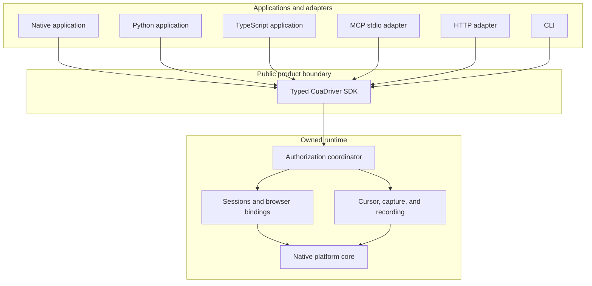
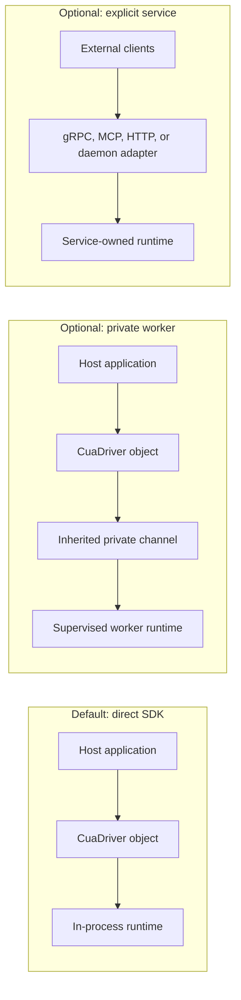
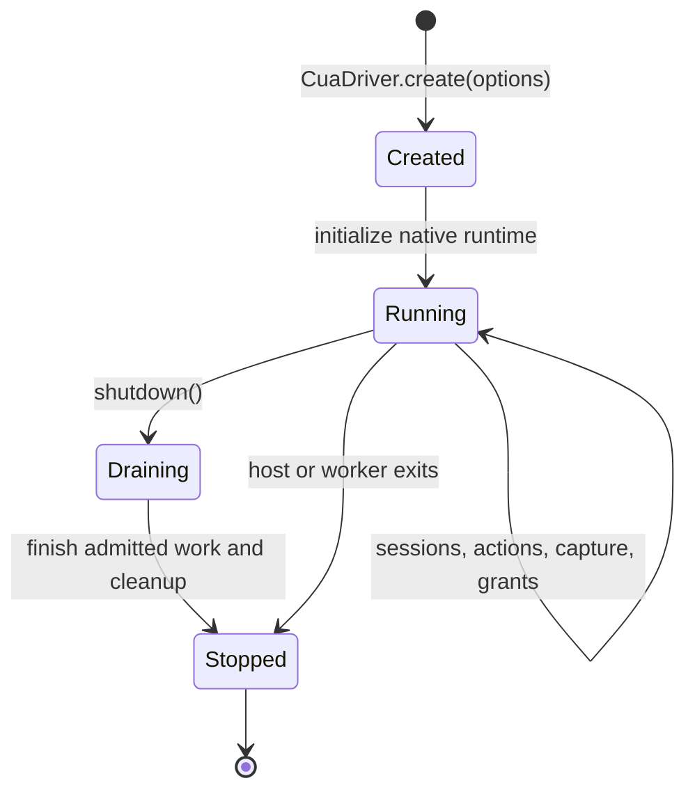
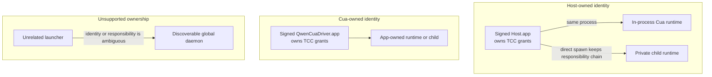
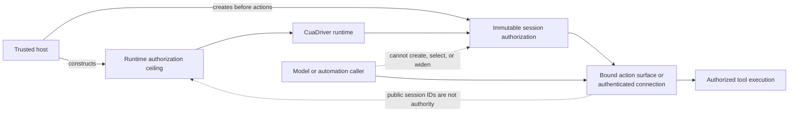
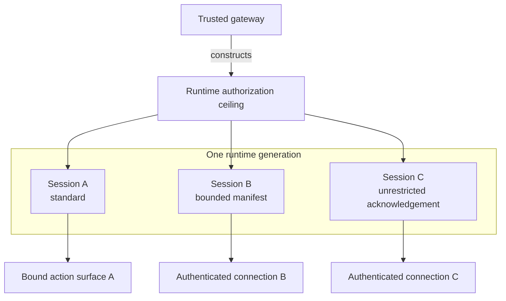
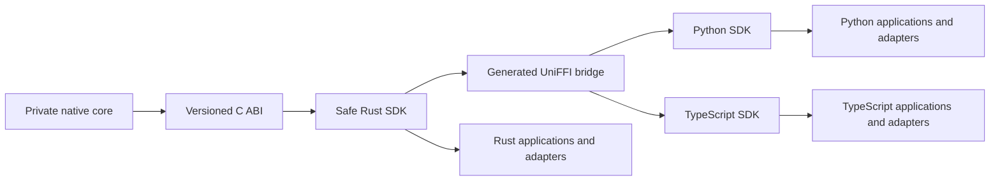
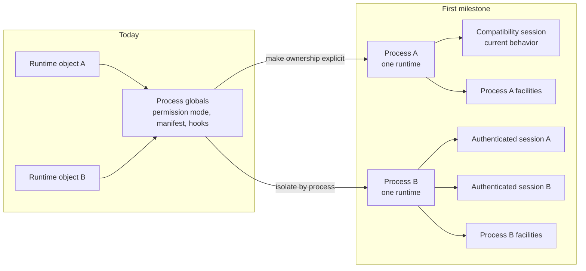
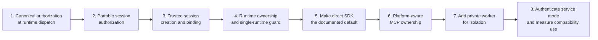

# Cua Driver SDK-First Runtime North Star

**Status:** Draft for architecture discussion

**Direction:** Make the typed SDK and its owned native runtime the product
boundary. Keep daemon and server topologies as optional adapters.

**RFC:** [RFC 2549](../../../rfcs/2549-cua-driver-sdk-owned-runtime.md)

**Supersedes:** [RFC 2447](../../../rfcs/2447-cua-driver-native-core-and-mcp-adapter.md)

**Related:**
[permission adapters and session modes](permission-adapters-and-session-modes-plan.md),
[#2385](https://github.com/trycua/cua/issues/2385), and
[#2437](https://github.com/trycua/cua/issues/2437).

## Decision at a glance

Cua Driver is a stateful native runtime exposed through typed SDKs. An
application creates the runtime, uses it, and shuts it down. MCP, HTTP, a
private worker, and a long-lived daemon can expose that runtime when a consumer
needs a transport or process boundary.

The daemon remains supported, but it stops defining the application contract.
The migration preserves the released CLI, MCP, Rust, Python, and TypeScript
interfaces. Runtime ownership may change behind them only after compatibility
and behavior-parity gates pass.

The runtime and public SDK stay transport-free. gRPC, MCP, HTTP, local sockets,
and environment forwarding carry generated Driver envelopes outside the core.

## One contract, several topologies

The topology changes ownership and isolation. It does not change tool
semantics, authorization, results, or generated SDK types.

| Need | Preferred topology |
| --- | --- |
| One application owns automation | Direct SDK |
| The host wants native crash containment | Private supervised worker |
| An MCP client owns one stdio process on Windows or Linux | MCP adapter with its own runtime |
| Standalone installed MCP runs on macOS | QwenCuaDriver.app-owned service runtime |
| Several external clients must share state | Explicit service or daemon |
| QwenCuaDriver.app must own a stable macOS permission identity | App-owned runtime or child |
| Short-lived scripts need persistent shared state | Explicit service or daemon |

## Daemonless still means stateful

The runtime owns state until its SDK object shuts down. Removing the required
daemon does not turn tools into independent stateless functions.

The runtime owns:

- session and browser-binding state;
- the runtime authorization ceiling and immutable session authorization
  contexts;
- bounded manifests and their session bindings;
- consent grants, indicators, and revocation;
- cursor overlays where the topology provides a main-thread owner, plus
  capture and recording;
- platform threads and event loops;
- cleanup for shutdown, expiry, and host death.

## Compatibility is a hard constraint

The architecture is not permission to disrupt current users. The CLI keeps its
commands, defaults, flags, socket behavior, platform identity, exit codes, and
machine-readable output. The SDKs keep `create`, `connect`, typed operation
names, package exports, result envelopes, structured errors, and lifecycle
behavior.

Private-worker options and new runtime configuration are additive. Changing a
released interface or an observably different default requires a separate
compatibility decision and the appropriate semantic-versioning release.
Browser-use improvements can continue shipping on the current daemon-backed
CLI while the SDK-owned refactor proceeds behind these gates.

## macOS TCC ownership

TCC needs a stable responsible process. It does not require a global socket
daemon.

The host must load the runtime directly or spawn its private worker without
breaking the macOS responsibility chain. QwenCuaDriver.app can own the identity for
standalone use. LaunchServices handoffs remain outside the supported embedding
contract, but standalone installed MCP may use LaunchServices to reach
QwenCuaDriver.app and preserve its stable TCC identity.

Direct permission checks are read-only. The embedding host owns permission UX
and any restart required after Accessibility or Screen Recording grants
change.

## Permission modes belong to sessions below a runtime ceiling

The trusted host chooses an immutable authorization ceiling when it creates a
runtime. It then creates immutable session contexts beneath that ceiling before
actions begin. Effective authority is the intersection of the runtime ceiling,
the session context, managed policy, and user policy. A session can narrow but
never widen the ceiling.

Released callers that do not use a trusted host session API inherit a
compatibility session with today's daemon or runtime behavior. This preserves
the current CLI and SDK contract while the permission model becomes portable
across direct, worker, and service topologies.

An unrestricted session suppresses Cua approval prompts only. Managed policy,
user policy, hard invariants, TCC, resource ownership, revocation, and cleanup
still apply. Its explicit acknowledgement must come from trusted host
construction, not an agent-visible request.

## Mixed trust uses authenticated sessions or separate processes

A gateway may host several authorization modes beneath one runtime ceiling
only when trusted host code creates the sessions and each action is bound to
the corresponding authenticated connection or in-process action surface.

The model receives only the action surface already bound to its effective
context. It never receives the host-only session factory, mode setter,
connection proof, or serialized authority value. Public session IDs remain
lifecycle labels and cannot select permission modes.

If a topology cannot provide a trusted binding, it exposes the compatibility
session or uses a separate runtime-owner process per mode. Multiple in-process
runtimes are a possible later optimization after every process-global facility
has been isolated; they are not a security boundary against arbitrary host
code.

## Generated SDK direction

The generated SDKs carry one typed contract into each supported language.
Transports consume this contract instead of defining a second one.

MCP stdio can create and own `CuaDriver` directly on Windows, Linux, and
embedded macOS paths. Standalone installed macOS MCP keeps the signed
QwenCuaDriver.app service identity by default. It does not add a second proxy layer
unless the deployment asks for service ownership or shared state.

Remote applications use the same generated SDK through an internal remote
connection backend. The backend exchanges generated Driver envelopes through a
minimal authenticated channel. gRPC may implement that channel, but it does not
become the native core, public SDK contract, or a second tool vocabulary.

## Explicit single-runtime ownership follows portable authorization

The current implementation still has process-global authorization and platform
state. First, canonical dispatch receives a portable effective session context.
Then one direct runtime per process becomes explicit and generation-scoped
authorization and resource ownership move behind that runtime. Complete
same-process multi-runtime isolation is later work.

State that must become runtime-owned includes:

- runtime authorization ceiling and unrestricted acknowledgement;
- immutable session contexts, bounded manifests, and policy views;
- trusted session creation and authenticated action bindings;
- consent provider and grant broker;
- session registry and teardown hooks;
- browser bindings and resource ownership;
- mutable platform callbacks that currently assume one runtime.

Shared process facilities must be read-only, synchronized, or represented by
an explicit process coordinator. A second direct runtime returns a structured
conflict until those facilities can no longer merge authority.

## Migration path

### Current work under this direction

- PR #2542 remains necessary. Every topology needs canonical authorization at
  runtime dispatch and an honest enforcement-adapter inventory.
- PR #2545 is the portable session-authorization foundation. Keep its effective
  authorization, mode-ceiling, expiry, and revocation concepts; route current
  callers through one compatibility context; and move daemon-specific
  registries behind the runtime boundary.
- Trusted mixed modes ship only after a host-only session factory and an
  authenticated action binding pass substitution, replay, expiry, revocation,
  generation, and reconnect tests.
- Issue #2437 is narrowed, not replaced. Its session model becomes
  topology-independent, while separate runtime-owner processes remain the safe
  fallback for topologies without a protected binding.
- Issue #2385 remains topology-independent. Each sensitive capability still
  needs a scoped enforcement adapter before Cua can claim active protection.

## Invariants

These are target-state requirements. The compatibility daemon must meet the
service-authentication invariant before it is presented as a mixed-trust
service.

1. The typed SDK is the only application contract.
2. Direct SDK, worker, MCP, HTTP, and daemon paths produce the same behavior.
3. Each runtime receives an immutable authorization ceiling at construction.
4. Each action resolves an immutable session context that can narrow but never
   widen the runtime ceiling.
5. No public tool, session ID, metadata field, environment value controlled by
   the caller, or reconnect request can create, select, or widen authority.
6. Released callers inherit a compatibility session with unchanged behavior.
7. Runtime and session shutdown revoke the resources they own.
8. A private worker dies with its host and exposes no reusable public endpoint.
9. macOS permission status names the responsible signed application.
10. Unrestricted mode changes prompt behavior but does not bypass policy or OS
   security.
11. One direct runtime is allowed per process until shared facilities pass a
    separate isolation gate.
12. Browser and CDP bindings do not migrate between sessions or runtime
    generations.
13. Every service endpoint authenticates its peer; endpoint location is not
    identity.
14. Released CLI, MCP, and SDK interfaces remain compatible across topology
    changes.
15. gRPC and other remote protocols remain adapters outside the native runtime
    and typed application contract.
16. The daemon remains available only where a service topology earns its
    operational cost.

## Exit criteria

The SDK-first architecture is ready to become the default when:

- direct Rust, Python, and TypeScript SDK tests exercise the same typed
  operations and error contract;
- CLI help, subcommand, flag, exit-code, JSON, and MCP-schema fixtures remain
  compatible;
- Python and TypeScript export and signature snapshots remain compatible with
  the previous supported release;
- representative applications written against the previous supported SDK
  release run without source changes;
- released calls inherit a compatibility session with unchanged authorization
  behavior;
- a second direct runtime returns a structured conflict;
- a session cannot exceed its runtime ceiling or exchange grants, manifests,
  browser bindings, or handles with another session;
- model-visible values cannot create or select a session authorization
  context;
- direct, worker, service, and remote actions resolve the context bound by
  their trusted host or authenticated connection;
- substitution, replay, duplicate binding, cross-generation use, expiry,
  revocation, and reconnect-without-reauthorization fail before dispatch;
- topologies without a trusted binding use the compatibility session or
  separate runtime-owner processes per mode;
- Windows and Linux MCP stdio can own a runtime without opening a daemon
  socket;
- shutdown, host death, cancellation, and in-flight side effects have tested
  outcomes;
- macOS tests prove embedded host-owned and standalone QwenCuaDriver.app-owned TCC
  attribution;
- private-worker tests prove parent-liveness cleanup and generation isolation;
- direct macOS overlays use a certified main-thread adapter or report
  structured unavailability;
- local and remote service endpoints reject unauthenticated peers;
- browser bindings, recordings, overlays, and grants remain generation-scoped;
- compatibility telemetry shows which consumers still need `connect()` and the
  long-lived daemon.

## Open decisions

- Which platform services can safely remain process-global?
- Does the private worker use the stable C ABI directly or a narrow inherited
  control channel above the SDK?
- How long should `CuaDriver.connect()` remain a supported compatibility path?
- Which existing daemon administrative tools need typed SDK replacements?
